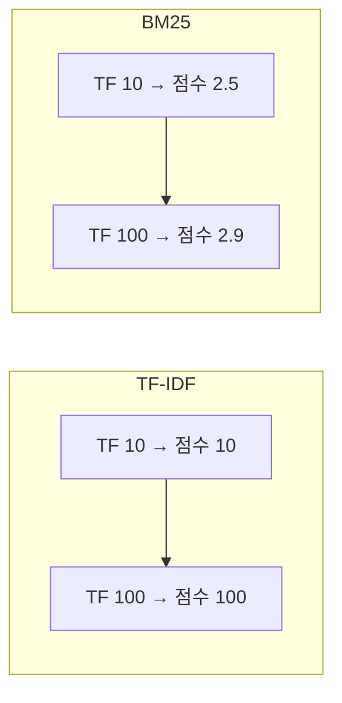
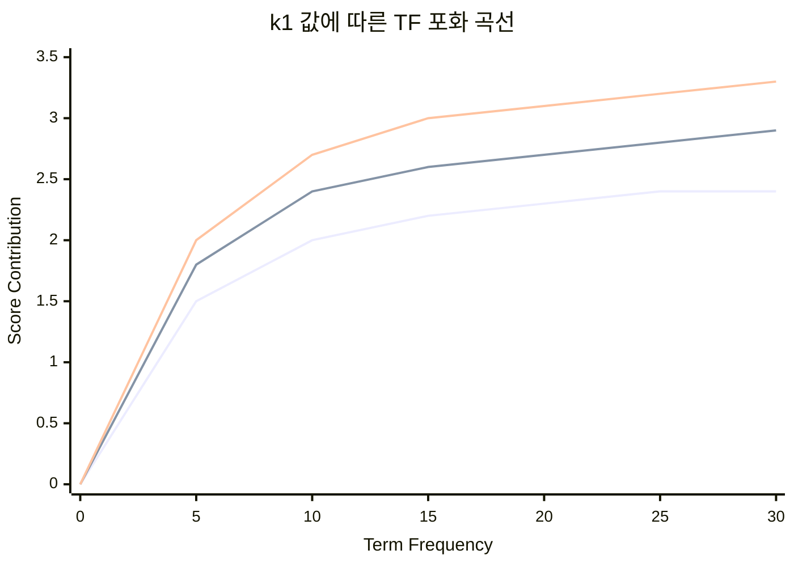
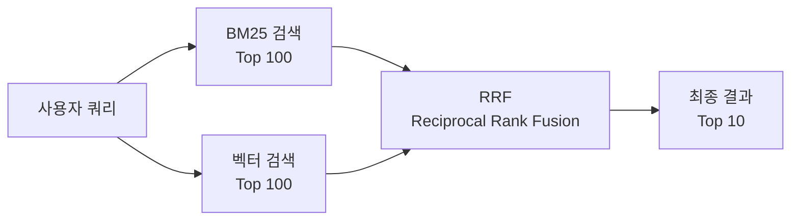

# BM25: 검색 엔진의 핵심 랭킹 알고리즘

**BM25**(Best Matching 25)는 Elasticsearch, OpenSearch, Lucene 등 거의 모든 현대 검색 엔진의 기본 랭킹 알고리즘입니다. 이 글에서는 BM25의 수학적 원리부터 실무 활용까지 깊이 있게 다룹니다.

---

## TF-IDF에서 BM25로

### TF-IDF의 한계

**TF-IDF**(Term Frequency - Inverse Document Frequency)는 정보 검색의 고전적인 알고리즘입니다:

$$
\text{TF-IDF}(t, d) = \text{TF}(t, d) \times \text{IDF}(t)
$$

하지만 TF-IDF에는 치명적인 문제가 있습니다:

1. **용어 빈도의 무한 성장**: 단어가 100번 등장하면 1번 등장한 것보다 100배 중요할까요?
2. **문서 길이 무시**: 10페이지 문서와 1페이지 문서를 동등하게 취급

### BM25의 해결책

BM25는 1994년 Stephen Robertson과 Karen Spärck Jones가 제안한 **확률적 정보 검색 모델**입니다. TF-IDF의 한계를 극복한 핵심 개선점:

- **용어 빈도 포화(Saturation)**: 빈도가 높아질수록 영향력 증가 속도가 감소
- **문서 길이 정규화**: 긴 문서에 불리하지 않도록 보정



---

## BM25 수학적 공식

### 전체 공식

쿼리 $Q$와 문서 $D$에 대한 BM25 점수:

$$
\text{BM25}(D, Q) = \sum_{i=1}^{n} \text{IDF}(q_i) \cdot \frac{f(q_i, D) \cdot (k_1 + 1)}{f(q_i, D) + k_1 \cdot \left(1 - b + b \cdot \frac{|D|}{\text{avgdl}}\right)}
$$

### 구성 요소 분해

| 기호 | 의미 | 설명 |
|------|------|------|
| $q_i$ | 쿼리 용어 | 쿼리에 포함된 i번째 단어 |
| $f(q_i, D)$ | TF | 문서 D에서 $q_i$의 등장 횟수 |
| $\|D\|$ | 문서 길이 | 문서 D의 단어 수 |
| $\text{avgdl}$ | 평균 문서 길이 | 전체 문서의 평균 단어 수 |
| $k_1$ | 포화 파라미터 | 기본값: 1.2 (범위: 0~3) |
| $b$ | 길이 정규화 | 기본값: 0.75 (범위: 0~1) |

### IDF 계산

$$
\text{IDF}(q_i) = \ln\left(\frac{N - n(q_i) + 0.5}{n(q_i) + 0.5} + 1\right)
$$

- $N$: 전체 문서 수
- $n(q_i)$: 용어 $q_i$를 포함한 문서 수

---

## 파라미터 심층 분석

### k1: 용어 빈도 포화도

**k1**은 용어 빈도(TF)가 점수에 미치는 영향을 조절합니다.



| k1 값 | 특성 | 적합한 상황 |
|-------|------|-------------|
| **0.5 이하** | 빠른 포화 | 불용어가 많은 콘텐츠 |
| **1.2 (기본)** | 균형 | 일반적인 텍스트 검색 |
| **2.0 이상** | 느린 포화 | 전문 용어가 많은 기술 문서 |

### b: 문서 길이 정규화

**b**는 문서 길이가 점수에 미치는 영향을 조절합니다.

| b 값 | 의미 | 적합한 상황 |
|------|------|-------------|
| **0** | 길이 무시 | 모든 문서가 비슷한 길이 |
| **0.75 (기본)** | 적절한 패널티 | 일반적인 웹 문서 |
| **1** | 강한 패널티 | 긴 문서가 불리해야 할 때 |

---

## Python 구현

### 기본 BM25 구현

```python
import math
from collections import Counter
from typing import List, Dict

class BM25:
    def __init__(self, corpus: List[List[str]], k1: float = 1.2, b: float = 0.75):
        self.k1 = k1
        self.b = b
        self.corpus = corpus
        self.corpus_size = len(corpus)
        
        # 문서 길이 계산
        self.doc_lengths = [len(doc) for doc in corpus]
        self.avgdl = sum(self.doc_lengths) / self.corpus_size
        
        # IDF 계산
        self.doc_freqs = self._calc_doc_freqs()
        self.idf = self._calc_idf()
        
        # TF 캐싱
        self.doc_term_freqs = [Counter(doc) for doc in corpus]
    
    def _calc_doc_freqs(self) -> Dict[str, int]:
        """각 용어가 등장하는 문서 수 계산"""
        df = {}
        for doc in self.corpus:
            for term in set(doc):
                df[term] = df.get(term, 0) + 1
        return df
    
    def _calc_idf(self) -> Dict[str, float]:
        """IDF 점수 계산"""
        idf = {}
        for term, freq in self.doc_freqs.items():
            idf[term] = math.log(
                (self.corpus_size - freq + 0.5) / (freq + 0.5) + 1
            )
        return idf
    
    def score(self, query: List[str], doc_idx: int) -> float:
        """단일 문서에 대한 BM25 점수 계산"""
        score = 0.0
        doc_len = self.doc_lengths[doc_idx]
        term_freqs = self.doc_term_freqs[doc_idx]
        
        for term in query:
            if term not in self.idf:
                continue
            
            tf = term_freqs.get(term, 0)
            idf = self.idf[term]
            
            # BM25 공식
            numerator = tf * (self.k1 + 1)
            denominator = tf + self.k1 * (1 - self.b + self.b * doc_len / self.avgdl)
            score += idf * (numerator / denominator)
        
        return score
    
    def search(self, query: List[str], top_k: int = 10) -> List[tuple]:
        """전체 문서에서 상위 k개 검색"""
        scores = [(i, self.score(query, i)) for i in range(self.corpus_size)]
        scores.sort(key=lambda x: x[1], reverse=True)
        return scores[:top_k]
```

### 사용 예제

```python
# 샘플 문서 (토큰화된 상태)
corpus = [
    ["machine", "learning", "is", "subset", "of", "artificial", "intelligence"],
    ["deep", "learning", "uses", "neural", "networks", "for", "learning"],
    ["natural", "language", "processing", "is", "part", "of", "ai"],
    ["machine", "learning", "algorithms", "learn", "from", "data"],
]

# BM25 인덱스 생성
bm25 = BM25(corpus)

# 검색
query = ["machine", "learning"]
results = bm25.search(query, top_k=3)

for doc_idx, score in results:
    print(f"문서 {doc_idx}: {score:.4f} - {' '.join(corpus[doc_idx][:5])}...")
```

출력:

```
문서 3: 1.2847 - machine learning algorithms learn from...
문서 0: 1.0923 - machine learning is subset of...
문서 1: 0.4651 - deep learning uses neural networks...
```

---

## Elasticsearch에서 BM25 활용

### 기본 설정

Elasticsearch는 BM25를 **기본 유사도 알고리즘**으로 사용합니다:

```json
PUT /my-index
{
  "settings": {
    "index": {
      "similarity": {
        "custom_bm25": {
          "type": "BM25",
          "k1": 1.5,
          "b": 0.8
        }
      }
    }
  },
  "mappings": {
    "properties": {
      "content": {
        "type": "text",
        "similarity": "custom_bm25"
      }
    }
  }
}
```

### 필드별 다른 설정 적용

```json
PUT /products
{
  "settings": {
    "index": {
      "similarity": {
        "title_similarity": {
          "type": "BM25",
          "k1": 1.2,
          "b": 0.3
        },
        "description_similarity": {
          "type": "BM25",
          "k1": 1.5,
          "b": 0.9
        }
      }
    }
  },
  "mappings": {
    "properties": {
      "title": {
        "type": "text",
        "similarity": "title_similarity"
      },
      "description": {
        "type": "text",
        "similarity": "description_similarity"
      }
    }
  }
}
```

### 점수 설명 확인

```json
GET /my-index/_explain/1
{
  "query": {
    "match": { "content": "machine learning" }
  }
}
```

응답에서 BM25 계산 과정을 상세히 확인할 수 있습니다:

```json
{
  "explanation": {
    "value": 2.8547,
    "description": "weight(content:learning in 0) [PerFieldSimilarity]",
    "details": [
      {
        "value": 1.8,
        "description": "idf, computed as log(1 + (N - n + 0.5) / (n + 0.5))"
      },
      {
        "value": 1.58,
        "description": "tf, computed as freq / (freq + k1 * (1 - b + b * dl / avgdl))"
      }
    ]
  }
}
```

---

## BM25 vs 벡터 검색

### 특성 비교

| 항목 | BM25 | 벡터 검색 |
|------|------|-----------|
| **검색 방식** | 키워드 매칭 | 의미적 유사도 |
| **처리 속도** | 매우 빠름 | 상대적으로 느림 |
| **정확도** | 정확한 키워드 필요 | 의미적 유사성 감지 |
| **리소스** | 낮음 | 높음 (임베딩 모델 필요) |
| **동의어 처리** | 수동 설정 필요 | 자동 (의미 기반) |

### 하이브리드 검색 전략



### Reciprocal Rank Fusion (RRF) 공식

$$
\text{RRF}(d) = \sum_{r \in R} \frac{1}{k + r(d)}
$$

- $r(d)$: 문서 $d$의 랭킹 순위
- $k$: 상수 (일반적으로 60)

Python 구현:

```python
def reciprocal_rank_fusion(rankings: List[List[int]], k: int = 60) -> List[int]:
    """
    여러 랭킹 리스트를 RRF로 결합
    
    Args:
        rankings: 각 검색 시스템의 문서 ID 순위 리스트
        k: 스무딩 상수
    
    Returns:
        통합된 최종 랭킹
    """
    scores = {}
    
    for ranking in rankings:
        for rank, doc_id in enumerate(ranking, start=1):
            scores[doc_id] = scores.get(doc_id, 0) + 1 / (k + rank)
    
    # 점수 기준 정렬
    sorted_docs = sorted(scores.items(), key=lambda x: x[1], reverse=True)
    return [doc_id for doc_id, _ in sorted_docs]

# 사용 예
bm25_results = [101, 203, 305, 402, 501]
vector_results = [203, 101, 408, 305, 602]

final_ranking = reciprocal_rank_fusion([bm25_results, vector_results])
print(final_ranking)  # [203, 101, 305, 402, 408, 501, 602]
```

---

## 실무 최적화 팁

### 1. 도메인별 k1, b 튜닝

```python
# A/B 테스트를 통한 최적 파라미터 탐색
param_grid = {
    'k1': [0.5, 1.0, 1.2, 1.5, 2.0],
    'b': [0.0, 0.25, 0.5, 0.75, 1.0]
}

best_params = None
best_ndcg = 0

for k1 in param_grid['k1']:
    for b in param_grid['b']:
        bm25 = BM25(corpus, k1=k1, b=b)
        ndcg = evaluate_ndcg(bm25, test_queries, ground_truth)
        if ndcg > best_ndcg:
            best_ndcg = ndcg
            best_params = (k1, b)

print(f"최적 파라미터: k1={best_params[0]}, b={best_params[1]}")
```

### 2. 필드 부스팅

```json
GET /products/_search
{
  "query": {
    "multi_match": {
      "query": "wireless headphones",
      "fields": ["title^3", "description^1", "brand^2"],
      "type": "best_fields"
    }
  }
}
```

### 3. 함수 스코어 결합

```json
GET /products/_search
{
  "query": {
    "function_score": {
      "query": { "match": { "title": "laptop" } },
      "functions": [
        {
          "field_value_factor": {
            "field": "sales_count",
            "factor": 1.2,
            "modifier": "sqrt"
          }
        },
        {
          "gauss": {
            "created_at": {
              "origin": "now",
              "scale": "30d"
            }
          }
        }
      ],
      "score_mode": "multiply"
    }
  }
}
```

---

## BM25+와 BM25L

### BM25+

BM25의 변형으로, 낮은 TF에 페널티를 주지 않도록 보정:

$$
\text{BM25+} = \text{BM25} + \delta \cdot \text{IDF}(q_i)
$$

- $\delta$: 하한 보정 상수 (일반적으로 1)

### BM25L

긴 문서에 대한 과도한 패널티를 완화:

$$
c(q_i, D) = \frac{f(q_i, D)}{1 - b + b \cdot \frac{|D|}{\text{avgdl}}}
$$

---

## 결론

| 상황 | 권장 설정 |
|------|-----------|
| **일반 웹 검색** | k1=1.2, b=0.75 (기본값) |
| **짧은 제목 검색** | k1=1.2, b=0.3 |
| **긴 기술 문서** | k1=1.5~2.0, b=0.75 |
| **상품 설명** | k1=1.2, b=0.9 |
| **FAQ/Q&A** | k1=0.8, b=0.4 |

BM25는 단순하지만 강력합니다. 40년 가까이 검색의 표준으로 자리 잡은 이유는 **수학적 견고함**과 **실용적 성능**의 균형 때문입니다. 벡터 검색이 부상하는 시대에도, BM25는 하이브리드 검색의 핵심 구성 요소로 계속 활용되고 있습니다.

---

## References

- Robertson, S., & Zaragoza, H. (2009). [The Probabilistic Relevance Framework: BM25 and Beyond](https://www.staff.city.ac.uk/~sbrp622/papers/foundations_bm25_review.pdf)
- [Elasticsearch Similarity Module](https://www.elastic.co/guide/en/elasticsearch/reference/current/index-modules-similarity.html)
- [OpenSearch k-NN and BM25 Hybrid Search](https://opensearch.org/docs/latest/search-plugins/knn/)
