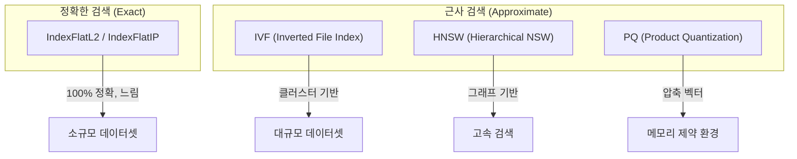
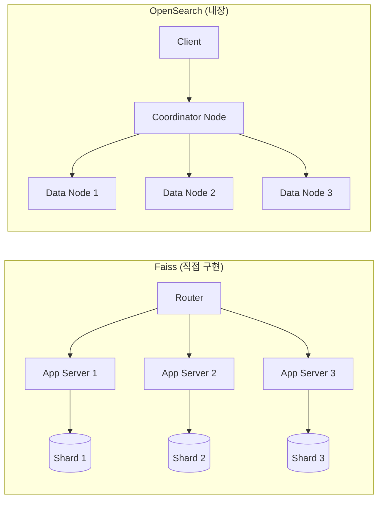
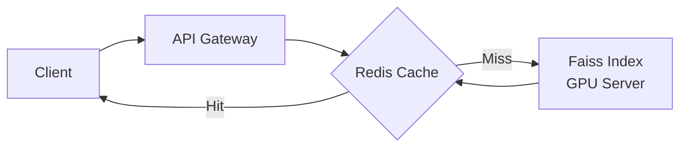
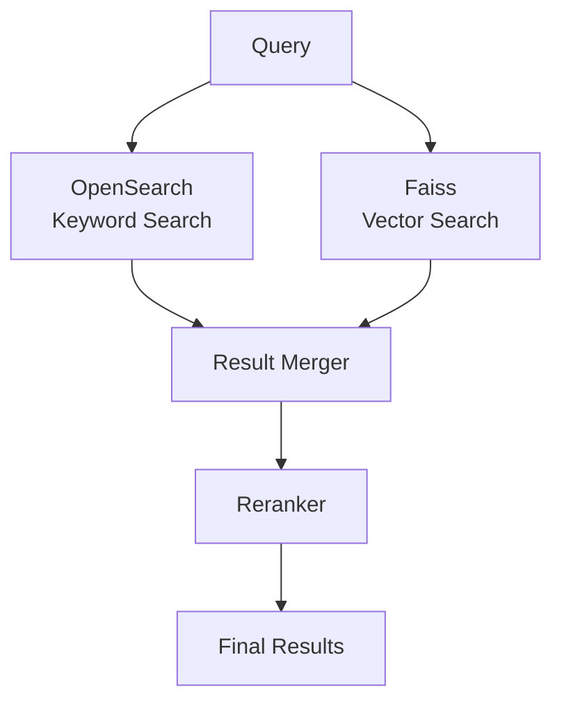

# Faiss와 OpenSearch 벡터 검색 비교

AI/ML 시대에 임베딩 벡터를 효율적으로 저장하고 검색하는 것은 핵심 인프라가 되었습니다. 이 글에서는 가장 널리 사용되는 두 가지 솔루션인 **Faiss**와 **OpenSearch**를 비교 분석합니다.

---

## 개요

| 항목 | Faiss | OpenSearch |
|------|-------|------------|
| **개발사** | Meta (Facebook AI Research) | AWS / OpenSearch Project |
| **유형** | 라이브러리 | 분산 검색 엔진 |
| **언어** | C++ (Python/Go 바인딩) | Java (REST API) |
| **라이선스** | MIT | Apache 2.0 |
| **주요 용도** | 순수 벡터 검색 | 벡터 + 전문 검색 통합 |

---

## Faiss: 순수 벡터 검색 라이브러리

**Faiss**는 Meta AI Research에서 개발한 고성능 유사도 검색 라이브러리입니다. 수십억 개의 벡터를 밀리초 단위로 검색할 수 있도록 최적화되어 있습니다.

### 핵심 특징

- **GPU 가속**: CUDA를 활용한 병렬 처리로 CPU 대비 최대 100배 이상 빠른 검색
- **다양한 인덱스 타입**: 정확도와 속도 사이의 트레이드오프를 세밀하게 조절 가능
- **메모리 효율**: Product Quantization(PQ)를 통한 벡터 압축으로 메모리 사용량 최소화
- **인메모리 처리**: 디스크 I/O 없이 RAM에서 직접 검색

### 주요 인덱스 타입



### 기본 사용법 (Python)

```python
import numpy as np
import faiss

# 데이터 준비: 10만 개의 128차원 벡터
d = 128  # 차원
nb = 100000  # 데이터베이스 크기
nq = 10  # 쿼리 수

np.random.seed(1234)
xb = np.random.random((nb, d)).astype('float32')
xq = np.random.random((nq, d)).astype('float32')

# 1. Flat Index (정확한 검색)
index_flat = faiss.IndexFlatL2(d)
index_flat.add(xb)

k = 5  # 상위 5개 결과
D, I = index_flat.search(xq, k)
print(f"가장 가까운 이웃: {I[0]}")
print(f"거리: {D[0]}")
```

### GPU 가속 검색

```python
import faiss

# GPU 리소스 초기화
res = faiss.StandardGpuResources()

# CPU 인덱스 → GPU 인덱스 변환
index_flat = faiss.IndexFlatL2(d)
gpu_index = faiss.index_cpu_to_gpu(res, 0, index_flat)  # GPU 0번 사용

# GPU에서 검색 (동일한 API)
gpu_index.add(xb)
D, I = gpu_index.search(xq, k)
```

### Index Factory로 복잡한 인덱스 생성

```python
# 문자열로 인덱스 구조 정의
# "IVF100,PQ8" = 100개 클러스터 + 8바이트 PQ 압축
index = faiss.index_factory(d, "IVF100,PQ8")

# 훈련 필요
index.train(xb)
index.add(xb)

# 검색
D, I = index.search(xq, k)
```

---

## OpenSearch: 통합 검색 플랫폼

**OpenSearch**는 Elasticsearch의 오픈소스 포크로, 전문 검색(Full-text Search)과 벡터 검색을 모두 지원하는 분산 검색 엔진입니다.

### 핵심 특징

- **하이브리드 검색**: 키워드 검색 + 벡터 검색을 단일 쿼리로 결합
- **분산 아키텍처**: 클러스터 기반 수평 확장
- **다중 엔진 지원**: Faiss, Lucene, NMSLIB 중 선택 가능
- **필터링 통합**: 메타데이터 기반 pre/post 필터링
- **관리 용이성**: REST API로 모든 작업 가능

### 지원 엔진 비교

| 엔진 | 알고리즘 | 훈련 필요 | 특징 |
|------|----------|-----------|------|
| **Lucene** | HNSW | 아니오 | 기본 엔진, 안정적 |
| **Faiss** | HNSW, IVF | IVF만 필요 | 고성능, 다양한 옵션 |
| **NMSLIB** | HNSW | 아니오 | 레거시, 호환성 |

### 인덱스 생성 (Faiss 엔진 + HNSW)

```json
PUT /embedding-index
{
  "settings": {
    "index": {
      "knn": true,
      "knn.algo_param.ef_search": 100
    }
  },
  "mappings": {
    "properties": {
      "title": { "type": "text" },
      "embedding": {
        "type": "knn_vector",
        "dimension": 768,
        "method": {
          "name": "hnsw",
          "space_type": "l2",
          "engine": "faiss",
          "parameters": {
            "ef_construction": 128,
            "m": 24
          }
        }
      }
    }
  }
}
```

### 문서 색인

```json
POST /embedding-index/_doc
{
  "title": "Introduction to Vector Search",
  "embedding": [0.12, -0.34, 0.56, ...]  // 768차원 벡터
}
```

### k-NN 검색 쿼리

```json
GET /embedding-index/_search
{
  "size": 10,
  "query": {
    "knn": {
      "embedding": {
        "vector": [0.11, -0.32, 0.54, ...],
        "k": 10
      }
    }
  }
}
```

### 하이브리드 검색 (키워드 + 벡터)

```json
GET /embedding-index/_search
{
  "size": 10,
  "query": {
    "bool": {
      "must": {
        "match": { "title": "vector search" }
      },
      "should": {
        "knn": {
          "embedding": {
            "vector": [0.11, -0.32, 0.54, ...],
            "k": 50
          }
        }
      }
    }
  }
}
```

---

## 상세 비교

### 성능

| 시나리오 | Faiss | OpenSearch |
|----------|-------|------------|
| 순수 벡터 검색 (10억 벡터) | ⭐⭐⭐⭐⭐ | ⭐⭐⭐ |
| GPU 가속 | ✅ 네이티브 지원 | ❌ 미지원 |
| 분산 검색 | ❌ 수동 구현 필요 | ✅ 내장 |
| 실시간 업데이트 | ⚠️ 인덱스 재구축 필요 | ✅ 실시간 |

### 확장성



### 운영 복잡도

| 항목 | Faiss | OpenSearch |
|------|-------|------------|
| 설치 | pip install | 클러스터 구성 |
| 모니터링 | 직접 구현 | OpenSearch Dashboards |
| 백업/복구 | 직접 구현 | 스냅샷 API |
| 고가용성 | 직접 구현 | 레플리카 자동화 |

---

## 사용 사례별 권장

### Faiss를 선택해야 할 때

1. **초저지연이 필요한 경우**: 밀리초 단위의 응답 시간이 중요한 실시간 추천
2. **GPU 자원이 풍부한 경우**: ML 인프라에 GPU가 이미 존재
3. **순수 벡터 검색만 필요한 경우**: 키워드 검색이 불필요
4. **커스텀 최적화가 필요한 경우**: 인덱스 파라미터 세밀 조정

```python
# Faiss 최적 사용 예: 실시간 추천 시스템
def get_recommendations(user_embedding, k=10):
    D, I = gpu_index.search(user_embedding.reshape(1, -1), k)
    return product_ids[I[0]]  # 밀리초 내 반환
```

### OpenSearch를 선택해야 할 때

1. **하이브리드 검색이 필요한 경우**: 키워드 + 벡터 검색 통합
2. **운영 편의성이 중요한 경우**: 모니터링, 백업 등 운영 기능 필요
3. **기존 Elasticsearch 인프라가 있는 경우**: 마이그레이션 용이
4. **실시간 데이터 업데이트가 필요한 경우**: 인덱스 재구축 없이 갱신

```json
// OpenSearch 최적 사용 예: RAG 검색 파이프라인
{
  "query": {
    "bool": {
      "filter": { "term": { "category": "technical" } },
      "must": {
        "knn": {
          "embedding": {
            "vector": [/* query embedding */],
            "k": 20
          }
        }
      }
    }
  }
}
```

---

## 아키텍처 패턴

### 패턴 1: Faiss + Redis (고성능 캐싱)



### 패턴 2: OpenSearch + LLM (RAG)


### 패턴 3: Faiss 백엔드 + OpenSearch (하이브리드)



---

## 마이그레이션 고려사항

### Faiss → OpenSearch

```python
# Faiss 인덱스의 벡터를 OpenSearch로 마이그레이션
from opensearchpy import OpenSearch, helpers

client = OpenSearch(hosts=['https://localhost:9200'])

def migrate_vectors(faiss_index, opensearch_index):
    vectors = faiss.rev_swig_ptr(
        faiss_index.get_xb(), faiss_index.ntotal * d
    ).reshape(-1, d)
    
    actions = [
        {
            "_index": opensearch_index,
            "_id": str(i),
            "_source": {"embedding": vectors[i].tolist()}
        }
        for i in range(len(vectors))
    ]
    
    helpers.bulk(client, actions)
```

### OpenSearch → Faiss

```python
# OpenSearch에서 벡터 추출 후 Faiss 인덱스 생성
from opensearchpy import OpenSearch
import numpy as np
import faiss

client = OpenSearch(hosts=['https://localhost:9200'])

def export_to_faiss(opensearch_index, field_name):
    vectors = []
    query = {"query": {"match_all": {}}, "size": 1000}
    
    response = client.search(index=opensearch_index, body=query, scroll='5m')
    while response['hits']['hits']:
        for hit in response['hits']['hits']:
            vectors.append(hit['_source'][field_name])
        response = client.scroll(scroll_id=response['_scroll_id'], scroll='5m')
    
    vectors = np.array(vectors, dtype='float32')
    index = faiss.IndexFlatL2(vectors.shape[1])
    index.add(vectors)
    return index
```

---

## 결론

| 요구사항 | 추천 솔루션 |
|----------|-------------|
| 순수 벡터 검색 성능 극대화 | **Faiss** |
| 하이브리드 검색 (키워드 + 벡터) | **OpenSearch** |
| GPU 가속 필수 | **Faiss** |
| 운영 편의성 우선 | **OpenSearch** |
| 마이크로서비스 통합 | **OpenSearch** |
| ML 파이프라인 내장 | **Faiss** |

두 도구는 상호 보완적인 관계입니다. **OpenSearch는 내부적으로 Faiss를 엔진으로 사용**할 수 있으므로, 복잡한 검색 요구사항에는 OpenSearch를, 순수 성능이 중요한 ML 파이프라인에는 Faiss를 직접 사용하는 것이 최선의 선택입니다.

---

## References

- [Faiss GitHub Repository](https://github.com/facebookresearch/faiss)
- [OpenSearch k-NN Documentation](https://opensearch.org/docs/latest/search-plugins/knn/)
- [Faiss Wiki - Running on GPUs](https://github.com/facebookresearch/faiss/wiki/Running-on-GPUs)
- [OpenSearch Vector Search](https://opensearch.org/docs/latest/vector-search/)
