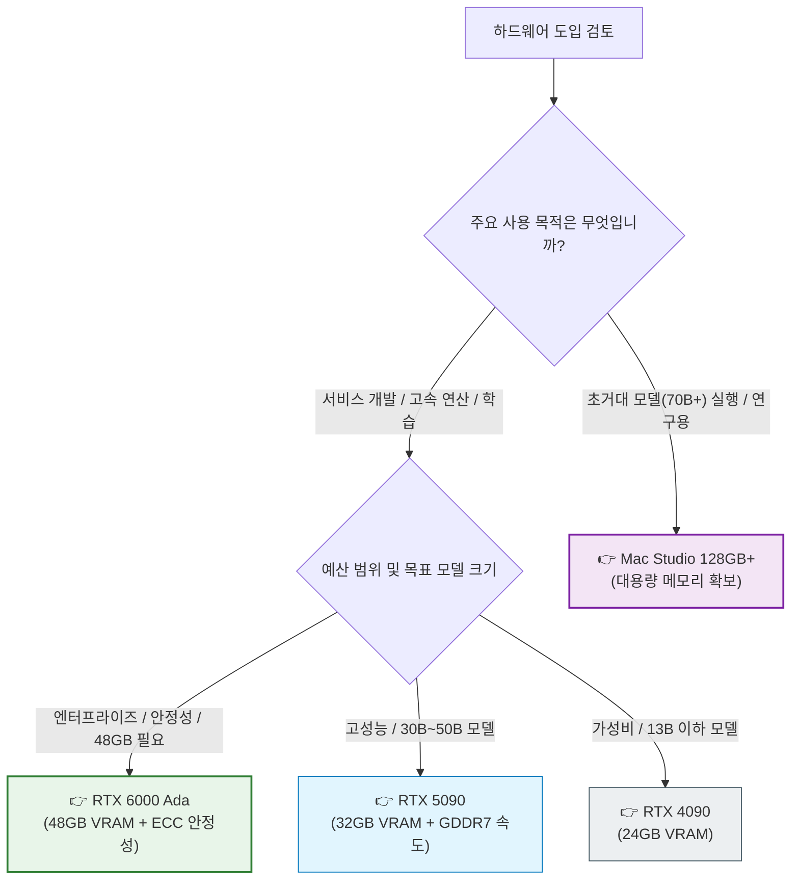

# 로컬 LLM 구축을 위한 하드웨어 가이드: RTX 6000/5090 vs Mac Studio

최근 데이터 보안과 맞춤형 모델 튜닝의 필요성으로 인해 '온프레미스(On-Premise) LLM' 구축 수요가 증가하고 있습니다. 외부 API 의존 없이 독립적인 환경에서 모델을 운용할 수 있다는 점은 기업과 연구자들에게 중요한 이점입니다.

본 가이드에서는 고성능 로컬 LLM 서버 구축을 위한 주요 선택지인 **NVIDIA RTX 6000 Ada Generation**, **GeForce RTX 5090**, 그리고 **Apple Mac Studio**의 사양과 특징을 비교 분석하여, 사용 목적에 적합한 하드웨어 선택을 돕고자 합니다.

---

## 1. 하드웨어 선정의 핵심 지표: VRAM

LLM 구동에 있어 가장 결정적인 요소는 **VRAM(비디오 메모리)** 용량입니다. 모델의 파라미터 크기와 양자화(Quantization) 수준에 따라 요구되는 메모리 용량이 결정되며, 이를 충족하지 못할 경우 실행 자체가 불가능할 수 있습니다.

| 구분 | RTX 4090 | RTX 5090 (Blackwell) | RTX 6000 Ada | Mac Studio (M4 Max / M3 Ultra) |
| :--- | :--- | :--- | :--- | :--- |
| **VRAM** | 24GB GDDR6X | **32GB GDDR7** | **48GB GDDR6 (ECC)** | **36GB ~ 192GB** (통합 메모리) |
| **대역폭** | 1,008 GB/s | 초고속 GDDR7 (상향) | **960 GB/s** | 410GB/s (Max) / 819GB/s (Ultra) |
| **가격** | - | 약 500만원 | **약 1,300만 원** | 329만 원 ~ 659만 원+ |
| **주요 특징** | 가성비 입문용 | 고성능 소비자용 | **엔터프라이즈/연구용** | 초고용량 메모리 |
| **추천 용도** | 13B 이하 모델 학습/추론 | 30B~50B 고속 추론 | **70B 고속 추론 & 학습** | **70B~180B 초대형 모델 구동** |

---

## 2. NVIDIA GPU: 성능과 호환성의 표준

대다수의 오픈소스 LLM 프로젝트와 프레임워크는 NVIDIA CUDA 생태계를 최우선으로 지원합니다. 따라서 호환성과 연산 처리에 있어서 가장 안정적인 선택지입니다.

### RTX 6000 Ada Generation: 전문가를 위한 최상의 선택

* **48GB ECC 메모리:** 48GB의 넉넉한 VRAM은 70B 파라미터 수준의 모델을 4-bit 양자화 상태에서 여유롭게 구동할 수 있으며, 8-bit 양자화 모델도 일부 수용 가능합니다. ECC(오류 정정 코드) 메모리를 탑재하여 장시간 학습이나 연산 시 데이터 신뢰성을 보장합니다.
* **워크스테이션 최적화:** 서버 랙이나 워크스테이션 환경에 적합한 블로워 팬 설계와 전력 효율성을 갖추고 있습니다. 멀티 GPU 구성 시(예: 2-way NVLink) 96GB까지 메모리를 확장하여 거대 모델 학습(Fine-tuning)에도 대응할 수 있습니다.
* **비용:** 약 1,200만 원대의 높은 초기 도입 비용이 발생하지만, 엔터프라이즈급 안정성과 성능을 필요로 하는 환경에서는 합리적인 투자입니다.

### RTX 5090: 소비자용 최고의 퍼포먼스

* **32GB GDDR7:** 기존 4090(24GB) 대비 33% 증가한 메모리 용량으로, 30B~40B 크기의 중형 모델을 단일 카드에서 원활하게 구동할 수 있습니다.
* **고속 추론:** GDDR7 메모리의 높은 대역폭을 바탕으로 매우 빠른 토큰 생성 속도를 제공합니다. 실시간 인터랙션이 중요한 서비스 프로토타이핑에 적합합니다.

### RTX 4090: 합리적인 입문

* **24GB VRAM:** 7B, 13B 모델 구동 및 경량화 학습(LoRA)에 충분한 성능을 제공합니다. 현재 시점에서 가장 가성비가 뛰어난 고성능 선택지입니다.

---

## 3. Apple Mac Studio: 메모리 용량의 우위

Mac Studio의 통합 메모리(Unified Memory) 아키텍처는 GPU 메모리 용량을 시스템 메모리와 공유함으로써, NVIDIA GPU 대비 저렴한 비용으로 압도적인 VRAM 용량을 확보할 수 있게 해줍니다.

### M4 Max / M3 Ultra

* **대용량 메모리:** 최대 192GB까지 구성 가능한 메모리는 70B 이상의 Llama-3, Falcon-180B 등 초대형 모델을 로컬에서 구동할 수 있는 거의 유일한 현실적인 솔루션입니다.
* **추론 중심:** 학습 속도는 NVIDIA GPU에 비해 다소 느릴 수 있으나, 양자화된 거대 모델을 단순히 로드하고 추론하는 용도(Inference only)로는 훌륭한 성능을 보여줍니다. `MLX` 프레임워크의 발전으로 호환성 또한 개선되고 있습니다.

---

## 4. 선택 가이드

사용 목적과 예산에 따른 추천 하드웨어는 다음과 같습니다.

---

## 5. 결론

* **RTX 6000 Ada**: 예산이 충분하고, 연구 및 상용 서비스 수준의 안정성과 48GB 이상의 메모리가 필요한 전문가에게 적합합니다.
* **RTX 5090/4090**: 빠른 추론 속도와 최신 CUDA 생태계 활용이 중요한 개발자 및 엔지니어에게 적합합니다.
* **Mac Studio**: 속도보다는 100GB 이상의 거대 모델을 로컬 메모리에 올리는 것이 최우선인 연구자에게 적합합니다.

---

## 참고 자료

* **[NVIDIA RTX 6000 Ada Generation Datasheet](https://www.nvidia.com/en-us/design-visualization/rtx-6000/)**: 공식 기술 사양서입니다.
* **[Tim Dettmers' Deep Learning Hardware Guide](https://timdettmers.com/2023/01/30/which-gpus-to-get-for-deep-learning/)**: 딥러닝 하드웨어 벤치마크 및 가이드입니다.
* **[Apple MLX Framework](https://github.com/ml-explore/mlx)**: Apple Silicon을 위한 최적화된 배열 프레임워크입니다.
