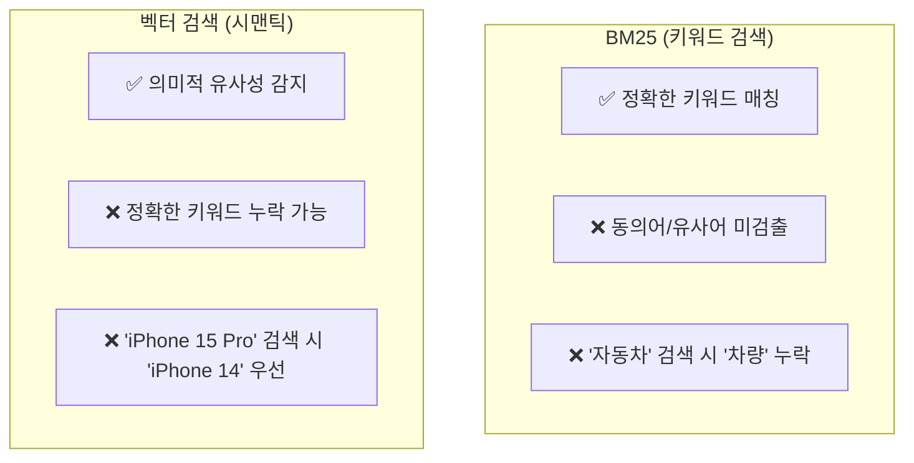
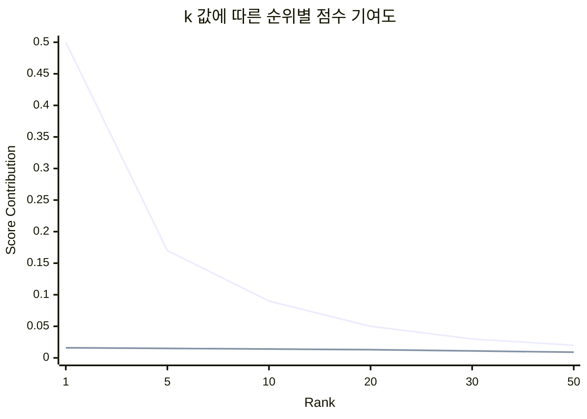
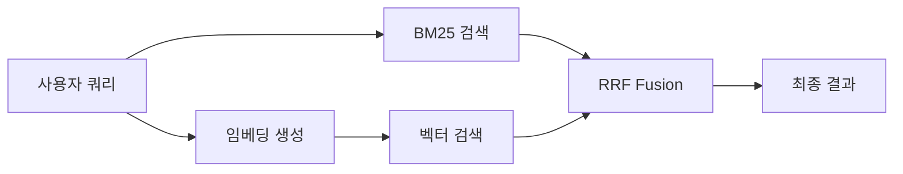
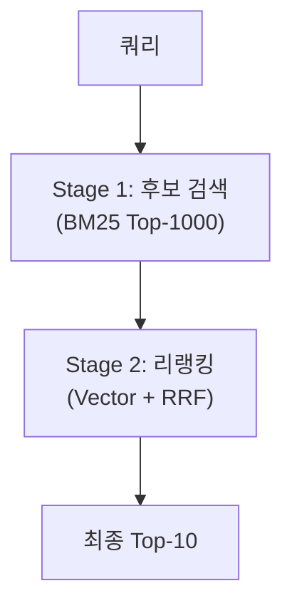

# RRF: 하이브리드 검색의 핵심 랭크 퓨전 알고리즘

**Reciprocal Rank Fusion(RRF)**은 여러 검색 시스템의 결과를 단일 랭킹으로 통합하는 알고리즘입니다. 키워드 검색(BM25)과 벡터 검색(Semantic Search)을 결합하는 **하이브리드 검색**의 핵심 기술로, OpenSearch 2.19+, Elasticsearch 8.8+ 등 주요 검색 엔진에서 공식 지원합니다.

---

## 왜 RRF가 필요한가?

### 단일 검색 시스템의 한계



| 검색 방식 | 강점 | 약점 |
|-----------|------|------|
| **BM25** | 정확한 용어 매칭 | 동의어, 문맥 이해 불가 |
| **벡터** | 의미적 유사성 | 정확한 키워드 매칭 약함 |
| **RRF 하이브리드** | 두 장점 결합 | - |

### RRF의 접근법

RRF는 각 검색 시스템의 **점수(score)**가 아닌 **순위(rank)**를 기반으로 결과를 결합합니다. 이 접근법이 강력한 이유:

1. **점수 정규화 불필요**: BM25 점수(0~∞)와 코사인 유사도(0~1)를 직접 비교할 필요 없음
2. **이상치에 강건**: 극단적인 점수 값의 영향을 최소화
3. **단순함**: 파라미터 하나($k$)만으로 동작

---

## RRF 수학적 원리

### 기본 공식

문서 $d$에 대한 RRF 점수:

$$
\text{RRF}(d) = \sum_{r \in R} \frac{1}{k + r(d)}
$$

- $R$: 검색 결과 리스트의 집합 (BM25 결과, 벡터 검색 결과 등)
- $r(d)$: 리스트 $r$에서 문서 $d$의 순위 (1부터 시작)
- $k$: 랭킹 상수 (기본값: 60)

### 상수 k의 역할

**k**는 상위 순위와 하위 순위 간의 점수 차이를 조절합니다.

| k 값 | 특성 | 1위 vs 10위 점수 비율 |
|------|------|----------------------|
| **1** | 상위 순위 극도로 우대 | 5.5배 |
| **60 (기본)** | 균형 잡힌 가중치 | 1.16배 |
| **1000** | 순위 차이 거의 무시 | 1.01배 |



### 계산 예시

두 검색 시스템(BM25, 벡터)의 결과를 RRF로 결합:

| 문서 | BM25 순위 | 벡터 순위 | RRF 점수 (k=60) |
|------|-----------|-----------|-----------------|
| A | 1 | 5 | $\frac{1}{61} + \frac{1}{65} = 0.0318$ |
| B | 3 | 1 | $\frac{1}{63} + \frac{1}{61} = 0.0322$ |
| C | 2 | 10 | $\frac{1}{62} + \frac{1}{70} = 0.0304$ |
| D | - | 2 | $\frac{0}{-} + \frac{1}{62} = 0.0161$ |

**최종 순위**: B > A > C > D

문서 B는 BM25에서 3위였지만, 벡터 검색에서 1위였기 때문에 최종적으로 1위가 됩니다.

---

## Python 구현

### 기본 RRF 구현

```python
from typing import List, Dict, Any
from collections import defaultdict

def reciprocal_rank_fusion(
    rankings: List[List[Any]],
    k: int = 60
) -> List[tuple]:
    """
    여러 검색 결과 리스트를 RRF로 결합
    
    Args:
        rankings: 각 검색 시스템의 결과 리스트 (문서 ID 순서대로)
        k: 랭킹 상수 (기본값: 60)
    
    Returns:
        (문서 ID, RRF 점수) 튜플의 정렬된 리스트
    """
    rrf_scores = defaultdict(float)
    
    for ranking in rankings:
        for rank, doc_id in enumerate(ranking, start=1):
            rrf_scores[doc_id] += 1 / (k + rank)
    
    # 점수 기준 내림차순 정렬
    sorted_results = sorted(
        rrf_scores.items(),
        key=lambda x: x[1],
        reverse=True
    )
    
    return sorted_results

# 사용 예시
bm25_results = ["doc_A", "doc_B", "doc_C", "doc_D", "doc_E"]
vector_results = ["doc_C", "doc_A", "doc_F", "doc_B", "doc_G"]

fused_results = reciprocal_rank_fusion([bm25_results, vector_results])

for doc_id, score in fused_results[:5]:
    print(f"{doc_id}: {score:.4f}")
```

출력:

```
doc_A: 0.0322
doc_C: 0.0322
doc_B: 0.0305
doc_D: 0.0156
doc_F: 0.0159
```

### 가중치가 있는 RRF

검색 시스템별로 다른 가중치를 적용:

```python
def weighted_rrf(
    rankings: List[List[Any]],
    weights: List[float] = None,
    k: int = 60
) -> List[tuple]:
    """
    가중치가 적용된 RRF
    
    Args:
        rankings: 검색 결과 리스트들
        weights: 각 검색 시스템의 가중치 (합이 1이 아니어도 됨)
        k: 랭킹 상수
    """
    if weights is None:
        weights = [1.0] * len(rankings)
    
    rrf_scores = defaultdict(float)
    
    for ranking, weight in zip(rankings, weights):
        for rank, doc_id in enumerate(ranking, start=1):
            rrf_scores[doc_id] += weight / (k + rank)
    
    return sorted(rrf_scores.items(), key=lambda x: x[1], reverse=True)

# BM25에 더 높은 가중치 부여
results = weighted_rrf(
    [bm25_results, vector_results],
    weights=[0.7, 0.3],  # BM25: 70%, Vector: 30%
    k=60
)
```

### 세 개 이상의 검색 시스템 결합

```python
# BM25 + Dense Vector + Sparse Vector 결합
bm25_results = ["A", "B", "C", "D", "E"]
dense_results = ["C", "A", "F", "B", "G"]
sparse_results = ["B", "D", "A", "H", "C"]

# 동일 가중치
fused = reciprocal_rank_fusion([
    bm25_results,
    dense_results,
    sparse_results
])

# 다른 가중치 (BM25: 40%, Dense: 40%, Sparse: 20%)
fused_weighted = weighted_rrf(
    [bm25_results, dense_results, sparse_results],
    weights=[0.4, 0.4, 0.2]
)
```

---

## OpenSearch에서 RRF 사용

### Search Pipeline 생성

OpenSearch 2.19+에서 `score-ranker-processor`를 사용한 RRF:

```json
PUT /_search/pipeline/hybrid-rrf-pipeline
{
  "description": "Hybrid search with RRF",
  "phase_results_processors": [
    {
      "score-ranker-processor": {
        "combination": {
          "technique": "rrf",
          "rank_constant": 60
        }
      }
    }
  ]
}
```

### 하이브리드 검색 쿼리

```json
POST /products/_search?search_pipeline=hybrid-rrf-pipeline
{
  "query": {
    "hybrid": {
      "queries": [
        {
          "match": {
            "title": "wireless headphones"
          }
        },
        {
          "knn": {
            "embedding": {
              "vector": [0.12, -0.34, 0.56, ...],
              "k": 100
            }
          }
        }
      ]
    }
  },
  "size": 10
}
```

### 정규화 + RRF 조합 (OpenSearch 2.10+)

점수 정규화 후 RRF 적용:

```json
PUT /_search/pipeline/normalized-hybrid-pipeline
{
  "description": "Normalized hybrid search",
  "phase_results_processors": [
    {
      "normalization-processor": {
        "normalization": {
          "technique": "min_max"
        },
        "combination": {
          "technique": "arithmetic_mean",
          "parameters": {
            "weights": [0.4, 0.6]
          }
        }
      }
    }
  ]
}
```

---

## Elasticsearch에서 RRF 사용

### 기본 RRF 쿼리 (ES 8.8+)

```json
POST /products/_search
{
  "retriever": {
    "rrf": {
      "retrievers": [
        {
          "standard": {
            "query": {
              "match": { "title": "laptop" }
            }
          }
        },
        {
          "knn": {
            "field": "embedding",
            "query_vector": [0.1, 0.2, ...],
            "k": 100,
            "num_candidates": 200
          }
        }
      ],
      "rank_constant": 60,
      "rank_window_size": 100
    }
  },
  "size": 10
}
```

### 중첩 RRF

여러 레벨의 RRF 적용:

```json
{
  "retriever": {
    "rrf": {
      "retrievers": [
        {
          "rrf": {
            "retrievers": [
              { "standard": { "query": { "match": { "title": "query" } } } },
              { "standard": { "query": { "match": { "body": "query" } } } }
            ],
            "rank_constant": 10
          }
        },
        {
          "knn": {
            "field": "embedding",
            "query_vector": [...],
            "k": 50
          }
        }
      ],
      "rank_constant": 60
    }
  }
}
```

---

## 아키텍처 패턴

### 패턴 1: 동기식 하이브리드 검색



### 패턴 2: 비동기식 병렬 검색

```python
import asyncio
from typing import List

async def hybrid_search(query: str, k: int = 10) -> List[dict]:
    """비동기 하이브리드 검색"""
    
    # BM25와 벡터 검색을 병렬 실행
    bm25_task = asyncio.create_task(bm25_search(query, top_k=100))
    vector_task = asyncio.create_task(vector_search(query, top_k=100))
    
    bm25_results, vector_results = await asyncio.gather(
        bm25_task, vector_task
    )
    
    # RRF로 결합
    fused = reciprocal_rank_fusion([
        [doc["id"] for doc in bm25_results],
        [doc["id"] for doc in vector_results]
    ])
    
    # 상위 k개 반환
    return fused[:k]
```

### 패턴 3: Two-Stage Retrieval



```python
def two_stage_search(query: str, final_k: int = 10) -> List[dict]:
    # Stage 1: 빠른 BM25로 후보 검색
    candidates = bm25_search(query, top_k=1000)
    candidate_ids = [doc["id"] for doc in candidates]
    
    # Stage 2: 후보 내에서 벡터 리랭킹
    query_embedding = embed(query)
    vector_scores = compute_similarities(query_embedding, candidate_ids)
    
    # RRF 적용
    bm25_ranking = candidate_ids  # 이미 BM25 순위대로 정렬됨
    vector_ranking = sorted(candidate_ids, key=lambda x: vector_scores[x], reverse=True)
    
    fused = reciprocal_rank_fusion([bm25_ranking, vector_ranking])
    return fused[:final_k]
```

---

## 성능 최적화

### k 값 튜닝

```python
def tune_rrf_k(
    rankings: List[List[str]],
    ground_truth: List[str],
    k_values: List[int] = [1, 10, 20, 40, 60, 80, 100]
) -> int:
    """nDCG 기반 최적 k 값 탐색"""
    
    best_k = 60
    best_ndcg = 0
    
    for k in k_values:
        fused = reciprocal_rank_fusion(rankings, k=k)
        ndcg = calculate_ndcg(fused, ground_truth)
        
        if ndcg > best_ndcg:
            best_ndcg = ndcg
            best_k = k
        
        print(f"k={k}: nDCG={ndcg:.4f}")
    
    return best_k
```

### 캐싱 전략

```python
from functools import lru_cache
import hashlib

@lru_cache(maxsize=10000)
def cached_rrf(rankings_hash: str, k: int = 60) -> tuple:
    """RRF 결과 캐싱"""
    rankings = decode_rankings(rankings_hash)
    return tuple(reciprocal_rank_fusion(rankings, k))

def search_with_cache(query: str) -> List:
    bm25_results = bm25_search(query)
    vector_results = vector_search(query)
    
    # 해시 생성하여 캐싱
    rankings_hash = hashlib.md5(
        str([bm25_results, vector_results]).encode()
    ).hexdigest()
    
    return cached_rrf(rankings_hash)
```

---

## RRF vs 다른 퓨전 방법

### 비교 표

| 방법 | 장점 | 단점 |
|------|------|------|
| **RRF** | 정규화 불필요, 단순함 | 점수 정보 손실 |
| **Linear Combination** | 점수 보존 | 정규화 필요 |
| **Borda Count** | 이해 쉬움 | 동점 처리 복잡 |
| **Learned Fusion** | 최적화 가능 | 학습 데이터 필요 |

### Linear Combination vs RRF

```python
def linear_combination(
    score_lists: List[List[tuple]],  # [(doc_id, score), ...]
    weights: List[float]
) -> List[tuple]:
    """선형 결합 기반 퓨전"""
    
    combined = defaultdict(float)
    
    for scores, weight in zip(score_lists, weights):
        # Min-Max 정규화
        min_s = min(s for _, s in scores)
        max_s = max(s for _, s in scores)
        
        for doc_id, score in scores:
            normalized = (score - min_s) / (max_s - min_s + 1e-10)
            combined[doc_id] += weight * normalized
    
    return sorted(combined.items(), key=lambda x: x[1], reverse=True)
```

---

## 실무 적용 가이드

### 도메인별 권장 설정

| 도메인 | k 값 | BM25 가중치 | 벡터 가중치 |
|--------|------|-------------|-------------|
| **E-commerce** | 60 | 0.4 | 0.6 |
| **기술 문서** | 40 | 0.6 | 0.4 |
| **Q&A/FAQ** | 20 | 0.3 | 0.7 |
| **법률/의료** | 80 | 0.7 | 0.3 |
| **뉴스/블로그** | 60 | 0.5 | 0.5 |

### A/B 테스트 체크리스트

- [ ] 다양한 k 값 (20, 40, 60, 80) 비교
- [ ] BM25/벡터 가중치 조합 테스트
- [ ] 쿼리 유형별 성능 분석 (단일 키워드 vs 문장형)
- [ ] 클릭률(CTR), 체류 시간 등 비즈니스 메트릭 측정

---

## 결론

| 상황 | 권장 접근법 |
|------|-------------|
| **빠른 프로토타이핑** | RRF (k=60, 동일 가중치) |
| **정밀 튜닝 필요** | Weighted RRF + A/B 테스트 |
| **점수 해석 필요** | Linear Combination |
| **대량 트래픽** | Two-Stage Retrieval + 캐싱 |

RRF는 단순하면서도 효과적인 랭크 퓨전 알고리즘입니다. 점수 정규화 없이 여러 검색 시스템을 결합할 수 있어, **하이브리드 검색의 첫 번째 선택지**로 적합합니다. 다만, 더 정교한 튜닝이 필요한 경우 가중치 조절이나 학습 기반 퓨전 방법을 고려하세요.

---

## References

- Cormack, G. V., Clarke, C. L. A., & Buettcher, S. (2009). [Reciprocal Rank Fusion outperforms Condorcet and individual Rank Learning Methods](https://plg.uwaterloo.ca/~gvcormac/cormacksigir09-rrf.pdf)
- [OpenSearch Score Ranker Processor](https://opensearch.org/docs/latest/search-plugins/search-pipelines/score-ranker-processor/)
- [Elasticsearch RRF](https://www.elastic.co/guide/en/elasticsearch/reference/current/rrf.html)
- [Hybrid Search in OpenSearch](https://opensearch.org/docs/latest/vector-search/ai-search/hybrid-search/)
