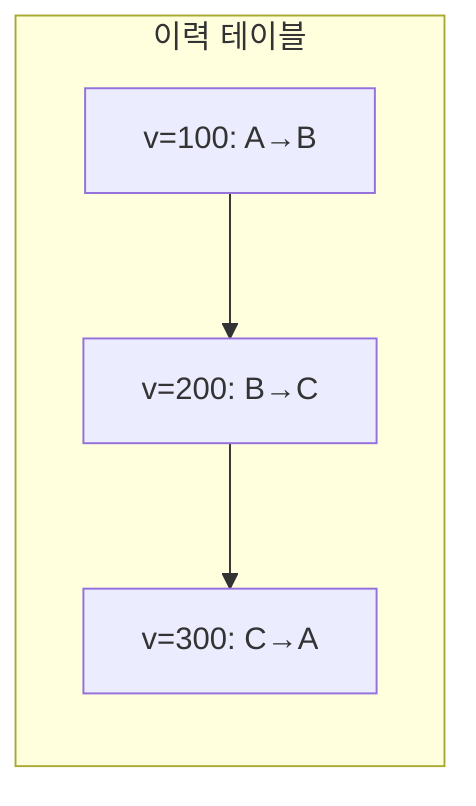
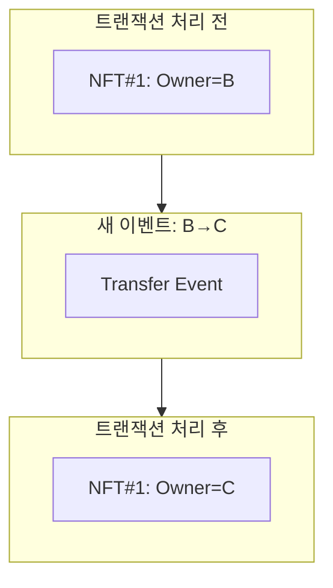
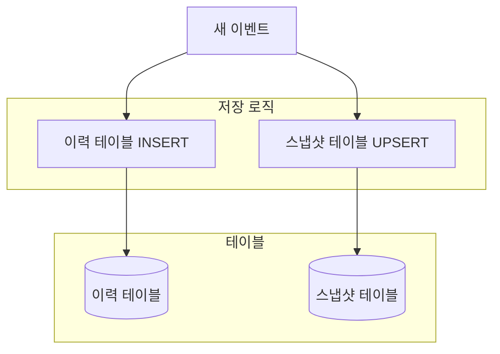

## 시리즈 목차

1. [블록체인 인덱서란?](/blog/blockchain/indexer-01-introduction)
2. [인덱서 아키텍처 Deep Dive](/blog/blockchain/indexer-02-architecture)
3. **이력 테이블 vs 스냅샷 테이블** (현재 글)
4. [Rust로 인덱서 SDK 만들기](/blog/blockchain/indexer-04-rust-sdk)
5. [Diesel ORM 실전 활용](/blog/blockchain/indexer-05-diesel-orm)
6. [멱등성 있는 인덱서 핸들러 설계](/blog/blockchain/indexer-06-idempotency)

---

## 인덱서 DB 설계의 핵심 질문

인덱서 DB를 설계할 때 가장 먼저 마주치는 질문이 있습니다:

> **"변경 이력을 모두 저장할 것인가, 현재 상태만 저장할 것인가?"**

정답은 **둘 다**입니다. 이것이 **이중 테이블 패턴**입니다.

---

## 이력 테이블 (History Table)

### 개념

이력 테이블은 **모든 변경 사항을 시간 순서대로 누적** 저장합니다.



### 스키마 예시

```sql
CREATE TABLE nft_transfers (
    id SERIAL,
    nft_id TEXT NOT NULL,
    from_address TEXT NOT NULL,
    to_address TEXT NOT NULL,
    transaction_version BIGINT NOT NULL,
    transaction_hash TEXT NOT NULL,
    transferred_at TIMESTAMP NOT NULL,
    
    -- 복합 PK: 같은 NFT가 여러 번 전송될 수 있음
    PRIMARY KEY (nft_id, transaction_version)
);

-- 조회 최적화 인덱스
CREATE INDEX idx_transfers_to ON nft_transfers(to_address);
CREATE INDEX idx_transfers_from ON nft_transfers(from_address);
CREATE INDEX idx_transfers_time ON nft_transfers(transferred_at DESC);
```

### 사용 사례

| 쿼리 | 이력 테이블 필요 |
|------|-----------------|
| "이 NFT의 거래 이력" | ✅ 필수 |
| "지난 24시간 거래량" | ✅ 필수 |
| "시간대별 활성 사용자" | ✅ 필수 |
| "특정 시점의 소유자" | ✅ 필수 |

---

## 스냅샷 테이블 (Current State Table)

### 개념

스냅샷 테이블은 **현재 상태만 유지**합니다. 새 이벤트가 오면 기존 row를 **덮어씁니다**.



### 스키마 예시

```sql
CREATE TABLE current_nft_owners (
    nft_id TEXT PRIMARY KEY,  -- 단일 PK: NFT당 하나의 row
    owner_address TEXT NOT NULL,
    last_transaction_version BIGINT NOT NULL,
    last_updated_at TIMESTAMP NOT NULL
);

-- 소유자 기준 조회 인덱스
CREATE INDEX idx_owners_address ON current_nft_owners(owner_address);
```

### 사용 사례

| 쿼리 | 스냅샷 테이블 적합 |
|------|-------------------|
| "내가 보유한 NFT 목록" | ✅ 최적 |
| "현재 토큰 잔액" | ✅ 최적 |
| "활성 구독 목록" | ✅ 최적 |
| "현재 설정값" | ✅ 최적 |

---

## 이중 테이블 패턴

### 왜 둘 다 필요한가?

| 요구사항 | 이력 테이블 | 스냅샷 테이블 |
|----------|:----------:|:------------:|
| 변경 이력 추적 | ✅ | ❌ |
| 현재 상태 빠른 조회 | ❌ (비효율) | ✅ |
| 특정 시점 상태 조회 | ✅ | ❌ |
| 저장 공간 효율 | ❌ (누적) | ✅ (고정) |
| 분석/집계 쿼리 | ✅ | ❌ |

### 아키텍처



### 저장 로직 예시

하나의 트랜잭션에서 **두 테이블을 동시에 갱신**합니다:

```sql
-- 1. 이력 테이블: 항상 INSERT
INSERT INTO nft_transfers (nft_id, from_address, to_address, transaction_version, ...)
VALUES ('nft#1', 'addr_B', 'addr_C', 300, ...);

-- 2. 스냅샷 테이블: UPSERT (있으면 UPDATE, 없으면 INSERT)
INSERT INTO current_nft_owners (nft_id, owner_address, last_transaction_version, ...)
VALUES ('nft#1', 'addr_C', 300, ...)
ON CONFLICT (nft_id) 
DO UPDATE SET 
    owner_address = EXCLUDED.owner_address,
    last_transaction_version = EXCLUDED.last_transaction_version,
    last_updated_at = EXCLUDED.last_updated_at
WHERE current_nft_owners.last_transaction_version < EXCLUDED.last_transaction_version;
```

> **핵심**: `WHERE` 조건으로 **더 오래된 버전이 덮어쓰지 않도록** 보호

---

## 실제 PKI 인덱서 스키마 예시

인증서 관리 시스템의 인덱서를 예로 들어보겠습니다:

### 이력 테이블

```sql
CREATE TABLE certificates (
    id SERIAL,
    serial_number TEXT NOT NULL,
    status TEXT NOT NULL,  -- 'ACTIVE', 'REVOKED', 'EXPIRED'
    issuer_id TEXT NOT NULL,
    valid_from TIMESTAMP NOT NULL,
    valid_until TIMESTAMP NOT NULL,
    transaction_version BIGINT NOT NULL,
    event_type TEXT NOT NULL,  -- 'ISSUED', 'REVOKED', 'RENEWED'
    created_at TIMESTAMP DEFAULT NOW(),
    
    PRIMARY KEY (serial_number, transaction_version)
);
```

### 스냅샷 테이블

```sql
CREATE TABLE current_certificates (
    serial_number TEXT PRIMARY KEY,
    status TEXT NOT NULL,
    issuer_id TEXT NOT NULL,
    valid_from TIMESTAMP NOT NULL,
    valid_until TIMESTAMP NOT NULL,
    last_transaction_version BIGINT NOT NULL,
    last_updated_at TIMESTAMP NOT NULL
);
```

---

## 성능 비교

### 쿼리별 성능

| 쿼리 유형 | 이력 테이블 | 스냅샷 테이블 |
|----------|------------|--------------|
| 현재 소유자 조회 | O(log N) ~ O(N)* | **O(1)** |
| 거래 이력 조회 | **O(K)** | 불가능 |
| 시간대별 집계 | **O(M)** | 불가능 |
| 전체 현재 상태 | O(N log N)* | **O(N)** |

*: 그룹핑/정렬 필요

### 저장 공간

```
예시: NFT 컬렉션 10,000개, 평균 50회 거래

이력 테이블: 10,000 × 50 = 500,000 rows
스냅샷 테이블: 10,000 rows (고정)
```

---

## 인덱스 설계 전략

### 이력 테이블 인덱스

```sql
-- 시간 범위 쿼리 (최근 거래, 일별 집계)
CREATE INDEX idx_history_time ON transfers(transferred_at DESC);

-- 주체별 조회 (내 거래 이력)
CREATE INDEX idx_history_address ON transfers(from_address, transferred_at DESC);
CREATE INDEX idx_history_to ON transfers(to_address, transferred_at DESC);

-- 버전 기반 조회 (동기화, 복구)
CREATE INDEX idx_history_version ON transfers(transaction_version);
```

### 스냅샷 테이블 인덱스

```sql
-- 소유자별 목록 조회 (내 NFT 목록)
CREATE INDEX idx_current_owner ON current_nft_owners(owner_address);

-- 상태별 필터링 (활성/비활성)
CREATE INDEX idx_current_status ON current_nft_owners(status) 
WHERE status = 'ACTIVE';  -- 부분 인덱스
```

---

## 정리

- **이력 테이블**: 모든 변경 누적, 분석/추적용
- **스냅샷 테이블**: 현재 상태만, 빠른 조회용
- **이중 테이블 패턴**: 두 테이블을 동시에 갱신
- **UPSERT + WHERE 조건**: 버전 역전 방지

---

## 다음 편 예고

**[4편: Rust로 인덱서 SDK 만들기 - 파이프라인 오케스트레이터 설계](/blog/blockchain/indexer-04-rust-sdk)**

- SDK가 필요한 이유
- 핵심 컴포넌트 설계
- Trait 기반 확장성
- Producer-Consumer 패턴 적용
