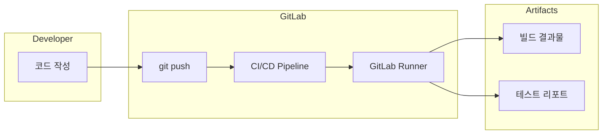
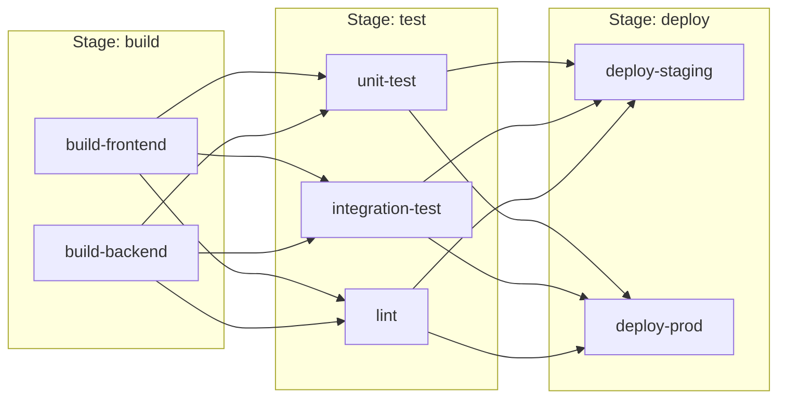
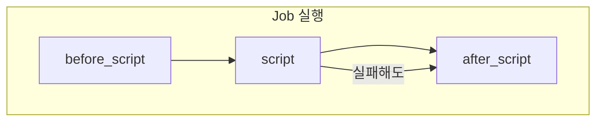
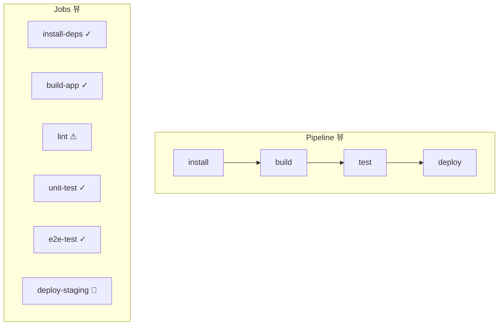

# GitLab CI/CD 시리즈 #1: 기초 - .gitlab-ci.yml의 구조와 Pipeline 이해

## 시리즈 개요

| # | 주제 | 핵심 내용 |
|---|------|----------|
| **1** | **기초** | .gitlab-ci.yml 구조, Stages, Jobs, Pipeline 흐름 |
| 2 | Variables & Secrets | 변수 유형, 우선순위, 외부 Vault 연동 |
| 3 | Runners & Executors | Docker, Kubernetes, Docker-in-Docker |
| 4 | Pipeline 아키텍처 | Parent-Child, Multi-Project Pipeline |
| 5 | 고급 Job 제어 | rules, needs, DAG, extends |
| 6 | 외부 통합 | Triggers, Webhooks, API |

---

## GitLab CI/CD란?

GitLab CI/CD는 GitLab에 내장된 **지속적 통합(CI)** 및 **지속적 배포(CD)** 도구입니다. 코드가 저장소에 푸시될 때마다 자동으로 빌드, 테스트, 배포를 실행합니다.



### 핵심 구성 요소

| 구성 요소 | 역할 |
|----------|------|
| **`.gitlab-ci.yml`** | 파이프라인 정의 파일 (프로젝트 루트) |
| **Pipeline** | Jobs의 집합, 코드 변경 시 트리거 |
| **Stage** | Jobs를 그룹화하는 단계 |
| **Job** | 실제 작업을 수행하는 단위 |
| **Runner** | Jobs를 실행하는 에이전트 |

---

## .gitlab-ci.yml 기본 구조

프로젝트 루트에 `.gitlab-ci.yml` 파일을 생성하면 GitLab이 자동으로 인식합니다.

### 최소 예제

```yaml
# 가장 간단한 .gitlab-ci.yml
build-job:
  script:
    - echo "Hello, GitLab CI!"
```

이 한 줄만으로도 파이프라인이 생성됩니다. `script`는 필수 키워드입니다.

### 완전한 기본 구조

```yaml
# 1. 전역 기본값 설정
default:
  image: node:20-alpine
  before_script:
    - npm ci

# 2. Stages 정의 (실행 순서)
stages:
  - build
  - test
  - deploy

# 3. Jobs 정의
build-job:
  stage: build
  script:
    - npm run build
  artifacts:
    paths:
      - dist/

test-job:
  stage: test
  script:
    - npm run test

deploy-job:
  stage: deploy
  script:
    - echo "Deploying to production..."
  when: manual  # 수동 승인 필요
```

---

## Stages: 실행 순서 정의

**Stages**는 Jobs를 그룹화하고 **실행 순서**를 정의합니다.

```yaml
stages:
  - build      # 1단계: 모든 build 스테이지 Jobs 병렬 실행
  - test       # 2단계: build 완료 후 test Jobs 병렬 실행
  - deploy     # 3단계: test 완료 후 deploy Jobs 실행
```

### Stage 실행 흐름



> [!IMPORTANT]
> 같은 Stage 내의 Jobs는 **병렬로 실행**됩니다. 다음 Stage는 이전 Stage의 모든 Jobs가 **성공해야** 시작됩니다.

### 기본 Stages

`stages`를 명시하지 않으면 다음 기본값이 적용됩니다:

```yaml
stages:
  - .pre      # 항상 첫 번째
  - build
  - test
  - deploy
  - .post     # 항상 마지막
```

---

## Jobs: 실제 작업 단위

**Job**은 파이프라인의 기본 실행 단위입니다. 각 Job은 독립적인 환경에서 실행됩니다.

### Job 기본 문법

```yaml
job-name:                    # Job 이름 (자유롭게 지정)
  stage: test                # 소속 Stage
  image: python:3.12         # 실행 환경 (Docker 이미지)
  script:                    # 실행할 명령어 (필수)
    - pip install -r requirements.txt
    - pytest
  tags:                      # Runner 선택 태그
    - docker
```

### 예약된 Job 이름

일부 이름은 특별한 의미를 가지므로 **사용할 수 없습니다**:

| 예약어 | 용도 |
|--------|------|
| `image` | Docker 이미지 지정 |
| `services` | 서비스 컨테이너 |
| `stages` | Stage 정의 |
| `include` | 외부 파일 포함 |
| `variables` | 변수 정의 |
| `default` | 기본값 설정 |

### 숨겨진 Job (템플릿)

점(`.`)으로 시작하는 Job은 실행되지 않고 **템플릿**으로 사용됩니다:

```yaml
.test-template:      # 실행되지 않음, 템플릿
  stage: test
  before_script:
    - setup-test-env.sh

unit-test:
  extends: .test-template  # 템플릿 상속
  script:
    - pytest unit/

integration-test:
  extends: .test-template
  script:
    - pytest integration/
```

---

## Script: 명령어 실행

### script, before_script, after_script

```yaml
job:
  before_script:     # script 이전에 실행
    - echo "Setting up..."
    - apt-get update
    
  script:            # 메인 명령어 (필수)
    - echo "Running main task..."
    - npm run build
    
  after_script:      # script 이후에 항상 실행 (실패해도)
    - echo "Cleaning up..."
    - rm -rf temp/
```

### 실행 순서



> [!TIP]
> `after_script`는 Job의 성공/실패와 관계없이 **항상 실행**됩니다. 리소스 정리에 유용합니다.

### 여러 줄 스크립트

```yaml
job:
  script:
    # 방법 1: 배열로 나열
    - echo "First command"
    - echo "Second command"
    
    # 방법 2: 리터럴 블록
    - |
      echo "Multi-line"
      echo "commands"
      if [ "$DEBUG" = "true" ]; then
        echo "Debug mode"
      fi
    
    # 방법 3: 폴딩 블록 (한 줄로 연결)
    - >
      curl -X POST
      -H "Content-Type: application/json"
      -d '{"key": "value"}'
      https://api.example.com
```

---

## Pipeline 트리거 방식

파이프라인은 다양한 이벤트로 트리거됩니다.

### 기본 트리거

| 트리거 | 설명 |
|--------|------|
| `push` | 브랜치에 커밋 푸시 |
| `merge_request_event` | MR 생성/업데이트 |
| `schedule` | 스케줄 (cron) |
| `web` | GitLab UI에서 수동 실행 |
| `api` | API 호출 |
| `trigger` | 다른 파이프라인에서 트리거 |

### 트리거별 조건 분기

```yaml
build:
  stage: build
  script:
    - npm run build
  rules:
    - if: $CI_PIPELINE_SOURCE == "push"
    - if: $CI_PIPELINE_SOURCE == "merge_request_event"

deploy:
  stage: deploy
  script:
    - deploy.sh
  rules:
    - if: $CI_COMMIT_BRANCH == "main"
      when: manual  # main 브랜치는 수동 배포
```

### Predefined Variables

GitLab은 파이프라인 실행 시 [다양한 변수](https://docs.gitlab.com/ee/ci/variables/predefined_variables.html)를 자동으로 제공합니다:

```yaml
job:
  script:
    - echo "Branch: $CI_COMMIT_BRANCH"
    - echo "Commit SHA: $CI_COMMIT_SHA"
    - echo "Project: $CI_PROJECT_NAME"
    - echo "Pipeline Source: $CI_PIPELINE_SOURCE"
    - echo "MR IID: $CI_MERGE_REQUEST_IID"
```

---

## 실전 예제: Node.js 풀스택 프로젝트

```yaml
default:
  image: node:20-alpine

stages:
  - install
  - build
  - test
  - deploy

# 캐시 설정 (의존성 재사용)
.node-cache:
  cache:
    key:
      files:
        - package-lock.json
    paths:
      - node_modules/
    policy: pull

install-deps:
  stage: install
  extends: .node-cache
  cache:
    policy: pull-push  # 캐시 저장
  script:
    - npm ci
  artifacts:
    paths:
      - node_modules/
    expire_in: 1 hour

build-app:
  stage: build
  extends: .node-cache
  script:
    - npm run build
  artifacts:
    paths:
      - dist/
    expire_in: 1 week

lint:
  stage: test
  extends: .node-cache
  script:
    - npm run lint
  allow_failure: true  # 실패해도 파이프라인 계속

unit-test:
  stage: test
  extends: .node-cache
  script:
    - npm run test:unit -- --coverage
  coverage: '/All files\s+\|\s+(\d+\.?\d*)\s*\|/'
  artifacts:
    reports:
      junit: junit.xml
      coverage_report:
        coverage_format: cobertura
        path: coverage/cobertura-coverage.xml

e2e-test:
  stage: test
  image: mcr.microsoft.com/playwright:v1.40.0
  extends: .node-cache
  script:
    - npm run test:e2e
  artifacts:
    when: on_failure
    paths:
      - test-results/

deploy-staging:
  stage: deploy
  script:
    - echo "Deploying to staging..."
  environment:
    name: staging
    url: https://staging.example.com
  rules:
    - if: $CI_COMMIT_BRANCH == "develop"

deploy-production:
  stage: deploy
  script:
    - echo "Deploying to production..."
  environment:
    name: production
    url: https://example.com
  rules:
    - if: $CI_COMMIT_BRANCH == "main"
      when: manual
```

---

## Pipeline 시각화와 디버깅

### GitLab UI에서 Pipeline 확인



### CI Lint

`.gitlab-ci.yml` 문법을 검증하려면:

1. **GitLab UI**: `CI/CD > Pipelines > CI lint`
2. **API**:

   ```bash
   curl --header "PRIVATE-TOKEN: $GITLAB_TOKEN" \
     --data "content=$(cat .gitlab-ci.yml)" \
     "https://gitlab.com/api/v4/ci/lint"
   ```

### 디버그 로깅

```yaml
variables:
  CI_DEBUG_TRACE: "true"  # 상세 로그 출력

job:
  script:
    - set -x  # 명령어 출력
    - echo "Debug info"
```

> [!WARNING]
> `CI_DEBUG_TRACE`는 **시크릿을 포함한 모든 변수**를 로그에 출력합니다. 프로덕션에서 사용 시 주의하세요.

---

## 정리

| 개념 | 설명 |
|-----|------|
| `.gitlab-ci.yml` | 프로젝트 루트에 위치한 파이프라인 정의 파일 |
| **Stage** | Jobs를 그룹화하고 실행 순서 정의 |
| **Job** | 실제 작업 단위, 독립 환경에서 실행 |
| **script** | Job에서 실행할 명령어 (필수) |
| **Pipeline** | 트리거에 의해 생성되는 Stages/Jobs의 집합 |

---

## 다음 편 예고

**2편: Variables와 Secrets 관리**에서는 다음을 다룹니다:

- CI/CD Variables의 종류 (Predefined, Custom, Protected, Masked)
- 프로젝트/그룹/인스턴스 레벨 변수
- 변수 우선순위 (Precedence)
- `.env` 파일과 dotenv artifacts
- Vault, AWS Secrets Manager 연동

---

## 참고 자료

- [GitLab CI/CD Documentation](https://docs.gitlab.com/ee/ci/)
- [.gitlab-ci.yml Reference](https://docs.gitlab.com/ee/ci/yaml/)
- [Predefined Variables](https://docs.gitlab.com/ee/ci/variables/predefined_variables.html)
- [CI/CD Pipeline Configuration](https://docs.gitlab.com/ee/ci/pipelines/)
