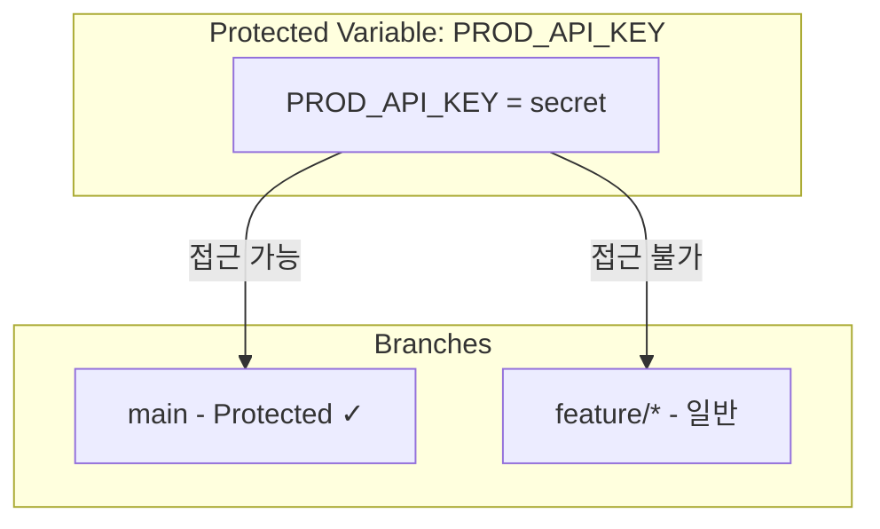
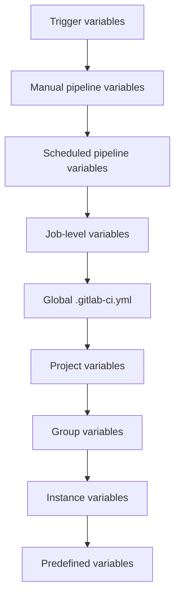
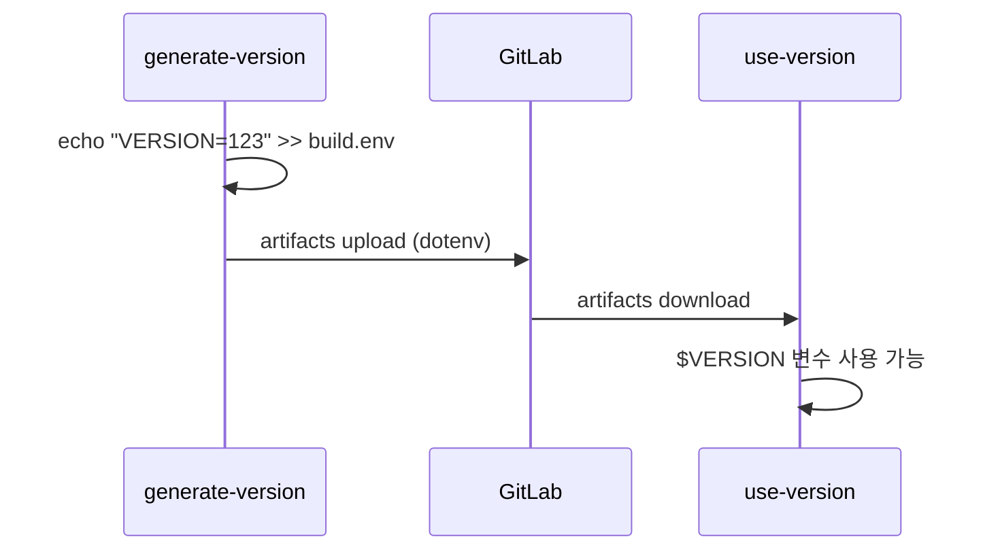

# GitLab CI/CD 시리즈 #2: Variables와 Secrets 관리

## 시리즈 개요

| # | 주제 | 핵심 내용 |
|---|------|----------|
| 1 | 기초 | .gitlab-ci.yml 구조, Stages, Jobs, Pipeline 흐름 |
| **2** | **Variables & Secrets** | 변수 유형, 우선순위, 외부 Vault 연동 |
| 3 | Runners & Executors | Docker, Kubernetes, Docker-in-Docker |
| 4 | Pipeline 아키텍처 | Parent-Child, Multi-Project Pipeline |
| 5 | 고급 Job 제어 | rules, needs, DAG, extends |
| 6 | 외부 통합 | Triggers, Webhooks, API |

---

## Variables 개요

GitLab CI/CD에서 **Variables**는 파이프라인 동작을 제어하고, 환경별 설정을 관리하며, 시크릿을 전달하는 핵심 메커니즘입니다.

### 변수 유형

| 유형 | 정의 위치 | 예시 |
|-----|----------|------|
| **Predefined** | GitLab 자동 제공 | `$CI_COMMIT_SHA`, `$CI_JOB_ID` |
| **File-defined** | `.gitlab-ci.yml` | `variables:` 블록 |
| **Project** | Settings > CI/CD | API 키, 배포 토큰 |
| **Group** | 그룹 Settings | 공통 시크릿 |
| **Instance** | Admin > CI/CD | 전역 설정 |

---

## Predefined Variables

GitLab은 **200개 이상의 사전 정의 변수**를 제공합니다. 파이프라인 콘텍스트 정보를 담고 있습니다.

### 자주 사용하는 변수

```yaml
job:
  script:
    # Pipeline 정보
    - echo "Pipeline ID: $CI_PIPELINE_ID"
    - echo "Pipeline Source: $CI_PIPELINE_SOURCE"
    
    # Commit 정보
    - echo "Branch: $CI_COMMIT_BRANCH"
    - echo "Tag: $CI_COMMIT_TAG"
    - echo "SHA: $CI_COMMIT_SHA"
    - echo "Short SHA: $CI_COMMIT_SHORT_SHA"
    - echo "Message: $CI_COMMIT_MESSAGE"
    
    # Merge Request
    - echo "MR IID: $CI_MERGE_REQUEST_IID"
    - echo "Target Branch: $CI_MERGE_REQUEST_TARGET_BRANCH_NAME"
    
    # Project
    - echo "Project Path: $CI_PROJECT_PATH"
    - echo "Project URL: $CI_PROJECT_URL"
    
    # Job
    - echo "Job Name: $CI_JOB_NAME"
    - echo "Job Stage: $CI_JOB_STAGE"
```

### Pipeline Source 값

| 값 | 트리거 |
|---|--------|
| `push` | 브랜치 푸시 |
| `merge_request_event` | MR 생성/업데이트 |
| `schedule` | 스케줄 파이프라인 |
| `web` | UI에서 수동 실행 |
| `api` | API 호출 |
| `trigger` | 다른 파이프라인에서 트리거 |
| `pipeline` | 멀티 프로젝트 파이프라인 |
| `parent_pipeline` | Parent 파이프라인에서 |

---

## File-defined Variables

`.gitlab-ci.yml`에서 직접 변수를 정의합니다.

### 전역 변수

```yaml
variables:
  NODE_ENV: "production"
  DOCKER_REGISTRY: "registry.gitlab.com"
  
stages:
  - build
  - test

build:
  script:
    - echo "Environment: $NODE_ENV"
    - docker build -t $DOCKER_REGISTRY/myapp .
```

### Job 레벨 변수

```yaml
variables:
  GLOBAL_VAR: "global"

job1:
  variables:
    JOB_VAR: "job1-specific"
  script:
    - echo "$GLOBAL_VAR"  # global
    - echo "$JOB_VAR"     # job1-specific

job2:
  script:
    - echo "$GLOBAL_VAR"  # global
    - echo "$JOB_VAR"     # (비어있음)
```

### 변수 확장 (Expansion)

변수 안에서 다른 변수를 참조할 수 있습니다:

```yaml
variables:
  PROJECT: "myapp"
  VERSION: "1.0.0"
  IMAGE_TAG: "$PROJECT:$VERSION"  # myapp:1.0.0

job:
  script:
    - docker build -t $IMAGE_TAG .
```

### 확장 비활성화

```yaml
variables:
  # 방법 1: 따옴표와 이스케이프
  LITERAL: "$$NOT_EXPANDED"
  
  # 방법 2: expand: false (GitLab 15.6+)
  PASSWORD:
    value: "pa$$word"
    expand: false
```

---

## Project/Group Variables (UI 설정)

민감한 정보는 `.gitlab-ci.yml`에 직접 작성하지 않고 **GitLab UI**에서 설정합니다.

### 설정 경로

- **Project**: `Settings > CI/CD > Variables`
- **Group**: `Group Settings > CI/CD > Variables`
- **Instance**: `Admin > Settings > CI/CD > Variables`

### 변수 옵션

| 옵션 | 설명 |
|------|------|
| **Protected** | Protected 브랜치/태그에서만 사용 가능 |
| **Masked** | Job 로그에서 `[MASKED]`로 표시 |
| **Expanded** | 다른 변수 참조 허용 (기본 true) |

### Protected Variables



> [!IMPORTANT]
> **Protected 변수**는 Protected 브랜치/태그에서 실행되는 파이프라인에서만 사용 가능합니다. `feature/*` 브랜치에서 프로덕션 시크릿 접근을 방지합니다.

### Masked Variables

```yaml
job:
  script:
    - echo "Token: $SECRET_TOKEN"
    # 로그 출력: Token: [MASKED]
```

**Masking 조건**:

- 최소 8자
- Base64 유효 문자만 (`A-Za-z0-9+/=@:.~`)
- 여러 줄 불가

---

## Variable 우선순위

동일한 이름의 변수가 여러 위치에 정의된 경우, **우선순위**에 따라 값이 결정됩니다.

### 우선순위 (높은 순)



1. **Trigger variables** (트리거 시 전달)
2. **Manual pipeline variables** (수동 실행 시 입력)
3. **Scheduled pipeline variables** (스케줄 설정)
4. **Job-level** (`.gitlab-ci.yml` Job 내)
5. **Global** (`.gitlab-ci.yml` 전역)
6. **Project variables** (UI 설정)
7. **Group variables** (상위 그룹 포함)
8. **Instance variables** (Admin 설정)
9. **Predefined variables** (GitLab 제공)

### 예시: 우선순위 확인

```yaml
variables:
  MY_VAR: "from-gitlab-ci"  # 5번 우선순위

job:
  variables:
    MY_VAR: "from-job"      # 4번 우선순위 (이 값 사용)
  script:
    - echo "$MY_VAR"        # from-job
```

---

## dotenv Artifacts

Job 간에 **동적으로 생성된 변수**를 전달할 수 있습니다.

### 변수 생성 및 전파

```yaml
generate-version:
  stage: build
  script:
    - VERSION=$(date +%Y%m%d%H%M%S)
    - echo "VERSION=$VERSION" >> build.env
    - echo "COMMIT_HASH=$CI_COMMIT_SHORT_SHA" >> build.env
  artifacts:
    reports:
      dotenv: build.env

use-version:
  stage: deploy
  needs:
    - job: generate-version
      artifacts: true
  script:
    - echo "Deploying version: $VERSION"
    - echo "Commit: $COMMIT_HASH"
```

### 동작 원리



> [!TIP]
> **dotenv**는 Job 간 동적 값 전달에 유용합니다. 빌드 버전, Git 태그, 계산된 값 등을 전달할 때 사용합니다.

---

## File Type Variables

큰 데이터나 인증서는 **File 타입 변수**로 저장합니다.

### 설정 (UI)

1. `Settings > CI/CD > Variables`
2. `Type: File` 선택
3. 파일 내용 입력

### 사용

```yaml
job:
  script:
    # 변수 값은 파일 경로
    - cat $KUBE_CONFIG  # 파일 내용 출력
    - kubectl --kubeconfig=$KUBE_CONFIG get pods
```

### 일반적인 용도

- Kubernetes kubeconfig
- GCP 서비스 계정 JSON
- SSH 프라이빗 키
- TLS 인증서

---

## External Secrets 연동

### HashiCorp Vault

GitLab Premium 이상에서 Vault와 네이티브 통합을 지원합니다.

```yaml
job:
  id_tokens:
    VAULT_ID_TOKEN:
      aud: https://vault.example.com
  secrets:
    DATABASE_PASSWORD:
      vault: production/db/password@secrets
      file: false
  script:
    - echo "Password: $DATABASE_PASSWORD"
```

### Vault JWT 인증 (무료)

```yaml
variables:
  VAULT_ADDR: "https://vault.example.com"

get-secrets:
  image: hashicorp/vault:latest
  script:
    - export VAULT_TOKEN=$(vault write -field=token auth/jwt/login role=myapp jwt=$CI_JOB_JWT)
    - vault kv get -field=password secret/myapp/db > db_password.txt
  artifacts:
    paths:
      - db_password.txt
```

### AWS Secrets Manager

```yaml
variables:
  AWS_DEFAULT_REGION: ap-northeast-2

get-aws-secret:
  image: amazon/aws-cli:latest
  script:
    - SECRET=$(aws secretsmanager get-secret-value --secret-id prod/db/password --query SecretString --output text)
    - echo "SECRET=$SECRET" >> aws.env
  artifacts:
    reports:
      dotenv: aws.env
```

---

## 변수 보안 Best Practices

### 1. Protected 변수 활용

```yaml
# 프로덕션 배포는 Protected 브랜치에서만
deploy-prod:
  script:
    - deploy --token $PROD_DEPLOY_TOKEN  # Protected 변수
  rules:
    - if: $CI_COMMIT_BRANCH == "main"
```

### 2. Masked 변수 필수화

민감한 모든 변수에 Masked 옵션을 활성화합니다.

### 3. 최소 권한 원칙

```yaml
# 잘못된 예: 모든 Job에서 프로덕션 시크릿 접근
variables:
  PROD_DB_PASSWORD: $PROD_DB_PASSWORD  # 위험!

# 올바른 예: 필요한 Job에서만 사용
deploy-prod:
  variables:
    DB_PASSWORD: $PROD_DB_PASSWORD
  script:
    - deploy.sh
```

### 4. 시크릿 로테이션

정기적으로 시크릿을 교체하고, 변수 업데이트 시 기존 파이프라인에 영향 없이 새 값이 적용됩니다.

---

## 정리

| 개념 | 설명 |
|-----|------|
| **Predefined** | GitLab이 자동 제공하는 200+ 변수 |
| **File-defined** | `.gitlab-ci.yml`에 정의 |
| **Project/Group** | UI에서 설정, 시크릿 저장 |
| **Protected** | Protected 브랜치/태그에서만 접근 |
| **Masked** | 로그에서 `[MASKED]` 처리 |
| **dotenv** | Job 간 동적 변수 전달 |
| **우선순위** | Trigger > Job > Global > Project > Group > Instance |

---

## 다음 편 예고

**3편: Runners와 Executors**에서는 다음을 다룹니다:

- Runner 유형 (Shared, Group, Project)
- Executor 종류 (Shell, Docker, Kubernetes)
- **Docker-in-Docker (DinD)** 심화
- TLS 설정과 보안
- Runner 성능 최적화

---

## 참고 자료

- [GitLab CI/CD Variables](https://docs.gitlab.com/ee/ci/variables/)
- [Predefined Variables Reference](https://docs.gitlab.com/ee/ci/variables/predefined_variables.html)
- [Using External Secrets](https://docs.gitlab.com/ee/ci/secrets/)
- [Variable Precedence](https://docs.gitlab.com/ee/ci/variables/#cicd-variable-precedence)
