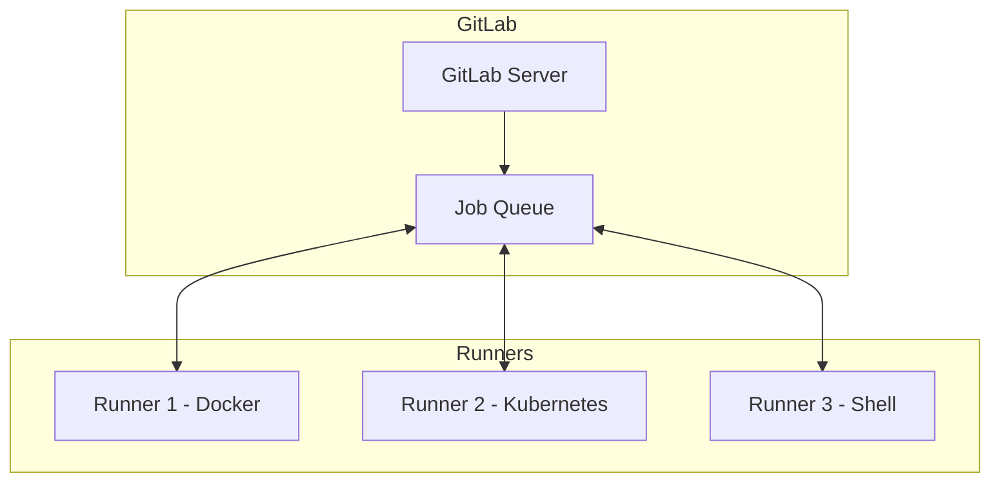
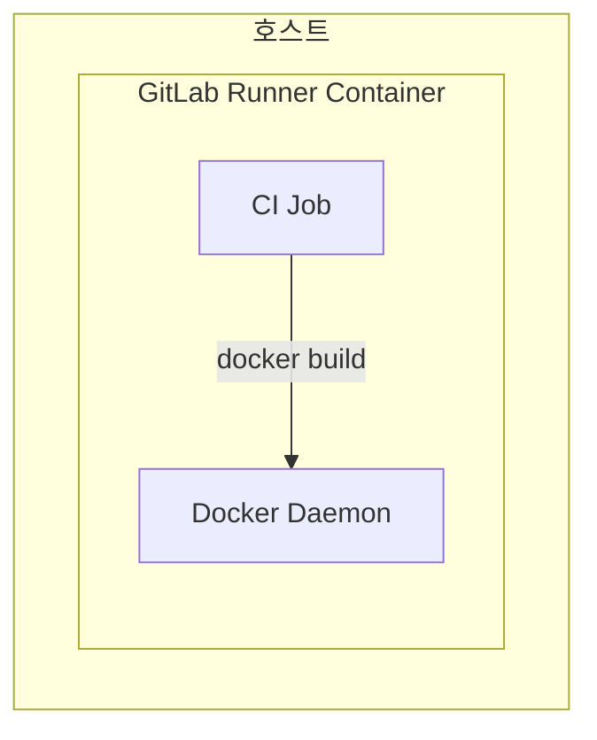
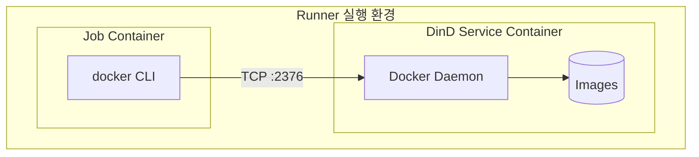
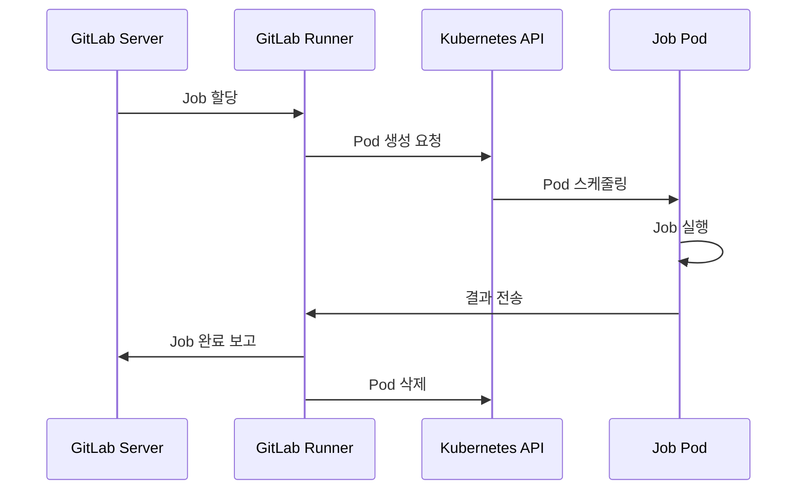

# GitLab CI/CD 시리즈 #3: Runners와 Executors - Docker-in-Docker 심화

## 시리즈 개요

| # | 주제 | 핵심 내용 |
|---|------|----------|
| 1 | 기초 | .gitlab-ci.yml 구조, Stages, Jobs, Pipeline 흐름 |
| 2 | Variables & Secrets | 변수 유형, 우선순위, 외부 Vault 연동 |
| **3** | **Runners & Executors** | Docker, Kubernetes, Docker-in-Docker |
| 4 | Pipeline 아키텍처 | Parent-Child, Multi-Project Pipeline |
| 5 | 고급 Job 제어 | rules, needs, DAG, extends |
| 6 | 외부 통합 | Triggers, Webhooks, API |

---

## GitLab Runner란?

**GitLab Runner**는 CI/CD Jobs를 실제로 실행하는 에이전트입니다. GitLab 서버와 분리되어 동작하며, 다양한 환경에서 실행할 수 있습니다.



### Runner 유형

| 유형 | 범위 | 설정 위치 |
|-----|------|----------|
| **Shared** | 인스턴스 전체 | Admin Area |
| **Group** | 특정 그룹과 하위 프로젝트 | Group Settings |
| **Project** | 특정 프로젝트만 | Project Settings |

### Runner 등록

```bash
# Runner 설치 (Linux)
curl -L "https://packages.gitlab.com/install/repositories/runner/gitlab-runner/script.deb.sh" | sudo bash
sudo apt-get install gitlab-runner

# Runner 등록
sudo gitlab-runner register \
  --url "https://gitlab.com/" \
  --registration-token "PROJECT_REGISTRATION_TOKEN" \
  --description "My Docker Runner" \
  --executor "docker" \
  --docker-image "alpine:latest"
```

---

## Executor 유형

Executor는 Jobs가 **어떤 환경에서 실행되는지** 결정합니다.

### 주요 Executors

| Executor | 격리 수준 | 용도 |
|----------|----------|------|
| **Shell** | 없음 | 간단한 스크립트, 호스트 직접 접근 |
| **Docker** | 컨테이너 | 일반적인 CI/CD |
| **Docker Machine** | VM + 컨테이너 | Auto-scaling |
| **Kubernetes** | Pod | 클라우드 네이티브 |
| **VirtualBox** | VM | 완전 격리 필요 시 |

### Shell Executor

호스트에서 직접 명령을 실행합니다.

```toml
# /etc/gitlab-runner/config.toml
[[runners]]
  name = "shell-runner"
  executor = "shell"
  shell = "bash"
```

```yaml
job:
  script:
    - whoami  # gitlab-runner 사용자
    - ls /home
```

> [!WARNING]
> Shell Executor는 **격리가 없어** 보안에 취약합니다. 신뢰할 수 있는 코드만 실행하세요.

### Docker Executor

가장 일반적인 Executor입니다. 각 Job은 독립된 컨테이너에서 실행됩니다.

```toml
[[runners]]
  name = "docker-runner"
  executor = "docker"
  [runners.docker]
    image = "alpine:latest"
    privileged = false
    volumes = ["/cache"]
    shm_size = 0
```

```yaml
job:
  image: node:20-alpine
  script:
    - npm ci
    - npm run build
```

---

## Docker-in-Docker (DinD)

CI/CD 파이프라인에서 **Docker 이미지를 빌드**해야 할 때 DinD를 사용합니다.

### 왜 DinD가 필요한가?



일반 Docker Executor에서는 `docker` 명령을 사용할 수 없습니다. 컨테이너 안에 Docker 데몬이 없기 때문입니다.

### DinD 설정

```yaml
default:
  image: docker:24.0.5
  services:
    - name: docker:24.0.5-dind
      alias: docker

variables:
  DOCKER_HOST: tcp://docker:2376
  DOCKER_TLS_CERTDIR: "/certs"
  DOCKER_TLS_VERIFY: 1
  DOCKER_CERT_PATH: "$DOCKER_TLS_CERTDIR/client"

build:
  stage: build
  script:
    - docker info
    - docker build -t myapp:$CI_COMMIT_SHA .
    - docker push myapp:$CI_COMMIT_SHA
```

### DinD 아키텍처



### TLS 활성화 vs 비활성화

#### TLS 활성화 (기본, 권장)

```yaml
variables:
  DOCKER_HOST: tcp://docker:2376
  DOCKER_TLS_CERTDIR: "/certs"
  DOCKER_TLS_VERIFY: 1
  DOCKER_CERT_PATH: "$DOCKER_TLS_CERTDIR/client"
```

#### TLS 비활성화 (테스트용)

```yaml
variables:
  DOCKER_HOST: tcp://docker:2375
  DOCKER_TLS_CERTDIR: ""
```

> [!CAUTION]
> TLS 비활성화는 **암호화되지 않은 통신**을 사용합니다. 프로덕션에서는 사용하지 마세요.

### Runner 설정 (config.toml)

```toml
[[runners]]
  name = "docker-runner"
  executor = "docker"
  [runners.docker]
    tls_verify = false
    image = "docker:24.0.5"
    privileged = true  # DinD 필수
    disable_entrypoint_overwrite = false
    oom_kill_disable = false
    disable_cache = false
    volumes = ["/certs/client", "/cache"]
    shm_size = 0
```

---

## Docker Socket Binding (대안)

DinD 대신 **호스트 Docker 소켓을 마운트**하는 방식도 있습니다.

```toml
[[runners]]
  [runners.docker]
    volumes = ["/var/run/docker.sock:/var/run/docker.sock"]
```

```yaml
build:
  image: docker:24.0.5
  script:
    - docker build -t myapp .
```

### DinD vs Socket Binding

| 특성 | DinD | Socket Binding |
|-----|------|----------------|
| **격리** | 완전 격리 | 호스트와 공유 |
| **보안** | 안전 | 호스트 접근 가능 |
| **성능** | 약간 느림 | 빠름 |
| **캐시** | Job마다 초기화 | 호스트 캐시 공유 |
| **빌드 레이어** | 매번 다운로드 | 캐시 활용 |

> [!IMPORTANT]
> **Socket Binding**은 호스트 Docker에 직접 접근하므로 **신뢰할 수 있는 코드만** 실행해야 합니다. DinD가 더 안전합니다.

---

## Kubernetes Executor

Kubernetes 클러스터에서 Jobs를 Pod로 실행합니다.

### 설정

```toml
[[runners]]
  name = "k8s-runner"
  executor = "kubernetes"
  [runners.kubernetes]
    namespace = "gitlab-runner"
    image = "alpine:latest"
    privileged = false
    
    cpu_request = "100m"
    cpu_limit = "1"
    memory_request = "128Mi"
    memory_limit = "1Gi"
    
    service_cpu_request = "100m"
    service_memory_request = "128Mi"
    
    poll_interval = 5
    poll_timeout = 3600
```

### Kubernetes DinD

```toml
[[runners]]
  [runners.kubernetes]
    privileged = true
    
    [[runners.kubernetes.services]]
      name = "docker:24.0.5-dind"
      alias = "docker"
      command = ["--storage-driver=overlay2"]
```

```yaml
build:
  image: docker:24.0.5
  services:
    - docker:24.0.5-dind
  variables:
    DOCKER_HOST: tcp://docker:2376
    DOCKER_TLS_CERTDIR: "/certs"
  script:
    - docker build -t myapp .
```

### Pod 생성 흐름



---

## Runner 태그와 Job 매칭

Runner에 태그를 지정하여 특정 Jobs만 실행하도록 제한합니다.

### Runner 태그

```toml
[[runners]]
  name = "gpu-runner"
  tags = ["gpu", "cuda", "ml"]
```

### Job 태그

```yaml
train-model:
  tags:
    - gpu
    - ml
  script:
    - python train.py

deploy:
  tags:
    - docker
  script:
    - ./deploy.sh
```

### 태그 없는 Job 처리

```toml
[[runners]]
  run_untagged = true  # 태그 없는 Job도 실행
```

---

## Runner 성능 최적화

### 동시 실행

```toml
concurrent = 10  # 전체 Runner가 동시 실행할 수 있는 최대 Job 수

[[runners]]
  limit = 5  # 이 Runner의 최대 동시 Job 수
```

### 캐시 설정

```yaml
default:
  cache:
    key:
      files:
        - package-lock.json
    paths:
      - node_modules/
    policy: pull-push

build:
  cache:
    policy: pull  # 읽기만
```

### 분산 캐시 (S3)

```toml
[[runners]]
  [runners.cache]
    Type = "s3"
    Shared = true
    [runners.cache.s3]
      ServerAddress = "s3.amazonaws.com"
      BucketName = "gitlab-runner-cache"
      BucketLocation = "ap-northeast-2"
```

---

## 실전 예제: 멀티 아키텍처 빌드

```yaml
stages:
  - build
  - manifest

variables:
  DOCKER_HOST: tcp://docker:2376
  DOCKER_TLS_CERTDIR: "/certs"

.docker-build:
  image: docker:24.0.5
  services:
    - docker:24.0.5-dind
  before_script:
    - docker login -u $CI_REGISTRY_USER -p $CI_REGISTRY_PASSWORD $CI_REGISTRY

build-amd64:
  extends: .docker-build
  tags:
    - amd64
  script:
    - docker build --platform linux/amd64 -t $CI_REGISTRY_IMAGE:amd64 .
    - docker push $CI_REGISTRY_IMAGE:amd64

build-arm64:
  extends: .docker-build
  tags:
    - arm64
  script:
    - docker build --platform linux/arm64 -t $CI_REGISTRY_IMAGE:arm64 .
    - docker push $CI_REGISTRY_IMAGE:arm64

create-manifest:
  extends: .docker-build
  stage: manifest
  script:
    - docker manifest create $CI_REGISTRY_IMAGE:latest
        $CI_REGISTRY_IMAGE:amd64
        $CI_REGISTRY_IMAGE:arm64
    - docker manifest push $CI_REGISTRY_IMAGE:latest
```

---

## 정리

| 개념 | 설명 |
|-----|------|
| **Runner** | Jobs를 실행하는 에이전트 |
| **Executor** | 실행 환경 결정 (Shell, Docker, K8s) |
| **DinD** | 컨테이너 안에서 Docker 빌드 |
| **TLS** | DinD 통신 암호화 (권장) |
| **Socket Binding** | 호스트 Docker 공유 (보안 주의) |
| **Tags** | Runner와 Job 매칭 |

---

## 다음 편 예고

**4편: Pipeline 아키텍처**에서는 다음을 다룹니다:

- 기본 Pipeline vs DAG Pipeline
- **Parent-Child Pipelines** (동적 파이프라인)
- **Multi-Project Pipelines** (크로스 프로젝트)
- `trigger` 키워드 심화
- 동적 Child Pipeline 생성

---

## 참고 자료

- [GitLab Runner Documentation](https://docs.gitlab.com/runner/)
- [Docker Executor](https://docs.gitlab.com/runner/executors/docker.html)
- [Using Docker to Build Docker Images](https://docs.gitlab.com/ee/ci/docker/using_docker_build.html)
- [Kubernetes Executor](https://docs.gitlab.com/runner/executors/kubernetes.html)
