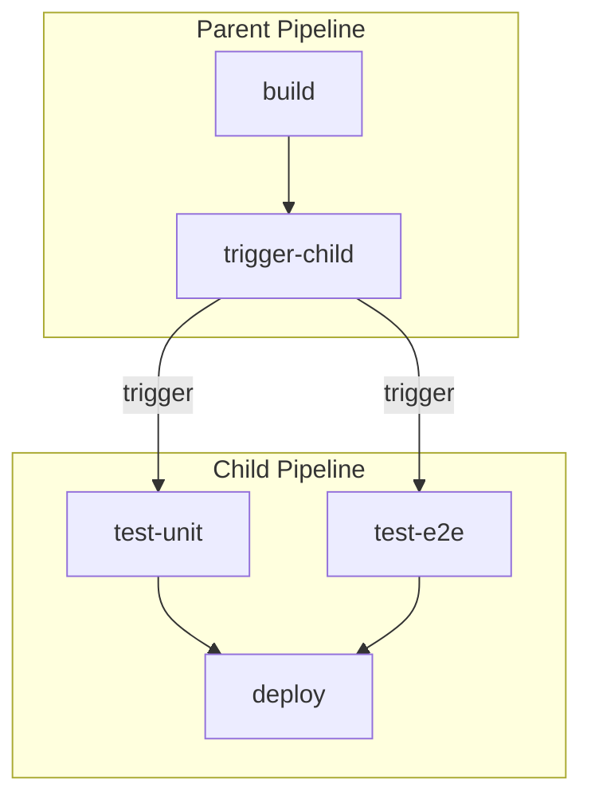
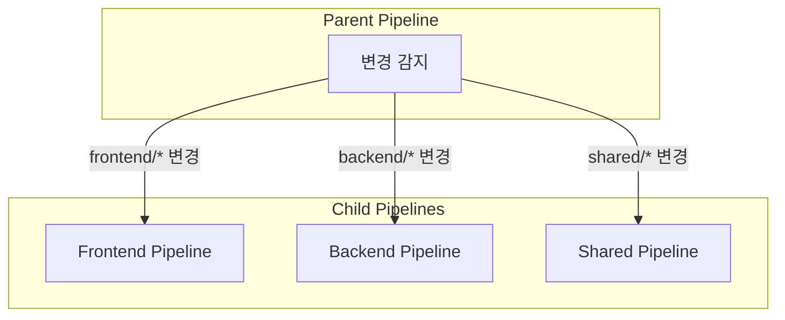
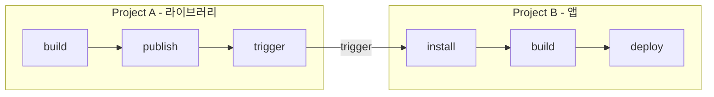
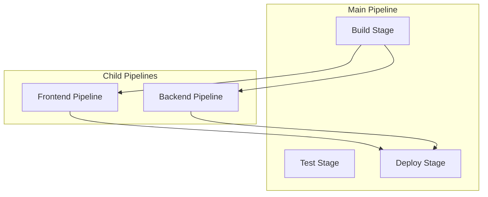

# GitLab CI/CD 시리즈 #4: Pipeline 아키텍처 - Parent-Child와 Multi-Project

## 시리즈 개요

| # | 주제 | 핵심 내용 |
|---|------|----------|
| 1 | 기초 | .gitlab-ci.yml 구조, Stages, Jobs, Pipeline 흐름 |
| 2 | Variables & Secrets | 변수 유형, 우선순위, 외부 Vault 연동 |
| 3 | Runners & Executors | Docker, Kubernetes, Docker-in-Docker |
| **4** | **Pipeline 아키텍처** | Parent-Child, Multi-Project Pipeline |
| 5 | 고급 Job 제어 | rules, needs, DAG, extends |
| 6 | 외부 통합 | Triggers, Webhooks, API |

---

## 왜 Pipeline 아키텍처가 필요한가?

단일 `.gitlab-ci.yml`이 수백 줄로 커지면 관리가 어려워집니다.

### 문제점

```yaml
# 거대한 단일 파일의 문제점
stages:
  - build
  - test
  - deploy

# 50개 이상의 Jobs...
build-frontend:
  # ...
build-backend:
  # ...
build-mobile-ios:
  # ...
build-mobile-android:
  # ...
# ... 수백 줄
```

### 해결책

| 패턴 | 용도 |
|------|------|
| **include** | 설정 파일 분리 (동일 프로젝트 내) |
| **Parent-Child** | 동적 파이프라인, 조건부 실행 |
| **Multi-Project** | 프로젝트 간 트리거 |
| **DAG** | Stage 무시하고 Job 간 의존성 직접 정의 |

---

## include: 설정 파일 분리

가장 기본적인 모듈화 방법입니다.

### include 유형

```yaml
include:
  # 1. 로컬 파일
  - local: '/templates/docker.yml'
  
  # 2. 다른 프로젝트의 파일
  - project: 'my-group/ci-templates'
    ref: main
    file: '/templates/node.yml'
  
  # 3. 원격 URL
  - remote: 'https://example.com/ci/template.yml'
  
  # 4. GitLab 제공 템플릿
  - template: 'Auto-DevOps.gitlab-ci.yml'
```

### 실전 구조

```
project/
├── .gitlab-ci.yml              # 메인 파일
├── .gitlab/
│   ├── ci/
│   │   ├── build.yml           # 빌드 Jobs
│   │   ├── test.yml            # 테스트 Jobs
│   │   └── deploy.yml          # 배포 Jobs
│   └── templates/
│       └── docker.yml          # 공통 템플릿
```

```yaml
# .gitlab-ci.yml
stages:
  - build
  - test
  - deploy

include:
  - local: '.gitlab/ci/build.yml'
  - local: '.gitlab/ci/test.yml'
  - local: '.gitlab/ci/deploy.yml'
```

```yaml
# .gitlab/ci/build.yml
build-app:
  stage: build
  script:
    - npm run build
```

---

## Parent-Child Pipelines

**Parent Pipeline**이 **Child Pipeline**을 트리거하는 구조입니다.

### 기본 구조



### 정적 Child Pipeline

```yaml
# .gitlab-ci.yml (Parent)
stages:
  - build
  - trigger

build:
  stage: build
  script:
    - npm run build
  artifacts:
    paths:
      - dist/

trigger-child:
  stage: trigger
  trigger:
    include: .gitlab/child-pipeline.yml
    strategy: depend  # Child 완료까지 대기
```

```yaml
# .gitlab/child-pipeline.yml (Child)
stages:
  - test
  - deploy

unit-test:
  stage: test
  script:
    - npm run test:unit

deploy:
  stage: deploy
  script:
    - ./deploy.sh
```

### strategy 옵션

| 옵션 | 동작 |
|------|------|
| `depend` | Child 완료까지 Parent Job 대기 |
| (없음) | Parent Job 즉시 완료, Child 비동기 실행 |

---

## 동적 Child Pipeline

**런타임에 Child Pipeline YAML을 생성**합니다.

### 동적 생성 예제

```yaml
# .gitlab-ci.yml
stages:
  - generate
  - trigger

generate-pipeline:
  stage: generate
  script:
    - |
      # 변경된 디렉토리에 따라 동적으로 파이프라인 생성
      cat > child-pipeline.yml <<EOF
      stages:
        - test
      
      $(for dir in $(git diff --name-only HEAD~1 | cut -d/ -f1 | sort -u); do
        echo "${dir}-test:"
        echo "  stage: test"
        echo "  script:"
        echo "    - echo 'Testing $dir'"
        echo ""
      done)
      EOF
  artifacts:
    paths:
      - child-pipeline.yml

trigger-tests:
  stage: trigger
  trigger:
    include:
      - artifact: child-pipeline.yml
        job: generate-pipeline
    strategy: depend
```

### Monorepo 패턴

```yaml
# .gitlab-ci.yml
stages:
  - detect
  - build

detect-changes:
  stage: detect
  script:
    - |
      # 변경된 서비스 감지
      for service in frontend backend api; do
        if git diff --name-only HEAD~1 | grep -q "^$service/"; then
          echo "$service" >> changed_services.txt
        fi
      done
      
      # 동적 파이프라인 생성
      echo "stages:" > child.yml
      echo "  - build" >> child.yml
      echo "" >> child.yml
      
      while read service; do
        cat >> child.yml <<EOF
      build-${service}:
        stage: build
        script:
          - cd ${service} && make build
      EOF
      done < changed_services.txt
  artifacts:
    paths:
      - child.yml

trigger-builds:
  stage: build
  trigger:
    include:
      - artifact: child.yml
        job: detect-changes
  rules:
    - exists:
        - changed_services.txt
```

---

## 변경된 파일 기반 트리거

`rules:changes`를 사용하여 특정 파일 변경 시에만 Child를 트리거합니다.

```yaml
# .gitlab-ci.yml
stages:
  - triggers

trigger-frontend:
  stage: triggers
  trigger:
    include: frontend/.gitlab-ci.yml
  rules:
    - changes:
        - frontend/**/*

trigger-backend:
  stage: triggers
  trigger:
    include: backend/.gitlab-ci.yml
  rules:
    - changes:
        - backend/**/*

trigger-shared:
  stage: triggers
  trigger:
    include: shared/.gitlab-ci.yml
  rules:
    - changes:
        - shared/**/*
```



---

## Multi-Project Pipelines

**다른 프로젝트의 파이프라인을 트리거**합니다.

### 기본 사용법

```yaml
# Project A의 .gitlab-ci.yml
stages:
  - build
  - trigger

build:
  stage: build
  script:
    - npm run build

trigger-project-b:
  stage: trigger
  trigger:
    project: my-group/project-b
    branch: main
    strategy: depend
```

### 변수 전달

```yaml
trigger-deploy:
  stage: trigger
  trigger:
    project: my-group/deployment
    branch: main
  variables:
    DEPLOY_ENV: production
    IMAGE_TAG: $CI_COMMIT_SHA
```

### 양방향 트리거 (Upstream → Downstream)



---

## 실전 예제: 마이크로서비스 배포

```yaml
# infrastructure/.gitlab-ci.yml (Parent)
stages:
  - build
  - trigger-services
  - deploy-infra

build-base-images:
  stage: build
  script:
    - docker build -t base-node:$CI_COMMIT_SHA ./base-images/node
    - docker push base-node:$CI_COMMIT_SHA

trigger-user-service:
  stage: trigger-services
  trigger:
    project: my-org/user-service
    branch: main
  variables:
    BASE_IMAGE_TAG: $CI_COMMIT_SHA

trigger-order-service:
  stage: trigger-services
  trigger:
    project: my-org/order-service
    branch: main
  variables:
    BASE_IMAGE_TAG: $CI_COMMIT_SHA

trigger-payment-service:
  stage: trigger-services
  trigger:
    project: my-org/payment-service
    branch: main
  variables:
    BASE_IMAGE_TAG: $CI_COMMIT_SHA

deploy-kubernetes:
  stage: deploy-infra
  trigger:
    project: my-org/k8s-manifests
    branch: main
  needs:
    - trigger-user-service
    - trigger-order-service
    - trigger-payment-service
  variables:
    SERVICES_VERSION: $CI_COMMIT_SHA
```

---

## Pipeline 간 아티팩트 공유

### Parent → Child

```yaml
# Parent
parent-job:
  script:
    - echo "data" > file.txt
  artifacts:
    paths:
      - file.txt

trigger-child:
  trigger:
    include: child.yml
  needs:
    - parent-job
```

```yaml
# Child (child.yml)
child-job:
  script:
    - cat file.txt  # Parent의 아티팩트 사용 가능
```

### Multi-Project 간 아티팩트

```yaml
# Project B
downstream-job:
  script:
    - |
      # Project A의 아티팩트 다운로드
      curl --header "PRIVATE-TOKEN: $API_TOKEN" \
        "$CI_API_V4_URL/projects/123/jobs/$UPSTREAM_JOB_ID/artifacts" \
        --output artifacts.zip
      unzip artifacts.zip
```

---

## 파이프라인 시각화

### Pipeline Graph



GitLab UI에서는 이러한 관계가 **시각적으로 표시**됩니다.

---

## 정리

| 패턴 | 용도 | 키워드 |
|-----|------|--------|
| **include** | 설정 파일 분리 | `include: local/project/remote` |
| **Parent-Child** | 동적 파이프라인 | `trigger: include:` |
| **Multi-Project** | 프로젝트 간 트리거 | `trigger: project:` |
| **동적 생성** | 런타임 파이프라인 | `artifact: + trigger` |

---

## 다음 편 예고

**5편: 고급 Job 제어**에서는 다음을 다룹니다:

- `rules` vs `only/except` 마이그레이션
- `needs`와 DAG 실행
- `dependencies`와 아티팩트 제어
- `workflow:rules` 전역 제어
- Job 템플릿과 `extends`, `!reference`

---

## 참고 자료

- [Parent-Child Pipelines](https://docs.gitlab.com/ee/ci/pipelines/downstream_pipelines.html)
- [Multi-Project Pipelines](https://docs.gitlab.com/ee/ci/pipelines/multi_project_pipelines.html)
- [Pipeline Architectures](https://docs.gitlab.com/ee/ci/pipelines/pipeline_architectures.html)
- [Dynamic Child Pipelines](https://docs.gitlab.com/ee/ci/pipelines/downstream_pipelines.html#dynamic-child-pipelines)
