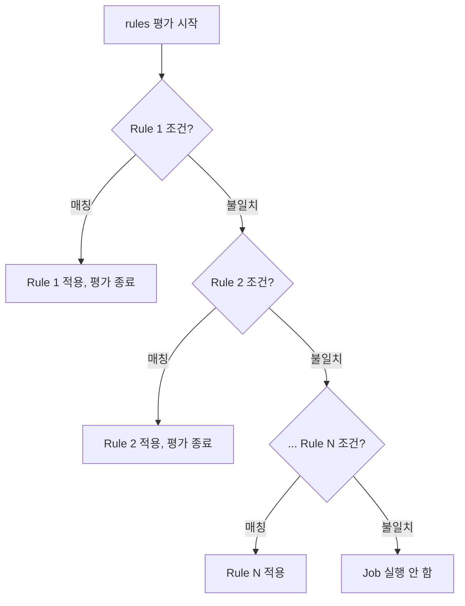
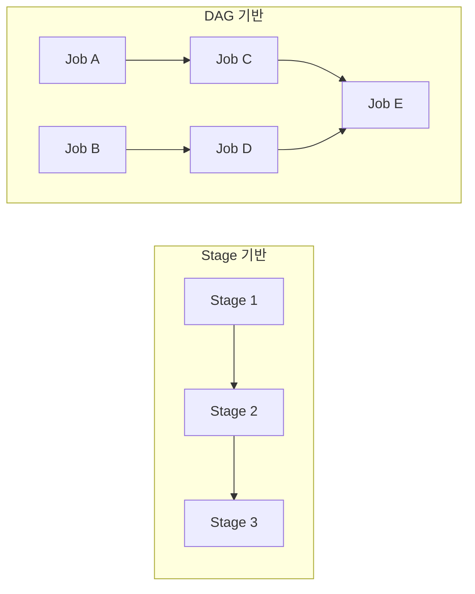
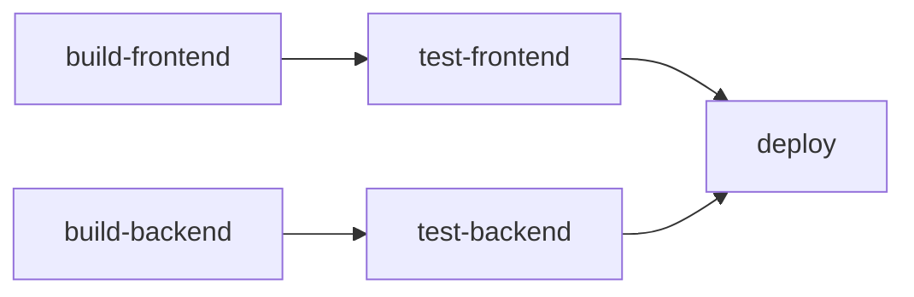
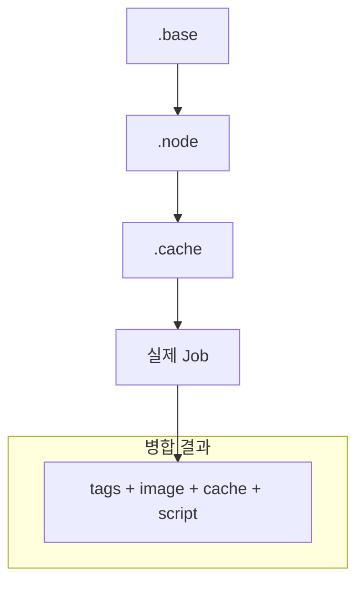

# GitLab CI/CD 시리즈 #5: 고급 Job 제어 - rules, needs, DAG

## 시리즈 개요

| # | 주제 | 핵심 내용 |
|---|------|----------|
| 1 | 기초 | .gitlab-ci.yml 구조, Stages, Jobs, Pipeline 흐름 |
| 2 | Variables & Secrets | 변수 유형, 우선순위, 외부 Vault 연동 |
| 3 | Runners & Executors | Docker, Kubernetes, Docker-in-Docker |
| 4 | Pipeline 아키텍처 | Parent-Child, Multi-Project Pipeline |
| **5** | **고급 Job 제어** | rules, needs, DAG, extends |
| 6 | 외부 통합 | Triggers, Webhooks, API |

---

## rules: 조건부 Job 실행

`rules`는 `only/except`를 대체하는 **강력한 조건부 실행 키워드**입니다.

### 기본 문법

```yaml
job:
  script:
    - echo "Hello"
  rules:
    - if: $CI_COMMIT_BRANCH == "main"
      when: always
    - if: $CI_PIPELINE_SOURCE == "merge_request_event"
      when: manual
    - when: never  # 기본값
```

### rules 평가 순서



> [!IMPORTANT]
> rules는 **위에서 아래로 순차 평가**하며, 첫 번째 매칭된 rule이 적용됩니다. 매칭되는 rule이 없으면 Job이 실행되지 않습니다.

### rules 조건 유형

#### if: 표현식 평가

```yaml
rules:
  # 브랜치 조건
  - if: $CI_COMMIT_BRANCH == "main"
  
  # Pipeline Source
  - if: $CI_PIPELINE_SOURCE == "push"
  - if: $CI_PIPELINE_SOURCE == "merge_request_event"
  
  # 변수 존재 여부
  - if: $DEPLOY_TOKEN
  
  # 정규식
  - if: $CI_COMMIT_TAG =~ /^v\d+\.\d+\.\d+$/
  
  # 복합 조건
  - if: $CI_COMMIT_BRANCH == "main" && $CI_PIPELINE_SOURCE == "push"
```

#### changes: 파일 변경 감지

```yaml
build-frontend:
  rules:
    - changes:
        - frontend/**/*
        - shared/**/*

build-backend:
  rules:
    - changes:
        paths:
          - backend/**/*
        compare_to: main  # main 브랜치와 비교
```

#### exists: 파일 존재 확인

```yaml
docker-build:
  rules:
    - exists:
        - Dockerfile
        - docker-compose.yml

npm-build:
  rules:
    - exists:
        - package.json
```

### when 옵션

| 값 | 동작 |
|---|------|
| `on_success` | 이전 Stage 성공 시 (기본값) |
| `always` | 항상 실행 |
| `never` | 실행 안 함 |
| `manual` | 수동 승인 필요 |
| `delayed` | 지연 후 실행 |

```yaml
deploy-prod:
  rules:
    - if: $CI_COMMIT_BRANCH == "main"
      when: manual
      allow_failure: false  # 블로킹 수동 Job
```

### only/except에서 마이그레이션

```yaml
# 이전 (only/except) - 더 이상 권장하지 않음
job:
  only:
    - main
  except:
    - tags

# 현재 (rules) - 권장
job:
  rules:
    - if: $CI_COMMIT_BRANCH == "main" && $CI_COMMIT_TAG == null
```

---

## workflow:rules: 전역 파이프라인 제어

**파이프라인 자체의 생성 여부**를 제어합니다.

```yaml
workflow:
  rules:
    # MR 파이프라인: MR 이벤트에서만
    - if: $CI_PIPELINE_SOURCE == "merge_request_event"
    
    # 브랜치 파이프라인: main, develop만
    - if: $CI_COMMIT_BRANCH == "main"
    - if: $CI_COMMIT_BRANCH == "develop"
    
    # 태그 파이프라인
    - if: $CI_COMMIT_TAG
    
    # 그 외: 파이프라인 생성 안 함

stages:
  - build
  - test
```

### 중복 파이프라인 방지

```yaml
workflow:
  rules:
    # MR 이벤트 시 브랜치 파이프라인 방지 (MR 파이프라인만 실행)
    - if: $CI_PIPELINE_SOURCE == "merge_request_event"
    - if: $CI_COMMIT_BRANCH && $CI_OPEN_MERGE_REQUESTS
      when: never  # MR이 열려있으면 브랜치 파이프라인 스킵
    - if: $CI_COMMIT_BRANCH
```

---

## needs: DAG (Directed Acyclic Graph)

`needs`는 **Stage를 무시하고 Job 간 직접 의존성**을 정의합니다.

### Stage 기반 vs DAG



### 기본 사용법

```yaml
stages:
  - build
  - test
  - deploy

build-frontend:
  stage: build
  script: make build-frontend

build-backend:
  stage: build
  script: make build-backend

test-frontend:
  stage: test
  needs: [build-frontend]  # build-frontend 완료 즉시 시작
  script: make test-frontend

test-backend:
  stage: test
  needs: [build-backend]
  script: make test-backend

deploy:
  stage: deploy
  needs: [test-frontend, test-backend]
  script: make deploy
```

### DAG 실행 흐름



`build-frontend`가 완료되면 `build-backend`를 기다리지 않고 **즉시** `test-frontend`가 시작됩니다.

### needs 옵션

```yaml
test:
  needs:
    - job: build
      artifacts: true   # 아티팩트 다운로드 (기본값)
      optional: false   # 필수 의존성 (기본값)

deploy:
  needs:
    - job: test
      artifacts: false  # 아티팩트 불필요
    - job: security-scan
      optional: true    # 실패해도 진행
```

### parallel과 needs

```yaml
test:
  parallel: 3
  script: run-tests.sh

report:
  needs:
    - job: test
      parallel:
        matrix:
          - RUNNER: [1, 2, 3]  # parallel 모든 인스턴스 대기
```

---

## dependencies: 아티팩트 제어

`dependencies`는 **아티팩트 다운로드**를 제어합니다.

```yaml
build:
  stage: build
  script: make build
  artifacts:
    paths:
      - dist/

test:
  stage: test
  dependencies:
    - build  # build의 아티팩트만 다운로드
  script: make test

deploy:
  stage: deploy
  dependencies: []  # 아티팩트 다운로드 안 함
  script: make deploy
```

### needs vs dependencies

| 특성 | needs | dependencies |
|-----|-------|--------------|
| **실행 순서** | 제어함 (DAG) | 제어 안 함 |
| **아티팩트** | 기본 포함 | 전용 제어 |
| **Stage 무시** | 가능 | 불가능 |

> [!TIP]
> `needs`를 사용하면 `dependencies`가 필요 없는 경우가 많습니다. `needs: [job]`은 해당 Job의 아티팩트를 자동으로 가져옵니다.

---

## extends: Job 템플릿

`extends`로 **Job 설정을 상속**합니다.

### 기본 사용법

```yaml
.test-template:
  stage: test
  image: node:20
  before_script:
    - npm ci
  cache:
    paths:
      - node_modules/

unit-test:
  extends: .test-template
  script:
    - npm run test:unit

integration-test:
  extends: .test-template
  script:
    - npm run test:integration
  services:
    - postgres:15
```

### 다중 상속

```yaml
.base:
  tags:
    - docker

.node:
  image: node:20

.cache:
  cache:
    paths:
      - node_modules/

build:
  extends:
    - .base
    - .node
    - .cache
  script:
    - npm run build
```

### 상속 순서



나중에 정의된 값이 **이전 값을 덮어씁니다**.

---

## !reference: 세밀한 재사용

`!reference`는 **특정 키만 선택적으로 재사용**합니다.

```yaml
.setup:
  before_script:
    - echo "Setting up..."
  after_script:
    - echo "Cleaning up..."
  script:
    - echo "Default script"

.test-vars:
  variables:
    TEST_ENV: "test"

build:
  # .setup의 before_script만 가져옴
  before_script:
    - !reference [.setup, before_script]
    - echo "Additional setup"
  script:
    - npm run build
  variables:
    # .test-vars의 variables 병합
    !reference [.test-vars, variables]
```

### extends vs !reference

```yaml
# extends: 전체 병합
job1:
  extends: .template  # 모든 키 상속

# !reference: 선택적 재사용
job2:
  script:
    - !reference [.template, script]  # script만 가져옴
```

---

## 실전 예제: 완전한 파이프라인

```yaml
# 전역 설정
default:
  image: node:20-alpine
  interruptible: true

variables:
  npm_config_cache: "$CI_PROJECT_DIR/.npm"

workflow:
  rules:
    - if: $CI_PIPELINE_SOURCE == "merge_request_event"
    - if: $CI_COMMIT_BRANCH == "main"
    - if: $CI_COMMIT_TAG

stages:
  - prepare
  - build
  - test
  - deploy

# 템플릿
.node-cache:
  cache:
    key:
      files:
        - package-lock.json
    paths:
      - .npm/
      - node_modules/

.deploy-template:
  image: bitnami/kubectl:latest
  before_script:
    - kubectl config use-context $KUBE_CONTEXT

# Jobs
install:
  stage: prepare
  extends: .node-cache
  script:
    - npm ci
  artifacts:
    paths:
      - node_modules/
    expire_in: 1 hour

lint:
  stage: build
  needs: [install]
  script:
    - npm run lint
  allow_failure: true

build:
  stage: build
  needs: [install]
  script:
    - npm run build
  artifacts:
    paths:
      - dist/

unit-test:
  stage: test
  needs:
    - job: build
      artifacts: true
  script:
    - npm run test:unit
  coverage: '/Coverage: (\d+\.?\d*)%/'
  rules:
    - if: $CI_PIPELINE_SOURCE == "merge_request_event"
    - if: $CI_COMMIT_BRANCH == "main"

e2e-test:
  stage: test
  needs: [build]
  image: mcr.microsoft.com/playwright:v1.40.0
  script:
    - npm run test:e2e
  rules:
    - if: $CI_COMMIT_BRANCH == "main"
    - when: manual
      allow_failure: true

deploy-staging:
  stage: deploy
  extends: .deploy-template
  needs: [unit-test]
  environment:
    name: staging
    url: https://staging.example.com
  script:
    - kubectl apply -f k8s/staging/
  rules:
    - if: $CI_COMMIT_BRANCH == "main"

deploy-production:
  stage: deploy
  extends: .deploy-template
  needs: [unit-test, e2e-test]
  environment:
    name: production
    url: https://example.com
  script:
    - kubectl apply -f k8s/production/
  rules:
    - if: $CI_COMMIT_TAG =~ /^v\d+\.\d+\.\d+$/
      when: manual
```

---

## 정리

| 키워드 | 용도 |
|-------|------|
| `rules` | 조건부 Job 실행 (if, changes, exists) |
| `workflow:rules` | 전역 파이프라인 생성 제어 |
| `needs` | DAG 의존성, Stage 무시 |
| `dependencies` | 아티팩트 다운로드 제어 |
| `extends` | Job 템플릿 상속 |
| `!reference` | 선택적 키 재사용 |

---

## 다음 편 예고

**6편: 외부 통합**에서는 다음을 다룹니다:

- Pipeline Triggers (토큰 기반)
- Webhooks로 파이프라인 트리거
- API를 통한 파이프라인 제어
- ChatOps 연동
- GitOps 시리즈와의 연결

---

## 참고 자료

- [rules Reference](https://docs.gitlab.com/ee/ci/yaml/#rules)
- [needs - DAG](https://docs.gitlab.com/ee/ci/yaml/#needs)
- [!reference Tag](https://docs.gitlab.com/ee/ci/yaml/yaml_optimization.html#reference-tags)
- [Job Keywords Reference](https://docs.gitlab.com/ee/ci/yaml/)
