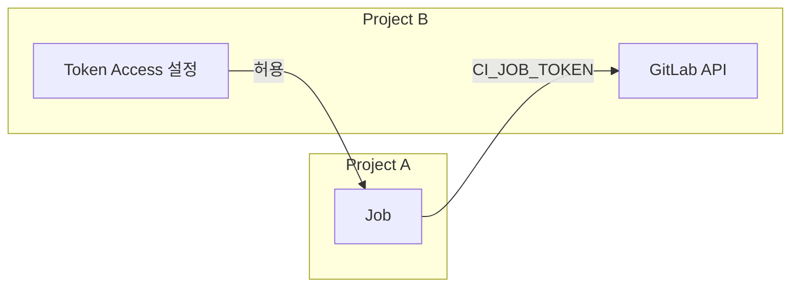
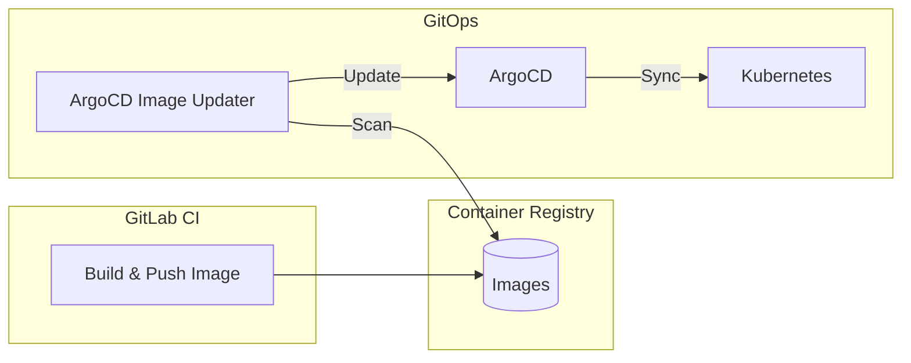

# GitLab CI/CD 시리즈 #6: 외부 통합 - Triggers, Webhooks, API

## 시리즈 개요

| # | 주제 | 핵심 내용 |
|---|------|----------|
| 1 | 기초 | .gitlab-ci.yml 구조, Stages, Jobs, Pipeline 흐름 |
| 2 | Variables & Secrets | 변수 유형, 우선순위, 외부 Vault 연동 |
| 3 | Runners & Executors | Docker, Kubernetes, Docker-in-Docker |
| 4 | Pipeline 아키텍처 | Parent-Child, Multi-Project Pipeline |
| 5 | 고급 Job 제어 | rules, needs, DAG, extends |
| **6** | **외부 통합** | Triggers, Webhooks, API |

---

## Pipeline Triggers

외부 시스템에서 **토큰 기반으로 파이프라인을 트리거**합니다.

### Trigger Token 생성

1. `Settings > CI/CD > Pipeline trigger tokens`
2. `Add trigger` 클릭
3. 설명 입력 후 생성
4. 생성된 토큰 복사

### 트리거 실행

```bash
# 기본 트리거
curl --request POST \
  --form "token=YOUR_TRIGGER_TOKEN" \
  --form "ref=main" \
  "https://gitlab.com/api/v4/projects/PROJECT_ID/trigger/pipeline"

# 변수와 함께
curl --request POST \
  --form "token=YOUR_TRIGGER_TOKEN" \
  --form "ref=main" \
  --form "variables[DEPLOY_ENV]=production" \
  --form "variables[VERSION]=1.2.3" \
  "https://gitlab.com/api/v4/projects/PROJECT_ID/trigger/pipeline"
```

### 파이프라인에서 트리거 감지

```yaml
deploy:
  script:
    - ./deploy.sh
  rules:
    - if: $CI_PIPELINE_SOURCE == "trigger"
      variables:
        DEPLOY_TOKEN: $DEPLOY_TOKEN  # 트리거로 전달된 변수
```

### Trigger 전용 Job

```yaml
triggered-deploy:
  script:
    - echo "Deploying version $VERSION to $DEPLOY_ENV"
  rules:
    - if: $CI_PIPELINE_SOURCE == "trigger"
  needs: []  # 다른 Job 대기 없이 즉시 실행
```

---

## Webhooks

**외부 이벤트를 수신**하여 파이프라인을 트리거합니다.

### Webhook URL 형식

```
https://gitlab.com/api/v4/projects/PROJECT_ID/ref/REF_NAME/trigger/pipeline?token=TOKEN
```

### 실제 Webhook 설정

```bash
# GitHub → GitLab 트리거
# GitHub 저장소의 Webhooks에 등록
https://gitlab.com/api/v4/projects/12345/ref/main/trigger/pipeline?token=abc123

# AWS SNS → GitLab 트리거
# Lambda를 통해 변환 후 트리거
```

### Webhook Payload 접근

```yaml
process-webhook:
  script:
    - echo "$TRIGGER_PAYLOAD" | jq .
    - export EVENT_TYPE=$(echo "$TRIGGER_PAYLOAD" | jq -r '.event_type')
    - |
      if [ "$EVENT_TYPE" = "release" ]; then
        ./deploy-release.sh
      fi
  rules:
    - if: $CI_PIPELINE_SOURCE == "trigger"
```

---

## GitLab API로 파이프라인 제어

### 파이프라인 생성

```bash
# Personal Access Token 사용
curl --request POST \
  --header "PRIVATE-TOKEN: $GITLAB_TOKEN" \
  --header "Content-Type: application/json" \
  --data '{
    "ref": "main",
    "variables": [
      {"key": "DEPLOY_ENV", "value": "staging"},
      {"key": "DEBUG", "value": "true"}
    ]
  }' \
  "https://gitlab.com/api/v4/projects/PROJECT_ID/pipeline"
```

### 파이프라인 상태 조회

```bash
# 특정 파이프라인
curl --header "PRIVATE-TOKEN: $GITLAB_TOKEN" \
  "https://gitlab.com/api/v4/projects/PROJECT_ID/pipelines/PIPELINE_ID"

# 최근 파이프라인
curl --header "PRIVATE-TOKEN: $GITLAB_TOKEN" \
  "https://gitlab.com/api/v4/projects/PROJECT_ID/pipelines?per_page=5"
```

### Job 재시도

```bash
curl --request POST \
  --header "PRIVATE-TOKEN: $GITLAB_TOKEN" \
  "https://gitlab.com/api/v4/projects/PROJECT_ID/jobs/JOB_ID/retry"
```

### 파이프라인 취소

```bash
curl --request POST \
  --header "PRIVATE-TOKEN: $GITLAB_TOKEN" \
  "https://gitlab.com/api/v4/projects/PROJECT_ID/pipelines/PIPELINE_ID/cancel"
```

---

## CI Job Token

파이프라인 내에서 **GitLab API를 호출**할 때 사용하는 임시 토큰입니다.

### CI_JOB_TOKEN 사용

```yaml
notify-other-project:
  script:
    # 다른 프로젝트 파이프라인 트리거
    - |
      curl --request POST \
        --form "token=$CI_JOB_TOKEN" \
        --form "ref=main" \
        "https://gitlab.com/api/v4/projects/OTHER_PROJECT_ID/trigger/pipeline"
```

### 아티팩트 다운로드

```yaml
download-artifacts:
  script:
    - |
      curl --header "JOB-TOKEN: $CI_JOB_TOKEN" \
        --output artifacts.zip \
        "https://gitlab.com/api/v4/projects/PROJECT_ID/jobs/JOB_ID/artifacts"
    - unzip artifacts.zip
```

### 권한 설정

`Settings > CI/CD > Token Access`에서 허용할 프로젝트를 설정합니다.



---

## ChatOps 연동

### Slack 알림

```yaml
notify-slack:
  stage: .post
  script:
    - |
      curl -X POST -H 'Content-type: application/json' \
        --data '{
          "channel": "#deployments",
          "username": "GitLab CI",
          "text": "✅ Pipeline succeeded for $CI_PROJECT_NAME",
          "attachments": [{
            "color": "good",
            "fields": [
              {"title": "Branch", "value": "'$CI_COMMIT_BRANCH'", "short": true},
              {"title": "Commit", "value": "'$CI_COMMIT_SHORT_SHA'", "short": true}
            ]
          }]
        }' \
        $SLACK_WEBHOOK_URL
  rules:
    - if: $CI_COMMIT_BRANCH == "main"
      when: on_success
```

### 배포 승인 (Slack → GitLab)

```yaml
# Slack 버튼 클릭 → Lambda → GitLab API
request-approval:
  stage: deploy
  script:
    - |
      curl -X POST -H 'Content-type: application/json' \
        --data '{
          "text": "🚀 Production deployment pending",
          "attachments": [{
            "text": "Approve deployment?",
            "callback_id": "deploy_'$CI_PIPELINE_ID'",
            "actions": [
              {"name": "approve", "text": "Approve", "type": "button", "style": "primary"},
              {"name": "reject", "text": "Reject", "type": "button", "style": "danger"}
            ]
          }]
        }' \
        $SLACK_WEBHOOK_URL
  environment:
    name: production
    action: prepare
```

---

## 외부 CI/CD 시스템 연동

### Jenkins → GitLab

```groovy
// Jenkinsfile
pipeline {
    agent any
    stages {
        stage('Build') {
            steps {
                sh 'make build'
            }
        }
        stage('Trigger GitLab') {
            steps {
                sh '''
                    curl --request POST \
                      --form "token=${GITLAB_TRIGGER_TOKEN}" \
                      --form "ref=main" \
                      --form "variables[JENKINS_BUILD]=${BUILD_NUMBER}" \
                      "https://gitlab.com/api/v4/projects/${GITLAB_PROJECT_ID}/trigger/pipeline"
                '''
            }
        }
    }
}
```

### GitHub Actions → GitLab

```yaml
# .github/workflows/trigger-gitlab.yml
name: Trigger GitLab Pipeline

on:
  push:
    branches: [main]

jobs:
  trigger:
    runs-on: ubuntu-latest
    steps:
      - name: Trigger GitLab
        run: |
          curl --request POST \
            --form "token=${{ secrets.GITLAB_TRIGGER_TOKEN }}" \
            --form "ref=main" \
            --form "variables[GITHUB_SHA]=${{ github.sha }}" \
            "https://gitlab.com/api/v4/projects/${{ secrets.GITLAB_PROJECT_ID }}/trigger/pipeline"
```

---

## GitOps 도구 연동

### GitLab CI → ArgoCD

```yaml
deploy-argocd:
  stage: deploy
  image: argoproj/argocd:latest
  script:
    # ArgoCD 로그인
    - argocd login $ARGOCD_SERVER --username admin --password $ARGOCD_PASSWORD --insecure
    
    # 이미지 태그 업데이트
    - argocd app set $APP_NAME --helm-set image.tag=$CI_COMMIT_SHA
    
    # Sync 트리거
    - argocd app sync $APP_NAME --prune
    
    # 배포 완료 대기
    - argocd app wait $APP_NAME --timeout 300
  rules:
    - if: $CI_COMMIT_BRANCH == "main"
```

### Image Updater 패턴

```yaml
# CI는 이미지만 빌드 & 푸시
# ArgoCD Image Updater가 자동으로 감지하여 배포

build-and-push:
  stage: build
  script:
    - docker build -t $CI_REGISTRY_IMAGE:$CI_COMMIT_SHA .
    - docker push $CI_REGISTRY_IMAGE:$CI_COMMIT_SHA
    
    # SemVer 태그도 푸시 (Image Updater가 감지)
    - docker tag $CI_REGISTRY_IMAGE:$CI_COMMIT_SHA $CI_REGISTRY_IMAGE:v$VERSION
    - docker push $CI_REGISTRY_IMAGE:v$VERSION
```



> [!TIP]
> CI/CD 분리 원칙: **CI는 아티팩트 생성**, **CD는 GitOps Agent**가 담당합니다. GitOps 시리즈 6편에서 자세히 다뤘습니다.

---

## Scheduled Pipelines (cron)

정기적으로 파이프라인을 실행합니다.

### 설정

`Build > Pipeline schedules > New schedule`

```yaml
nightly-test:
  script:
    - npm run test:full
  rules:
    - if: $CI_PIPELINE_SOURCE == "schedule"
      variables:
        FULL_TEST: "true"

daily-backup:
  script:
    - ./backup.sh
  rules:
    - if: $CI_PIPELINE_SOURCE == "schedule" && $SCHEDULE_TYPE == "backup"
```

### Schedule 변수

```yaml
# Schedule 설정에서 SCHEDULE_TYPE=security 지정

security-scan:
  script:
    - trivy image $CI_REGISTRY_IMAGE:latest
  rules:
    - if: $CI_PIPELINE_SOURCE == "schedule" && $SCHEDULE_TYPE == "security"
```

---

## 실전 예제: 완전한 외부 연동

```yaml
stages:
  - build
  - deploy
  - notify

variables:
  DOCKER_IMAGE: $CI_REGISTRY_IMAGE:$CI_COMMIT_SHA

build:
  stage: build
  script:
    - docker build -t $DOCKER_IMAGE .
    - docker push $DOCKER_IMAGE
  rules:
    - if: $CI_COMMIT_BRANCH == "main"

# ArgoCD 배포 트리거
trigger-argocd:
  stage: deploy
  image: curlimages/curl:latest
  script:
    - |
      # GitOps 레포에 이미지 태그 업데이트 PR 생성
      curl --request POST \
        --header "PRIVATE-TOKEN: $GITOPS_TOKEN" \
        --header "Content-Type: application/json" \
        --data '{
          "branch": "update-'$CI_COMMIT_SHORT_SHA'",
          "commit_message": "Update image to '$DOCKER_IMAGE'",
          "actions": [{
            "action": "update",
            "file_path": "apps/myapp/values.yaml",
            "content": "image:\n  tag: '$CI_COMMIT_SHA'"
          }]
        }' \
        "https://gitlab.com/api/v4/projects/GITOPS_PROJECT_ID/repository/commits"
  rules:
    - if: $CI_COMMIT_BRANCH == "main"

# Slack 알림
notify-success:
  stage: notify
  script:
    - |
      curl -X POST -H 'Content-type: application/json' \
        --data '{
          "channel": "#deployments",
          "text": "✅ '$CI_PROJECT_NAME' deployed successfully",
          "attachments": [{
            "color": "good",
            "fields": [
              {"title": "Version", "value": "'$CI_COMMIT_SHORT_SHA'"},
              {"title": "Pipeline", "value": "'$CI_PIPELINE_URL'"}
            ]
          }]
        }' \
        $SLACK_WEBHOOK_URL
  rules:
    - if: $CI_COMMIT_BRANCH == "main"
      when: on_success

notify-failure:
  stage: notify
  script:
    - |
      curl -X POST -H 'Content-type: application/json' \
        --data '{
          "channel": "#deployments",
          "text": "❌ '$CI_PROJECT_NAME' deployment failed!",
          "attachments": [{
            "color": "danger",
            "fields": [
              {"title": "Pipeline", "value": "'$CI_PIPELINE_URL'"}
            ]
          }]
        }' \
        $SLACK_WEBHOOK_URL
  rules:
    - if: $CI_COMMIT_BRANCH == "main"
      when: on_failure
```

---

## 정리: 시리즈 완결

6편의 시리즈를 통해 GitLab CI/CD의 핵심을 다뤘습니다.

| 편 | 주제 | 핵심 메시지 |
|---|------|-----------|
| 1 | 기초 | .gitlab-ci.yml, Stages, Jobs, Pipeline |
| 2 | Variables | Predefined, Protected, Masked, dotenv |
| 3 | Runners | Executors, DinD, Kubernetes |
| 4 | 아키텍처 | Parent-Child, Multi-Project, 동적 생성 |
| 5 | Job 제어 | rules, needs, DAG, extends |
| 6 | 외부 통합 | Triggers, Webhooks, API, GitOps |

### 다음 단계

- **GitOps 시리즈**: ArgoCD/Flux CD를 활용한 CD 자동화
- **Kubernetes 시리즈**: 클러스터 운영 심화

---

## 참고 자료

- [Pipeline Triggers](https://docs.gitlab.com/ee/ci/triggers/)
- [CI/CD API](https://docs.gitlab.com/ee/api/pipelines.html)
- [CI Job Token](https://docs.gitlab.com/ee/ci/jobs/ci_job_token.html)
- [Scheduled Pipelines](https://docs.gitlab.com/ee/ci/pipelines/schedules.html)
