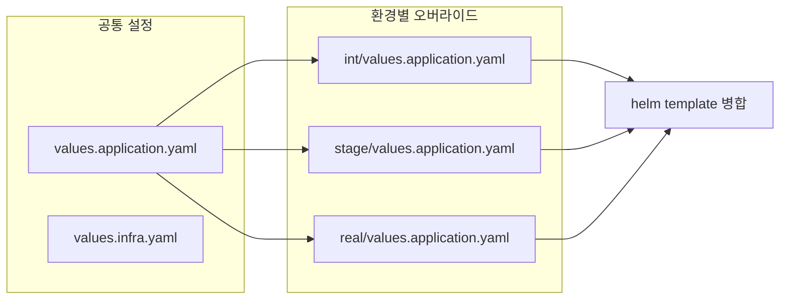

# Helm 환경별 Values 오버라이드 전략

## 개요

Kubernetes 환경에서 동일한 애플리케이션을 INT/STAGE/REAL 등 여러 환경에 배포할 때, **공통 설정**과 **환경별 설정**을 분리하면 유지보수성이 크게 향상됩니다.

## 핵심 개념



- **공통 설정**: 모든 환경에서 동일한 기본값
- **환경별 오버라이드**: 해당 환경에만 다른 값을 덮어씌움

## 디렉토리 구조

```
k8s/manifests/my-service/helm/
├── values.application.yaml    # 공통 애플리케이션 설정
├── values.infra.yaml          # 공통 인프라 설정
├── dev/
│   ├── Chart.yaml
│   ├── values.application.yaml  # dev 환경 오버라이드
│   └── values.infra.yaml
├── int/
│   ├── Chart.yaml
│   ├── values.application.yaml  # int 환경 오버라이드
│   └── values.infra.yaml
├── stage/
│   ├── Chart.yaml
│   ├── values.application.yaml  # stage 환경 오버라이드
│   └── values.infra.yaml
└── real/
    ├── Chart.yaml
    ├── values.application.yaml  # real(production) 환경 오버라이드
    └── values.infra.yaml
```

## 공통 설정

### values.application.yaml (공통)

모든 환경에서 동일한 기본값을 정의:

```yaml
# 공통 설정 - 모든 환경에서 동일
app:
  regionCode: "apn2"
  enableProbe: "true"
  
  args: ["run", "--config", "/etc/my-service/config.yaml"]
  
  readinessProbe:
    grpc:
      port: 9090
    initialDelaySeconds: 15
    periodSeconds: 20
    
  livenessProbe:
    grpc:
      port: 9090
    initialDelaySeconds: 15
    periodSeconds: 20
  
  replicaCount: 1  # 기본값, 환경별로 오버라이드
  
  service:
    ports:
      - name: http
        port: 8080
        protocol: TCP
      - name: grpc
        port: 9090
        protocol: TCP
```

## 환경별 오버라이드

### int/values.application.yaml

INT 환경에만 다른 설정:

```yaml
# int 환경 오버라이드 - 공통 값을 덮어씀

app:
  serviceAccount:
    annotations:
      eks.amazonaws.com/role-arn: "arn:aws:iam::123456789:role/int-role"
    create: true
    name: "my-service-api"
  
  # INT 환경 시크릿
  secretsStores:
    - path: /common/int/secrets
      type: secretsmanager
      keys:
        - MONGO_CONNECTION_STRING
        - REDIS_CONNECTION_STRING
  
  # INT 환경 ConfigMap
  configmaps:
    - name: my-service-config
      mount:
        enabled: true
        path: /etc/my-service
        filename: config.yaml
      value: |
        database:
          mongo_connection_string: "get_secret_from_secret_manager"
          redis_connection_strings:
            - "get_secret_from_secret_manager"
        stellar:
          url: https://api.int.example.com
  
  # INT 환경 환경변수
  env:
    - name: ENV
      value: "int"
```

### real/values.application.yaml

REAL(Production) 환경:

```yaml
# real(production) 환경 오버라이드

app:
  replicaCount: 3  # 프로덕션은 3개 레플리카
  
  resources:
    requests:
      cpu: 500m
      memory: 2Gi
    limits:
      cpu: 1000m
      memory: 2Gi
  
  serviceAccount:
    annotations:
      eks.amazonaws.com/role-arn: "arn:aws:iam::987654321:role/real-role"
    create: true
    name: "my-service-api"
  
  secretsStores:
    - path: /common/real/secrets
      type: secretsmanager
      keys:
        - MONGO_CONNECTION_STRING
        - REDIS_CONNECTION_STRING
  
  configmaps:
    - name: my-service-config
      mount:
        enabled: true
        path: /etc/my-service
        filename: config.yaml
      value: |
        database:
          mongo_connection_string: "get_secret_from_secret_manager"
        stellar:
          url: https://api.example.com
  
  env:
    - name: ENV
      value: "real"
```

## 로컬 테스트

배포 전 템플릿 렌더링으로 검증:

```bash
# 의존성 업데이트
helm dependency update int

# 템플릿 렌더링 (공통 + 환경별 병합)
helm template my-service \
  -f values.infra.yaml \
  -f values.application.yaml \
  -f int/values.infra.yaml \
  -f int/values.application.yaml \
  ./int | yq
```

순서가 중요합니다:

1. 공통 infra → 2. 공통 application → 3. 환경별 infra → 4. 환경별 application

뒤에 오는 파일이 앞의 값을 오버라이드합니다.

## ArgoCD GitOps 배포

ArgoCD는 각 환경별 디렉토리를 별도 Application으로 등록:

```yaml
apiVersion: argoproj.io/v1alpha1
kind: Application
metadata:
  name: my-service-int
  namespace: argocd
spec:
  source:
    repoURL: https://github.com/myorg/k8s-manifests.git
    path: k8s/manifests/my-service/helm/int
    helm:
      valueFiles:
        - ../values.infra.yaml
        - ../values.application.yaml
        - values.infra.yaml
        - values.application.yaml
  destination:
    server: https://kubernetes.default.svc
    namespace: my-namespace-int
```

## 핵심 정리

| 파일 | 위치 | 역할 |
|------|------|------|
| `values.application.yaml` | 루트 | 공통 애플리케이션 설정 |
| `values.infra.yaml` | 루트 | 공통 인프라 설정 |
| `{env}/values.application.yaml` | 환경 폴더 | 환경별 오버라이드 |
| `{env}/Chart.yaml` | 환경 폴더 | 의존성 차트 정의 |

## 모범 사례

1. **공통 최대화**: 최대한 공통 설정에 넣고, 환경별은 최소화
2. **시크릿 분리**: 민감 정보는 Secrets Manager/Vault 사용
3. **리소스 차등**: 프로덕션은 더 높은 리소스 설정
4. **로컬 검증**: 배포 전 `helm template`로 렌더링 확인
5. **레플리카 차등**: dev=1, int=1~2, real=3+

## 참고 자료

- [Helm Values Files](https://helm.sh/docs/chart_template_guide/values_files/)
- [ArgoCD Helm](https://argo-cd.readthedocs.io/en/stable/user-guide/helm/)
