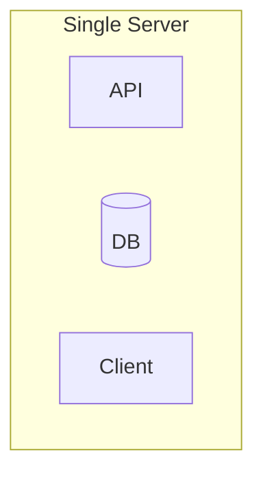
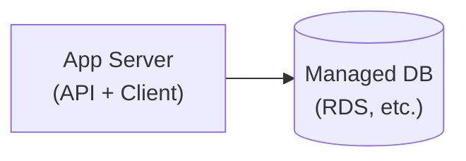
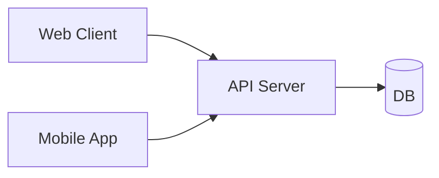
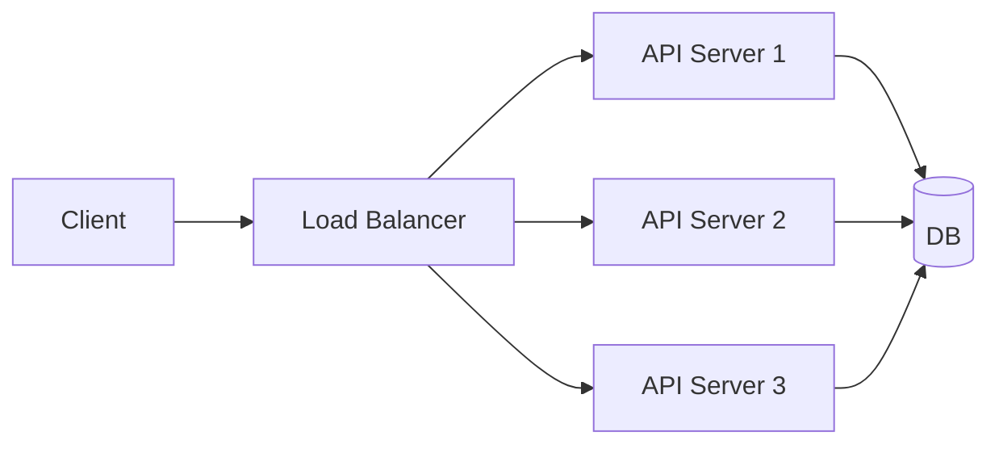
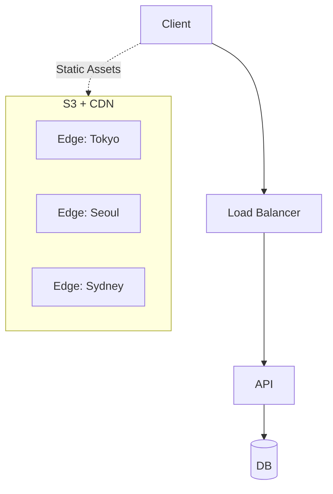
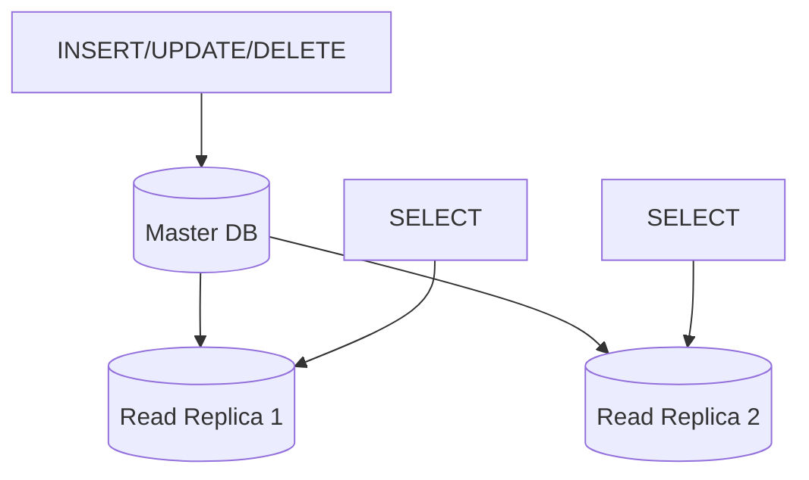
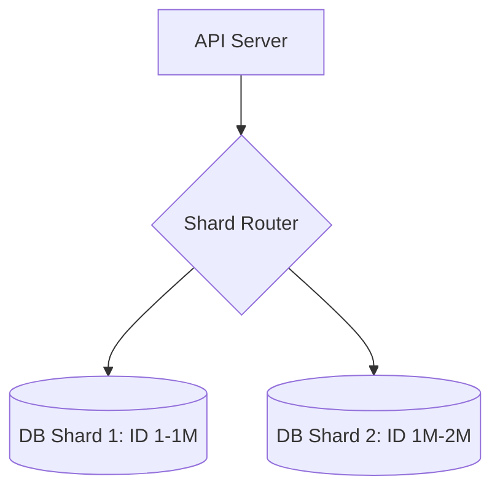
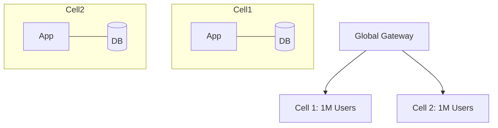

# 서비스 규모에 따른 스케일링 전략

서비스가 성장함에 따라 인프라도 함께 진화해야 합니다. 이 글에서는 사용자 규모별로 어떤 아키텍처 전략을 채택해야 하는지 정리합니다.

---

## 1명 → 단일 서버

모든 애플리케이션은 세 가지 핵심 컴포넌트로 구성됩니다:

- **API 서버**: 데이터 요청 처리

- **데이터베이스**: 영속성 데이터 저장

- **클라이언트**: 사용자에게 데이터 렌더링

초기 단계에서는 이 모든 것을 하나의 서버에서 실행할 수 있습니다. 개발 환경과 유사한 구성으로, 단일 EC2 인스턴스나 DigitalOcean Droplet으로 시작합니다.



---

## 10명 → 데이터베이스 분리

한 명 이상의 사용자가 예상된다면, 데이터베이스 계층을 분리하는 것이 좋습니다.

**관리형 데이터베이스 서비스 사용의 장점:**

- 자동화된 백업

- 다중 리전 중복성

- 읽기 전용 복제본 쉽게 추가 가능

AWS RDS, DigitalOcean Managed Database 등의 서비스를 활용합니다.



---

## 100명 → 클라이언트 분리

**엔티티 분리**는 확장 가능한 애플리케이션 구축의 핵심 원칙입니다. 클라이언트를 API와 분리하면 각 컴포넌트를 독립적으로 스케일링할 수 있습니다.

- 웹, 모바일 웹, iOS, Android 등 다양한 플랫폼 지원 용이

- 트래픽 패턴에 따른 유연한 리소스 할당



---

## 1,000명 → 로드 밸런서 도입

단일 API 인스턴스가 모든 트래픽을 처리하기 어려워지면, **로드 밸런서**를 도입하여 수평적 확장(Horizontal Scaling)을 구현합니다.

**로드 밸런서의 이점:**

- **중복성(Redundancy)**: 한 인스턴스가 다운되어도 서비스 지속

- **오토 스케일링**: 트래픽에 따라 자동으로 인스턴스 수 조절



---

## 10,000명 → CDN 도입

이미지, 비디오 등 정적 콘텐츠가 서버에 부하를 주기 시작합니다. **클라우드 스토리지(S3)와 CDN(CloudFront)**을 결합하여 응답 속도를 개선합니다.

**CDN의 작동 방식:**

1. 메인 데이터 센터가 오하이오에 있다고 가정

2. 일본 사용자가 이미지 요청 시, 일본 에지(Edge) 데이터 센터에 사본 저장

3. 이후 요청은 최접점 에지에서 즉시 응답



---

## 100,000명 → 데이터 계층 확장

API 서버는 늘리기 쉽지만, 데이터베이스는 스케일링이 가장 까다롭습니다.

### 캐싱 (Caching)

**Redis**를 사용하여 반복적인 읽기 요청을 인메모리에서 처리합니다.

```python
def get_user_profile(user_id):
    cached = redis.get(f"user:{user_id}")
    if cached: return cached
    
    user = db.query(f"SELECT * FROM users WHERE id = {user_id}")
    redis.setex(f"user:{user_id}", 30, user)
    return user
```

### 읽기 전용 복제본 (Read Replicas)

쓰기 전용 **Master DB**와 읽기 전용 **Replica DB**를 분리하여 부하를 분산합니다.



---

## 1,000,000명(1M+) → 데이터베이스 샤딩

쓰기 트래픽이 Master DB 한 대의 처리량을 넘어서면 데이터를 물리적으로 나누어 저장해야 합니다.

- **DB 샤딩**: 특정 키(User ID 등)를 기준으로 데이터를 여러 DB 서버에 분산

- **사례**: **Instagram**은 수천 개의 논리 샤드를 통해 데이터를 분산 관리했습니다.



---

## 10,000,000명(10M+) → 멀티 리전 아키텍처

사용자가 전 세계에 분포하면 물리적 거리에 따른 지연 시간이 문제가 됩니다.

- **GSLB**: 사용자 IP 기반 최적 리전 라우팅

- **리전 이관(Regional Evacuation)**: 특정 리전 전체 장애 시 트래픽을 타 리전으로 즉시 이관

- **사례**: **Netflix**는 전 세계 주요 대륙에 활성(Active) 리전을 두고 상시 가동합니다.

---

## 100,000,000명(100M+) → 셀 기반 아키텍처

시스템 규모가 비대해지면 작은 코드 오류가 억 단위 사용자에게 영향을 미칩니다. 장애의 '폭발 반경(Blast Radius)'을 최소화해야 합니다.

- **셀(Cell)**: 전체 인프라를 독립적인 소규모 클러스터 단위로 격리

- **장점**: 특정 셀의 DB 장애가 다른 셀 사용자에게 전파되지 않음

- **사례**: **AWS**와 **Salesforce**는 전체 시스템을 수백 개의 셀로 나누어 관리합니다.



---

## 1,000,000,000명(1B+) → 전 지구적 일관성

10억 명 규모(Planet-Scale)에서는 전 세계에 흩어진 데이터의 정합성을 유지하는 것이 핵심입니다.

- **Google Spanner**: 원자시계와 GPS를 활용한 **TrueTime API**로 전 세계 데이터 센터의 시간을 동기화하여 분산 트랜잭션 구현

- **Meta TAO**: 십억 명 이상의 소셜 그래프 데이터를 효율적으로 서빙하기 위한 분산 캐시 레이어

---

## 정리: 규모별 체크리스트

|**사용자 수**|**핵심 전략**|**도입 기술**|**주요 사례**|
|---|---|---|---|
|1명|단일 서버|EC2, Droplet|-|
|1,000명|로드 밸런싱|ALB, Nginx|-|
|10,000명|콘텐츠 가속|CloudFront, S3|-|
|100,000명|데이터 확장|Redis, Read Replica|-|
|1M|DB 수평 확장|DB Sharding|Instagram|
|10M|글로벌 가용성|Multi-Region, GSLB|Netflix|
|100M|장애 격리|Cell-based Architecture|AWS, Salesforce|
|1B+|전 지구적 일관성|Spanner, TAO, TrueTime|Google, Meta|

---

## 핵심 원칙

1. **과도한 엔지니어링 회피**: 현재 규모에 맞는 솔루션을 선택하되, 다음 단계를 위한 확장성을 열어둡니다.

2. **엔티티 분리**: 컴포넌트를 독립적으로 분리해야 병목 지점만 골라 확장할 수 있습니다.

3. **상태 관리의 외부화**: 서버는 무상태(Stateless)여야 오토 스케일링이 원활합니다.

4. **관찰 가능성(Observability)**: 로그와 트레이싱 없이는 대규모 환경에서 장애를 추적할 수 없습니다.

---

## Related Posts

- [스파이크 트래픽 대응 전략](https://www.google.com/search?q=/blog/backend/devops/%EC%8A%A4%ED%8C%8C%EC%9D%B4%ED%81%AC-%ED%8A%B8%EB%9E%98%ED%94%BD-%EB%8C%80%EC%9D%91-%EC%A0%84%EB%9E%B5)

- [분산 시스템에서의 데이터 정합성](https://www.google.com/search?q=/blog/distributed-system/consistency)

## References

- [Google Research: Spanner](https://research.google/pubs/pub39966/)

- [Netflix Tech Blog: Regional Evacuation](https://netflixtechblog.com/active-active-for-multi-regional-resiliency-c47719f6685b)

- [Scaling to 100k Users - Alex Pareto](https://alexpareto.com/scalability/systems/2020/02/03/scaling-100k.html)
