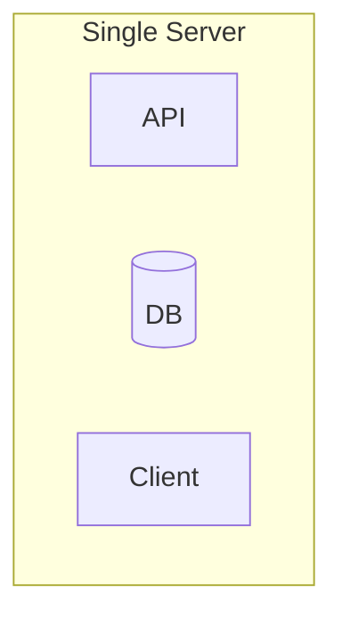
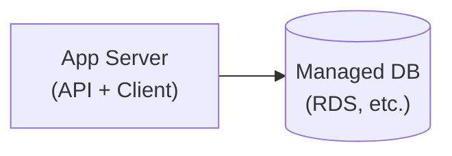
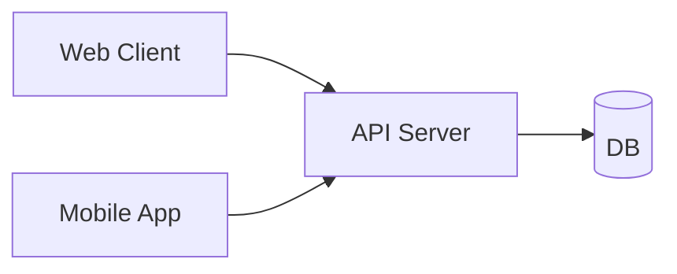
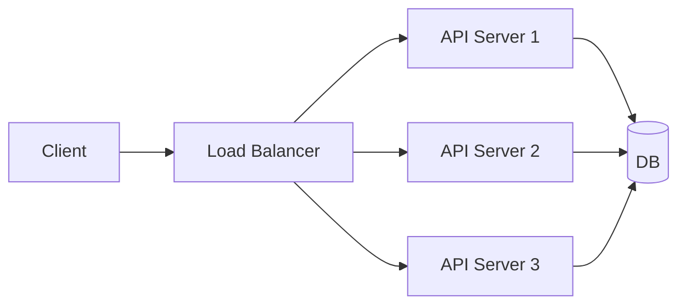
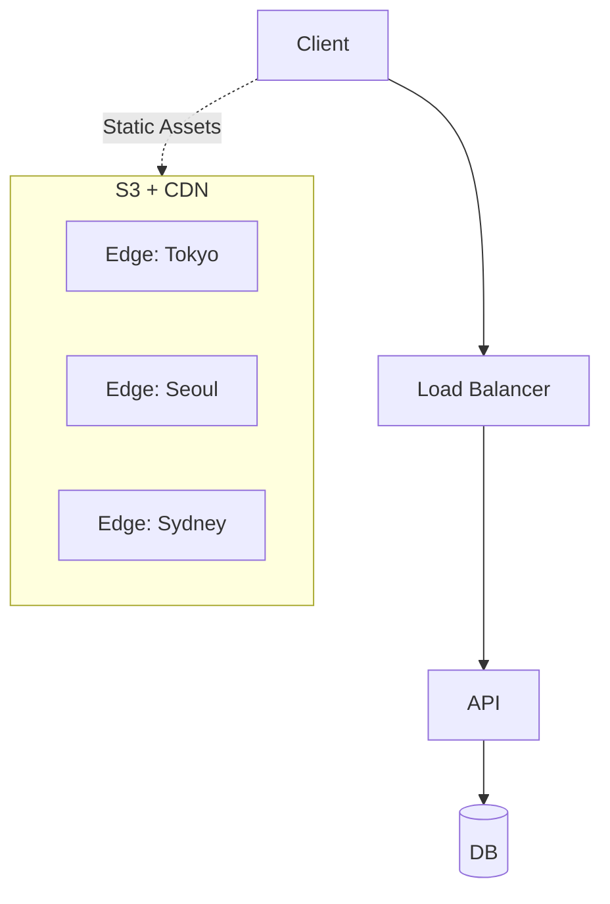
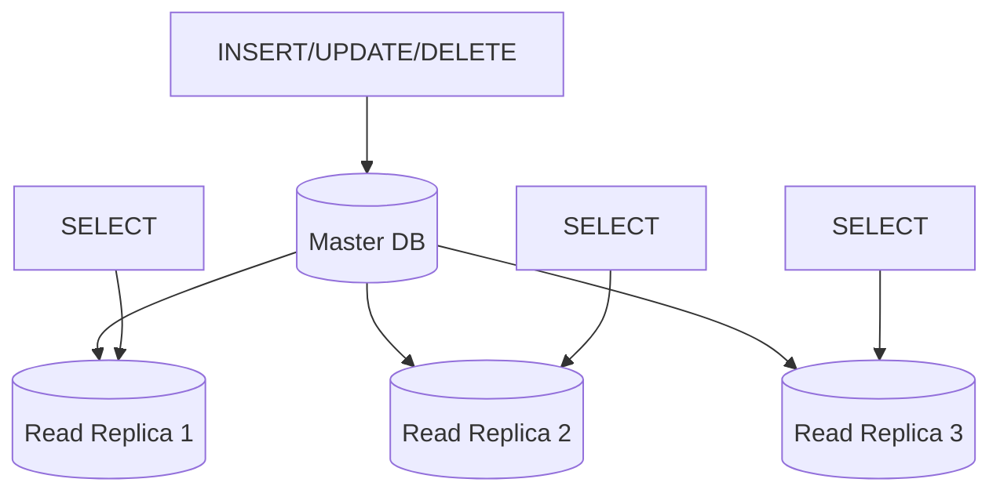

# 서비스 규모에 따른 스케일링 전략

서비스가 성장함에 따라 인프라도 함께 진화해야 합니다. 이 글에서는 사용자 규모별로 어떤 아키텍처 전략을 채택해야 하는지 정리합니다.

## 1명 → 단일 서버

모든 애플리케이션은 세 가지 핵심 컴포넌트로 구성됩니다:

- **API 서버**: 데이터 요청 처리
- **데이터베이스**: 영속성 데이터 저장
- **클라이언트**: 사용자에게 데이터 렌더링

초기 단계에서는 이 모든 것을 하나의 서버에서 실행할 수 있습니다. 개발 환경과 유사한 구성으로, 단일 EC2 인스턴스나 DigitalOcean Droplet으로 시작합니다.



## 10명 → 데이터베이스 분리

한 명 이상의 사용자가 예상된다면, 데이터베이스 계층을 분리하는 것이 좋습니다.

**관리형 데이터베이스 서비스 사용의 장점:**

- 자동화된 백업
- 다중 리전 중복성
- 읽기 전용 복제본 쉽게 추가 가능

AWS RDS, DigitalOcean Managed Database 등의 서비스를 활용합니다.



## 100명 → 클라이언트 분리

**엔티티 분리**는 확장 가능한 애플리케이션 구축의 핵심 원칙입니다.

클라이언트를 API와 분리하면:

- 웹, 모바일 웹, iOS, Android, 데스크톱 등 다양한 플랫폼 지원 용이
- 각 컴포넌트를 독립적으로 스케일링 가능
- 트래픽 패턴에 따른 유연한 리소스 할당



## 1,000명 → 로드 밸런서 도입

단일 API 인스턴스가 모든 트래픽을 처리하기 어려워지면, **로드 밸런서**를 도입합니다.

**로드 밸런서의 이점:**

- **수평적 확장(Horizontal Scaling)**: 동일한 코드를 실행하는 서버 추가
- **중복성(Redundancy)**: 한 인스턴스가 다운되어도 서비스 지속
- **오토 스케일링**: 트래픽에 따라 자동으로 인스턴스 수 조절



> 💡 **Tip**: Heroku나 AWS Elastic Beanstalk 같은 PaaS 서비스는 이 단계까지의 구성을 기본으로 제공합니다. 초기 스타트업이나 사이드 프로젝트에 적합합니다.

## 10,000명 → CDN 도입

이미지, 비디오 등 정적 콘텐츠가 서버에 부하를 주기 시작합니다.

**해결책: 클라우드 스토리지 + CDN**

- AWS S3, DigitalOcean Spaces 등으로 정적 콘텐츠 호스팅
- CDN(CloudFront 등)으로 전 세계 데이터 센터에 캐싱

**CDN의 작동 방식:**

1. 메인 데이터 센터가 오하이오에 있다고 가정
2. 일본에서 이미지 요청 시, 클라우드 제공자가 일본 데이터 센터에 사본 저장
3. 이후 일본에서의 요청은 훨씬 빠르게 응답



## 100,000명 → 데이터 계층 확장

API 서버는 로드 밸런서로 쉽게 스케일링할 수 있지만, **데이터베이스 스케일링은 가장 까다로운 부분**입니다.

### 캐싱 (Caching)

**Redis** 또는 **Memcached**를 사용한 인메모리 캐시 도입:

```python
# 캐시 적용 예시
def get_user_profile(user_id):
    # 1. 캐시 먼저 확인
    cached = redis.get(f"user:{user_id}")
    if cached:
        return cached
    
    # 2. 캐시 미스 시 DB 조회
    user = db.query(f"SELECT * FROM users WHERE id = {user_id}")
    
    # 3. 캐시에 저장 (TTL 30초)
    redis.setex(f"user:{user_id}", 30, user)
    return user
```

**캐싱이 효과적인 경우:**

- 동일한 데이터에 대한 반복적인 요청
- 자주 변경되지 않는 데이터 (프로필 정보, 설정 등)
- 인기 콘텐츠 (인플루언서 프로필 등)

### 읽기 전용 복제본 (Read Replicas)

데이터베이스 읽기/쓰기 트래픽을 분리합니다:

- **Master DB**: INSERT, UPDATE, DELETE 처리
- **Read Replicas**: SELECT 쿼리 처리



## 100,000명 이상 → 마이크로서비스 & 샤딩

이 단계에서는 더 복잡한 전략이 필요합니다:

### 서비스 분리 (마이크로서비스)

- 독립적으로 스케일링이 필요한 기능을 별도 서비스로 분리
- 예: WebSocket 처리, 알림 서비스, 검색 서비스

### 데이터베이스 샤딩

- 데이터를 여러 데이터베이스에 분산 저장
- 수평 파티셔닝으로 데이터 계층 무한 확장 가능

### 모니터링 강화

- New Relic, Datadog 등으로 병목 지점 파악
- 요청 지연 분석 및 개선 포인트 식별

## 정리: 규모별 체크리스트

| 사용자 수 | 핵심 전략 | 도입 기술 |
|-----------|-----------|-----------|
| 1명 | 단일 서버 | EC2, Droplet |
| 10명 | DB 분리 | RDS, Managed DB |
| 100명 | 클라이언트 분리 | 별도 프론트엔드 배포 |
| 1,000명 | 로드 밸런싱 | ALB, ELB, Nginx |
| 10,000명 | CDN | CloudFront, S3 |
| 100,000명 | 캐싱 + 읽기 복제본 | Redis, Read Replicas |
| 100,000명+ | 마이크로서비스 + 샤딩 | K8s, DB Sharding |

## 핵심 원칙

1. **과도한 엔지니어링 회피**: 현재 규모에 맞는 솔루션 선택
2. **엔티티 분리**: 독립적으로 스케일링 가능한 구조 설계
3. **모니터링 우선**: 병목 지점을 파악한 후 최적화
4. **관리형 서비스 활용**: 운영 부담 감소

---

## Related Posts

- [스파이크 트래픽 대응 전략](/blog/backend/devops/스파이크-트래픽-대응-전략) - 티켓팅, 이벤트 응모 등 순간적인 폭발 트래픽 처리

## References

- [Scaling to 100k Users - Alex Pareto](https://alexpareto.com/scalability/systems/2020/02/03/scaling-100k.html)
- [번역 - 10만명 접속을 허용하는 시스템 만들기](https://brunch.co.kr/@jowlee/102)
