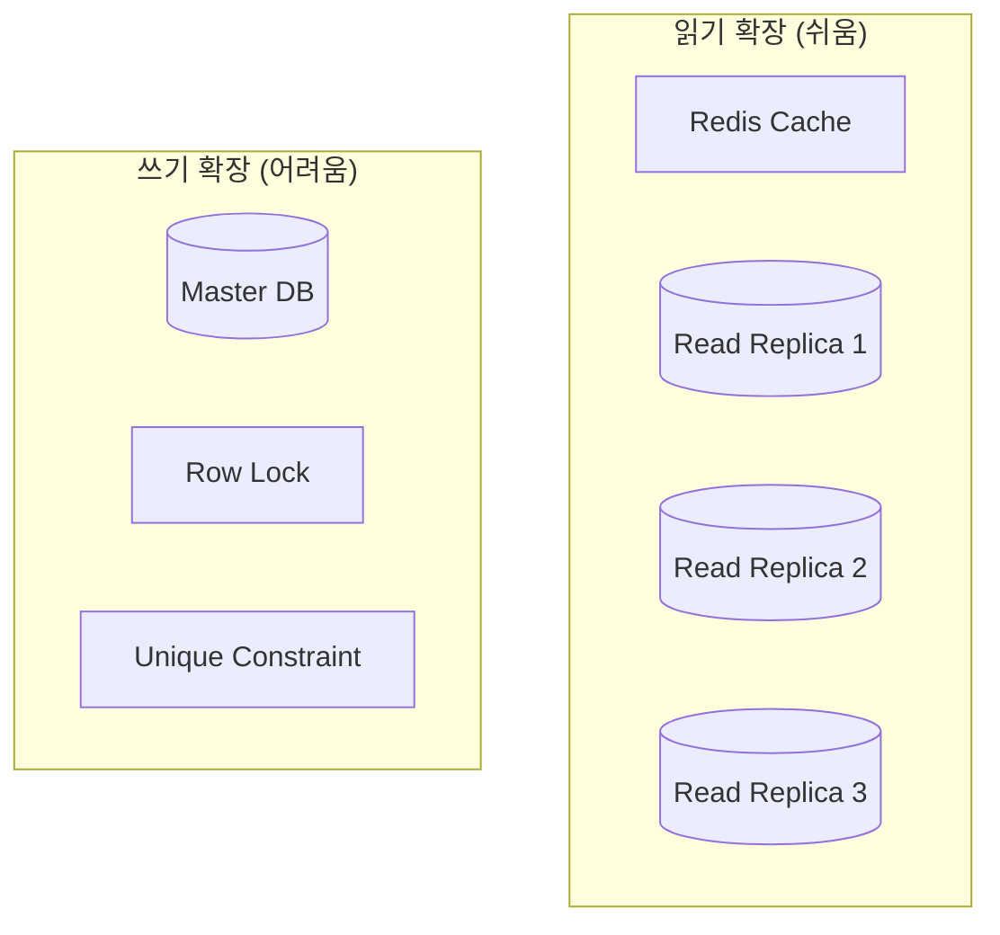
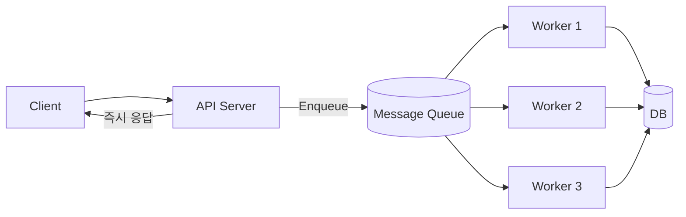
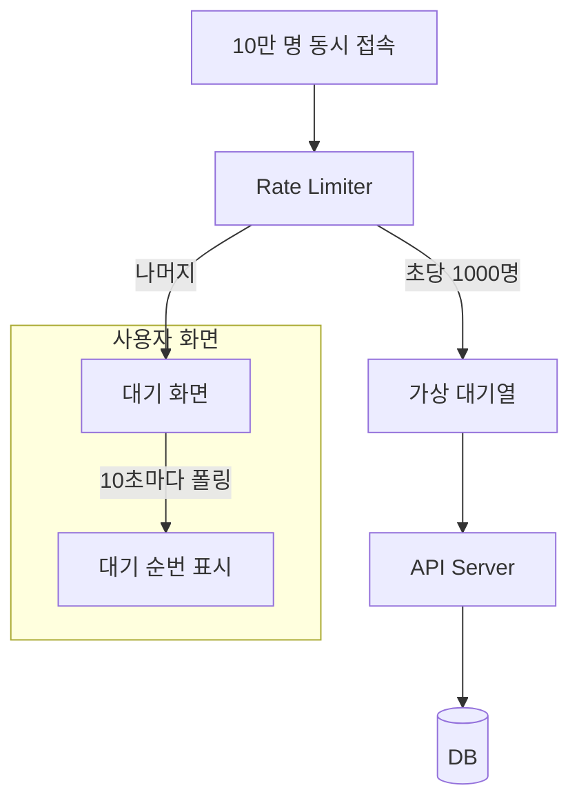
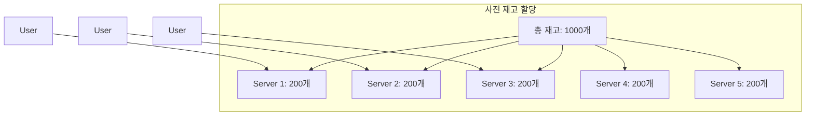
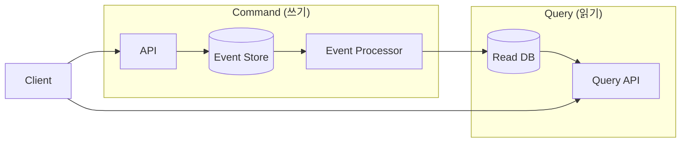
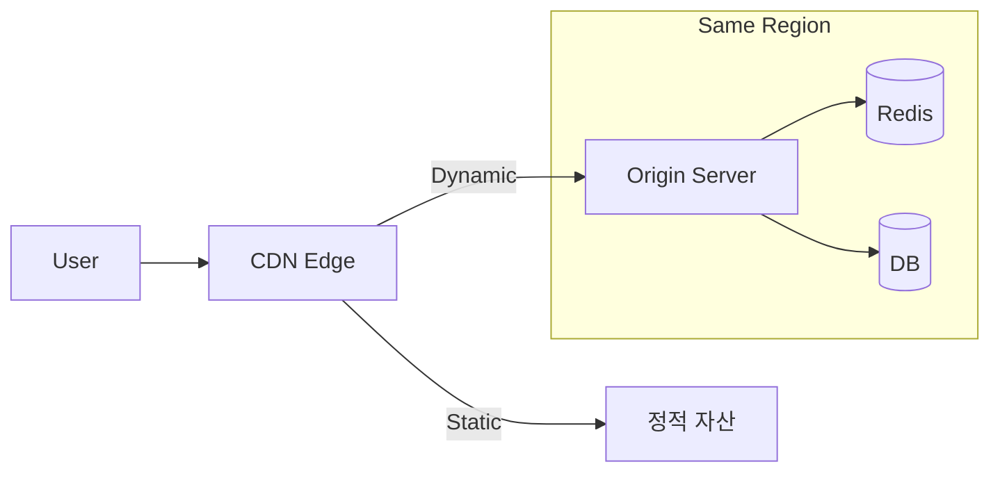

# 스파이크 트래픽 대응 전략

일반적인 서비스 스케일링 전략은 **읽기 중심**의 점진적인 성장을 가정합니다. 하지만 다음과 같은 서비스는 완전히 다른 패턴을 보입니다:

- **티켓팅 시스템**: 콘서트 티켓 오픈 시 수십만 명이 동시에 구매 시도
- **이벤트 응모**: 선착순 쿠폰 발급
- **플래시 세일**: 특정 시간에 할인 상품 판매
- **실시간 투표/설문**: 방송 중 시청자 투표

이런 서비스의 특징은 **예측 가능한 시점에 폭발적인 쓰기 요청**이 발생한다는 것입니다.

## 문제: 왜 일반적인 스케일링으로 부족한가?

### 읽기 vs 쓰기 확장의 차이



**읽기 확장**은 캐시와 복제본으로 거의 무한대로 확장할 수 있습니다. 반면 **쓰기 확장**은:

- 모든 쓰기가 Master DB로 집중
- 동시성 제어를 위한 락(Lock) 경합
- 데이터 정합성 보장 필요

### 실제 병목 사례

```python
# 선착순 100명 쿠폰 발급 - 문제가 있는 코드
def issue_coupon(user_id):
    coupon = db.query("SELECT * FROM coupons WHERE issued = false LIMIT 1 FOR UPDATE")
    if coupon:
        db.execute("UPDATE coupons SET issued = true, user_id = ? WHERE id = ?", 
                   user_id, coupon.id)
        return coupon
    return None
```

10만 명이 동시에 요청하면:

- `FOR UPDATE` 락으로 인한 대기열 형성
- DB 연결 풀 고갈
- 타임아웃 발생
- 서비스 전체 마비

## 전략 1: 메시지 큐로 부하 분산

가장 기본적이면서 효과적인 전략입니다. 동기 처리를 비동기로 전환합니다.



### 구현 예시

```python
# API 레이어 - 즉시 응답
async def apply_coupon(user_id: str):
    request_id = uuid.uuid4()
    await redis.lpush("coupon:queue", json.dumps({
        "request_id": request_id,
        "user_id": user_id,
        "timestamp": time.time()
    }))
    return {"status": "queued", "request_id": request_id}

# Worker - 순차 처리
async def process_coupon_queue():
    while True:
        request = await redis.brpop("coupon:queue")
        data = json.loads(request)
        
        # 이미 발급받았는지 확인
        if await redis.sismember("coupon:issued_users", data["user_id"]):
            continue
            
        # 재고 확인 및 발급 (원자적 연산)
        remaining = await redis.decr("coupon:remaining")
        if remaining >= 0:
            await redis.sadd("coupon:issued_users", data["user_id"])
            await notify_user(data["user_id"], "쿠폰 발급 완료!")
        else:
            await redis.incr("coupon:remaining")  # 롤백
            await notify_user(data["user_id"], "쿠폰이 소진되었습니다")
```

**장점:**

- API 서버는 즉시 응답 → 타임아웃 방지
- 처리량을 Worker 수로 제어 가능
- DB 부하 예측 가능

**단점:**

- 사용자에게 즉시 결과를 알려주기 어려움
- 추가 인프라(큐, Worker) 필요

## 전략 2: 요청 제한 (Rate Limiting + 가상 대기열)

사용자 경험을 개선하면서 시스템을 보호하는 전략입니다.



### 가상 대기열 구현

```python
# 입장 토큰 발급
async def enter_queue(user_id: str):
    queue_position = await redis.incr("queue:position")
    token = jwt.encode({
        "user_id": user_id,
        "position": queue_position,
        "exp": time.time() + 600  # 10분 유효
    }, SECRET_KEY)
    return {"token": token, "position": queue_position}

# 현재 처리 중인 순번 확인
async def get_current_position():
    return await redis.get("queue:current") or 0

# 실제 구매 페이지 진입 허용 여부
async def can_enter(token: str):
    data = jwt.decode(token, SECRET_KEY)
    current = await get_current_position()
    
    # 내 순번이 현재 처리 순번 + 100 이내면 진입 허용
    if data["position"] <= current + 100:
        return True
    return False
```

**장점:**

- 사용자에게 대기 상황 투명하게 공개
- 시스템 과부하 방지
- 공정한 순서 보장

## 전략 3: 사전 재고 할당 (Quota Pre-allocation)

재고 데이터를 미리 분할하여 락 경합을 제거합니다.



### 구현 예시

```python
# 서버 시작 시 재고 할당
SERVER_ID = os.environ.get("SERVER_ID")
LOCAL_QUOTA_KEY = f"quota:{SERVER_ID}"

async def initialize_quota():
    # Coordinator에서 할당받은 수량
    allocated = await coordinator.allocate_quota(SERVER_ID, 200)
    await redis.set(LOCAL_QUOTA_KEY, allocated)

# 구매 처리 - 로컬 Redis만 사용
async def purchase(user_id: str):
    remaining = await redis.decr(LOCAL_QUOTA_KEY)
    if remaining >= 0:
        await redis.sadd("purchased_users", user_id)
        return {"success": True}
    else:
        await redis.incr(LOCAL_QUOTA_KEY)  # 롤백
        
        # 다른 서버에 재고가 남았는지 확인
        for server_id in await get_other_servers():
            result = await try_other_server(server_id, user_id)
            if result:
                return result
        
        return {"success": False, "message": "품절"}
```

**장점:**

- DB 락 경합 완전 제거
- 각 서버가 독립적으로 처리 → 수평 확장 용이
- 초당 수만 건 처리 가능

**단점:**

- 재고 불균형 발생 가능
- 구현 복잡도 증가

## 전략 4: 이벤트 소싱 + CQRS

복잡한 비즈니스 로직이 필요한 경우, 쓰기와 읽기를 완전히 분리합니다.



### 핵심 개념

```python
# 이벤트 저장 (Append Only)
async def apply_for_event(user_id: str, event_id: str):
    event = {
        "type": "APPLICATION_SUBMITTED",
        "user_id": user_id,
        "event_id": event_id,
        "timestamp": datetime.utcnow().isoformat(),
        "sequence": await redis.incr(f"event:{event_id}:seq")
    }
    
    # Kafka, EventStore 등에 저장
    await kafka.send("applications", event)
    return {"status": "accepted", "sequence": event["sequence"]}

# 이벤트 처리 (비동기)
async def process_application_event(event):
    if event["type"] == "APPLICATION_SUBMITTED":
        # 중복 체크, 자격 확인 등 비즈니스 로직
        if await is_eligible(event["user_id"], event["event_id"]):
            await update_read_model(event)
```

**장점:**

- 쓰기 처리량 극대화 (Append Only)
- 완벽한 감사 로그
- 시간 여행(특정 시점 상태 복원) 가능

**단점:**

- 최종 일관성(Eventual Consistency)
- 학습 곡선이 높음

## 전략 5: 하드웨어 레벨 최적화

소프트웨어 아키텍처 외에도 하드웨어 선택이 중요합니다.

### 데이터베이스 선택

| 요구사항 | 권장 DB |
|----------|---------|
| 단순 카운터/재고 | Redis (INCR/DECR) |
| 트랜잭션 필수 | PostgreSQL, MySQL |
| 대용량 쓰기 | ScyllaDB, Cassandra |
| 이벤트 로그 | Kafka, Apache Pulsar |

### 네트워크 최적화



- **같은 리전에 모든 인프라 배치**: 네트워크 지연 최소화
- **Connection Pooling**: DB 연결 재사용
- **Keep-Alive**: HTTP 연결 재사용

## 실전 체크리스트

트래픽 스파이크에 대비한 체크리스트:

| 항목 | 체크 |
|------|------|
| Rate Limiting 설정 | ☐ |
| 메시지 큐 도입 | ☐ |
| 캐시 워밍업 완료 | ☐ |
| DB 커넥션 풀 크기 조정 | ☐ |
| 오토스케일링 테스트 | ☐ |
| 부하 테스트 수행 | ☐ |
| 장애 발생 시 Fallback 준비 | ☐ |
| 모니터링/알림 설정 | ☐ |

## 정리

스파이크성 쓰기 트래픽 대응의 핵심 원칙:

1. **동기 → 비동기 전환**: 즉시 응답하고 나중에 처리
2. **락 경합 최소화**: 사전 할당, 낙관적 락 활용
3. **사용자 경험 고려**: 대기열 순번 표시, 진행 상황 알림
4. **Fail-safe 설계**: 과부하 시 우아한 성능 저하(Graceful Degradation)

---

## Related Posts

- [서비스 규모에 따른 스케일링 전략](/blog/backend/devops/서비스-규모에-따른-스케일링-전략) - 일반적인 읽기 중심 서비스의 스케일링

## References

- [Designing Data-Intensive Applications - Martin Kleppmann](https://dataintensive.net/)
- [The Twelve-Factor App](https://12factor.net/)
