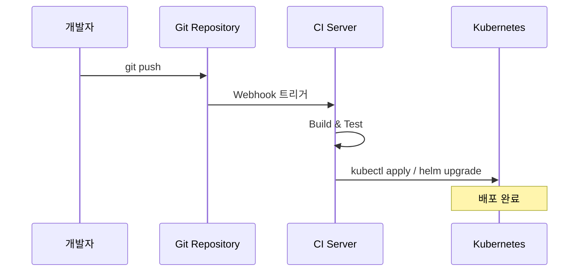
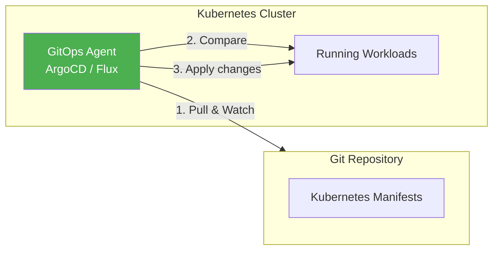
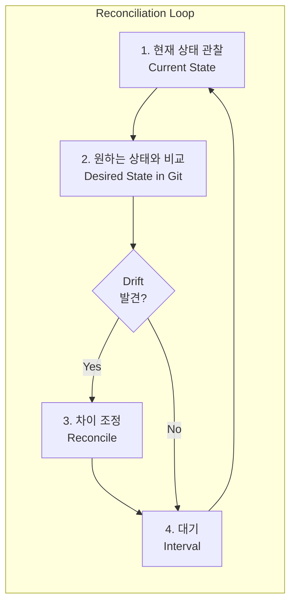
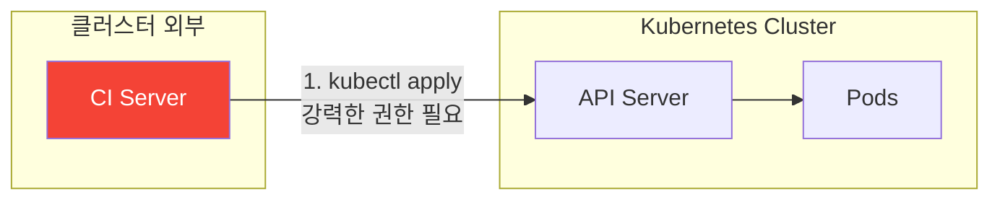
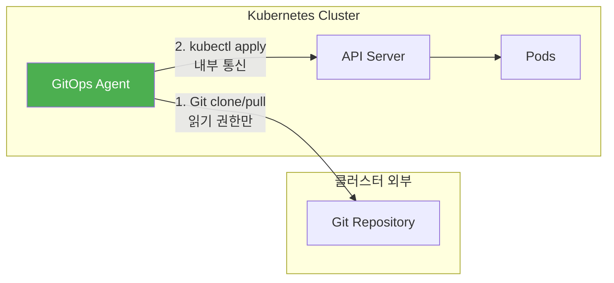
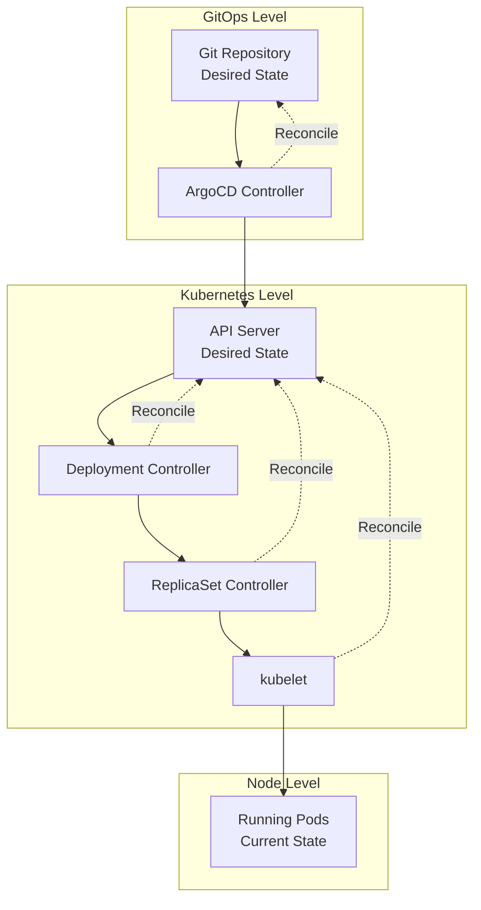
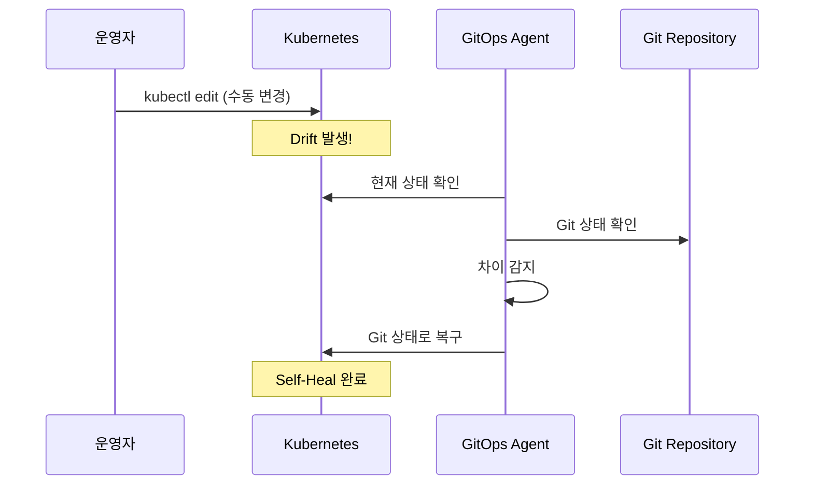
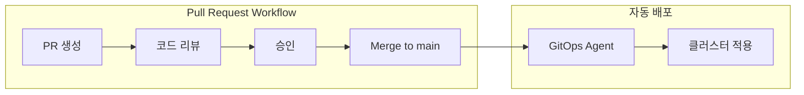
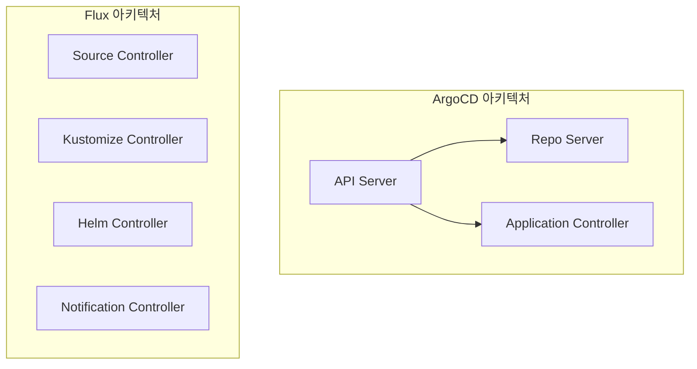

# GitOps 심화 시리즈 #1: GitOps란 무엇인가 - 철학과 원칙

## 시리즈 개요

| # | 주제 | 핵심 내용 |
|---|------|----------|
| **1** | **GitOps 개요** | 철학과 원칙, Push vs Pull 배포, Reconciliation |
| 2 | ArgoCD Deep Dive | 아키텍처, Application CRD, Sync 전략 |
| 3 | Flux CD & GitOps Toolkit | 컨트롤러 아키텍처, GitRepository, Kustomization |
| 4 | 환경별 설정 관리 | Kustomize vs Helm, 전략 선택 기준 |
| 5 | Secrets Management | Sealed Secrets, External Secrets, SOPS |
| 6 | CI/CD 파이프라인 통합 | Image Updater, Progressive Delivery |

---

## GitOps 이전의 세계

전통적인 CI/CD 파이프라인을 떠올려봅시다. Jenkins나 GitHub Actions가 코드를 빌드하고, 테스트를 통과하면 `kubectl apply`나 `helm upgrade` 명령으로 클러스터에 직접 배포합니다.



이 방식은 동작하지만, 몇 가지 근본적인 문제가 있습니다:

| 문제 | 설명 |
|-----|------|
| **Credential 분산** | CI 서버가 프로덕션 클러스터에 접근하는 강력한 권한 보유 |
| **Drift 감지 불가** | 누군가 `kubectl edit`으로 직접 수정하면 Git과 실제 상태 불일치 |
| **Audit Trail 부재** | 누가, 언제, 왜 변경했는지 추적 어려움 |
| **롤백의 복잡성** | 이전 상태로 돌아가려면 "어떤 버전이 배포되어 있었는지" 찾아야 함 |

> [!WARNING]
> **실제 사고 사례**: CI 서버가 해킹당하면 공격자가 프로덕션 클러스터에 임의 코드를 배포할 수 있습니다. 2021년 Codecov 사태에서 CI 파이프라인이 공격 벡터가 되었습니다.

---

## GitOps의 핵심 정의

**GitOps**는 Git을 **Single Source of Truth (SSOT)**로 삼아, 원하는 시스템 상태를 선언적으로 정의하고, 자동화된 프로세스가 실제 상태를 Git에 정의된 상태와 지속적으로 일치시키는 운영 방식입니다.

2021년 CNCF 산하 [OpenGitOps 프로젝트](https://opengitops.dev/)에서 공식화한 **4가지 원칙**을 살펴봅시다:

### 1. Declarative (선언적)

시스템의 **원하는 상태(Desired State)**를 선언적으로 기술합니다.

```yaml
# "3개의 nginx Pod가 실행되어야 한다"는 선언
apiVersion: apps/v1
kind: Deployment
metadata:
  name: nginx
spec:
  replicas: 3
  selector:
    matchLabels:
      app: nginx
  template:
    metadata:
      labels:
        app: nginx
    spec:
      containers:
      - name: nginx
        image: nginx:1.25
```

명령형(Imperative) 접근: "nginx Pod를 3개 만들어라" (`kubectl scale`)
선언형(Declarative) 접근: "nginx Pod가 3개인 상태가 되어야 한다" (YAML manifest)

> [!TIP]
> Kubernetes 자체가 선언적 시스템입니다. GitOps는 이 철학을 Git과 결합한 것입니다.

### 2. Versioned and Immutable (버전 관리 및 불변)

Git은 본질적으로 모든 변경사항을 버전 관리합니다. 각 커밋은 불변(Immutable)하며, 전체 히스토리가 보존됩니다.

```bash
# 모든 변경 이력 추적 가능
git log --oneline
# a1b2c3d (HEAD) feat: scale nginx to 5 replicas
# d4e5f6g fix: update nginx image to 1.25.3
# g7h8i9j initial: deploy nginx with 3 replicas

# 특정 시점으로 롤백
git revert a1b2c3d
```

이것이 왜 중요한가?

- **Audit Trail**: 누가, 언제, 왜 변경했는지 모든 기록이 남음
- **Rollback**: `git revert`로 이전 상태로 즉시 복구 가능
- **Compliance**: 금융, 헬스케어 등 규제 산업의 감사 요구사항 충족

### 3. Pulled Automatically (자동으로 Pull)

원하는 상태의 변경사항이 Git에 푸시되면, **에이전트가 자동으로 감지하고 적용**합니다.



여기서 핵심은 **Pull 모델**입니다. CI 서버가 클러스터에 접근하는 것이 아니라, 클러스터 내부의 에이전트가 Git을 주기적으로 확인합니다.

### 4. Continuously Reconciled (지속적 조정)

에이전트는 단순히 변경을 한 번 적용하고 끝나는 것이 아닙니다. **Reconciliation Loop**를 통해 실제 상태와 원하는 상태를 지속적으로 비교하고, 차이가 발생하면 자동으로 수정합니다.



> [!IMPORTANT]
> **Drift Detection**: 누군가 `kubectl edit`으로 replicas를 5개로 변경하면? GitOps 에이전트가 감지하고 Git에 정의된 3개로 자동 복구합니다. 이것이 **Self-Healing**입니다.

---

## Push vs Pull 배포 모델

GitOps를 이해하는 핵심은 **Push 모델과 Pull 모델의 차이**입니다.

### Push 모델 (전통적 CI/CD)



**특징**:

- CI 서버가 클러스터에 **직접 접근**
- CI 서버에 admin 수준의 kubeconfig 필요
- CI 서버가 침해되면 클러스터도 위험

### Pull 모델 (GitOps)



**특징**:

- 클러스터 내부의 에이전트가 Git을 **Pull**
- Git에 대한 읽기 전용 권한만 필요
- 외부에서 클러스터로의 인바운드 연결 없음

### 보안 관점에서의 비교

| 관점 | Push 모델 | Pull 모델 |
|-----|----------|----------|
| **네트워크 방향** | 외부 → 클러스터 | 클러스터 → 외부 (Git) |
| **필요 권한** | CI에 cluster-admin | Agent에 내부 권한 |
| **공격 표면** | CI 서버 침해 시 클러스터 위험 | Git 저장소 보호에 집중 |
| **방화벽** | 인바운드 허용 필요 | 아웃바운드만 허용 |

> [!NOTE]
> 실제로 ArgoCD나 Flux도 클러스터 내에서 강력한 권한을 가집니다. 하지만 **공격 벡터가 Git 저장소로 단일화**되어 보안 관리가 단순해집니다.

---

## Kubernetes Controller Pattern과의 연결

GitOps가 Kubernetes에서 특히 잘 작동하는 이유는 **Controller Pattern** 때문입니다. 이미 Kubernetes 시리즈에서 다뤘듯이, 모든 Kubernetes 컨트롤러는 Reconciliation Loop로 동작합니다.

```go
// Kubernetes Controller의 핵심 로직
func (c *Controller) Reconcile(ctx context.Context, req Request) (Result, error) {
    // 1. 현재 상태 조회
    current, err := c.Get(ctx, req.NamespacedName)
    if err != nil {
        return Result{}, err
    }
    
    // 2. 원하는 상태와 비교
    desired := c.calculateDesiredState(current)
    
    // 3. 차이가 있으면 조정
    if !reflect.DeepEqual(current.Spec, desired) {
        current.Spec = desired
        return Result{}, c.Update(ctx, current)
    }
    
    // 4. Requeue for next reconciliation
    return Result{RequeueAfter: 30 * time.Second}, nil
}
```

GitOps 에이전트(ArgoCD, Flux)는 이 패턴의 **상위 레벨 구현**입니다:

| 개념 | Kubernetes Controller | GitOps Agent |
|-----|----------------------|--------------|
| Desired State | Spec in YAML | Git Repository |
| Current State | Status in API Server | Live Kubernetes Objects |
| Reconciliation | Controller Manager | ArgoCD/Flux Controller |
| Watch mechanism | Informer (etcd watch) | Git polling / Webhook |



> [!TIP]
> GitOps는 Kubernetes의 선언적 모델을 **Git까지 확장**한 것입니다. "Infrastructure as Code"의 자연스러운 진화입니다.

---

## GitOps의 이점

### 1. 완전한 감사 추적 (Audit Trail)

모든 변경은 Git 커밋으로 기록됩니다. `git log`, `git blame`으로 완벽한 히스토리 추적이 가능합니다.

```bash
# 누가 replicas를 변경했는가?
git log -p -- k8s/deployment.yaml | grep -A5 "replicas:"

# 특정 시점의 클러스터 상태는?
git show abc123:k8s/deployment.yaml
```

### 2. 간편한 롤백

문제가 발생하면 `git revert`로 즉시 이전 상태로 복구합니다.

```bash
# 마지막 변경 롤백
git revert HEAD
git push

# GitOps 에이전트가 자동으로 이전 상태 적용
```

### 3. Drift Detection과 Self-Healing



### 4. Pull Request 기반 변경 관리

인프라 변경도 코드 리뷰와 동일한 워크플로우를 따릅니다.



---

## GitOps 도구: ArgoCD vs Flux

GitOps를 구현하는 대표적인 두 도구가 있습니다. 다음 편에서 각각을 깊이 다루겠지만, 간략히 비교합니다.

| 특성 | ArgoCD | Flux |
|-----|--------|------|
| **CNCF 단계** | Graduated | Graduated |
| **UI** | 강력한 Web UI 제공 | CLI 중심 (Web UI는 별도 프로젝트) |
| **아키텍처** | 단일 애플리케이션 | 마이크로서비스 (GitOps Toolkit) |
| **멀티 클러스터** | ApplicationSet | Kustomization + 클러스터별 디렉토리 |
| **이미지 자동 업데이트** | Image Updater (별도) | Image Automation Controller (내장) |
| **주요 사용자** | Intuit, Red Hat | Weaveworks, AWS |



> [!NOTE]
> **선택 기준**: UI가 중요하고 중앙 집중식 관리를 원하면 ArgoCD, 경량화와 모듈화를 원하면 Flux가 적합합니다. 둘 다 성숙한 프로젝트입니다.

---

## 실무 도입 시 고려사항

### 1. 레포지토리 구조

**Monorepo vs Polyrepo**

```
# Monorepo 방식
gitops-repo/
├── apps/
│   ├── frontend/
│   ├── backend/
│   └── database/
├── infrastructure/
│   ├── monitoring/
│   └── ingress/
└── clusters/
    ├── dev/
    ├── staging/
    └── prod/
```

```
# Polyrepo 방식
frontend-gitops/      # 프론트엔드 팀 관리
backend-gitops/       # 백엔드 팀 관리
platform-gitops/      # 플랫폼 팀 관리
```

### 2. 환경별 설정 관리

Kustomize나 Helm으로 환경별 설정을 분리합니다:

```
base/
├── deployment.yaml
├── service.yaml
└── kustomization.yaml

overlays/
├── dev/
│   ├── kustomization.yaml
│   └── replica-patch.yaml
├── staging/
│   └── kustomization.yaml
└── prod/
    ├── kustomization.yaml
    └── resource-patch.yaml
```

### 3. Secrets 처리

Git에 평문 Secret을 저장하면 안 됩니다. 다음 중 하나를 선택합니다:

- **Sealed Secrets**: 암호화된 형태로 Git에 저장
- **External Secrets Operator**: AWS Secrets Manager 등 외부 참조
- **SOPS**: 파일 레벨 암호화

(5편에서 자세히 다룹니다)

---

## 정리

| 개념 | 설명 |
|-----|------|
| **GitOps** | Git을 Single Source of Truth로 삼는 운영 방식 |
| **4가지 원칙** | Declarative, Versioned, Pulled, Reconciled |
| **Pull 모델** | 클러스터 내부 에이전트가 Git을 감시 |
| **Reconciliation** | 지속적으로 현재 상태를 원하는 상태로 조정 |
| **Self-Healing** | 수동 변경(Drift)을 자동으로 Git 상태로 복구 |

---

## 다음 편 예고

**2편: ArgoCD Deep Dive**에서는 다음을 다룹니다:

- ArgoCD 아키텍처 상세 (API Server, Repo Server, Controller)
- Application CRD 완전 분석
- Sync 전략: Manual vs Automated, Self-Heal, Prune
- Sync Waves와 Hooks
- ApplicationSet으로 멀티 클러스터 관리

---

## 참고 자료

- [OpenGitOps Principles](https://opengitops.dev/principles)
- [ArgoCD - Declarative GitOps CD for Kubernetes](https://argo-cd.readthedocs.io/)
- [Flux - The GitOps family of projects](https://fluxcd.io/)
- [CNCF GitOps Working Group](https://github.com/cncf/tag-app-delivery/tree/main/gitops-wg)
- [Guide to GitOps - Weaveworks](https://www.weave.works/technologies/gitops/)
