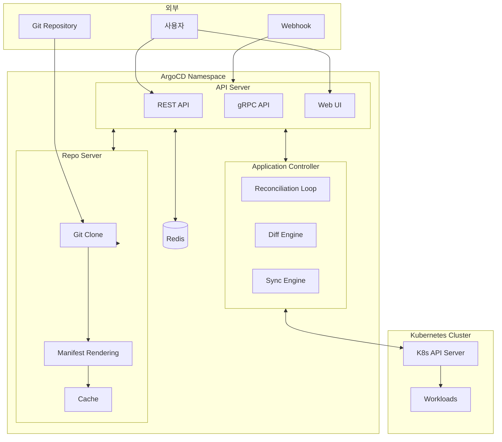
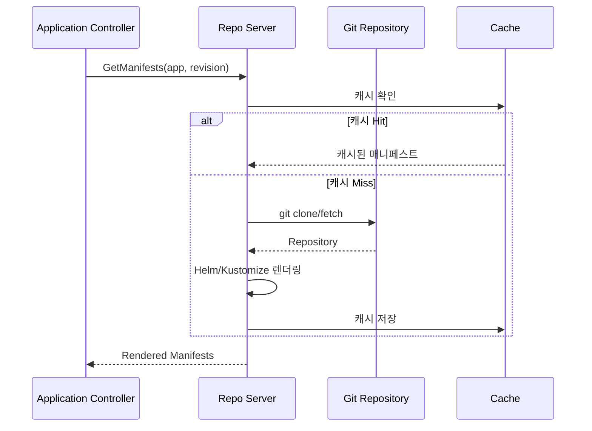
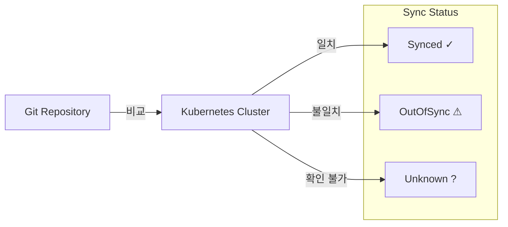
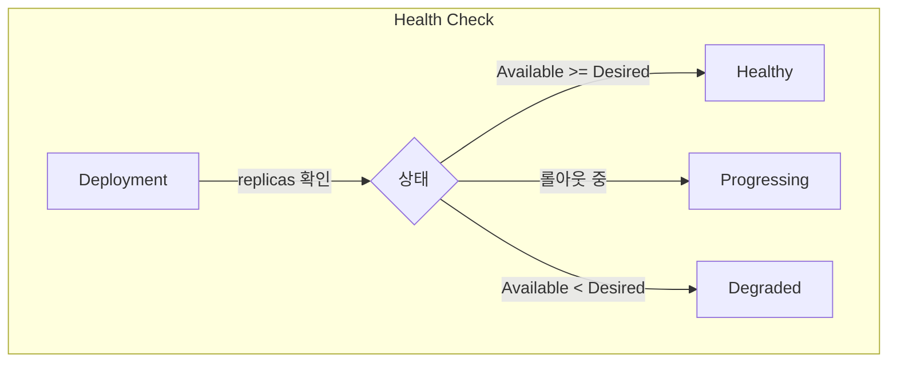
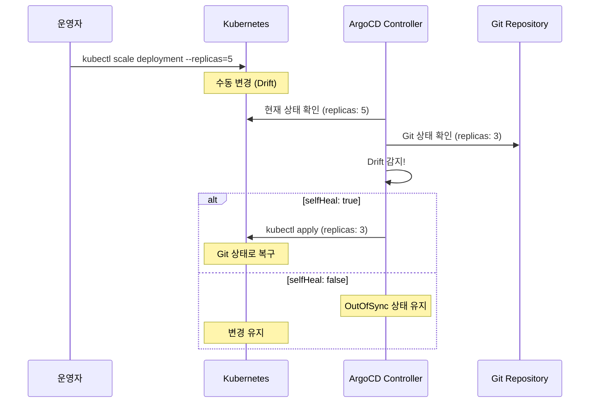
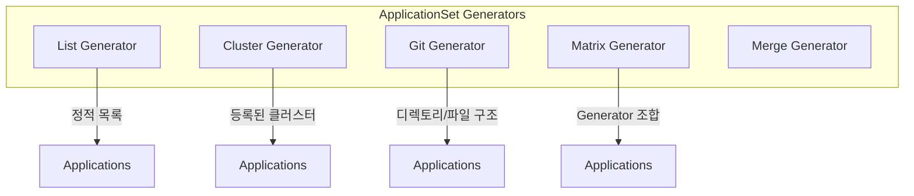

# GitOps 심화 시리즈 #2: ArgoCD Deep Dive - 아키텍처와 동작 원리

## 시리즈 개요

| # | 주제 | 핵심 내용 |
|---|------|----------|
| 1 | GitOps 개요 | 철학과 원칙, Push vs Pull 배포, Reconciliation |
| **2** | **ArgoCD Deep Dive** | 아키텍처, Application CRD, Sync 전략 |
| 3 | Flux CD & GitOps Toolkit | 컨트롤러 아키텍처, GitRepository, Kustomization |
| 4 | 환경별 설정 관리 | Kustomize vs Helm, 전략 선택 기준 |
| 5 | Secrets Management | Sealed Secrets, External Secrets, SOPS |
| 6 | CI/CD 파이프라인 통합 | Image Updater, Progressive Delivery |

---

## ArgoCD란?

ArgoCD는 Kubernetes를 위한 **선언적(Declarative) GitOps 지속 배포(Continuous Delivery) 도구**입니다. Git 저장소에 정의된 애플리케이션 상태를 지속적으로 모니터링하고, Kubernetes 클러스터의 실제 상태와 동기화합니다.

### 핵심 특징

- **CNCF Graduated 프로젝트**: 2022년 12월 CNCF 졸업, 프로덕션 검증됨
- **다양한 매니페스트 지원**: Plain YAML, Helm, Kustomize, Jsonnet
- **강력한 Web UI**: 실시간 애플리케이션 상태 시각화
- **멀티 클러스터**: 단일 ArgoCD로 여러 클러스터 관리
- **SSO 통합**: OIDC, SAML, LDAP, GitHub, GitLab

---

## ArgoCD 아키텍처

ArgoCD는 3개의 핵심 컴포넌트로 구성됩니다:



### 1. API Server

ArgoCD의 **프론트엔드** 역할을 합니다.

| 기능 | 설명 |
|-----|------|
| **REST/gRPC API** | CLI, Web UI, 외부 시스템과 통신 |
| **Web UI** | React 기반 실시간 대시보드 |
| **인증/인가** | RBAC, SSO 통합 |
| **Webhook 처리** | Git 변경 시 즉시 Sync 트리거 |

```bash
# ArgoCD CLI는 gRPC API 사용
argocd app list
argocd app sync my-app
```

### 2. Repo Server

Git 저장소와 **매니페스트 렌더링**을 담당합니다.



**지원하는 매니페스트 도구**:

- Plain YAML/JSON
- Helm Charts
- Kustomize
- Jsonnet
- Custom Config Management Plugin (CMP)

> [!TIP]
> Repo Server는 **stateless**입니다. 렌더링 결과를 Redis에 캐싱하므로, 스케일 아웃이 용이합니다.

### 3. Application Controller

ArgoCD의 **핵심 엔진**입니다. Kubernetes Controller 패턴으로 동작합니다.

```go
// 간략화된 Application Controller 로직
func (c *ApplicationController) Reconcile(app *Application) error {
    // 1. Git에서 Desired State 조회 (Repo Server 통해)
    desired, err := c.repoServer.GetManifests(app)
    if err != nil {
        return err
    }
    
    // 2. 클러스터에서 Current State 조회
    current, err := c.kubectl.GetResources(app.Destination)
    if err != nil {
        return err
    }
    
    // 3. Diff 계산
    diff := c.diffEngine.Compare(desired, current)
    
    // 4. 상태 업데이트
    app.Status.Sync.Status = calculateSyncStatus(diff)
    app.Status.Health = calculateHealth(current)
    
    // 5. Auto Sync 활성화 시 동기화
    if app.Spec.SyncPolicy.Automated != nil && diff.HasChanges() {
        return c.syncEngine.Sync(app, desired)
    }
    
    return nil
}
```

**주요 책임**:

- Application 리소스 감시
- Git 상태와 클러스터 상태 비교
- Sync Status, Health Status 계산
- Automated Sync 실행

---

## Application CRD

ArgoCD에서 관리하는 모든 애플리케이션은 **Application Custom Resource**로 정의됩니다.

### 기본 구조

```yaml
apiVersion: argoproj.io/v1alpha1
kind: Application
metadata:
  name: my-app
  namespace: argocd  # ArgoCD가 설치된 네임스페이스
  finalizers:
    - resources-finalizer.argocd.argoproj.io  # 삭제 시 리소스 정리
spec:
  # 프로젝트 (RBAC 단위)
  project: default
  
  # 소스: 어디서 가져올 것인가
  source:
    repoURL: https://github.com/myorg/myrepo.git
    targetRevision: HEAD  # 브랜치, 태그, 커밋 SHA
    path: k8s/overlays/prod  # 매니페스트 경로
  
  # 목적지: 어디에 배포할 것인가
  destination:
    server: https://kubernetes.default.svc  # 클러스터 API Server
    namespace: production  # 타겟 네임스페이스
  
  # 동기화 정책
  syncPolicy:
    automated:
      prune: true      # Git에서 삭제된 리소스 클러스터에서도 삭제
      selfHeal: true   # 수동 변경 시 Git 상태로 복구
    syncOptions:
      - CreateNamespace=true  # 네임스페이스 자동 생성

status:
  sync:
    status: Synced  # Synced, OutOfSync, Unknown
    revision: abc123
  health:
    status: Healthy  # Healthy, Progressing, Degraded, Missing
  resources:
    - kind: Deployment
      name: my-app
      status: Synced
      health: Healthy
```

### Source 설정: Helm

```yaml
spec:
  source:
    repoURL: https://charts.bitnami.com/bitnami
    chart: nginx
    targetRevision: 15.0.0
    helm:
      releaseName: my-nginx
      values: |
        replicaCount: 3
        service:
          type: ClusterIP
      parameters:
        - name: image.tag
          value: "1.25"
      valueFiles:
        - values-prod.yaml
```

### Source 설정: Kustomize

```yaml
spec:
  source:
    repoURL: https://github.com/myorg/myrepo.git
    path: k8s/overlays/prod
    kustomize:
      namePrefix: prod-
      nameSuffix: -v1
      images:
        - name: my-app
          newTag: v1.2.3
      commonLabels:
        environment: production
```

---

## Sync 상태와 Health 상태

ArgoCD는 두 가지 상태를 추적합니다:

### Sync Status

Git의 Desired State와 클러스터의 Current State 비교 결과



| 상태 | 의미 |
|-----|------|
| **Synced** | Git과 클러스터 상태 일치 |
| **OutOfSync** | 차이 존재 (Git 변경 or 수동 수정) |
| **Unknown** | 상태 확인 불가 |

### Health Status

클러스터에 배포된 리소스의 실제 상태

| 상태 | 의미 | 예시 |
|-----|------|-----|
| **Healthy** | 정상 동작 중 | Deployment replicas 충족 |
| **Progressing** | 진행 중 | 롤아웃 중 |
| **Degraded** | 문제 발생 | Pod CrashLoopBackOff |
| **Suspended** | 일시 중지 | HPA 일시 중지 |
| **Missing** | 리소스 없음 | 아직 생성 안됨 |



---

## Sync 전략

### Manual Sync vs Automated Sync

```yaml
# Manual Sync: 명시적 트리거 필요
spec:
  syncPolicy: {}  # 또는 생략

# Automated Sync: Git 변경 시 자동 동기화
spec:
  syncPolicy:
    automated: {}
```

**Automated Sync 옵션**:

```yaml
spec:
  syncPolicy:
    automated:
      prune: true       # Git에서 삭제된 리소스 정리
      selfHeal: true    # Drift 발생 시 자동 복구
      allowEmpty: false # 빈 매니페스트 허용 여부
```

> [!WARNING]
> `prune: true`는 Git에서 리소스 정의를 삭제하면 클러스터에서도 **즉시 삭제**됩니다. 실수로 파일을 삭제하면 프로덕션 리소스가 사라질 수 있습니다.

### Self-Heal 동작



### Sync Options

세밀한 동기화 제어를 위한 옵션들:

```yaml
spec:
  syncPolicy:
    syncOptions:
      - CreateNamespace=true       # 네임스페이스 자동 생성
      - PrunePropagationPolicy=foreground  # 삭제 전파 정책
      - PruneLast=true             # 다른 리소스 먼저 적용 후 Prune
      - Replace=true               # apply 대신 replace 사용
      - ServerSideApply=true       # Server-Side Apply 사용
      - FailOnSharedResource=true  # 다른 앱과 리소스 공유 금지
      - RespectIgnoreDifferences=true  # ignoreDifferences 존중
```

---

## Sync Waves와 Hooks

복잡한 배포 시나리오를 위해 **순서 제어**가 필요할 때 사용합니다.

### Sync Waves

리소스에 `argocd.argoproj.io/sync-wave` 어노테이션으로 순서 지정:

```yaml
# Wave 0: 먼저 실행 (기본값)
apiVersion: v1
kind: Namespace
metadata:
  name: my-app
  annotations:
    argocd.argoproj.io/sync-wave: "0"

---
# Wave 1: Namespace 생성 후 실행
apiVersion: v1
kind: ConfigMap
metadata:
  name: app-config
  annotations:
    argocd.argoproj.io/sync-wave: "1"

---
# Wave 2: ConfigMap 이후 실행
apiVersion: apps/v1
kind: Deployment
metadata:
  name: my-app
  annotations:
    argocd.argoproj.io/sync-wave: "2"
```



```mermaid
gantt
    title Sync Waves 실행 순서
    dateFormat X
    axisFormat %s
    
    section Wave 0
    Namespace    :0, 1
    
    section Wave 1
    ConfigMap    :1, 2
    Secret       :1, 2
    
    section Wave 2
    Deployment   :2, 3
    Service      :2, 3
```

### Sync Hooks

특정 시점에 Job을 실행합니다:

```yaml
apiVersion: batch/v1
kind: Job
metadata:
  name: db-migration
  annotations:
    argocd.argoproj.io/hook: PreSync           # 언제 실행?
    argocd.argoproj.io/hook-delete-policy: HookSucceeded  # 언제 삭제?
spec:
  template:
    spec:
      containers:
      - name: migrate
        image: my-app:latest
        command: ["./migrate.sh"]
      restartPolicy: Never
```

**Hook Phases**:

| Phase | 시점 | 사용 사례 |
|-------|-----|----------|
| `PreSync` | Sync 이전 | DB 마이그레이션, 백업 |
| `Sync` | 일반 리소스와 함께 | 특수 처리 필요 리소스 |
| `PostSync` | Sync 완료 후 | 알림 전송, 테스트 실행 |
| `SyncFail` | Sync 실패 시 | 롤백, 알림 |

**Delete Policy**:

| 정책 | 설명 |
|-----|------|
| `HookSucceeded` | 성공 시 삭제 |
| `HookFailed` | 실패 시 삭제 |
| `BeforeHookCreation` | 다음 Hook 생성 전 삭제 |

### 실전 예시: Blue-Green 배포

```yaml
# PreSync: 새 버전 배포 전 준비
---
apiVersion: batch/v1
kind: Job
metadata:
  name: pre-deploy-check
  annotations:
    argocd.argoproj.io/hook: PreSync
    argocd.argoproj.io/sync-wave: "-1"
spec:
  template:
    spec:
      containers:
      - name: check
        image: curlimages/curl
        command: ["curl", "-f", "http://health-check-endpoint"]
      restartPolicy: Never

---
# Sync: 새 버전 Deployment
apiVersion: apps/v1
kind: Deployment
metadata:
  name: my-app-green
  annotations:
    argocd.argoproj.io/sync-wave: "0"
spec:
  replicas: 3
  # ...

---
# PostSync: 트래픽 전환
apiVersion: batch/v1
kind: Job
metadata:
  name: switch-traffic
  annotations:
    argocd.argoproj.io/hook: PostSync
    argocd.argoproj.io/sync-wave: "1"
spec:
  template:
    spec:
      containers:
      - name: switch
        image: my-tool:latest
        command: ["./switch-service.sh", "my-app-green"]
      restartPolicy: Never
```

---

## ApplicationSet

**ApplicationSet**은 단일 템플릿에서 여러 Application을 자동 생성합니다. 멀티 클러스터, 멀티 테넌트 환경에서 필수입니다.

### Generator 종류



### List Generator

정적 목록에서 Application 생성:

```yaml
apiVersion: argoproj.io/v1alpha1
kind: ApplicationSet
metadata:
  name: my-apps
  namespace: argocd
spec:
  goTemplate: true
  generators:
  - list:
      elements:
      - cluster: dev
        url: https://dev.k8s.example.com
        namespace: dev
      - cluster: staging
        url: https://staging.k8s.example.com
        namespace: staging
      - cluster: prod
        url: https://prod.k8s.example.com
        namespace: prod
  template:
    metadata:
      name: 'my-app-{{.cluster}}'
    spec:
      project: default
      source:
        repoURL: https://github.com/myorg/myrepo.git
        targetRevision: HEAD
        path: 'k8s/overlays/{{.cluster}}'
      destination:
        server: '{{.url}}'
        namespace: '{{.namespace}}'
```

### Cluster Generator

ArgoCD에 등록된 클러스터에서 자동 생성:

```yaml
apiVersion: argoproj.io/v1alpha1
kind: ApplicationSet
metadata:
  name: cluster-addons
  namespace: argocd
spec:
  goTemplate: true
  generators:
  - clusters:
      selector:
        matchLabels:
          environment: production
  template:
    metadata:
      name: '{{.name}}-monitoring'
    spec:
      project: default
      source:
        repoURL: https://github.com/myorg/cluster-addons.git
        path: monitoring
      destination:
        server: '{{.server}}'
        namespace: monitoring
      syncPolicy:
        automated:
          prune: true
          selfHeal: true
```

### Git Directory Generator

Git 디렉토리 구조에서 자동 생성:

```
apps/
├── frontend/
│   └── kustomization.yaml
├── backend/
│   └── kustomization.yaml
└── database/
    └── kustomization.yaml
```

```yaml
apiVersion: argoproj.io/v1alpha1
kind: ApplicationSet
metadata:
  name: apps
  namespace: argocd
spec:
  goTemplate: true
  generators:
  - git:
      repoURL: https://github.com/myorg/gitops.git
      revision: HEAD
      directories:
      - path: apps/*
  template:
    metadata:
      name: '{{.path.basename}}'
    spec:
      project: default
      source:
        repoURL: https://github.com/myorg/gitops.git
        path: '{{.path.path}}'
      destination:
        server: https://kubernetes.default.svc
        namespace: '{{.path.basename}}'
```

> [!TIP]
> Git Directory Generator를 사용하면 디렉토리만 추가하면 **자동으로 Application이 생성**됩니다. 코드 변경 없이 새 앱을 추가할 수 있습니다.

---

## 프로젝트(Project)와 RBAC

### AppProject

AppProject는 Application을 그룹화하고 접근 제어를 적용합니다:

```yaml
apiVersion: argoproj.io/v1alpha1
kind: AppProject
metadata:
  name: production
  namespace: argocd
spec:
  description: Production applications
  
  # 허용된 소스 저장소
  sourceRepos:
  - https://github.com/myorg/*
  
  # 허용된 목적지
  destinations:
  - namespace: 'prod-*'
    server: https://prod.k8s.example.com
  
  # 허용된 클러스터 리소스
  clusterResourceWhitelist:
  - group: ''
    kind: Namespace
  
  # 거부된 네임스페이스 리소스  
  namespaceResourceBlacklist:
  - group: ''
    kind: ResourceQuota
  
  # RBAC 역할
  roles:
  - name: developer
    description: Developer access
    policies:
    - p, proj:production:developer, applications, get, production/*, allow
    - p, proj:production:developer, applications, sync, production/*, allow
    groups:
    - developers
```

### RBAC 정책

```csv
# p, <role>, <resource>, <action>, <object>, <effect>

# 개발자: 읽기 + sync만 가능
p, role:developer, applications, get, */*, allow
p, role:developer, applications, sync, */*, allow

# 운영자: 모든 권한
p, role:operator, applications, *, */*, allow
p, role:operator, clusters, *, *, allow

# 특정 프로젝트만 접근
p, role:team-a, applications, *, team-a/*, allow
```

---

## 트러블슈팅

### OutOfSync 상태가 해결되지 않음

```bash
# 상세 diff 확인
argocd app diff my-app --local ./manifests

# 특정 리소스 무시 설정
```

```yaml
spec:
  ignoreDifferences:
  - group: apps
    kind: Deployment
    jsonPointers:
    - /spec/replicas  # HPA가 관리하는 필드 무시
  - group: ""
    kind: Service
    jqPathExpressions:
    - .spec.clusterIP  # 자동 할당 필드 무시
```

### Sync 실패

```bash
# 동기화 상태 확인
argocd app get my-app

# 이벤트 확인
kubectl describe application my-app -n argocd

# 강제 재동기화
argocd app sync my-app --force
```

### Application 삭제 시 리소스가 남음

```yaml
# Finalizer 확인
metadata:
  finalizers:
  - resources-finalizer.argocd.argoproj.io  # 이게 있어야 함
```

```bash
# 수동으로 리소스 삭제 후 Application 삭제
argocd app delete my-app --cascade=false
kubectl delete all -l app.kubernetes.io/instance=my-app
```

---

## 정리

| 개념 | 설명 |
|-----|------|
| **API Server** | Web UI, CLI, Webhook 처리 |
| **Repo Server** | Git clone, 매니페스트 렌더링 |
| **Application Controller** | Reconciliation Loop 실행 |
| **Application CRD** | 배포 단위 정의 (source, destination, syncPolicy) |
| **Sync Waves** | 리소스 적용 순서 제어 |
| **Hooks** | PreSync, PostSync 등 특정 시점 Job 실행 |
| **ApplicationSet** | 템플릿 기반 다중 Application 생성 |
| **AppProject** | Application 그룹화 및 RBAC |

---

## 다음 편 예고

**3편: Flux CD & GitOps Toolkit**에서는 다음을 다룹니다:

- Flux의 마이크로서비스 아키텍처
- Source Controller, Kustomize Controller, Helm Controller
- GitRepository, Kustomization, HelmRelease CRD
- ArgoCD vs Flux 상세 비교

---

## 참고 자료

- [ArgoCD Official Documentation](https://argo-cd.readthedocs.io/)
- [ArgoCD Architecture](https://argo-cd.readthedocs.io/en/stable/operator-manual/architecture/)
- [ApplicationSet Controller](https://argo-cd.readthedocs.io/en/stable/operator-manual/applicationset/)
- [Sync Waves and Hooks](https://argo-cd.readthedocs.io/en/stable/user-guide/sync-waves/)
