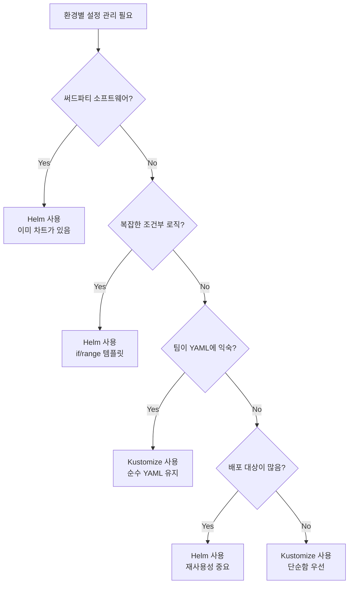

# GitOps 심화 시리즈 #4: 환경별 설정 관리 - Kustomize vs Helm

## 시리즈 개요

| # | 주제 | 핵심 내용 |
|---|------|----------|
| 1 | GitOps 개요 | 철학과 원칙, Push vs Pull 배포, Reconciliation |
| 2 | ArgoCD Deep Dive | 아키텍처, Application CRD, Sync 전략 |
| 3 | Flux CD & GitOps Toolkit | 컨트롤러 아키텍처, GitRepository, Kustomization |
| **4** | **환경별 설정 관리** | Kustomize vs Helm, 전략 선택 기준 |
| 5 | Secrets Management | Sealed Secrets, External Secrets, SOPS |
| 6 | CI/CD 파이프라인 통합 | Image Updater, Progressive Delivery |

---

## 왜 환경별 설정 관리가 중요한가?

실제 프로덕션 환경에서는 동일한 애플리케이션을 **여러 환경(dev, staging, prod)**에 배포합니다. 환경마다 다른 것들:

| 항목 | dev | staging | prod |
|-----|-----|---------|------|
| replicas | 1 | 2 | 5 |
| CPU request | 100m | 200m | 500m |
| DB host | dev-db.local | staging-db.local | prod-db.aws |
| Log level | debug | info | warn |
| Ingress domain | dev.example.com | staging.example.com | example.com |

**문제**: 환경마다 완전히 별개의 YAML 파일을 관리하면?

- 중복 코드가 대량 발생
- 한 곳 수정 시 모든 환경에 동기화 필요
- 실수로 누락되는 변경 발생

**해결책**: Kustomize 또는 Helm으로 **공통 부분(Base)과 환경별 차이(Overlays/Values)를 분리**

---

## Kustomize: Template-free Configuration

Kustomize는 **템플릿 없이** YAML을 패치하는 방식입니다. Kubernetes 1.14부터 `kubectl` 에 내장되었습니다.

### 핵심 철학

- **Base**: 공통 리소스 정의
- **Overlays**: 환경별 패치
- **No templating**: Go template 같은 문법 없음
- **Pure YAML**: 결과물도 순수 YAML

### 디렉토리 구조

```
myapp/
├── base/
│   ├── kustomization.yaml
│   ├── deployment.yaml
│   ├── service.yaml
│   └── configmap.yaml
└── overlays/
    ├── dev/
    │   ├── kustomization.yaml
    │   └── patch-replicas.yaml
    ├── staging/
    │   ├── kustomization.yaml
    │   └── patch-resources.yaml
    └── prod/
        ├── kustomization.yaml
        ├── patch-replicas.yaml
        ├── patch-resources.yaml
        └── patch-ingress.yaml
```

### Base 정의

```yaml
# base/kustomization.yaml
apiVersion: kustomize.config.k8s.io/v1beta1
kind: Kustomization

resources:
  - deployment.yaml
  - service.yaml
  - configmap.yaml

commonLabels:
  app: myapp
```

```yaml
# base/deployment.yaml
apiVersion: apps/v1
kind: Deployment
metadata:
  name: myapp
spec:
  replicas: 1
  selector:
    matchLabels:
      app: myapp
  template:
    metadata:
      labels:
        app: myapp
    spec:
      containers:
      - name: myapp
        image: myapp:latest
        ports:
        - containerPort: 8080
        resources:
          requests:
            cpu: 100m
            memory: 128Mi
          limits:
            cpu: 200m
            memory: 256Mi
```

### Overlay 정의

```yaml
# overlays/prod/kustomization.yaml
apiVersion: kustomize.config.k8s.io/v1beta1
kind: Kustomization

resources:
  - ../../base

# 네임스페이스 설정
namespace: production

# 공통 레이블 추가
commonLabels:
  environment: production

# 이미지 태그 변경
images:
  - name: myapp
    newTag: v1.2.3

# 패치 적용
patches:
  - path: patch-replicas.yaml
  - path: patch-resources.yaml
```

```yaml
# overlays/prod/patch-replicas.yaml
apiVersion: apps/v1
kind: Deployment
metadata:
  name: myapp
spec:
  replicas: 5
```

```yaml
# overlays/prod/patch-resources.yaml
apiVersion: apps/v1
kind: Deployment
metadata:
  name: myapp
spec:
  template:
    spec:
      containers:
      - name: myapp
        resources:
          requests:
            cpu: 500m
            memory: 512Mi
          limits:
            cpu: 1000m
            memory: 1024Mi
```

### 빌드 및 확인

```bash
# 결과 미리보기
kubectl kustomize overlays/prod

# 직접 적용
kubectl apply -k overlays/prod

# 또는 ArgoCD에서
argocd app create myapp-prod \
  --repo https://github.com/myorg/myapp.git \
  --path overlays/prod \
  --dest-server https://kubernetes.default.svc
```

### 패치 전략

#### 1. Strategic Merge Patch (기본)

```yaml
# 배열의 특정 요소만 수정 (name으로 매칭)
apiVersion: apps/v1
kind: Deployment
metadata:
  name: myapp
spec:
  template:
    spec:
      containers:
      - name: myapp  # 이름으로 매칭
        env:
        - name: LOG_LEVEL
          value: warn
```

#### 2. JSON Patch

더 정밀한 제어가 필요할 때:

```yaml
# overlays/prod/kustomization.yaml
patches:
  - target:
      kind: Deployment
      name: myapp
    patch: |-
      - op: replace
        path: /spec/replicas
        value: 5
      - op: add
        path: /spec/template/spec/containers/0/env/-
        value:
          name: NEW_VAR
          value: "some-value"
```

#### 3. Replace

기존 값을 완전히 대체:

```yaml
patches:
  - target:
      kind: ConfigMap
      name: myconfig
    patch: |-
      - op: replace
        path: /data
        value:
          key1: newvalue1
          key2: newvalue2
```

### Components (재사용 가능한 패치 모음)

Kustomize 3.7+에서 지원하는 **Components**는 여러 Overlay에서 공유할 수 있는 패치 모음입니다:

```
myapp/
├── base/
├── components/
│   ├── high-availability/
│   │   └── kustomization.yaml
│   ├── monitoring/
│   │   └── kustomization.yaml
│   └── security/
│       └── kustomization.yaml
└── overlays/
    ├── dev/
    │   └── kustomization.yaml
    └── prod/
        └── kustomization.yaml
```

```yaml
# components/high-availability/kustomization.yaml
apiVersion: kustomize.config.k8s.io/v1alpha1
kind: Component

patches:
  - patch: |-
      apiVersion: apps/v1
      kind: Deployment
      metadata:
        name: myapp
      spec:
        replicas: 3
        strategy:
          type: RollingUpdate
          rollingUpdate:
            maxSurge: 1
            maxUnavailable: 0
```

```yaml
# overlays/prod/kustomization.yaml
resources:
  - ../../base

components:
  - ../../components/high-availability
  - ../../components/monitoring
```

---

## Helm: The Package Manager for Kubernetes

Helm은 **템플릿 기반** 패키지 매니저입니다. Chart라는 패키지 형태로 애플리케이션을 배포합니다.

### 핵심 개념

- **Chart**: 패키지 (템플릿 + 기본값)
- **Values**: 설정 값
- **Release**: Chart의 설치된 인스턴스
- **Repository**: Chart 저장소

### Chart 구조

```
mychart/
├── Chart.yaml           # 차트 메타데이터
├── values.yaml          # 기본 values
├── values-dev.yaml      # 환경별 values
├── values-prod.yaml
├── templates/
│   ├── _helpers.tpl     # 템플릿 헬퍼
│   ├── deployment.yaml
│   ├── service.yaml
│   ├── configmap.yaml
│   ├── ingress.yaml
│   └── NOTES.txt        # 설치 후 출력 메시지
└── charts/              # 의존 차트
```

### Chart.yaml

```yaml
apiVersion: v2
name: mychart
version: 1.0.0
appVersion: "1.2.3"
description: My application chart
type: application

dependencies:
  - name: postgresql
    version: "12.x.x"
    repository: https://charts.bitnami.com/bitnami
    condition: postgresql.enabled
```

### 템플릿 작성

```yaml
# templates/deployment.yaml
apiVersion: apps/v1
kind: Deployment
metadata:
  name: {{ include "mychart.fullname" . }}
  labels:
    {{- include "mychart.labels" . | nindent 4 }}
spec:
  replicas: {{ .Values.replicaCount }}
  selector:
    matchLabels:
      {{- include "mychart.selectorLabels" . | nindent 6 }}
  template:
    metadata:
      labels:
        {{- include "mychart.selectorLabels" . | nindent 8 }}
    spec:
      containers:
      - name: {{ .Chart.Name }}
        image: "{{ .Values.image.repository }}:{{ .Values.image.tag | default .Chart.AppVersion }}"
        ports:
        - containerPort: {{ .Values.service.port }}
        resources:
          {{- toYaml .Values.resources | nindent 12 }}
        {{- if .Values.env }}
        env:
          {{- range $key, $value := .Values.env }}
          - name: {{ $key }}
            value: {{ $value | quote }}
          {{- end }}
        {{- end }}
```

### values.yaml

```yaml
# values.yaml (기본값)
replicaCount: 1

image:
  repository: myapp
  tag: ""
  pullPolicy: IfNotPresent

service:
  type: ClusterIP
  port: 8080

resources:
  requests:
    cpu: 100m
    memory: 128Mi
  limits:
    cpu: 200m
    memory: 256Mi

ingress:
  enabled: false
  host: ""

env: {}
```

```yaml
# values-prod.yaml
replicaCount: 5

image:
  tag: v1.2.3

resources:
  requests:
    cpu: 500m
    memory: 512Mi
  limits:
    cpu: 1000m
    memory: 1024Mi

ingress:
  enabled: true
  host: myapp.example.com
  tls:
    - secretName: myapp-tls
      hosts:
        - myapp.example.com

env:
  LOG_LEVEL: warn
  DB_HOST: prod-db.example.com
```

### 배포

```bash
# 로컬 차트 설치
helm install myapp-prod ./mychart -f values-prod.yaml -n production

# 리포지토리에서 설치
helm repo add bitnami https://charts.bitnami.com/bitnami
helm install nginx bitnami/nginx -f my-values.yaml

# 업그레이드
helm upgrade myapp-prod ./mychart -f values-prod.yaml

# 롤백
helm rollback myapp-prod 1
```

### Helm Hooks

특정 시점에 작업 실행:

```yaml
# templates/pre-upgrade-job.yaml
apiVersion: batch/v1
kind: Job
metadata:
  name: {{ include "mychart.fullname" . }}-db-migrate
  annotations:
    "helm.sh/hook": pre-upgrade
    "helm.sh/hook-weight": "0"
    "helm.sh/hook-delete-policy": hook-succeeded
spec:
  template:
    spec:
      containers:
      - name: migrate
        image: "{{ .Values.image.repository }}:{{ .Values.image.tag }}"
        command: ["./migrate.sh"]
      restartPolicy: Never
```

| Hook | 시점 |
|------|-----|
| `pre-install` | 설치 전 |
| `post-install` | 설치 후 |
| `pre-upgrade` | 업그레이드 전 |
| `post-upgrade` | 업그레이드 후 |
| `pre-delete` | 삭제 전 |
| `post-delete` | 삭제 후 |
| `pre-rollback` | 롤백 전 |
| `post-rollback` | 롤백 후 |

---

## Kustomize vs Helm: 선택 기준



### 비교 표

| 관점 | Kustomize | Helm |
|-----|-----------|------|
| **학습 곡선** | 낮음 (순수 YAML) | 중간 (Go template) |
| **디버깅** | 쉬움 (YAML 그대로) | 어려움 (템플릿 렌더링 필요) |
| **조건부 로직** | 제한적 | 강력함 (if/range) |
| **재사용성** | Component로 가능 | Chart로 패키징 |
| **의존성 관리** | 없음 | Chart dependencies |
| **버전 관리** | Git으로 직접 | Chart 버전 + values |
| **에코시스템** | kubectl 내장 | ArtifactHub, 수많은 차트 |
| **GitOps 친화성** | 높음 | 중간 (렌더링 필요) |

### Kustomize를 선택해야 할 때

1. **내부 애플리케이션**을 배포할 때
2. **단순한 환경별 차이**만 있을 때 (replicas, resources, env)
3. **템플릿 없이 순수 YAML**을 유지하고 싶을 때
4. **Git diff가 명확**해야 할 때

### Helm을 선택해야 할 때

1. **써드파티 소프트웨어** 설치 (nginx, postgresql, prometheus)
2. **복잡한 조건부 로직**이 필요할 때
3. **재사용 가능한 패키지**로 배포할 때
4. **의존성 관리**가 필요할 때

> [!TIP]
> **실무 조언**: 내부 앱은 Kustomize, 인프라 컴포넌트는 Helm으로 관리하는 하이브리드 접근이 일반적입니다.

---

## 하이브리드 접근: Helm + Kustomize

ArgoCD와 Flux 모두 Helm 차트에 Kustomize를 적용하는 **post-rendering**을 지원합니다.

### ArgoCD에서 Helm + Kustomize

```yaml
apiVersion: argoproj.io/v1alpha1
kind: Application
metadata:
  name: nginx-prod
spec:
  source:
    repoURL: https://charts.bitnami.com/bitnami
    chart: nginx
    targetRevision: 15.0.0
    helm:
      values: |
        replicaCount: 3
    # Kustomize post-rendering
    kustomize:
      patches:
        - target:
            kind: Deployment
            name: nginx
          patch: |-
            - op: add
              path: /spec/template/metadata/annotations
              value:
                custom-annotation: "added-by-kustomize"
```

### Flux에서 Helm + Kustomize

```yaml
apiVersion: helm.toolkit.fluxcd.io/v2
kind: HelmRelease
metadata:
  name: nginx
spec:
  chart:
    spec:
      chart: nginx
      sourceRef:
        kind: HelmRepository
        name: bitnami
  # Kustomize post-rendering
  postRenderers:
    - kustomize:
        patches:
          - target:
              kind: Deployment
              name: nginx
            patch: |
              - op: add
                path: /metadata/annotations/custom
                value: "post-rendered"
```

### 사용 사례

1. **Helm 차트에 커스텀 레이블/어노테이션 추가**
2. **Helm 차트가 지원하지 않는 설정 패치**
3. **조직 표준 정책 강제 적용** (예: 모든 Pod에 sidecar 추가)

---

## 실전 레포지토리 구조

### Kustomize 기반 구조

```
gitops-repo/
├── apps/
│   ├── frontend/
│   │   ├── base/
│   │   └── overlays/
│   │       ├── dev/
│   │       ├── staging/
│   │       └── prod/
│   └── backend/
│       ├── base/
│       └── overlays/
│           ├── dev/
│           ├── staging/
│           └── prod/
├── infrastructure/
│   ├── base/
│   │   ├── cert-manager/
│   │   ├── ingress-nginx/
│   │   └── monitoring/
│   └── overlays/
│       ├── dev/
│       └── prod/
└── clusters/
    ├── dev/
    │   ├── apps.yaml      # ArgoCD Application
    │   └── infra.yaml
    └── prod/
        ├── apps.yaml
        └── infra.yaml
```

### Helm 기반 구조

```
gitops-repo/
├── charts/
│   ├── frontend/
│   │   ├── Chart.yaml
│   │   ├── values.yaml
│   │   └── templates/
│   └── backend/
│       ├── Chart.yaml
│       ├── values.yaml
│       └── templates/
├── releases/
│   ├── dev/
│   │   ├── frontend.yaml  # HelmRelease
│   │   └── backend.yaml
│   └── prod/
│       ├── frontend.yaml
│       └── backend.yaml
└── infrastructure/
    ├── cert-manager/
    │   ├── helmrepository.yaml
    │   └── helmrelease.yaml
    └── ingress-nginx/
        ├── helmrepository.yaml
        └── helmrelease.yaml
```

---

## 정리

| 도구 | 장점 | 단점 | 사용 시기 |
|-----|------|------|----------|
| **Kustomize** | 순수 YAML, 학습 쉬움, kubectl 내장 | 조건부 로직 제한 | 내부 앱, 단순 환경 차이 |
| **Helm** | 강력한 템플릿, 패키지화, 에코시스템 | 디버깅 어려움 | 써드파티, 복잡한 로직 |
| **하이브리드** | 양쪽 장점 활용 | 복잡도 증가 | Helm 차트 커스터마이징 |

---

## 다음 편 예고

**5편: Secrets Management**에서는 다음을 다룹니다:

- GitOps에서 Secrets의 딜레마
- Sealed Secrets 동작 원리와 한계
- External Secrets Operator
- SOPS (Secrets OPerationS)
- 전략 선택 가이드

---

## 참고 자료

- [Kustomize Official](https://kustomize.io/)
- [Kustomize Components](https://kubectl.docs.kubernetes.io/guides/config_management/components/)
- [Helm Documentation](https://helm.sh/docs/)
- [Helm Best Practices](https://helm.sh/docs/chart_best_practices/)
- [ArgoCD + Kustomize](https://argo-cd.readthedocs.io/en/stable/user-guide/kustomize/)
