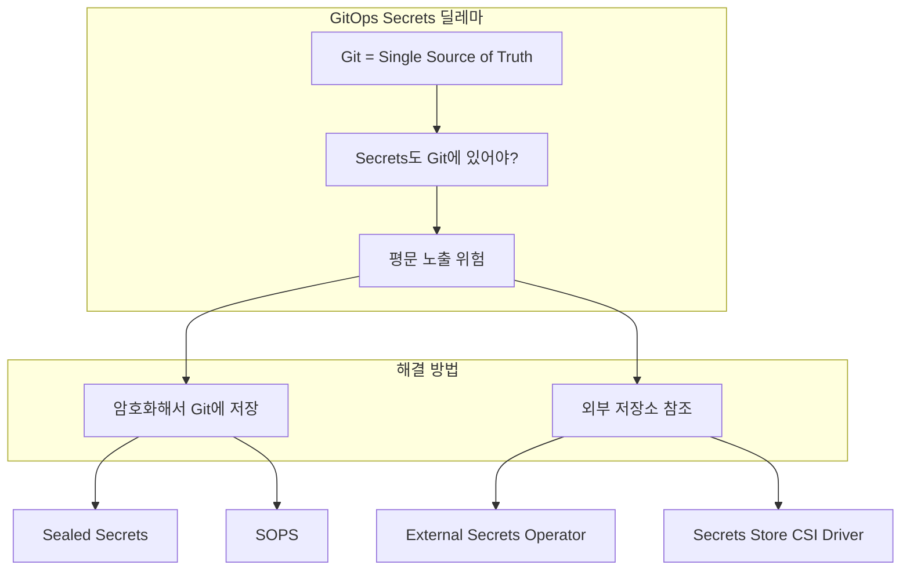
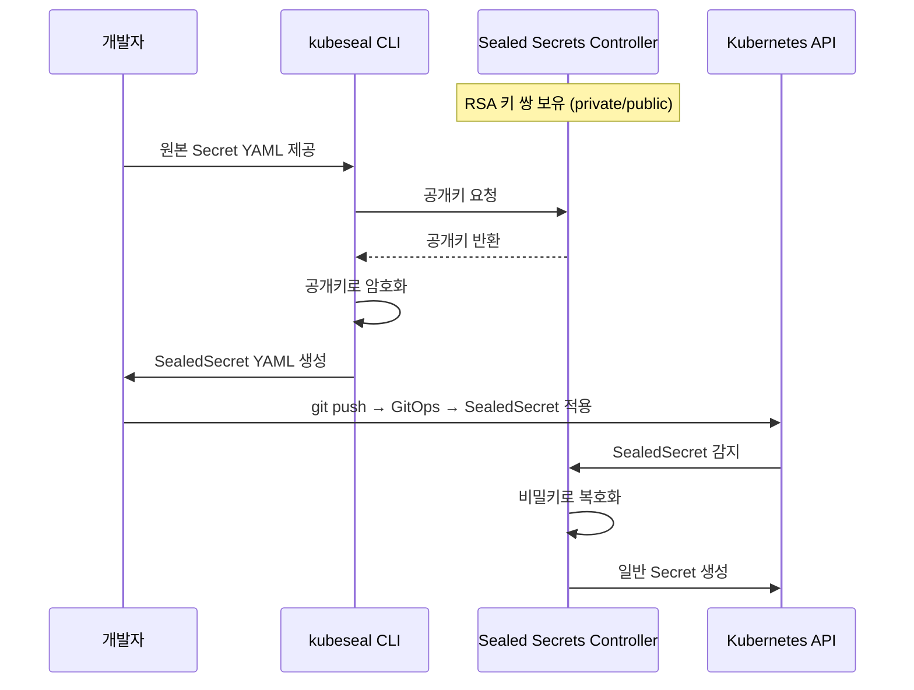
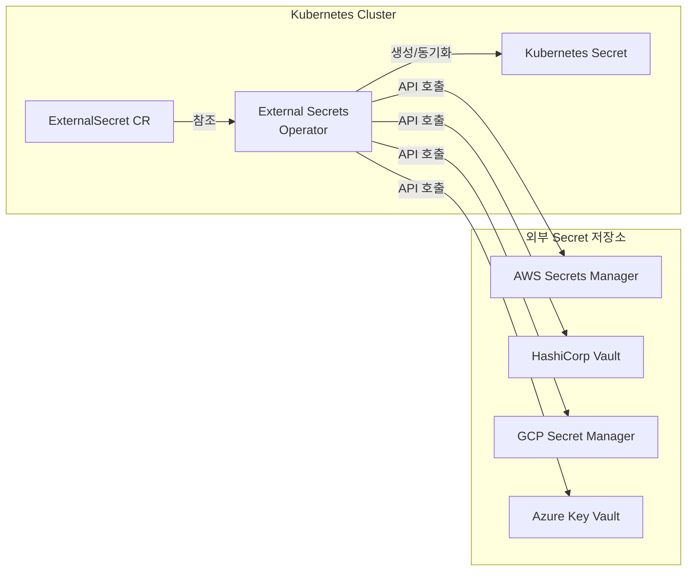
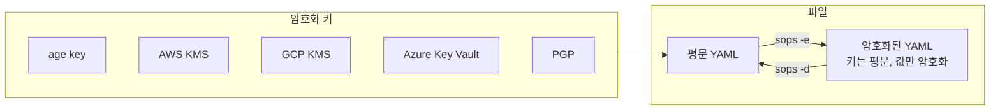
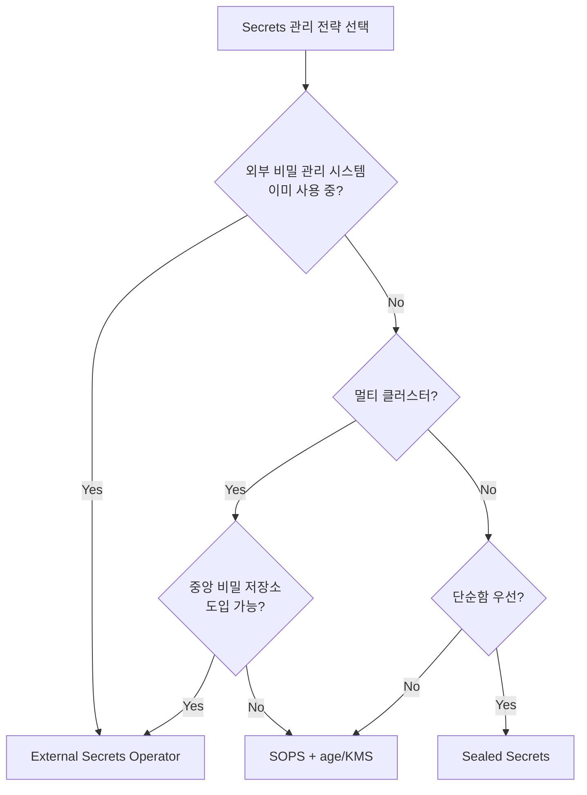

# GitOps 심화 시리즈 #5: Secrets Management - Git에 비밀을 안전하게 저장하기

## 시리즈 개요

| # | 주제 | 핵심 내용 |
|---|------|----------|
| 1 | GitOps 개요 | 철학과 원칙, Push vs Pull 배포, Reconciliation |
| 2 | ArgoCD Deep Dive | 아키텍처, Application CRD, Sync 전략 |
| 3 | Flux CD & GitOps Toolkit | 컨트롤러 아키텍처, GitRepository, Kustomization |
| 4 | 환경별 설정 관리 | Kustomize vs Helm, 전략 선택 기준 |
| **5** | **Secrets Management** | Sealed Secrets, External Secrets, SOPS |
| 6 | CI/CD 파이프라인 통합 | Image Updater, Progressive Delivery |

---

## GitOps에서 Secrets의 딜레마

GitOps의 핵심 원칙은 **Git을 Single Source of Truth**로 삼는 것입니다. 하지만 Kubernetes Secret을 Git에 저장하면?

```yaml
# ⚠️ 절대 이렇게 하면 안 됩니다!
apiVersion: v1
kind: Secret
metadata:
  name: db-credentials
type: Opaque
data:
  username: YWRtaW4=        # base64는 암호화가 아님!
  password: c3VwZXJzZWNyZXQ=  # 누구나 디코딩 가능
```

```bash
# 즉시 평문 노출
echo "c3VwZXJzZWNyZXQ=" | base64 -d
# 출력: supersecret
```

> [!CAUTION]
> **Base64는 인코딩이지 암호화가 아닙니다**. Git 히스토리에 한 번 들어가면 영구히 노출됩니다.

### 딜레마의 본질



---

## 해결책 1: Sealed Secrets

**Sealed Secrets**는 Bitnami에서 개발한 Kubernetes 컨트롤러로, 클러스터 내에서만 복호화 가능한 암호화된 Secret을 Git에 저장합니다.

### 동작 원리



### 설치

```bash
# 컨트롤러 설치
helm repo add sealed-secrets https://bitnami-labs.github.io/sealed-secrets
helm install sealed-secrets sealed-secrets/sealed-secrets \
  -n kube-system

# CLI 설치 (macOS)
brew install kubeseal
```

### 사용법

```bash
# 1. 원본 Secret 생성 (적용하지 않음!)
kubectl create secret generic db-credentials \
  --from-literal=username=admin \
  --from-literal=password=supersecret \
  --dry-run=client -o yaml > secret.yaml

# 2. Sealed Secret으로 암호화
kubeseal --format yaml < secret.yaml > sealed-secret.yaml

# 3. 원본 삭제, Sealed Secret만 Git에 커밋
rm secret.yaml
git add sealed-secret.yaml
git commit -m "Add encrypted database credentials"
```

### 생성된 SealedSecret

```yaml
apiVersion: bitnami.com/v1alpha1
kind: SealedSecret
metadata:
  name: db-credentials
  namespace: default
spec:
  encryptedData:
    username: AgBy8BQ...암호화된_데이터...==
    password: AgCtr2I...암호화된_데이터...==
  template:
    metadata:
      name: db-credentials
      namespace: default
    type: Opaque
```

### Scope 설정

SealedSecret은 **어떤 조건에서 복호화를 허용할지** 범위(scope)를 지정할 수 있습니다:

```bash
# strict (기본): 동일한 namespace + name만 허용
kubeseal --scope strict

# namespace-wide: 동일 namespace 내 다른 이름 허용
kubeseal --scope namespace-wide

# cluster-wide: 모든 namespace에서 사용 가능
kubeseal --scope cluster-wide
```

| Scope | 이름 변경 | 네임스페이스 변경 | 보안 수준 |
|-------|---------|----------------|----------|
| `strict` | ❌ | ❌ | 높음 |
| `namespace-wide` | ✅ | ❌ | 중간 |
| `cluster-wide` | ✅ | ✅ | 낮음 |

### 키 관리

> [!WARNING]
> Sealed Secrets 컨트롤러의 **비밀키가 유출되면 모든 SealedSecret이 복호화**됩니다. 키 백업이 필수입니다.

```bash
# 키 백업
kubectl get secret -n kube-system \
  -l sealedsecrets.bitnami.com/sealed-secrets-key \
  -o yaml > sealed-secrets-key-backup.yaml

# 키 복원 (재해 복구 시)
kubectl apply -f sealed-secrets-key-backup.yaml
kubectl delete pod -n kube-system -l app.kubernetes.io/name=sealed-secrets
```

### 한계

1. **클러스터 종속**: 다른 클러스터에서는 복호화 불가
2. **키 로테이션 복잡**: 키 변경 시 모든 SealedSecret 재암호화 필요
3. **단일 실패점**: 컨트롤러 장애 시 Secret 생성 불가

---

## 해결책 2: External Secrets Operator (ESO)

**External Secrets Operator**는 외부 비밀 관리 시스템(AWS Secrets Manager, HashiCorp Vault 등)에서 Secret을 가져와 Kubernetes Secret으로 동기화합니다.

### 동작 원리



**핵심 포인트**: Git에는 **ExternalSecret (참조 정보)**만 저장하고, 실제 비밀 값은 외부 저장소에 있습니다.

### 설치

```bash
helm repo add external-secrets https://charts.external-secrets.io
helm install external-secrets external-secrets/external-secrets \
  -n external-secrets --create-namespace
```

### SecretStore & ClusterSecretStore

먼저 외부 저장소와의 연결을 설정합니다:

```yaml
# ClusterSecretStore (클러스터 전역)
apiVersion: external-secrets.io/v1beta1
kind: ClusterSecretStore
metadata:
  name: aws-secrets-manager
spec:
  provider:
    aws:
      service: SecretsManager
      region: ap-northeast-2
      auth:
        jwt:
          serviceAccountRef:
            name: external-secrets-sa
            namespace: external-secrets
```

```yaml
# AWS IAM Role for Service Account (IRSA) 설정 필요
apiVersion: v1
kind: ServiceAccount
metadata:
  name: external-secrets-sa
  namespace: external-secrets
  annotations:
    eks.amazonaws.com/role-arn: arn:aws:iam::123456789:role/external-secrets-role
```

### ExternalSecret

```yaml
apiVersion: external-secrets.io/v1beta1
kind: ExternalSecret
metadata:
  name: db-credentials
  namespace: production
spec:
  # 동기화 주기
  refreshInterval: 1h
  
  # SecretStore 참조
  secretStoreRef:
    name: aws-secrets-manager
    kind: ClusterSecretStore
  
  # 생성할 Secret 설정
  target:
    name: db-credentials
    creationPolicy: Owner
  
  # 데이터 매핑
  data:
    - secretKey: username      # K8s Secret의 키
      remoteRef:
        key: prod/database     # AWS Secrets Manager의 경로
        property: username     # JSON 내 속성
    
    - secretKey: password
      remoteRef:
        key: prod/database
        property: password
```

### 전체 Secret 가져오기

```yaml
apiVersion: external-secrets.io/v1beta1
kind: ExternalSecret
metadata:
  name: all-db-credentials
spec:
  # ...
  dataFrom:
    - extract:
        key: prod/database  # JSON 전체를 가져와서 각 키를 Secret 데이터로
```

### 지원하는 Provider

| Provider | 설명 |
|----------|------|
| AWS Secrets Manager | AWS 네이티브 |
| AWS Parameter Store | SSM 파라미터 |
| HashiCorp Vault | 온프레미스/클라우드 |
| GCP Secret Manager | GCP 네이티브 |
| Azure Key Vault | Azure 네이티브 |
| 1Password | 팀 비밀 공유 |
| Doppler | SaaS 비밀 관리 |

### 장점과 단점

**장점**:

- Git에 비밀 값이 전혀 없음
- 자동 로테이션 지원
- 중앙 집중식 비밀 관리

**단점**:

- 외부 서비스 의존성
- 네트워크 지연
- 추가 비용 (AWS Secrets Manager 등)

---

## 해결책 3: SOPS (Secrets OPerationS)

**SOPS**는 Mozilla에서 개발한 파일 레벨 암호화 도구입니다. YAML, JSON, ENV 파일의 **값만 선택적으로 암호화**합니다.

### 동작 원리



### 특징: 키는 평문, 값만 암호화

```yaml
# 암호화 후 (읽기 쉬움!)
apiVersion: v1
kind: Secret
metadata:
  name: db-credentials
stringData:
  username: ENC[AES256_GCM,data:6FLiRc8=,iv:...,tag:...,type:str]
  password: ENC[AES256_GCM,data:HdNqmY3WUr8=,iv:...,tag:...,type:str]
sops:
  age:
    - recipient: age1...
      enc: |
        -----BEGIN AGE ENCRYPTED FILE-----
        ...
        -----END AGE ENCRYPTED FILE-----
  lastmodified: "2024-01-15T10:00:00Z"
  mac: ENC[AES256_GCM,...]
  version: 3.8.1
```

> [!TIP]
> **Git diff가 의미있습니다**. 어떤 키가 변경되었는지 바로 알 수 있습니다.

### Age 키로 사용하기 (권장)

```bash
# age 설치
brew install age

# 키 쌍 생성
age-keygen -o key.txt
# Public key: age1abc...
# Private key 저장됨

# SOPS 설치
brew install sops

# .sops.yaml 설정 (레포지토리 루트)
cat > .sops.yaml << EOF
creation_rules:
  - path_regex: .*secrets.*\.yaml$
    age: age1abc...  # 공개키
EOF
```

### 암호화/복호화

```bash
# 암호화
sops -e secrets.yaml > secrets.enc.yaml

# 복호화
sops -d secrets.enc.yaml > secrets.yaml

# 제자리 편집 (복호화 → 편집 → 저장 시 재암호화)
sops secrets.enc.yaml
```

### Flux와 SOPS 통합

Flux는 SOPS를 **네이티브로 지원**합니다:

```yaml
# 복호화 키를 Secret으로 저장
apiVersion: v1
kind: Secret
metadata:
  name: sops-age
  namespace: flux-system
stringData:
  age.agekey: |
    # created: 2024-01-15
    # public key: age1abc...
    AGE-SECRET-KEY-1...

---
# Kustomization에서 복호화 활성화
apiVersion: kustomize.toolkit.fluxcd.io/v1
kind: Kustomization
metadata:
  name: my-app
  namespace: flux-system
spec:
  # ...
  decryption:
    provider: sops
    secretRef:
      name: sops-age
```

### ArgoCD와 SOPS

ArgoCD는 플러그인을 통해 SOPS를 지원합니다:

```yaml
# argocd-cm ConfigMap
apiVersion: v1
kind: ConfigMap
metadata:
  name: argocd-cm
  namespace: argocd
data:
  configManagementPlugins: |
    - name: kustomize-sops
      generate:
        command: ["bash", "-c"]
        args: ["kustomize build . | sops -d /dev/stdin"]
```

### AWS KMS와 함께 사용

```yaml
# .sops.yaml
creation_rules:
  - path_regex: .*prod.*secrets.*\.yaml$
    kms: arn:aws:kms:ap-northeast-2:123456789:key/abc-def
    
  - path_regex: .*dev.*secrets.*\.yaml$
    kms: arn:aws:kms:ap-northeast-2:123456789:key/xyz-123
```

```bash
# 환경별 다른 KMS 키 사용
sops -e --kms arn:aws:kms:... secrets.yaml
```

---

## 전략 선택 가이드



### 비교 표

| 관점 | Sealed Secrets | ESO | SOPS |
|-----|----------------|-----|------|
| **Git에 저장되는 것** | 암호화된 SealedSecret | 참조(ExternalSecret) | 암호화된 파일 |
| **복호화 위치** | 클러스터 내 | 외부 저장소 | 클러스터/로컬 |
| **멀티 클러스터** | ❌ (각 클러스터 키 다름) | ✅ (중앙 저장소) | ✅ (같은 키 공유) |
| **비밀 로테이션** | 수동 | 자동 (refreshInterval) | 수동 |
| **외부 의존성** | 없음 | 있음 (Vault, AWS 등) | 선택적 (age vs KMS) |
| **Flux 지원** | ✅ | ✅ | ✅ (네이티브) |
| **ArgoCD 지원** | ✅ | ✅ | ✅ (플러그인) |
| **학습 곡선** | 낮음 | 중간 | 중간 |

### 권장 시나리오

| 상황 | 권장 솔루션 |
|-----|-----------|
| 단일 클러스터, 빠른 시작 | Sealed Secrets |
| AWS/GCP/Azure 사용, 중앙 관리 | External Secrets Operator |
| 멀티 클러스터, Flux 사용 | SOPS + age |
| 기존 Vault 인프라 | ESO + Vault |
| 규제 요구사항 (감사 로그 필요) | ESO + AWS Secrets Manager |

---

## 보안 모범 사례

### 1. 최소 권한 원칙

```yaml
# ESO ServiceAccount에 필요한 권한만 부여
{
  "Version": "2012-10-17",
  "Statement": [
    {
      "Effect": "Allow",
      "Action": [
        "secretsmanager:GetSecretValue"
      ],
      "Resource": [
        "arn:aws:secretsmanager:*:*:secret:prod/*"
      ]
    }
  ]
}
```

### 2. 네임스페이스 격리

```yaml
# SecretStore를 네임스페이스별로 분리
apiVersion: external-secrets.io/v1beta1
kind: SecretStore
metadata:
  name: team-a-secrets
  namespace: team-a
spec:
  provider:
    aws:
      service: SecretsManager
      region: ap-northeast-2
      # team-a 전용 IAM Role
      auth:
        jwt:
          serviceAccountRef:
            name: team-a-eso-sa
```

### 3. 자동 로테이션

```yaml
# ESO: 1시간마다 동기화
spec:
  refreshInterval: 1h

# AWS Secrets Manager: 자동 로테이션 활성화
# Lambda 함수가 주기적으로 비밀 값 변경
```

### 4. 감사 로깅

```bash
# AWS CloudTrail에서 Secret 접근 로그 확인
aws cloudtrail lookup-events \
  --lookup-attributes AttributeKey=EventName,AttributeValue=GetSecretValue
```

---

## 정리

| 솔루션 | 핵심 개념 | 장점 | 단점 |
|-------|----------|------|------|
| **Sealed Secrets** | 클러스터 키로 암호화 | 단순, 외부 의존성 없음 | 클러스터 종속, 키 관리 |
| **ESO** | 외부 저장소 참조 | 중앙 관리, 자동 로테이션 | 외부 의존성, 비용 |
| **SOPS** | 파일 레벨 암호화 | Git diff 가능, 유연함 | 수동 로테이션 |

---

## 다음 편 예고

**6편: CI/CD 파이프라인 통합**에서는 다음을 다룹니다:

- GitOps에서 CI와 CD의 분리
- ArgoCD Image Updater
- Flux Image Automation
- Progressive Delivery (Argo Rollouts, Flagger)
- 프로덕션 GitOps 워크플로우

---

## 참고 자료

- [Sealed Secrets](https://github.com/bitnami-labs/sealed-secrets)
- [External Secrets Operator](https://external-secrets.io/)
- [SOPS](https://github.com/getsops/sops)
- [Flux SOPS Integration](https://fluxcd.io/flux/guides/mozilla-sops/)
- [ArgoCD Secrets Management](https://argo-cd.readthedocs.io/en/stable/operator-manual/secret-management/)
