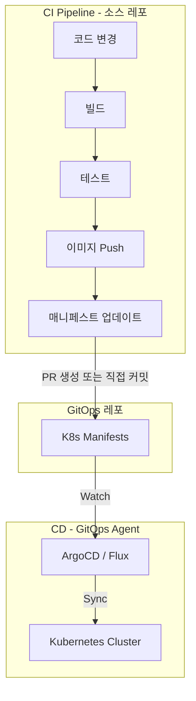
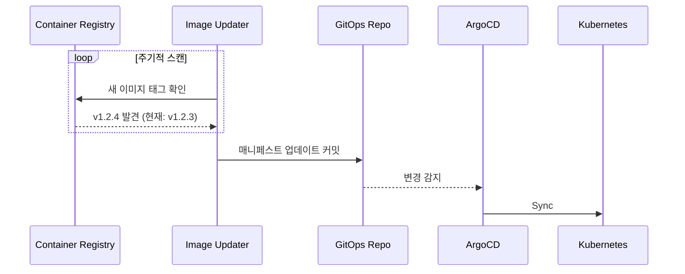
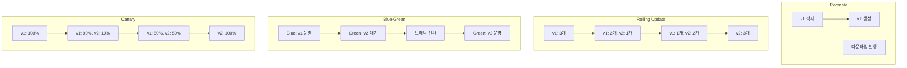
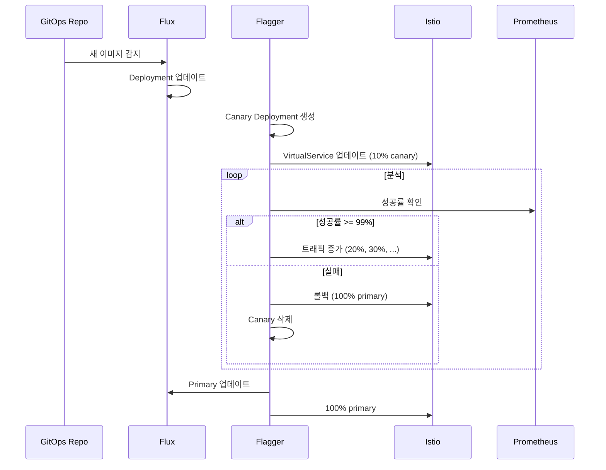
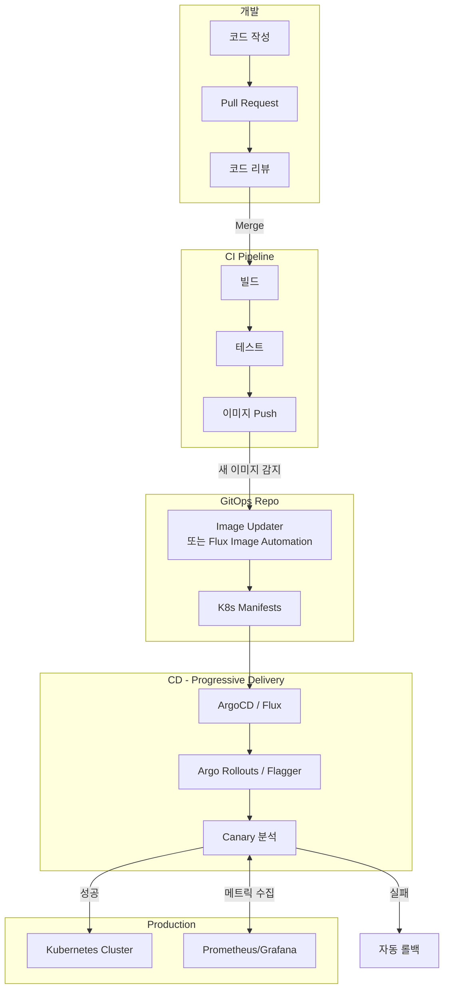
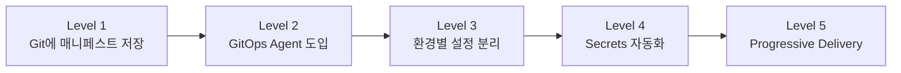

# GitOps 심화 시리즈 #6: CI/CD 파이프라인 통합과 Progressive Delivery

## 시리즈 개요

| # | 주제 | 핵심 내용 |
|---|------|----------|
| 1 | GitOps 개요 | 철학과 원칙, Push vs Pull 배포, Reconciliation |
| 2 | ArgoCD Deep Dive | 아키텍처, Application CRD, Sync 전략 |
| 3 | Flux CD & GitOps Toolkit | 컨트롤러 아키텍처, GitRepository, Kustomization |
| 4 | 환경별 설정 관리 | Kustomize vs Helm, 전략 선택 기준 |
| 5 | Secrets Management | Sealed Secrets, External Secrets, SOPS |
| **6** | **CI/CD 파이프라인 통합** | Image Updater, Progressive Delivery |

---

## GitOps에서 CI와 CD의 분리

전통적인 CI/CD 파이프라인에서는 CI와 CD가 하나의 파이프라인에서 연속적으로 실행됩니다. GitOps에서는 **명확하게 분리**됩니다.



### 왜 분리하는가?

| 관점 | 통합 CI/CD | 분리된 CI + GitOps |
|-----|-----------|------------------|
| **배포 권한** | CI가 클러스터 접근 | 클러스터 내부 Agent만 접근 |
| **감사 추적** | CI 로그에만 기록 | Git 커밋 히스토리 |
| **롤백** | 재빌드 필요 | `git revert` |
| **환경 일관성** | CI 파이프라인에 의존 | Git이 SSOT |

> [!IMPORTANT]
> **핵심 원칙**: CI는 **아티팩트(이미지)를 생성**하고, CD는 **GitOps Agent가 담당**합니다. CI가 클러스터에 직접 접근하지 않습니다.

---

## CI 파이프라인에서 매니페스트 업데이트

이미지 빌드 후 GitOps 레포의 매니페스트를 업데이트하는 여러 방법이 있습니다.

### 방법 1: CI에서 직접 커밋

```yaml
# .github/workflows/build.yaml
name: Build and Update Manifest

on:
  push:
    branches: [main]

jobs:
  build:
    runs-on: ubuntu-latest
    steps:
      - name: Checkout source
        uses: actions/checkout@v4
      
      - name: Build and push image
        run: |
          docker build -t ghcr.io/myorg/myapp:${{ github.sha }} .
          docker push ghcr.io/myorg/myapp:${{ github.sha }}
      
      - name: Update GitOps repo
        env:
          GITHUB_TOKEN: ${{ secrets.GITOPS_PAT }}
        run: |
          git clone https://$GITHUB_TOKEN@github.com/myorg/gitops-repo.git
          cd gitops-repo
          
          # Kustomize 사용 시
          cd apps/myapp/overlays/prod
          kustomize edit set image ghcr.io/myorg/myapp:${{ github.sha }}
          
          git config user.name "GitHub Actions"
          git config user.email "actions@github.com"
          git add .
          git commit -m "Update myapp to ${{ github.sha }}"
          git push
```

### 방법 2: PR 생성 (권장)

```yaml
      - name: Create PR to GitOps repo
        uses: peter-evans/create-pull-request@v6
        with:
          token: ${{ secrets.GITOPS_PAT }}
          repository: myorg/gitops-repo
          branch: update-myapp-${{ github.sha }}
          title: "Update myapp to ${{ github.sha }}"
          body: |
            Automated image update
            - Commit: ${{ github.sha }}
            - Build: ${{ github.run_id }}
          commit-message: "chore: update myapp image to ${{ github.sha }}"
```

> [!TIP]
> **PR 방식의 장점**: 코드 리뷰 프로세스 활용, 자동화된 테스트 실행, 승인 후 배포

### 방법 3: 이미지 태그 자동 업데이트 (권장)

CI는 이미지만 푸시하고, **GitOps Agent가 자동으로 매니페스트를 업데이트**합니다. 다음 섹션에서 자세히 다룹니다.

---

## ArgoCD Image Updater

**ArgoCD Image Updater**는 컨테이너 레지스트리를 모니터링하고, 새 이미지 태그가 발견되면 자동으로 Application을 업데이트합니다.

### 동작 원리



### 설치

```bash
kubectl apply -n argocd \
  -f https://raw.githubusercontent.com/argoproj-labs/argocd-image-updater/stable/manifests/install.yaml
```

### Application 설정

```yaml
apiVersion: argoproj.io/v1alpha1
kind: Application
metadata:
  name: myapp
  namespace: argocd
  annotations:
    # Image Updater 활성화
    argocd-image-updater.argoproj.io/image-list: myapp=ghcr.io/myorg/myapp
    
    # 업데이트 전략: semver
    argocd-image-updater.argoproj.io/myapp.update-strategy: semver
    
    # SemVer 제약
    argocd-image-updater.argoproj.io/myapp.allow-tags: regexp:^v[0-9]+\.[0-9]+\.[0-9]+$
    
    # Git에 커밋 (write-back)
    argocd-image-updater.argoproj.io/write-back-method: git
    argocd-image-updater.argoproj.io/git-branch: main
spec:
  source:
    repoURL: https://github.com/myorg/gitops.git
    path: apps/myapp
```

### Update Strategies

| 전략 | 설명 | 예시 |
|-----|------|-----|
| `semver` | SemVer 최신 | v1.2.3 < v1.2.4 < v1.3.0 |
| `latest` | 최신 푸시된 태그 | 날짜/시간 기준 |
| `name` | 알파벳순 최신 | a < b < c |
| `digest` | 특정 태그의 digest 변경 | :latest의 실제 이미지 변경 |

### Write-back Methods

```yaml
# 1. Git 직접 커밋 (권장)
argocd-image-updater.argoproj.io/write-back-method: git

# 2. ArgoCD에 오버라이드 (Git에 기록 안 됨)
argocd-image-updater.argoproj.io/write-back-method: argocd
```

> [!WARNING]
> `argocd` 방식은 Git에 기록되지 않아 **GitOps 원칙에 위배**됩니다. 프로덕션에서는 `git` 방식을 권장합니다.

---

## Flux Image Automation

Flux는 Image Automation을 **핵심 기능으로 내장**하고 있습니다 (3편에서 간략히 소개했습니다).

### 전체 구성

```yaml
# 1. ImageRepository: 레지스트리 스캔
apiVersion: image.toolkit.fluxcd.io/v1beta2
kind: ImageRepository
metadata:
  name: myapp
  namespace: flux-system
spec:
  image: ghcr.io/myorg/myapp
  interval: 5m
  secretRef:
    name: ghcr-auth

---
# 2. ImagePolicy: 태그 선택 정책
apiVersion: image.toolkit.fluxcd.io/v1beta2
kind: ImagePolicy
metadata:
  name: myapp
  namespace: flux-system
spec:
  imageRepositoryRef:
    name: myapp
  policy:
    semver:
      range: ">=1.0.0"

---
# 3. ImageUpdateAutomation: Git 업데이트
apiVersion: image.toolkit.fluxcd.io/v1beta2
kind: ImageUpdateAutomation
metadata:
  name: myapp
  namespace: flux-system
spec:
  interval: 5m
  sourceRef:
    kind: GitRepository
    name: myapp
  git:
    checkout:
      ref:
        branch: main
    commit:
      author:
        name: Flux
        email: flux@myorg.com
      messageTemplate: |
        Auto-update images
        
        {{range .Changed.Changes}}
        - {{.OldValue}} -> {{.NewValue}}
        {{end}}
    push:
      branch: main
  update:
    path: ./deploy
    strategy: Setters
```

### 마커 기반 업데이트

```yaml
# deployment.yaml
apiVersion: apps/v1
kind: Deployment
metadata:
  name: myapp
spec:
  template:
    spec:
      containers:
      - name: myapp
        image: ghcr.io/myorg/myapp:v1.2.3  # {"$imagepolicy": "flux-system:myapp"}
```

Flux가 새 버전을 발견하면:

```yaml
        image: ghcr.io/myorg/myapp:v1.2.4  # {"$imagepolicy": "flux-system:myapp"}
```

---

## Progressive Delivery

새 버전을 **점진적으로 배포**하여 위험을 최소화하는 전략입니다.

### 배포 전략 비교



| 전략 | 다운타임 | 리소스 | 롤백 속도 | 위험 노출 |
|-----|---------|-------|---------|---------|
| Recreate | ✅ 있음 | 낮음 | 느림 | 높음 |
| Rolling | ❌ 없음 | 일시 증가 | 중간 | 중간 |
| Blue-Green | ❌ 없음 | 2배 | 빠름 | 낮음 |
| Canary | ❌ 없음 | 약간 증가 | 빠름 | 낮음 |

---

## Argo Rollouts

**Argo Rollouts**는 Kubernetes Deployment를 대체하여 Blue-Green, Canary 배포를 제공합니다.

### 설치

```bash
kubectl create namespace argo-rollouts
kubectl apply -n argo-rollouts \
  -f https://github.com/argoproj/argo-rollouts/releases/latest/download/install.yaml
```

### Canary Rollout

```yaml
apiVersion: argoproj.io/v1alpha1
kind: Rollout
metadata:
  name: myapp
spec:
  replicas: 5
  revisionHistoryLimit: 3
  selector:
    matchLabels:
      app: myapp
  template:
    metadata:
      labels:
        app: myapp
    spec:
      containers:
      - name: myapp
        image: ghcr.io/myorg/myapp:v1.2.3
        ports:
        - containerPort: 8080
  strategy:
    canary:
      # 단계별 배포
      steps:
      - setWeight: 10      # 10% 트래픽
      - pause: {duration: 5m}  # 5분 대기
      - setWeight: 30
      - pause: {duration: 5m}
      - setWeight: 50
      - pause: {}          # 수동 승인 대기
      - setWeight: 100
      
      # 분석 실행 (자동 롤백)
      analysis:
        templates:
        - templateName: success-rate
        startingStep: 1
        args:
        - name: service-name
          value: myapp
```

### AnalysisTemplate

메트릭 기반 자동 롤백:

```yaml
apiVersion: argoproj.io/v1alpha1
kind: AnalysisTemplate
metadata:
  name: success-rate
spec:
  args:
  - name: service-name
  metrics:
  - name: success-rate
    interval: 1m
    failureLimit: 3
    successCondition: result[0] >= 0.95
    provider:
      prometheus:
        address: http://prometheus.monitoring:9090
        query: |
          sum(rate(http_requests_total{
            service="{{args.service-name}}",
            status=~"2.."
          }[5m])) /
          sum(rate(http_requests_total{
            service="{{args.service-name}}"
          }[5m]))
```

### Blue-Green Rollout

```yaml
apiVersion: argoproj.io/v1alpha1
kind: Rollout
metadata:
  name: myapp
spec:
  replicas: 5
  selector:
    matchLabels:
      app: myapp
  template:
    # ...
  strategy:
    blueGreen:
      activeService: myapp-active
      previewService: myapp-preview
      autoPromotionEnabled: false  # 수동 승인
      prePromotionAnalysis:
        templates:
        - templateName: smoke-test
```

### ArgoCD와 통합

```yaml
apiVersion: argoproj.io/v1alpha1
kind: Application
metadata:
  name: myapp
spec:
  source:
    repoURL: https://github.com/myorg/gitops.git
    path: apps/myapp
  # Rollout 리소스를 인식하도록 설정
  syncPolicy:
    automated:
      prune: true
      selfHeal: true
```

---

## Flagger

**Flagger**는 Flux와 함께 사용되는 Progressive Delivery 도구입니다. Istio, Linkerd, NGINX Ingress 등과 통합됩니다.

### 설치 (with Flux)

```yaml
apiVersion: source.toolkit.fluxcd.io/v1
kind: HelmRepository
metadata:
  name: flagger
  namespace: flux-system
spec:
  interval: 1h
  url: https://flagger.app

---
apiVersion: helm.toolkit.fluxcd.io/v2
kind: HelmRelease
metadata:
  name: flagger
  namespace: flagger-system
spec:
  interval: 1h
  chart:
    spec:
      chart: flagger
      sourceRef:
        kind: HelmRepository
        name: flagger
        namespace: flux-system
  values:
    meshProvider: istio
    metricsServer: http://prometheus.monitoring:9090
```

### Canary CRD

```yaml
apiVersion: flagger.app/v1beta1
kind: Canary
metadata:
  name: myapp
  namespace: production
spec:
  targetRef:
    apiVersion: apps/v1
    kind: Deployment
    name: myapp
  
  # Istio VirtualService 자동 생성
  service:
    port: 8080
    targetPort: 8080
  
  # 분석 설정
  analysis:
    interval: 1m           # 분석 주기
    threshold: 5           # 최대 실패 횟수
    maxWeight: 50          # 최대 Canary 트래픽
    stepWeight: 10         # 단계별 증가량
    
    metrics:
    - name: request-success-rate
      thresholdRange:
        min: 99
      interval: 1m
    
    - name: request-duration
      thresholdRange:
        max: 500
      interval: 1m
    
    # Webhook 테스트
    webhooks:
    - name: smoke-test
      type: pre-rollout
      url: http://flagger-loadtester/
      timeout: 30s
      metadata:
        type: bash
        cmd: "curl -s http://myapp-canary:8080/health | grep ok"
```

### 동작 흐름



---

## 프로덕션 GitOps 워크플로우

모든 것을 종합한 프로덕션 워크플로우입니다.



### 레포지토리 구조 (최종)

```
gitops-repo/
├── clusters/
│   ├── dev/
│   │   └── kustomization.yaml
│   ├── staging/
│   │   └── kustomization.yaml
│   └── prod/
│       └── kustomization.yaml
│
├── infrastructure/
│   ├── base/
│   │   ├── ingress-nginx/
│   │   ├── cert-manager/
│   │   ├── monitoring/
│   │   └── flagger/
│   └── overlays/
│       ├── dev/
│       └── prod/
│
├── apps/
│   ├── frontend/
│   │   ├── base/
│   │   │   ├── deployment.yaml
│   │   │   ├── service.yaml
│   │   │   ├── canary.yaml        # Flagger Canary
│   │   │   └── kustomization.yaml
│   │   └── overlays/
│   │       ├── dev/
│   │       ├── staging/
│   │       └── prod/
│   └── backend/
│       └── ...
│
└── image-automation/              # Flux Image Automation
    ├── image-repositories.yaml
    ├── image-policies.yaml
    └── image-update-automation.yaml
```

---

## 정리: GitOps 시리즈 총정리

6편의 시리즈를 통해 다룬 내용을 정리합니다.

| 편 | 주제 | 핵심 메시지 |
|---|------|-----------|
| 1 | GitOps 개요 | Git = SSOT, Pull 모델, Reconciliation |
| 2 | ArgoCD | 모놀리식 아키텍처, 강력한 UI, ApplicationSet |
| 3 | Flux CD | 마이크로서비스 컨트롤러, Image Automation 내장 |
| 4 | 설정 관리 | Kustomize(순수 YAML) vs Helm(템플릿) |
| 5 | Secrets | Sealed Secrets, ESO, SOPS |
| 6 | CI/CD 통합 | CI와 CD 분리, Progressive Delivery |

### GitOps 성숙도 모델



### 시작하기 권장 순서

1. **ArgoCD 또는 Flux 설치**
2. **간단한 앱으로 GitOps 워크플로우 경험**
3. **Kustomize로 환경별 설정 분리**
4. **Sealed Secrets 또는 ESO 도입**
5. **Image Updater로 자동화**
6. **Argo Rollouts 또는 Flagger로 Progressive Delivery**

---

## 마치며

GitOps는 단순한 도구가 아닌 **운영 철학**입니다. Git을 중심으로 선언적 인프라를 관리하고, 자동화된 Reconciliation으로 일관성을 유지합니다.

이 시리즈가 여러분의 GitOps 여정에 도움이 되길 바랍니다. 🚀

---

## 참고 자료

- [ArgoCD Image Updater](https://argocd-image-updater.readthedocs.io/)
- [Flux Image Automation](https://fluxcd.io/flux/guides/image-update/)
- [Argo Rollouts](https://argoproj.github.io/argo-rollouts/)
- [Flagger](https://flagger.app/)
- [Progressive Delivery with Flux](https://fluxcd.io/flagger/)
- [GitOps Working Group - CNCF](https://github.com/cncf/tag-app-delivery/tree/main/gitops-wg)
