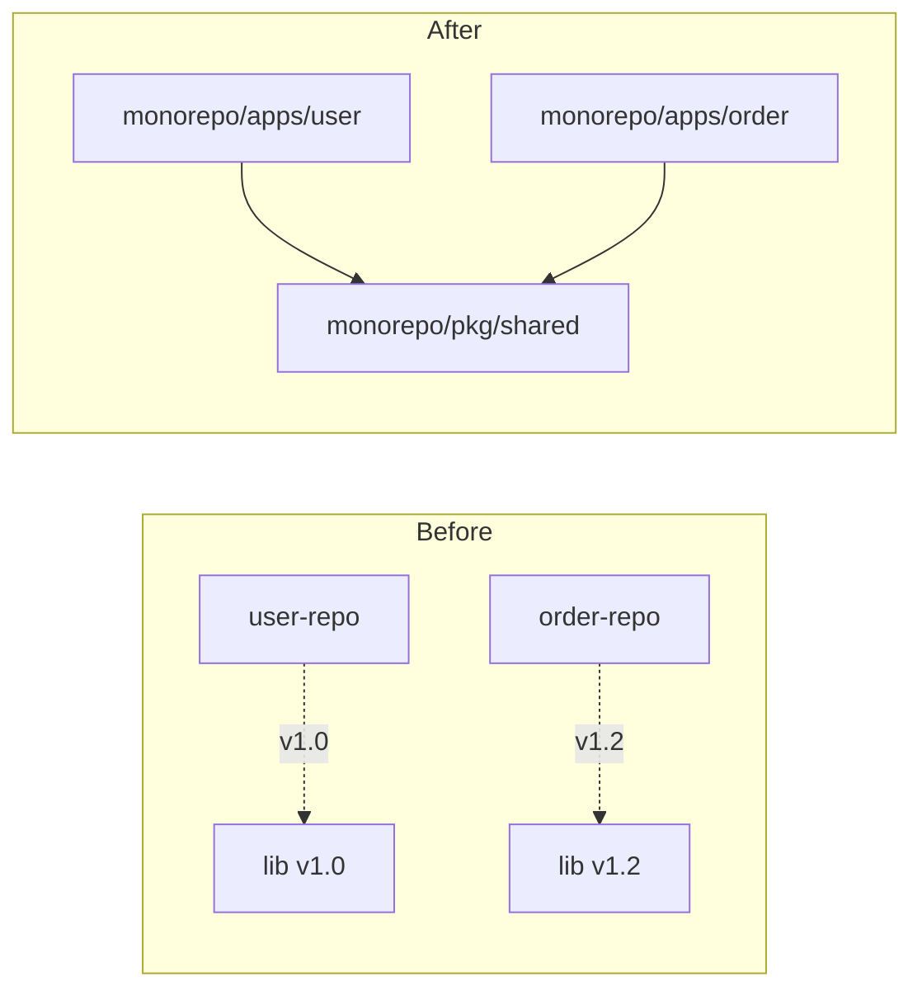
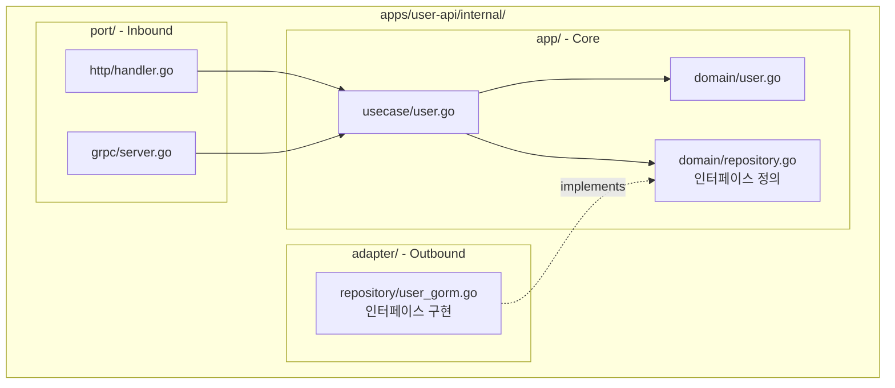
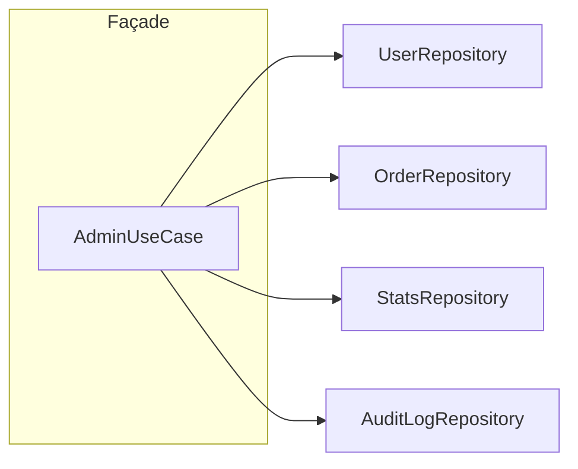
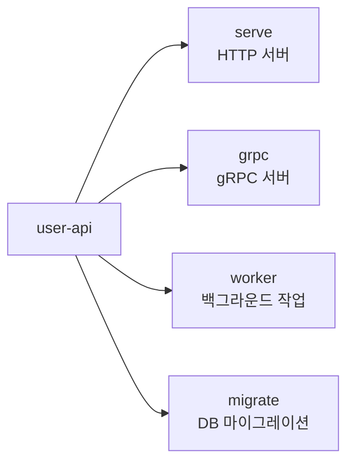

# Enterprise Go 시리즈 #1: 프로젝트 설계와 구조화

> **대상 독자**: Java, Node.js 등 다른 생태계에서 충분한 경험을 쌓은 후 Go로 전환하는 시니어 엔지니어

## 시리즈 소개

| # | 주제 | 다른 언어에서의 대응 개념 |
|---|------|------------------------|
| **1** | 프로젝트 설계 | Maven 멀티모듈, Gradle 컨벤션 |
| 2 | HTTP 서버 | Spring MVC, Express |
| 3 | Context | ThreadLocal, AsyncLocalStorage |
| 4 | 동시성 | ExecutorService, Worker Threads |
| 5 | 데이터베이스 | @Transactional, Sequelize |
| 6 | 외부 통신 | Resilience4j, Polly |
| 7 | 테스트 | JUnit, Jest |
| 8 | Observability | Micrometer, Winston |

---

## 모노레포를 선택한 이유

### 멀티레포에서 겪은 문제

빠른 프로토타이핑을 위해 각 서비스를 별도 저장소로 분리했으나, 정식 프로젝트 채택 이후 문제가 드러났습니다:

- **공통 라이브러리 버전 파편화**: 서비스 A는 v1.0, B는 v1.2 → 호환성 이슈
- **Cross-cutting 변경의 어려움**: 인증 방식 변경 시 PR 5개 + 배포 조율
- **의존성 업데이트 지옥**: 보안 패치 하나에 N개 저장소 수정

### 모노레포로 전환 후



- Atomic Commit으로 관련 변경을 한 번에
- `go.work`를 활용한 로컬 모듈 개발 (replace 없이 로컬 변경 즉시 반영)
- 변경된 서비스만 빌드하는 CI 구성 가능

---

## golang-standards + 모노레포 + 헥사고날

### 디렉토리 구조

[golang-standards/project-layout](https://github.com/golang-standards/project-layout)을 기반으로 모노레포와 헥사고날을 녹여낸 구조입니다.

```
monorepo/
├── apps/                          # 배포 단위별 서비스
│   ├── user-api/
│   │   ├── cmd/                   # 엔트리포인트 (Cobra)
│   │   │   └── main.go
│   │   └── internal/              # 외부 import 불가
│   │       ├── port/              # Inbound (HTTP, gRPC)
│   │       │   └── http/
│   │       ├── app/               # UseCase, Domain
│   │       │   ├── usecase/
│   │       │   └── domain/
│   │       └── adapter/           # Outbound (DB, External)
│   │           └── repository/
│   │
│   └── order-api/
│       └── (동일 구조)
│
├── pkg/                           # 외부 공개 가능한 공용 코드
│   ├── logger/
│   ├── errors/
│   └── config/
│
├── internal/                      # 모노레포 내부 공유, 외부 비공개
│   └── shared/
│       └── domain/                # 공유 도메인 모델
│
├── api/                           # OpenAPI, Protobuf 정의
│   └── proto/
│
├── scripts/                       # 빌드, 배포 스크립트
├── go.work                        # Go 워크스페이스
└── go.work.sum
```

### 핵심 디렉토리 역할

| 디렉토리 | Go 컴파일러 강제 | 역할 |
|----------|-----------------|------|
| `/cmd` | - | 엔트리포인트, 최소한의 main() |
| `/internal` | ✅ import 제한 | 외부 패키지에서 import 불가 |
| `/pkg` | - | 외부 공개 가능, 신중하게 사용 |
| `/api` | - | OpenAPI, Protobuf 정의 |

---

## 헥사고날 적용 시 고민했던 점

### Port와 Adapter를 어디에 둘 것인가?



**결정 근거:**

- `domain/`에 인터페이스 정의 → 의존성 역전
- `adapter/`에서 구현 → 인프라 교체 용이
- Output Port 인터페이스는 Domain에, 구현체는 Adapter에

### UseCase는 Façade다

AdminUseCase를 설계할 때 고민이 있었습니다:

> "UserRepository, OrderRepository, StatsRepository... 다 주입해야 하는데 이게 맞나?"

**맞습니다.** UseCase는 **Façade 패턴**입니다.



| 역할 | 설명 |
|------|------|
| Handler | 단일 UseCase 호출 |
| **UseCase (Façade)** | 여러 Repository 조합, 트랜잭션 경계 |
| Repository | 단일 테이블/도메인 담당 |

Handler는 단순해지고, 복잡한 조합은 UseCase에서 처리합니다.

---

## Cobra: 다중 진입점 관리

### 왜 Cobra인가?

하나의 바이너리로 여러 역할 수행이 필요했습니다:



- **배포 단순화**: 하나의 Docker 이미지, 다른 커맨드
- **설정 공유**: Viper로 공통 설정, 커맨드별 오버라이드
- **테스트 용이**: 각 커맨드 독립적으로 테스트 가능

---

## Wire: 컴파일 타임 DI

### 다른 DI 도구와 비교

| 도구 | 에러 발견 시점 | 특징 |
|------|--------------|------|
| uber/fx | 런타임 | 유연하나 런타임 에러 |
| google/wire | 컴파일 타임 | 코드 생성, 안전 |
| 수동 DI | 컴파일 타임 | 보일러플레이트 증가 |

빠른 프로토타이핑 시에는 수동 DI로 시작했으나, 정식 채택 후 의존성이 복잡해지면서 Wire로 전환했습니다. 컴파일 타임에 의존성 그래프 오류를 잡을 수 있어 배포 후 장애를 예방할 수 있습니다.

---

## Functional Options 패턴

Java의 Builder 패턴, JavaScript의 옵션 객체에 대응하는 Go의 관용구입니다:

```go
// Go 관용적 방식
server := NewServer(
    WithPort(8080),
    WithTimeout(30 * time.Second),
    WithLogger(logger),
)
```

**장점:**

- 기본값 내장 (zero value보다 명시적)
- 옵션 추가 시 기존 코드 호환
- 문서화 없이도 사용법 명확

---

## 정리

| 선택 | 근거 |
|------|------|
| 모노레포 | Cross-cutting 변경, 버전 통일 |
| golang-standards | Go 생태계 표준, 팀 온보딩 |
| 헥사고날 | 인프라 교체, 테스트 용이 |
| Cobra | 다중 진입점, 설정 관리 |
| Wire | 컴파일 타임 안전성 |

---

## 다음 편 예고

**2편: 견고한 HTTP 서버 구축**에서는 Spring MVC의 Filter/Interceptor에 대응하는 Echo 미들웨어 설계를 다룹니다.

---

## 참고 자료

- [golang-standards/project-layout](https://github.com/golang-standards/project-layout)
- [Hexagonal Architecture](https://alistair.cockburn.us/hexagonal-architecture/)
- [Google Wire](https://github.com/google/wire)
