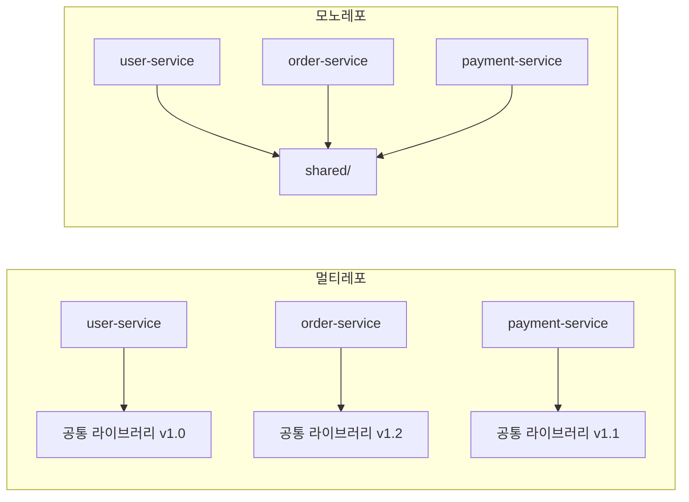
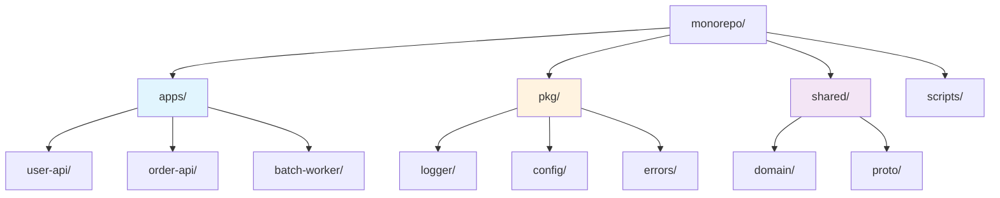
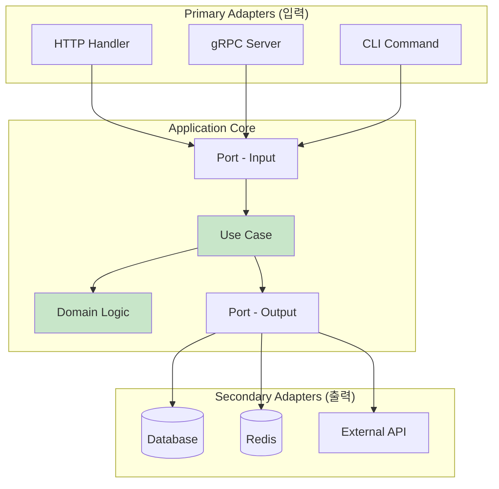
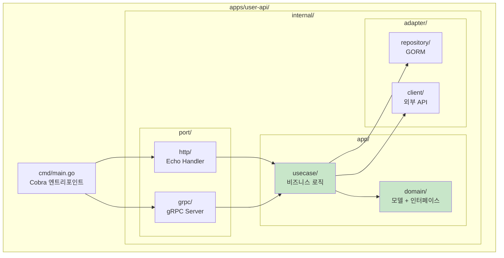
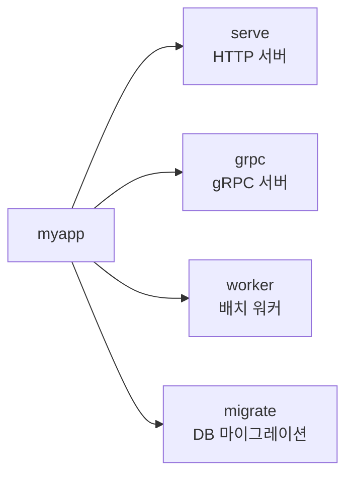
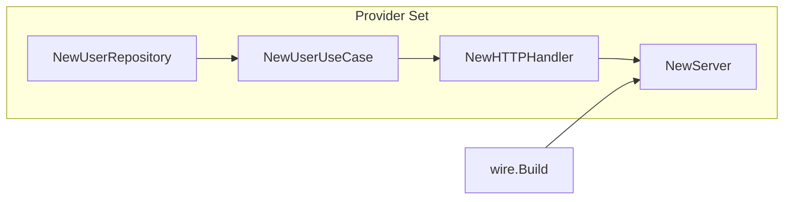
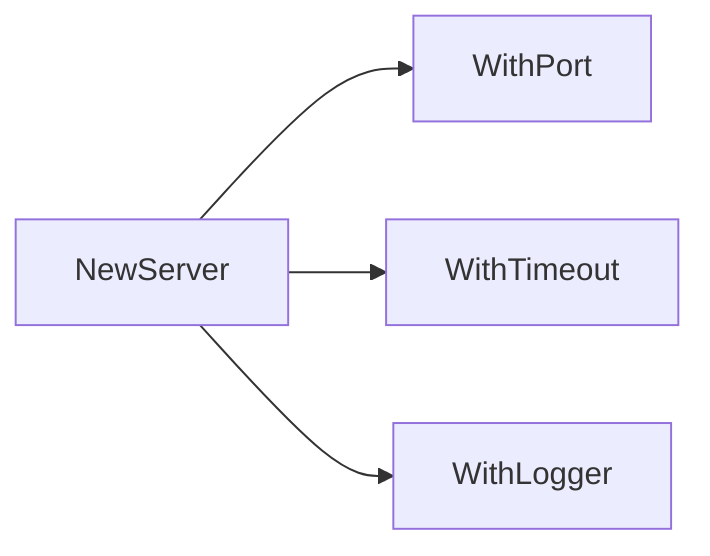

# Enterprise Go 시리즈 #1: 프로젝트 설계와 구조화

## 시리즈 소개

이 시리즈는 엔터프라이즈 레벨의 Go 애플리케이션을 구축하는 실전 가이드입니다. 기술적 주제가 아닌, **실제 개발자가 마주하는 상황** 순서대로 구성했습니다.

| # | 주제 | 핵심 내용 |
|---|------|----------|
| **1** | 프로젝트 설계와 구조화 | 모노레포, Hexagonal Architecture |
| 2 | 견고한 HTTP 서버 구축 | Echo, Middleware |
| 3 | Context로 요청 생명주기 관리 | Timeout, Cancellation |
| 4 | Goroutine과 Channel 실전 활용 | Fearless Concurrency |
| 5 | 데이터베이스 연동 패턴 | 트랜잭션 전파 |
| 6 | Resilient한 외부 통신 | Circuit Breaker |
| 7 | 테스트 전략과 실전 | 통합 테스트 |
| 8 | Observability와 Debugging | 관찰가능성 |

---

## 왜 아키텍처가 중요한가?

엔터프라이즈 환경에서 겪는 현실적인 문제들:

> "처음엔 HTTP 서버 하나였는데, 이제 gRPC도 필요하고 배치 워커도 있고..."
> "팀이 커지면서 코드 충돌이 너무 잦아요"
> "테스트 환경 구성하는 게 본 작업보다 오래 걸려요"

이런 문제들은 **처음부터 확장 가능한 구조**로 시작해야 해결됩니다.

---

## 모노레포(Monorepo)를 선택한 이유

### 멀티레포 vs 모노레포



### 실전 경험에서 배운 것

**멀티레포의 고통:**

- 공통 라이브러리 버전 파편화 → 서비스마다 다른 버전 의존
- 크로스 서비스 변경 시 PR 3개 이상 필요
- "이 변경이 다른 서비스에 영향 주나요?" 확인 어려움

**모노레포의 장점:**

- **Atomic Commit**: 관련 변경을 한 커밋에
- **통합 CI/CD**: 변경된 서비스만 빌드/배포
- **코드 공유 용이**: import 경로만 맞추면 됨

**모노레포의 trade-off:**

- 초기 설정 복잡도 증가
- CI/CD 파이프라인 설계 필요
- 권한 관리 고민 (폴더별 CODEOWNERS)

---

## 모노레포 디렉토리 구조



| 디렉토리 | 역할 | 예시 |
|----------|------|------|
| `apps/` | 배포 가능한 서비스들 | user-api, order-api, worker |
| `pkg/` | 범용 유틸리티 | logger, config, errors |
| `shared/` | 도메인 공유 코드 | domain 모델, proto 정의 |
| `scripts/` | 빌드/배포 스크립트 | Makefile, CI 스크립트 |

---

## Hexagonal Architecture (Port & Adapter)

### 핵심 원칙

> 비즈니스 로직은 외부 세계(DB, HTTP, 메시지 큐)를 몰라야 한다.



### 왜 이 구조인가?

**경험담**: 초기에는 Handler에서 직접 DB 쿼리를 호출했습니다. 문제는:

- gRPC 추가 시 Handler 로직 복붙
- 테스트할 때 실제 DB 필요
- 외부 결제 API 변경 시 수십 개 파일 수정

**Hexagonal 적용 후:**

- UseCase 하나로 HTTP/gRPC/CLI 모두 처리
- Port(인터페이스) 덕분에 Mock 주입 용이
- Adapter만 교체하면 인프라 변경 가능

---

## 서비스 하나의 구조



---

## Cobra: CLI 엔트리포인트

### 설계 원칙

Cobra를 선택한 이유:

- 서브커맨드로 **다중 Port 선택** 가능
- Viper와 자연스럽게 연동
- 자동 Help 생성



### 핵심 패턴

```go
// 서브커맨드에서 Wire로 의존성 주입
rootCmd.AddCommand(
    newServeCmd(),   // Wire → HTTP Server
    newGRPCCmd(),    // Wire → gRPC Server
    newWorkerCmd(),  // Wire → Background Worker
)
```

**실전 팁:**

- 각 커맨드는 독립적인 의존성 그래프
- `serve`와 `worker`가 다른 Adapter를 사용할 수 있음
- Graceful Shutdown은 커맨드 레벨에서 처리

---

## Wire: 의존성 주입

### 왜 Wire인가?

| 방식 | 에러 발견 시점 | 복잡도 |
|------|--------------|--------|
| 수동 DI | 컴파일 타임 | 보일러플레이트 ↑ |
| fx, dig | 런타임 | 디버깅 어려움 |
| **Wire** | 컴파일 타임 | 코드 생성 |

**경험담**: uber/fx를 사용했다가 "런타임에서야 에러 발견" 문제로 Wire로 전환했습니다. 컴파일 타임에 의존성 그래프 오류를 잡을 수 있어 안심됩니다.

### Wire 패턴



**핵심 원칙:**

1. Provider는 단일 타입 반환
2. Provider Set으로 레이어별 그룹핑
3. Injector에서 최종 조립

---

## Functional Options 패턴

### 문제 상황

```go
// 매개변수가 계속 늘어남
func NewServer(port int, timeout time.Duration, logger Logger, ...) *Server
```

### 해결



**장점:**

- 기본값 제공 가능
- 옵션 추가 시 기존 코드 영향 없음
- 가독성 향상

---

## 정리: 설계 원칙 체크리스트

| 원칙 | 질문 |
|------|------|
| **모노레포** | 서비스 간 코드 공유가 필요한가? |
| **Hexagonal** | 비즈니스 로직이 인프라에 의존하지 않는가? |
| **Cobra** | 다중 진입점(HTTP, gRPC, CLI)이 필요한가? |
| **Wire** | 의존성 그래프가 복잡한가? |
| **Functional Options** | 설정이 다양한 컴포넌트가 있는가? |

---

## 다음 편 예고

**2편: 견고한 HTTP 서버 구축**에서는:

- Echo 미들웨어 체인 설계
- 일관된 에러 응답 패턴
- Graceful Shutdown

을 다룹니다.

---

## 참고 자료

- [Hexagonal Architecture](https://alistair.cockburn.us/hexagonal-architecture/)
- [Cobra 공식 문서](https://cobra.dev/)
- [Google Wire](https://github.com/google/wire)
