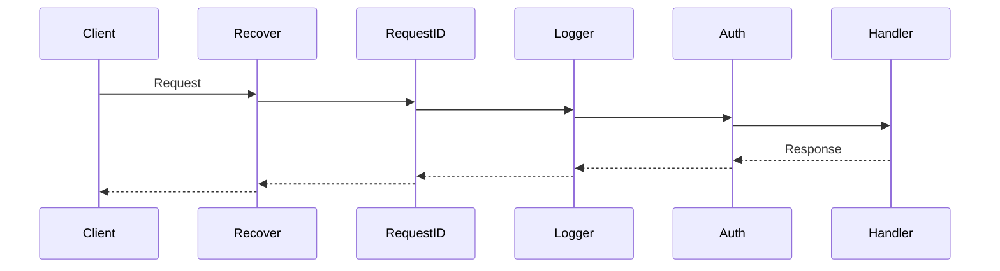
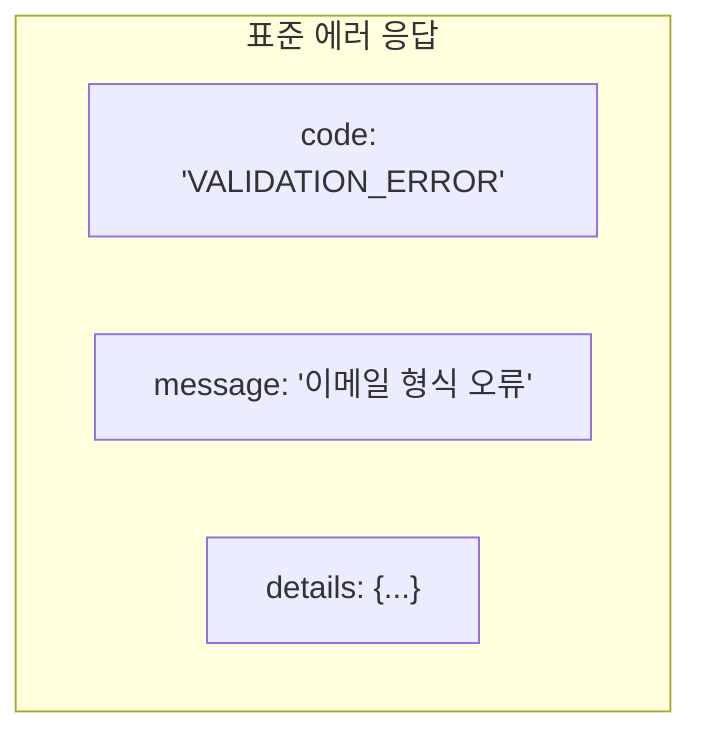
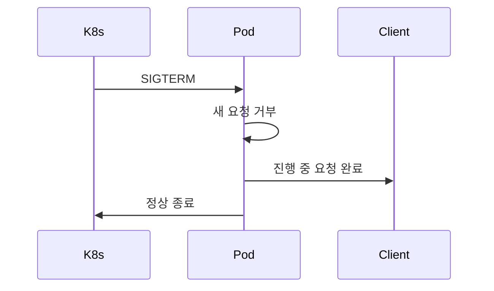

# Enterprise Go 시리즈 #2: 견고한 HTTP 서버 구축

> **다른 생태계 경험자를 위한 매핑**
>
> - Java: Spring MVC Filter, HandlerInterceptor
> - Node.js: Express Middleware
> - Python: Django Middleware, FastAPI Middleware

## 미들웨어 체인: 순서가 중요하다

### 실행 흐름

### 권장 순서와 이유

| 순서 | 미들웨어 | Spring 대응 | 위치 이유 |
|------|---------|------------|----------|
| 1 | Recover | @ControllerAdvice | 패닉 → 500 변환 |
| 2 | Request ID | MDC 설정 | 로깅 전 ID 필요 |
| 3 | Logger | AccessLogFilter | 인증 실패도 로깅 |
| 4 | CORS | CorsFilter | preflight 처리 |
| 5 | Auth | SecurityFilter | 핸들러 보호 |

### 경험담

빠른 프로토타이핑을 위해 미들웨어 순서를 고려하지 않았으나, 정식 채택 후:

> Recover를 Auth 뒤에 두었더니, 인증 로직 패닉 시 응답 없이 연결 끊김

> Logger를 RequestID 앞에 두었더니, 로그에서 요청 추적 불가

---

## 에러 핸들링

### 일관된 응답 구조

### 도메인 에러 → HTTP 매핑

| Domain Error | HTTP Status | Spring 대응 |
|--------------|-------------|------------|
| ErrNotFound | 404 | @ResponseStatus |
| ErrValidation | 400 | MethodArgumentNotValidException |
| ErrUnauthorized | 401 | AuthenticationException |
| 기타 | 500 | @ExceptionHandler |

---

## Graceful Shutdown

### 왜 필요한가?

### Spring vs Go

| 측면 | Spring Boot | Go Echo |
|------|-------------|---------|
| 설정 | server.shutdown=graceful | 직접 구현 |
| 타임아웃 | spring.lifecycle.timeout-per-shutdown-phase | WithTimeout |
| 시그널 | 자동 처리 | signal.NotifyContext |

---

## 정리

| 요소 | 핵심 |
|------|------|
| 미들웨어 순서 | Recover → RequestID → Logger → Auth |
| 에러 핸들링 | 도메인 에러 → HTTP 상태 매핑 |
| Graceful Shutdown | SIGTERM 처리, 타임아웃 설정 |

---

## 다음 편 예고

**3편: Context로 요청 생명주기 관리**에서는 Java의 ThreadLocal, Node.js의 AsyncLocalStorage에 대응하는 Context 패턴을 다룹니다.

---

## 참고 자료

- [Echo 공식 문서](https://echo.labstack.com/)
- [Graceful Shutdown](https://pkg.go.dev/net/http#Server.Shutdown)
