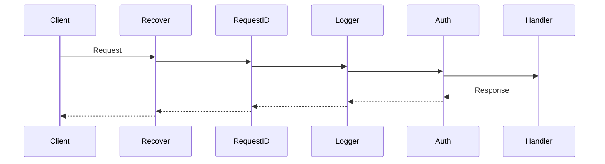
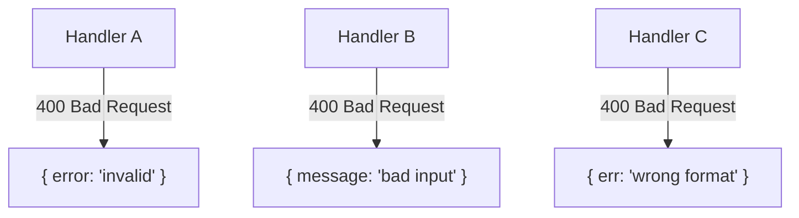
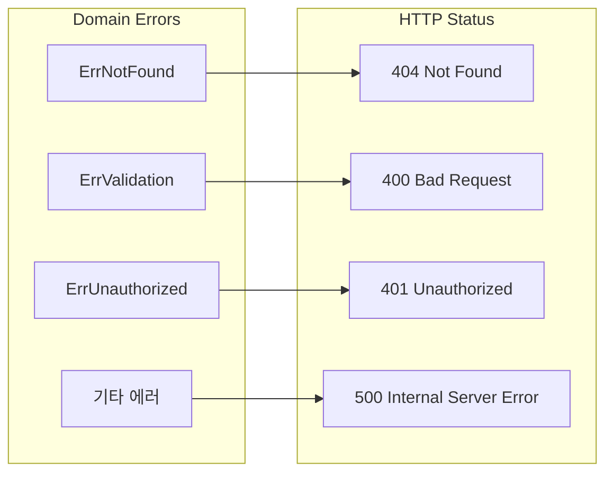
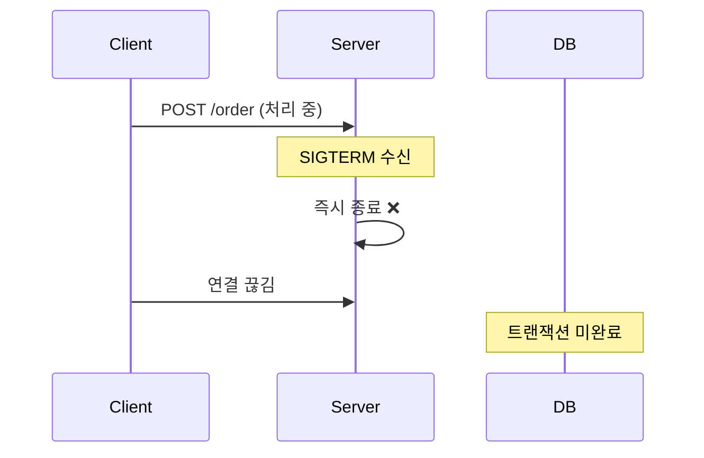
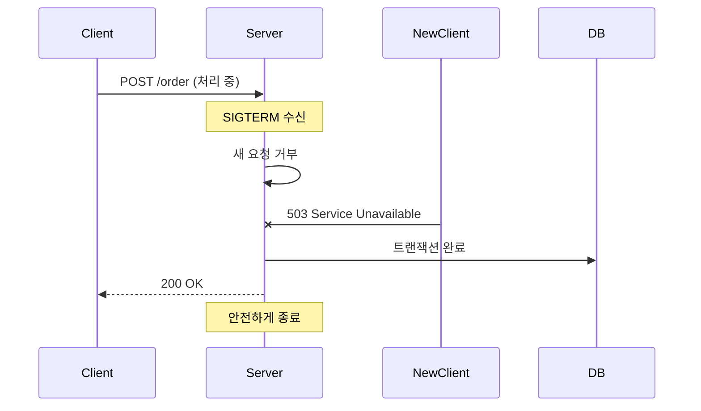
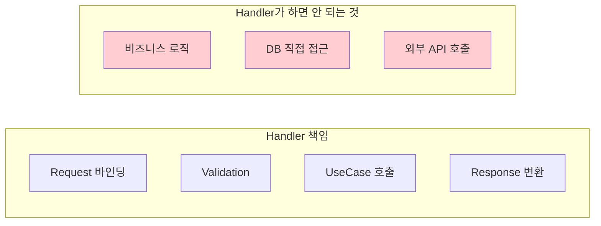
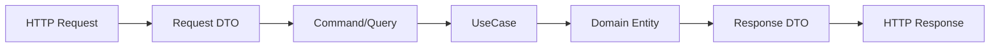
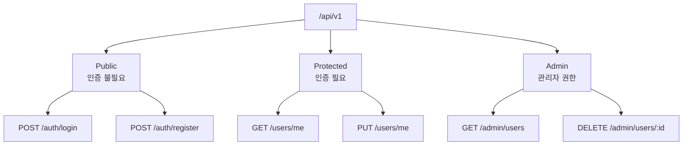

# Enterprise Go 시리즈 #2: 견고한 HTTP 서버 구축

## 개요

[1편](/blog/backend/go/enterprise-go-1-project-structure)에서 설계한 Hexagonal Architecture의 **HTTP Port**를 구현합니다.

### 핵심 질문

- Middleware는 어떤 순서로 쌓아야 하나?
- 에러 응답을 일관되게 만들려면?
- 서버를 안전하게 종료하려면?

---

## 미들웨어 체인 설계

### 실행 순서의 중요성



### 권장 순서와 이유

| 순서 | 미들웨어 | 역할 | 왜 이 위치? |
|------|---------|------|------------|
| 1 | **Recover** | 패닉 복구 | 모든 패닉을 잡아야 함 |
| 2 | **Request ID** | 추적 ID 생성 | 로깅 전에 ID 필요 |
| 3 | **Logger** | 요청 로깅 | 인증 실패도 로깅 필요 |
| 4 | **CORS** | 교차 출처 허용 | 인증 전에 preflight 처리 |
| 5 | **Auth** | 인증 검증 | 핸들러 보호 |

### 경험담: 순서가 잘못되면?

> Recover를 Auth 뒤에 두었더니, 인증 로직에서 패닉 발생 시 500 응답 대신 연결이 끊겼습니다.

> Logger를 RequestID 앞에 두었더니, 로그에 Request ID가 누락되어 추적이 불가능했습니다.

---

## 에러 핸들링 전략

### 문제: 일관성 없는 에러 응답



클라이언트가 에러 처리하기 어려움!

### 해결: 표준 에러 응답 구조

```mermaid
graph TD
    subgraph 표준 에러 응답
        CODE[code: 'VALIDATION_ERROR']
        MSG[message: '이메일 형식이 올바르지 않습니다']
        DETAILS[details: ['email' 필드 오류]]
    end
```

### 도메인 에러 → HTTP 에러 매핑



### 설계 원칙

1. **도메인 레이어는 HTTP를 모름** - 순수 Go error 반환
2. **Handler가 변환** - 도메인 에러 → HTTP 응답
3. **500 에러만 로깅** - 4xx는 클라이언트 잘못

---

## Graceful Shutdown

### 왜 필요한가?



### 올바른 Shutdown 흐름



### 핵심 원칙

| 단계 | 설명 |
|------|------|
| 1. 신호 수신 | SIGTERM, SIGINT 감지 |
| 2. 새 요청 거부 | Health check → unhealthy |
| 3. 진행 중 요청 완료 | 타임아웃 설정 (30초 권장) |
| 4. 리소스 정리 | DB 연결, 파일 핸들 닫기 |
| 5. 종료 | exit 0 |

---

## Handler 설계 패턴

### 역할 분리



### DTO 변환 흐름



---

## 라우트 그룹 설계

### 인증 레벨별 그룹



### 원칙

- **최소 권한**: 기본은 인증 필요, Public은 명시적으로
- **버전 관리**: `/api/v1`, `/api/v2` 병행 가능
- **일관된 네이밍**: REST 규칙 준수

---

## 정리: 체크리스트

| 항목 | 확인 |
|------|------|
| Recover가 가장 바깥에 있는가? | ☐ |
| Request ID가 로깅 전에 생성되는가? | ☐ |
| 에러 응답 포맷이 통일되어 있는가? | ☐ |
| Graceful Shutdown이 구현되어 있는가? | ☐ |
| Handler에 비즈니스 로직이 없는가? | ☐ |

---

## 다음 편 예고

**3편: Context로 요청 생명주기 관리**에서는:

- Context 전파 패턴
- 타임아웃 설정 전략
- Request ID / Trace ID 관리

를 다룹니다.

---

## 참고 자료

- [Echo 공식 문서](https://echo.labstack.com/)
- [Graceful Shutdown in Go](https://pkg.go.dev/net/http#Server.Shutdown)
