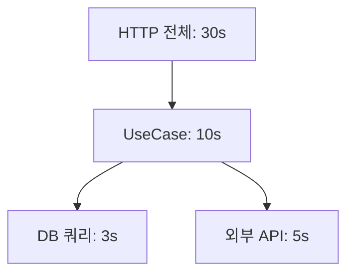
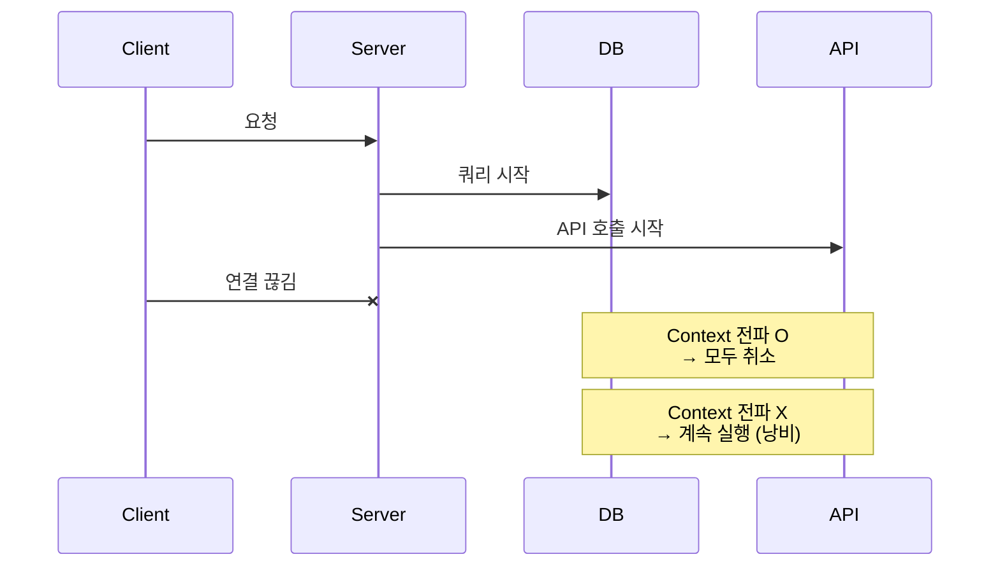
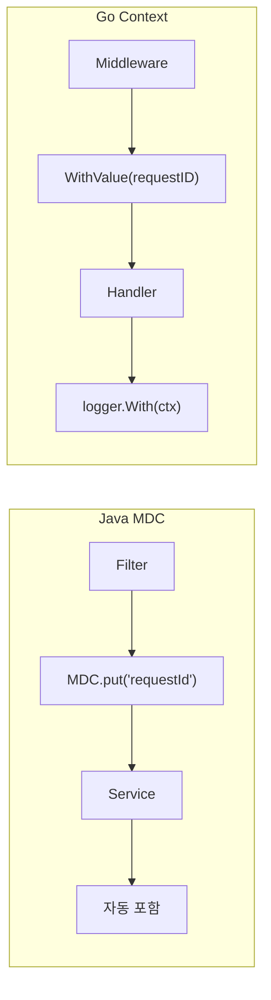
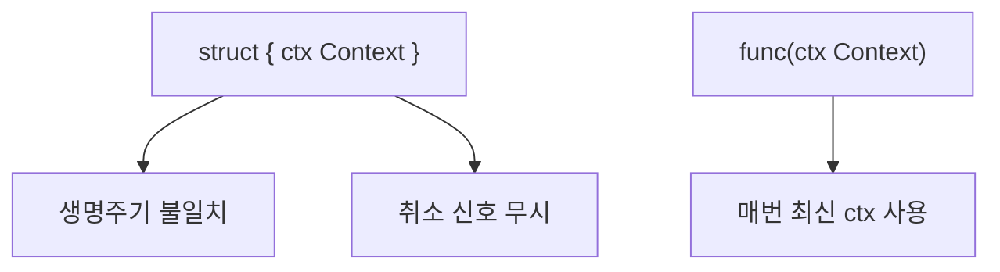

# Enterprise Go 시리즈 #3: Context로 요청 생명주기 관리

> **다른 생태계 경험자를 위한 매핑**
>
> - Java: ThreadLocal, MDC
> - Node.js: AsyncLocalStorage
> - Python: contextvars

## Context의 역할

### 다른 언어와의 비교

| 기능 | Java | Node.js | Go |
|------|------|---------|-----|
| 요청 범위 값 | ThreadLocal | AsyncLocalStorage | context.WithValue |
| 타임아웃 | ExecutorService timeout | AbortController | context.WithTimeout |
| 취소 전파 | Future.cancel() | AbortSignal | context.WithCancel |

### 핵심 차이점

Go Context는 세 가지 역할을 **하나의 인터페이스**에서 처리:

1. 값 전파 (Request ID, Trace ID)
2. 타임아웃
3. 취소 신호 전파

---

## 타임아웃 설계

### 계층별 전략

**원칙**: 하위 타임아웃 합 < 상위 타임아웃

### Spring vs Go

| Spring | Go |
|--------|-----|
| @Transactional(timeout=3) | WithTimeout(ctx, 3*time.Second) |
| RestTemplate.setConnectTimeout | http.Client Timeout |

---

## 취소 전파

### 왜 중요한가?

### Java 대응

| Java | Go |
|------|-----|
| Future.cancel(true) | cancel() 호출 |
| InterruptedException | ctx.Done() 채널 |

---

## Request ID 전파

### MDC vs Context

---

## 안티패턴

### Context를 구조체에 저장

### Spring 개발자 주의점

| Spring 습관 | Go 규칙 |
|------------|---------|
| @Autowired로 주입 | **파라미터로 전달** |
| ThreadLocal에 저장 | **저장하지 않음** |
| 선택적 사용 | **첫 번째 파라미터 (필수)** |

---

## 정리

| 개념 | Java/Spring | Go |
|------|-------------|-----|
| 요청 범위 값 | ThreadLocal/MDC | WithValue |
| 타임아웃 | @Transactional timeout | WithTimeout |
| 취소 | Future.cancel | cancel() |
| 사용 패턴 | 암묵적 (ThreadLocal) | **명시적 (파라미터)** |

---

## 다음 편 예고

**4편: Goroutine과 Channel 실전 활용**에서는 Java의 ExecutorService, Node.js의 Worker Threads에 대응하는 Go 동시성 패턴을 다룹니다.

---

## 참고 자료

- [Go Blog: Context](https://blog.golang.org/context)
- [context Package](https://pkg.go.dev/context)
