# Enterprise Go 시리즈 #3: Context로 요청 생명주기 관리

## 개요

Go의 `context.Context`는 단순한 값 전달이 아닌, **요청의 생명주기를 관리**하는 핵심 메커니즘입니다.

### 핵심 질문

- 사용자가 요청을 취소하면 DB 쿼리도 중단되나?
- 외부 API 호출에 타임아웃이 설정되어 있나?
- 로그에서 요청을 어떻게 추적하나?

---

## Context의 역할

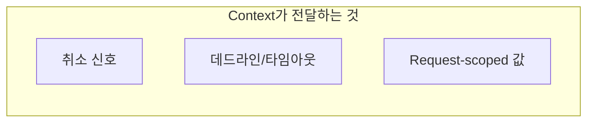

### 실전에서의 의미

| 역할 | 없으면 생기는 문제 |
|------|-------------------|
| **취소** | 사용자가 떠나도 쿼리 계속 실행 |
| **타임아웃** | 외부 API 장애 시 무한 대기 |
| **값 전파** | 로그에서 요청 추적 불가 |

---

## Context 전파 흐름

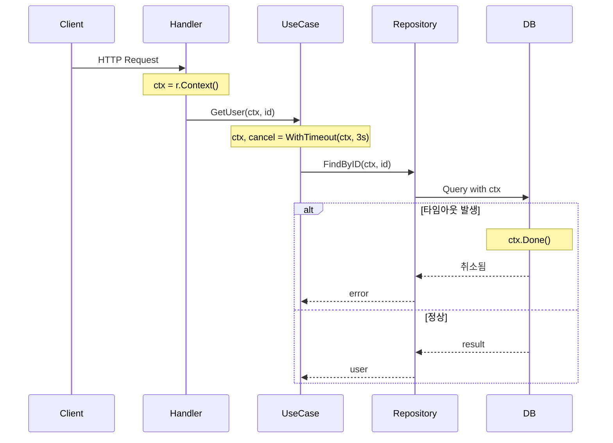

### 핵심 원칙

1. **Context는 첫 번째 파라미터**
2. **Context는 저장하지 않음** (구조체 필드 X)
3. **cancel()은 반드시 호출** (defer)

---

## 타임아웃 설계

### 계층별 타임아웃 전략

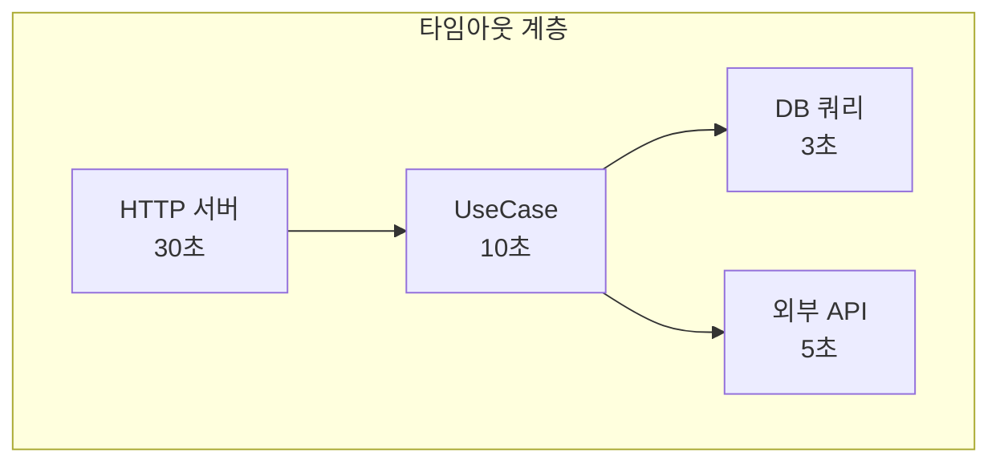

### 경험담: 타임아웃 없으면?

> 결제 API가 응답하지 않아 Goroutine이 쌓이다가 OOM으로 서버 다운

> DB 커넥션 풀이 고갈되어 전체 서비스 마비

### 설계 원칙

| 계층 | 타임아웃 | 이유 |
|------|---------|------|
| HTTP 전체 | 30초 | 사용자 대기 한계 |
| UseCase | 10초 | 비즈니스 로직 합리적 시간 |
| DB 쿼리 | 3초 | 쿼리가 3초 이상이면 문제 |
| 외부 API | 5초 | 외부 장애 격리 |

**규칙**: 하위 계층 타임아웃 합 < 상위 계층 타임아웃

---

## 취소 전파

### 왜 중요한가?

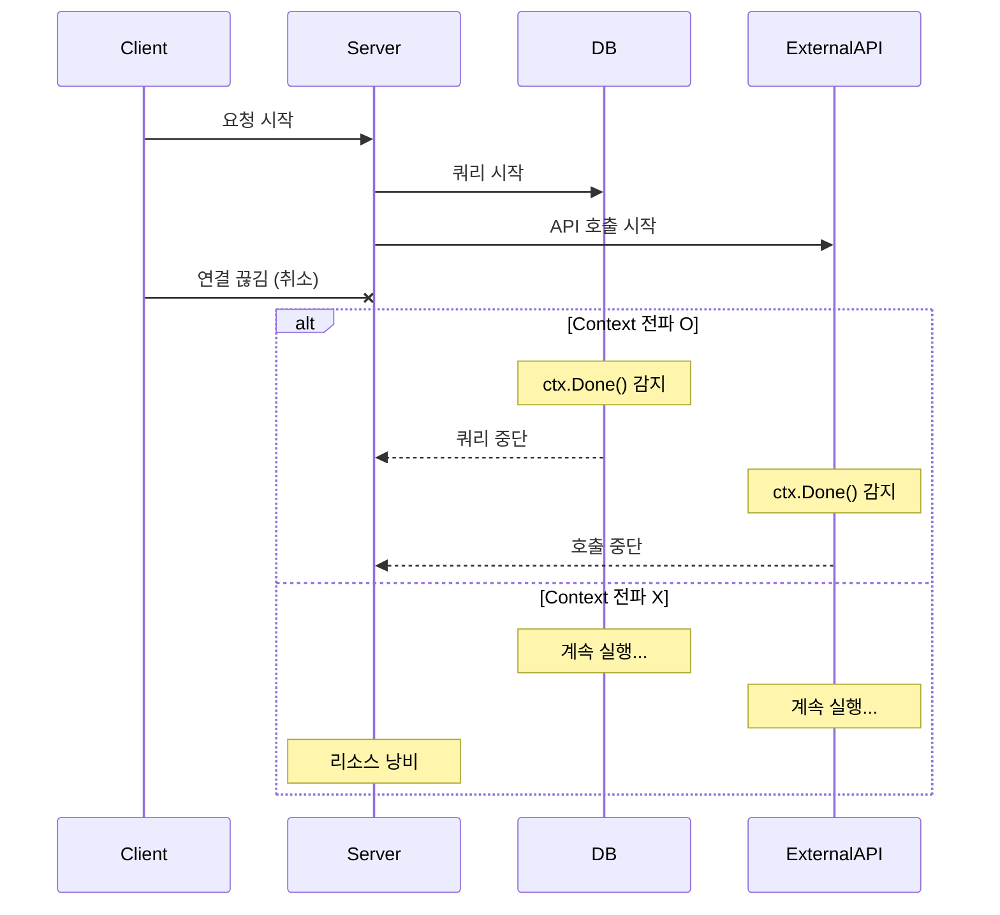

---

## Request ID / Trace ID

### 왜 필요한가?

분산 시스템에서 하나의 요청이 여러 서비스를 거칠 때:

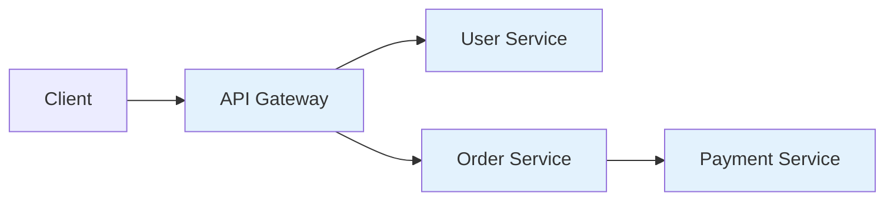

모든 로그에 **동일한 Trace ID**가 있어야 추적 가능!

### 전파 패턴

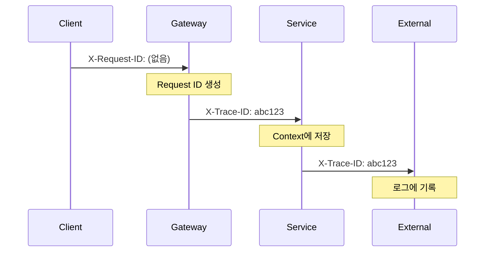

### 실전 팁

- **Request ID**: 요청마다 새로 생성
- **Trace ID**: 외부에서 온 것 우선 사용
- **Span ID**: OpenTelemetry에서 자동 관리

---

## WithValue 사용 가이드

### 적합한 용도

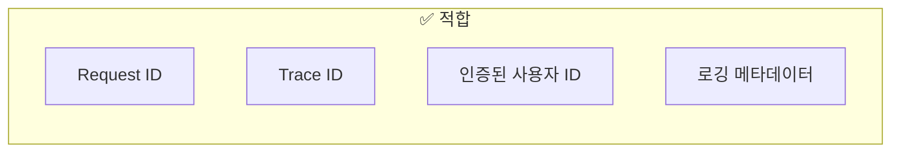

### 부적합한 용도

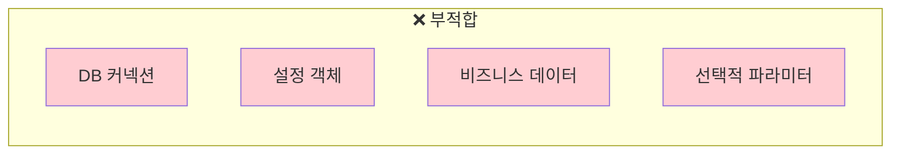

### 경험담

> Context에 user 객체 전체를 넣었다가, 어느 레이어에서 수정하면 다른 곳에도 영향이 가는 버그 발생

**원칙**: WithValue는 **불변(immutable)** 값만

---

## 안티패턴

### 1. Context를 구조체에 저장

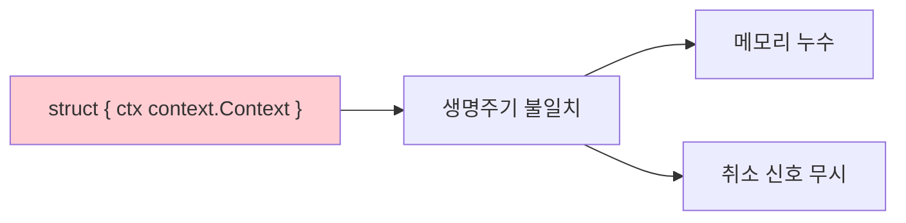

### 2. nil Context 전달

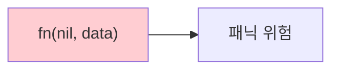

**대안**: `context.Background()` 또는 `context.TODO()`

### 3. cancel 누락

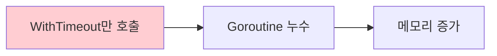

**필수**: `defer cancel()`

---

## 정리: 체크리스트

| 항목 | 확인 |
|------|------|
| Context가 첫 번째 파라미터인가? | ☐ |
| cancel()을 defer로 호출하는가? | ☐ |
| DB/HTTP 클라이언트에 Context 전달하는가? | ☐ |
| WithValue에 불변 값만 저장하는가? | ☐ |
| 타임아웃이 계층별로 설정되어 있는가? | ☐ |

---

## 다음 편 예고

**4편: Goroutine과 Channel 실전 활용**에서는:

- Fearless Concurrency 패턴
- errgroup으로 Goroutine 관리
- Context와 연동한 취소 전파

를 다룹니다.

---

## 참고 자료

- [Go Blog: Context](https://blog.golang.org/context)
- [Go Context Package](https://pkg.go.dev/context)
