# Enterprise Go 시리즈 #4: Goroutine과 Channel 실전 활용

## 개요

Go의 동시성 모델은 **CSP(Communicating Sequential Processes)** 에 기반합니다.

> **"메모리를 공유하여 통신하지 말고, 통신하여 메모리를 공유하라."**

### 핵심 질문

- Goroutine을 무한정 생성해도 되나?
- 에러가 발생하면 나머지 작업은 어떻게 되나?
- Goroutine 누수를 어떻게 방지하나?

---

## Goroutine의 실체

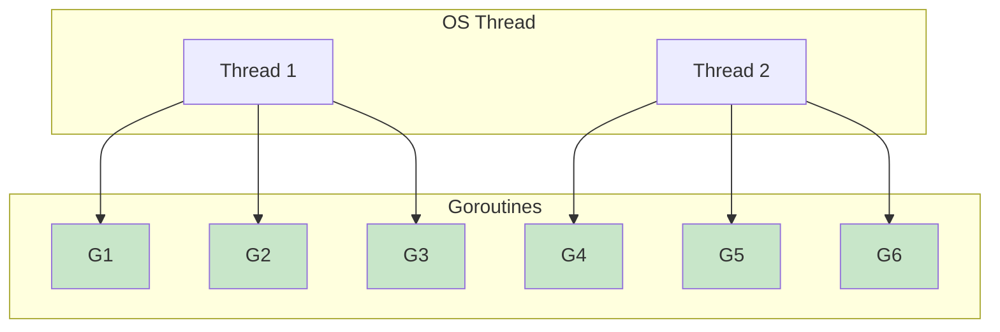

| 특성 | OS Thread | Goroutine |
|------|-----------|-----------|
| 스택 크기 | ~1MB (고정) | ~2KB (가변) |
| 생성 비용 | 높음 | 낮음 |
| 스케줄링 | OS | Go 런타임 |
| 수 | 수십~수백 | 수십만 가능 |

---

## 위험: 무제한 Goroutine

### 문제 상황

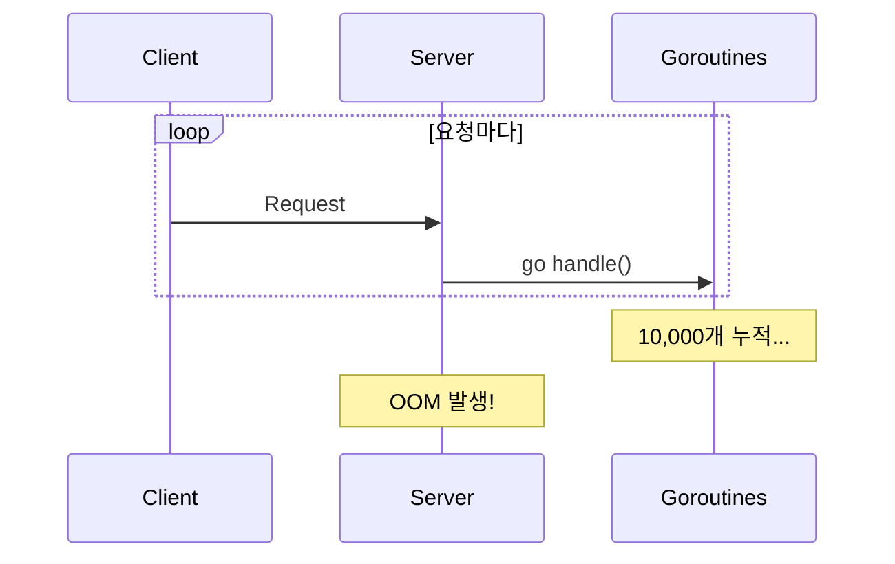

### 경험담

> 이미지 처리 서버에서 요청마다 Goroutine을 생성했더니, 트래픽 급증 시 OOM으로 다운

### 해결: Worker Pool

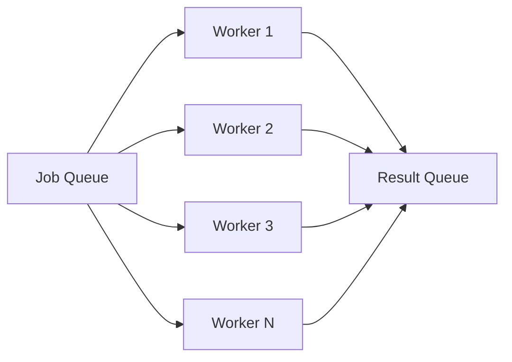

**원칙**: Goroutine 수는 **제한**해야 함

---

## Channel 설계

### Buffered vs Unbuffered

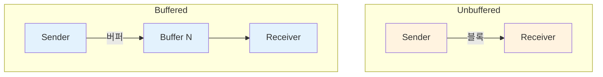

| 타입 | 사용 시점 |
|------|----------|
| **Unbuffered** | 동기화가 필요할 때, 핸드쉐이크 |
| **Buffered** | 비동기 처리, 백프레셔 |

### 닫기 원칙

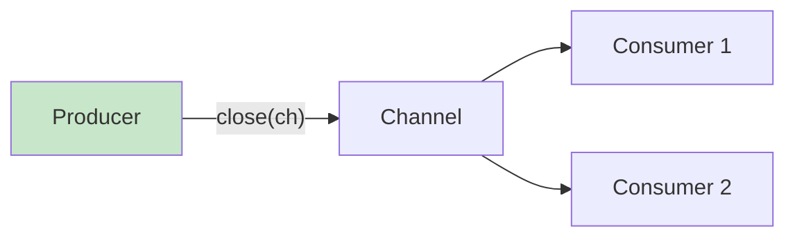

**규칙**: Channel을 닫는 것은 **Producer의 책임**

---

## errgroup: 핵심 도구

### 문제 상황

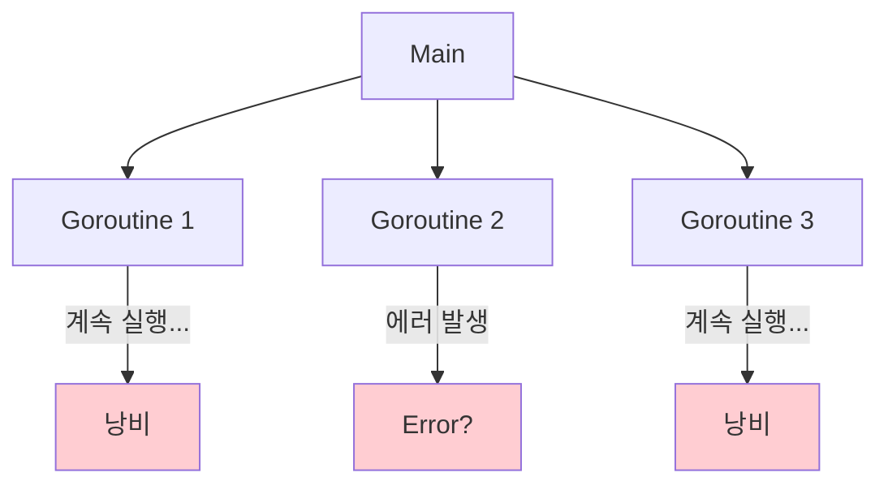

### errgroup 해결

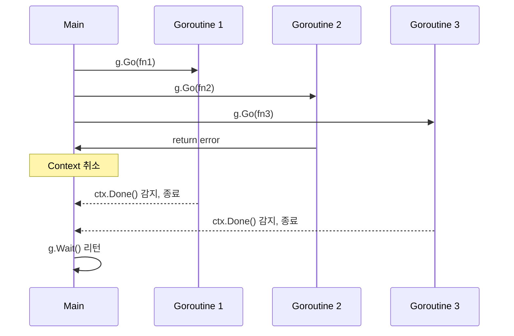

### 핵심 기능

| 기능 | 설명 |
|------|------|
| **에러 전파** | 첫 에러 발생 시 Wait()에서 반환 |
| **Context 취소** | 에러 시 모든 Goroutine에 취소 신호 |
| **SetLimit** | 동시 실행 Goroutine 수 제한 |

---

## Fan-out / Fan-in

### 패턴

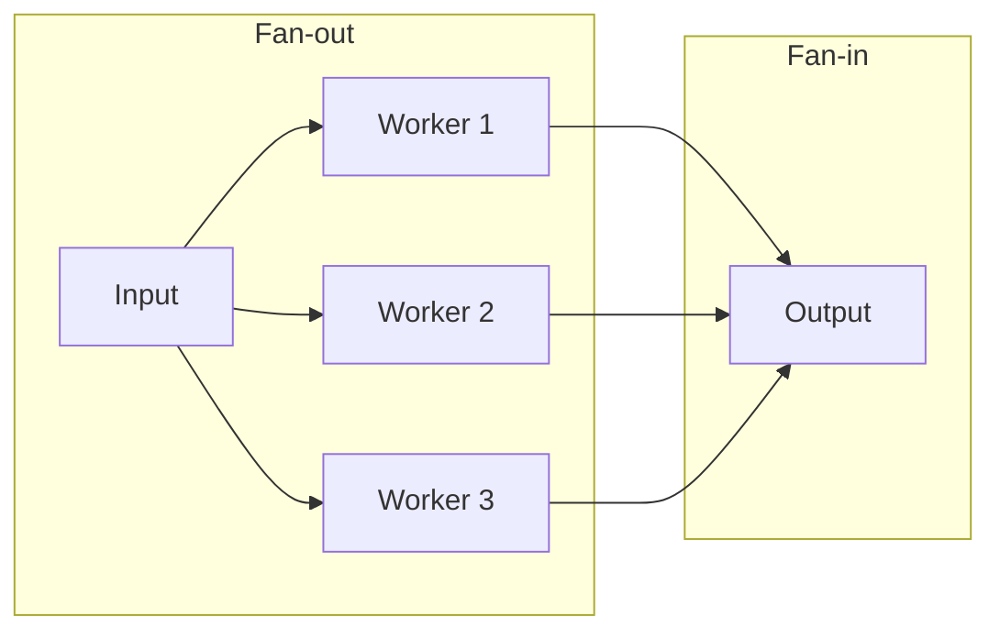

### 사용 시점

| 패턴 | 사용 시점 |
|------|----------|
| **Fan-out** | CPU 집약적 작업 병렬화 |
| **Fan-in** | 여러 소스의 결과 합치기 |
| **Pipeline** | 단계별 처리 (transform → filter → aggregate) |

---

## Mutex vs Channel

### 선택 기준

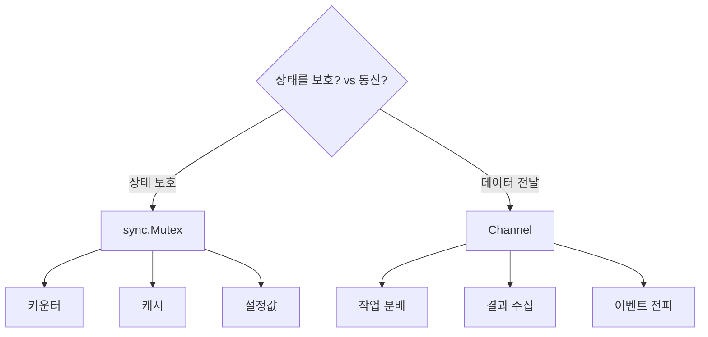

---

## Goroutine 누수 방지

### 누수 패턴

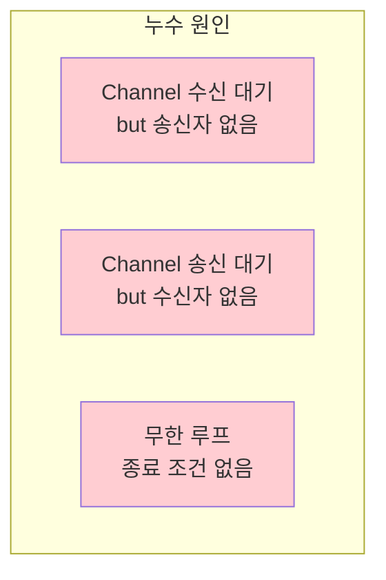

### 방지 패턴

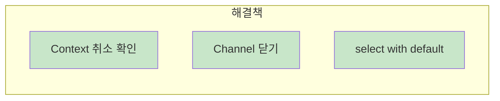

---

## Race Detector

### 사용법

```bash
go test -race ./...
go build -race ./cmd/myapp
```

### 발견되는 문제

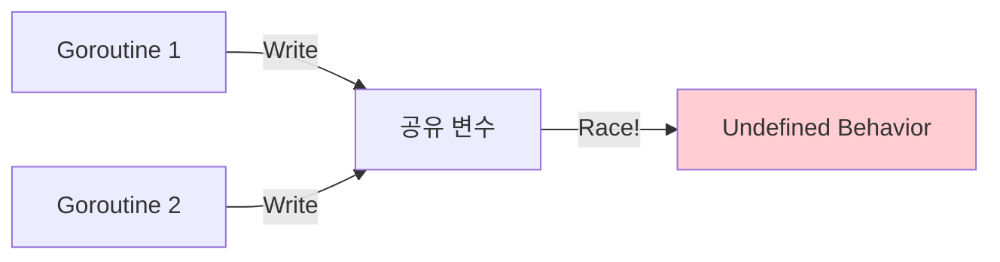

**원칙**: CI에서 `-race` 필수!

---

## 정리: 체크리스트

| 항목 | 확인 |
|------|------|
| Goroutine 수가 제한되어 있는가? | ☐ |
| errgroup으로 에러 전파하는가? | ☐ |
| Context 취소를 확인하는가? | ☐ |
| Channel 닫기 책임이 명확한가? | ☐ |
| Race Detector로 테스트하는가? | ☐ |

---

## 다음 편 예고

**5편: 데이터베이스 연동 패턴**에서는:

- 트랜잭션 관리 전략
- sessionCtx 패턴
- Connection Pool 튜닝

을 다룹니다.

---

## 참고 자료

- [Go Concurrency Patterns](https://talks.golang.org/2012/concurrency.slide)
- [errgroup Package](https://pkg.go.dev/golang.org/x/sync/errgroup)
