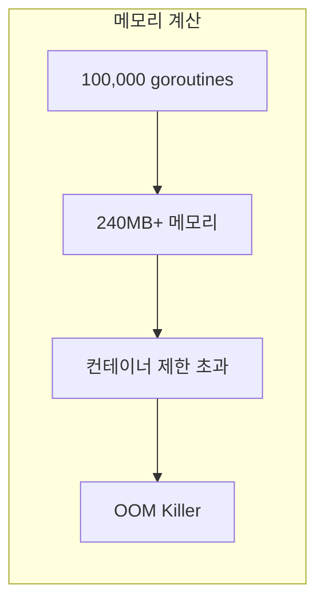
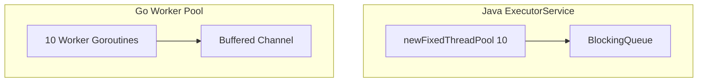
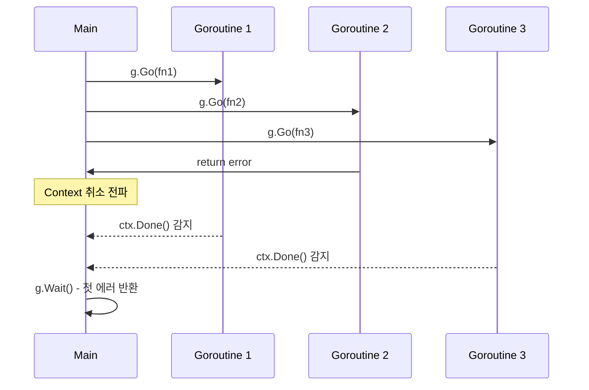
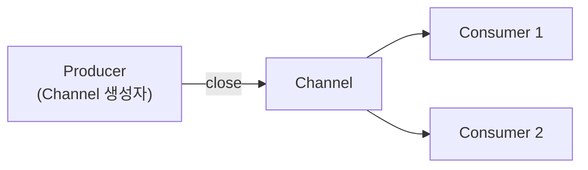
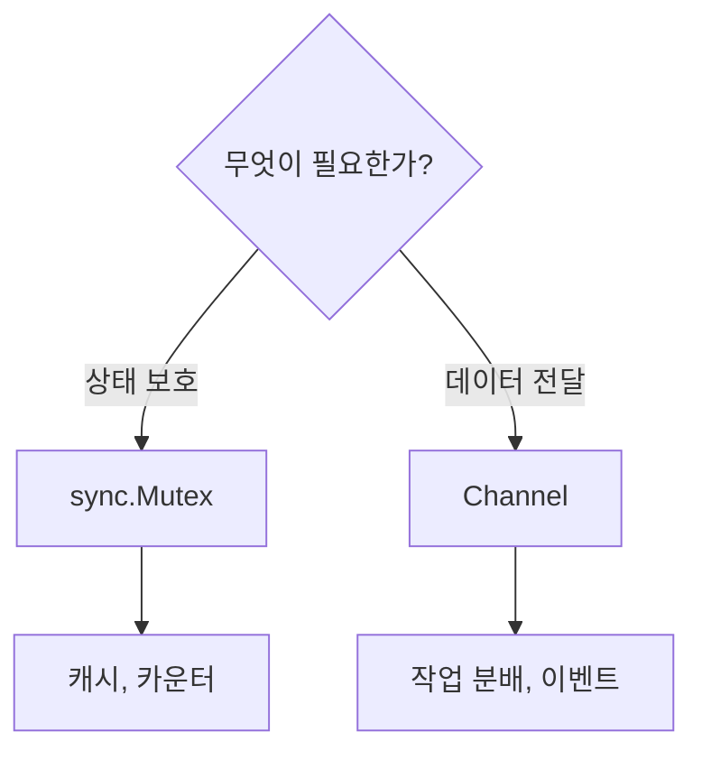

# Enterprise Go 시리즈 #4: Goroutine과 Channel 실전 활용

> **다른 언어 경험자를 위한 매핑**
>
> - Java: `ExecutorService`, `CompletableFuture`
> - Node.js: Worker Threads, `Promise.all`
> - Rust: `tokio::spawn`, `mpsc`

## Goroutine의 실체

### Java Thread vs Go Goroutine

| 특성 | Java Thread | Go Goroutine |
|------|------------|--------------|
| 초기 스택 | ~1MB (OS 할당) | **~2KB** (Go 런타임) |
| 최대 스택 | 고정 | **동적 확장** (최대 1GB) |
| 스케줄링 | OS 커널 | Go 런타임 (M:N) |
| 생성 비용 | 높음 | 낮음 |
| 실용적 상한 | 수천 개 | **수십만 개** |

### 왜 제한이 필요한가?

Goroutine이 가볍다고 해서 무제한은 아닙니다.

**실증적 근거:**

- 초기 스택 2KB + 디스크립터 ~400바이트 ≈ **약 2.4KB / goroutine**
- 100,000개 goroutine = **최소 240MB** 메모리
- 컨테이너 메모리 제한(512MB~2GB)에서 OOM 위험



**실제 OOM 시나리오:**

1. 요청마다 goroutine 생성
2. 외부 API 응답 지연으로 goroutine 대기
3. 대기 중인 goroutine 누적
4. 컨테이너 메모리 제한 도달 → 강제 종료

---

## Java 개발자를 위한 패턴 매핑

### ExecutorService → Worker Pool



| Java | Go |
|------|-----|
| `Executors.newFixedThreadPool(10)` | Worker Pool 패턴 |
| `executor.submit(task)` | `jobs <- task` |
| `Future.get()` | `<-results` |

### CompletableFuture.allOf → errgroup



**Java와의 차이점:**

- `CompletableFuture.allOf`는 모든 완료를 기다림
- `errgroup`은 첫 에러 시 나머지 **취소 가능** (Context 연동)

---

## Channel 설계 원칙

### Buffered vs Unbuffered

| 타입 | Java 대응 | 사용 시점 |
|------|----------|----------|
| Unbuffered | `SynchronousQueue` | 핸드셰이크, 동기 통신 |
| Buffered | `ArrayBlockingQueue` | 백프레셔, 비동기 |

### 닫기 규칙



**Java와의 차이:**

- Java: `BlockingQueue`는 보통 닫지 않음
- Go: **Producer가 close() 호출** (규칙)

---

## 동기화 도구 선택

### Mutex vs Channel



| 상황 | Java | Go |
|------|------|-----|
| 공유 상태 보호 | `synchronized` | `sync.Mutex` |
| 작업 분배 | `BlockingQueue` | Channel |
| 병렬 실행 후 수집 | `CompletableFuture` | errgroup |

---

## Race Detector

Go의 강력한 장점 중 하나입니다. Java의 ThreadSanitizer에 대응되나, **표준 도구로 내장**되어 있습니다:

```bash
go test -race ./...
go build -race ./cmd/myapp
```

**CI 필수 적용 권장** - 런타임 오버헤드가 있으나 테스트 환경에서는 문제없음

---

## 정리

| 개념 | Java 대응 | Go |
|------|----------|-----|
| 스레드 풀 | ExecutorService | Worker Pool + Channel |
| 병렬 실행 | CompletableFuture | errgroup |
| 공유 상태 | synchronized | sync.Mutex |
| 메시지 전달 | BlockingQueue | Channel |
| 경쟁 상태 탐지 | ThreadSanitizer | -race 플래그 |

---

## 다음 편 예고

**5편: 데이터베이스 연동 패턴**에서는 Spring의 `@Transactional`에 대응하는 Go의 트랜잭션 관리 전략을 다룹니다.

---

## 참고 자료

- [Go Concurrency Patterns](https://talks.golang.org/2012/concurrency.slide)
- [errgroup Package](https://pkg.go.dev/golang.org/x/sync/errgroup)
- [Goroutine Stack Size](https://go.dev/blog/go1.4)
