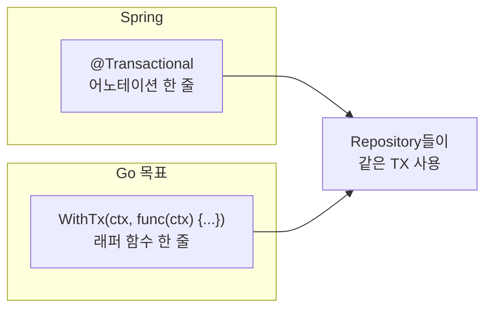
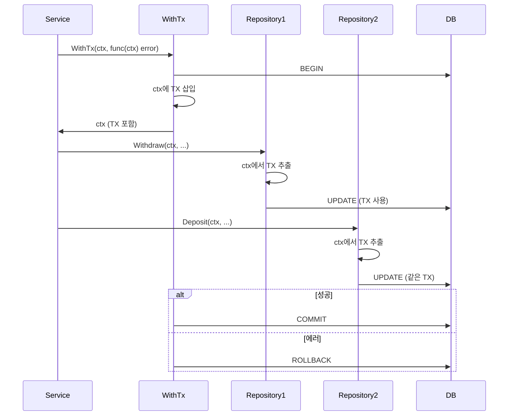

# Enterprise Go 시리즈 #5: 데이터베이스 연동 패턴

> **Spring 개발자를 위한 핵심 질문**
> `@Transactional` 어노테이션 하나로 메서드들을 하나의 트랜잭션으로 묶던 편리함, Go에서도 가능할까요?

## @Transactional의 본질

### Spring에서의 경험

```java
@Transactional
public void transfer(String from, String to, BigDecimal amount) {
    accountRepository.withdraw(from, amount);  // 같은 TX
    accountRepository.deposit(to, amount);     // 같은 TX
    logRepository.save(new TransferLog(...));  // 같은 TX
}
```

**핵심 편의성:**

- 어노테이션만 붙이면 끝
- 메서드 내 모든 Repository 호출이 **자동으로 같은 트랜잭션**
- 예외 발생 시 **자동 롤백**
- 개발자는 비즈니스 로직에만 집중

### Go의 현실

Go에는 AOP가 없으므로 `@Transactional`과 100% 동일한 경험은 불가능합니다. 하지만 **비슷한 수준의 편의성**을 달성할 수 있습니다.

---

## 목표: @Transactional과 유사한 경험

### 우리가 원하는 것



### 핵심 아이디어



---

## 구현 패턴

### 사용 코드 (UseCase)

Spring의 `@Transactional`과 유사하게, **래퍼 함수 한 줄**로 트랜잭션 경계를 정의합니다:

```go
func (u *TransferUseCase) Transfer(ctx context.Context, from, to string, amount int64) error {
    // WithTx 한 줄로 트랜잭션 시작 - @Transactional과 유사!
    return database.WithTx(ctx, u.db, func(ctx context.Context) error {
        // 이 안의 모든 Repository 호출은 같은 트랜잭션
        if err := u.accountRepo.Withdraw(ctx, from, amount); err != nil {
            return err  // 자동 롤백
        }
        if err := u.accountRepo.Deposit(ctx, to, amount); err != nil {
            return err  // 자동 롤백
        }
        return u.logRepo.Save(ctx, &TransferLog{...})
    })
    // 성공 시 자동 커밋, 실패 시 자동 롤백
}
```

### Repository는 트랜잭션을 모름

```go
func (r *AccountRepository) Withdraw(ctx context.Context, id string, amount int64) error {
    // ctx에서 TX가 있으면 사용, 없으면 일반 DB
    db := database.GetDB(ctx, r.db)
    return db.Model(&Account{}).Where("id = ?", id).
        Update("balance", gorm.Expr("balance - ?", amount)).Error
}
```

---

## Spring vs Go 비교

| 측면 | Spring @Transactional | Go WithTx |
|------|----------------------|-----------|
| 문법 | 어노테이션 | 래퍼 함수 |
| 명시성 | 암묵적 | 명시적 |
| 트랜잭션 전파 | 선언적 (REQUIRED 등) | Context 전달 |
| 롤백 조건 | 예외 타입 기반 | error 반환 |
| 학습 곡선 | AOP 이해 필요 | Context 이해 필요 |

### Go의 장점

- **명시적**: 트랜잭션 경계가 코드에 보임
- **테스트 용이**: Mock Context 주입 가능
- **디버깅 용이**: 스택 트레이스 명확

### Go의 단점

- **반복 코드**: 매번 WithTx 호출 필요
- **규율 필요**: GetDB 호출 누락 시 별도 TX 사용

---

## Connection Pool 설정

### 핵심 설정

| 설정 | 권장 | 이유 |
|------|------|------|
| MaxOpenConns | 25-50 | DB 동시 연결 제한 고려 |
| MaxIdleConns | 10-25 | Open의 40-50% |
| ConnMaxLifetime | 5분 | 방화벽/LB 타임아웃 고려 |

### Spring 대응

| Spring | Go |
|--------|-----|
| HikariCP maximumPoolSize | MaxOpenConns |
| minimumIdle | MaxIdleConns |
| maxLifetime | ConnMaxLifetime |

---

## 정리

| 요소 | 역할 |
|------|------|
| **WithTx** | @Transactional 대응, 트랜잭션 경계 |
| **GetDB** | Context에서 TX 추출 |
| **Repository** | TX를 모름, Context만 받음 |

**핵심 메시지**: Go에서도 `WithTx` 래퍼 하나로 Spring의 `@Transactional`과 유사한 편의성을 얻을 수 있습니다.

---

## 다음 편 예고

**6편: Resilient한 외부 통신**에서는 Resilience4j에 대응하는 Go의 Circuit Breaker, Retry 패턴을 다룹니다.

---

## 참고 자료

- [GORM 공식 문서](https://gorm.io/)
- [database/sql](https://golang.org/pkg/database/sql/)
