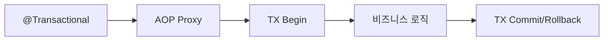
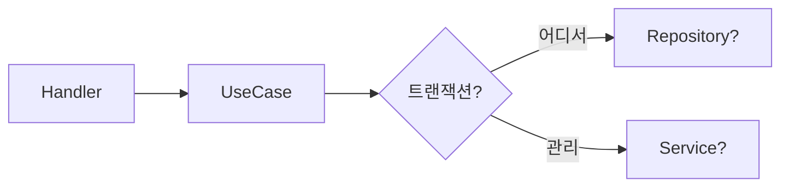
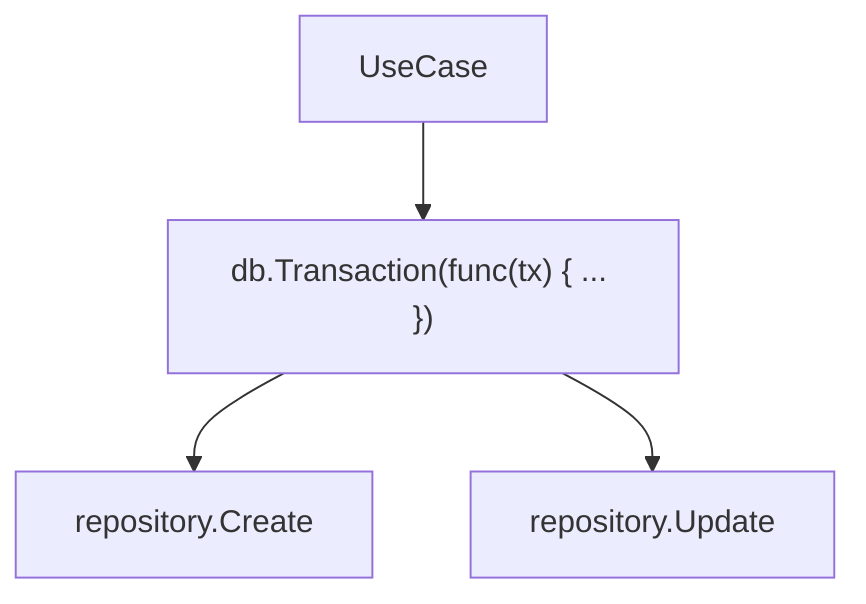
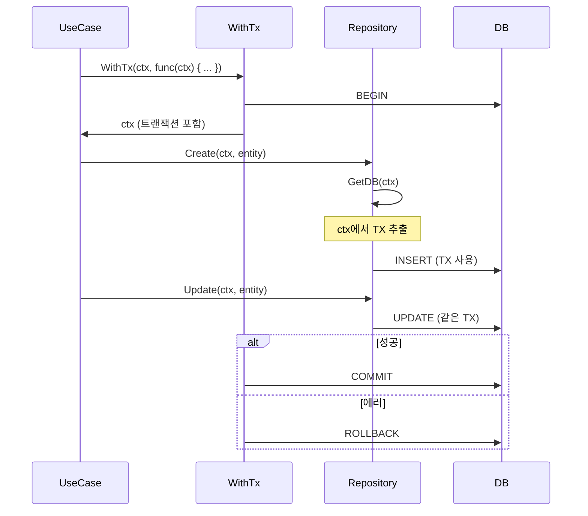
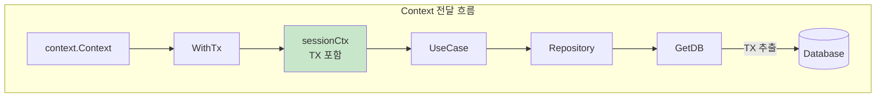
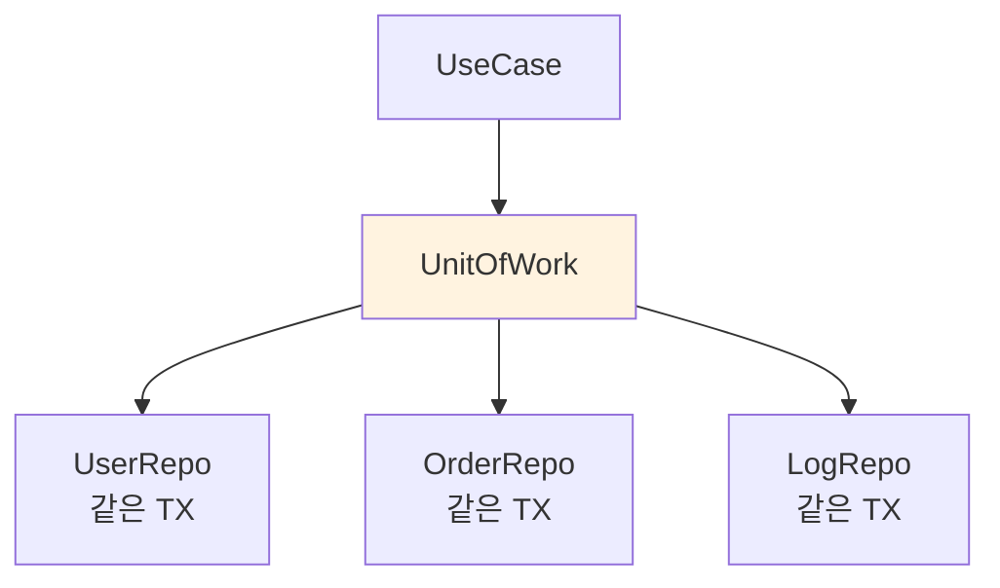
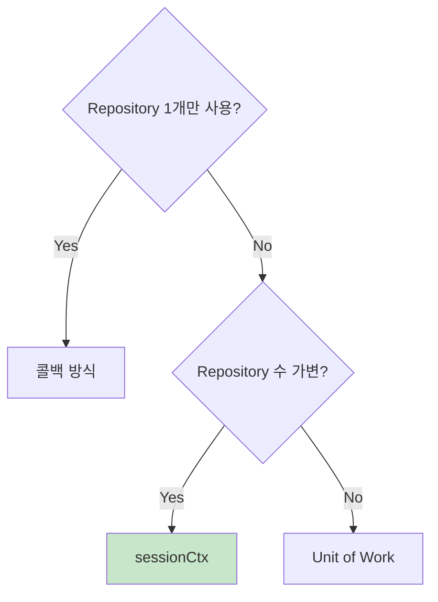
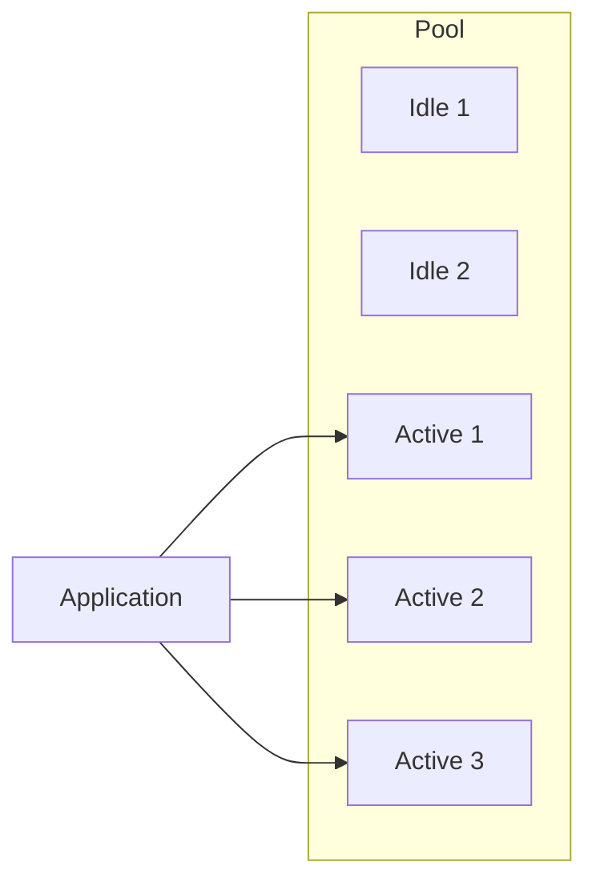
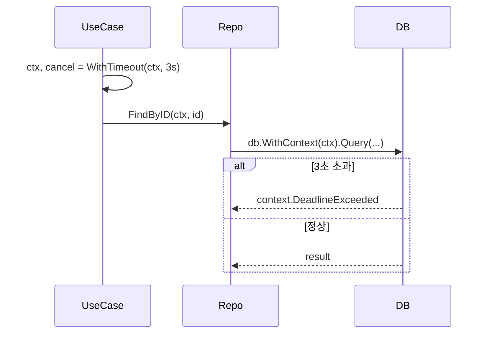

# Enterprise Go 시리즈 #5: 데이터베이스 연동 패턴

## 개요

Go에서 데이터베이스 연동의 핵심 과제는 **트랜잭션 관리**입니다. Java의 `@Transactional`처럼 선언적으로 관리할 수 없어 명시적인 설계가 필요합니다.

### 핵심 질문

- 여러 Repository가 같은 트랜잭션을 공유하려면?
- 비즈니스 로직이 DB 레이어에 침투하지 않으려면?
- Connection Pool은 어떻게 튜닝하나?

---

## Java vs Go: 트랜잭션 관리

### Java의 방식

장점: 선언적, 관심사 분리
단점: **Go에는 AOP가 없음**

### Go의 현실

**결정 필요**: 트랜잭션 경계를 어느 레이어에서 정할 것인가?

---

## 트랜잭션 패턴 비교

### 패턴 1: 콜백 방식

**문제**: 비즈니스 로직이 DB 레이어에 침투

---

### 패턴 2: sessionCtx (권장)

---

### sessionCtx 핵심 개념

### 설계 원칙

| 레이어 | 역할 |
|--------|------|
| **UseCase** | 트랜잭션 경계 결정 (WithTx 호출) |
| **Repository** | Context에서 DB/TX 추출, SQL 실행 |
| **sessionCtx** | 트랜잭션을 Context에 포장 |

---

### 패턴 3: Unit of Work

**사용 시점**: 여러 Repository가 명시적으로 같은 TX 공유

---

## 패턴 선택 가이드

---

## Connection Pool 설계

### 핵심 설정

| 설정 | 권장값 | 설명 |
|------|--------|------|
| MaxOpenConns | 25-50 | DB 동시 연결 제한 고려 |
| MaxIdleConns | 10-25 | Open의 40-50% |
| ConnMaxLifetime | 5분 | 방화벽 타임아웃 고려 |

### 경험담

> MaxIdleConns가 너무 높으면 유휴 연결이 리소스 낭비
> 너무 낮으면 연결 생성/해제 오버헤드 발생

---

## Context와 DB 연동

### 타임아웃 전파

**필수**: 모든 DB 호출에 `WithContext(ctx)` 사용

---

## 정리: 체크리스트

| 항목 | 확인 |
|------|------|
| 트랜잭션 경계가 UseCase에서 정해지는가? | ☐ |
| Repository는 트랜잭션을 모르는가? (Context만 받음) | ☐ |
| Connection Pool 설정이 적절한가? | ☐ |
| DB 쿼리에 Context가 전달되는가? | ☐ |

---

## 다음 편 예고

**6편: Resilient한 외부 통신**에서는:

- Retry 패턴
- Circuit Breaker
- Rate Limiting

을 다룹니다.

---

## 참고 자료

- [GORM 공식 문서](https://gorm.io/)
- [database/sql Connection Pool](https://golang.org/pkg/database/sql/)
