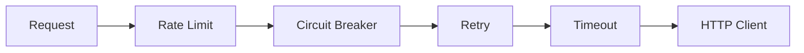
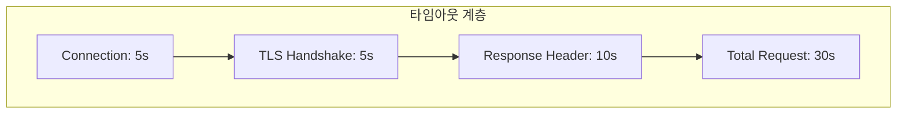
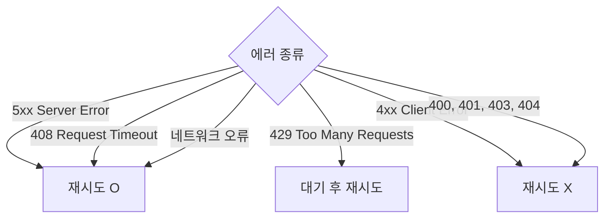
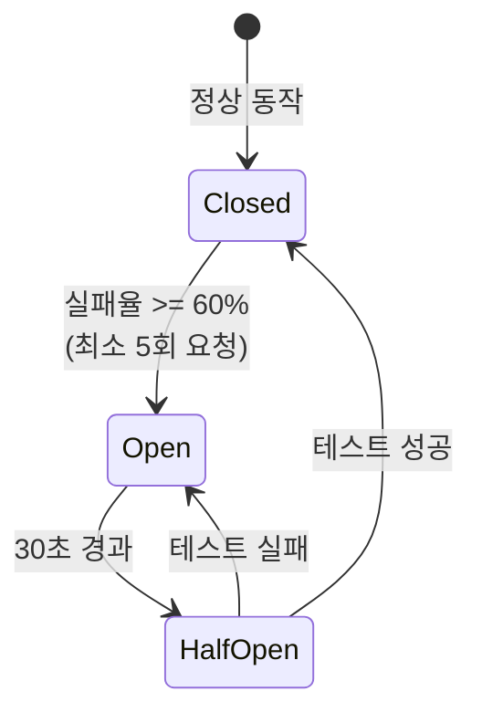
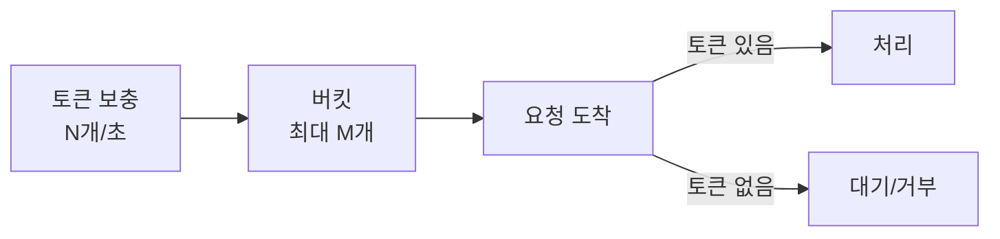

# Enterprise Go 시리즈 #6: Resilient한 외부 통신

> **다른 생태계 경험자를 위한 매핑**
>
> - Java: Resilience4j, Hystrix
> - .NET: Polly
> - Node.js: cockatiel, opossum

## 핵심 질문

마이크로서비스 환경에서:

- 외부 API가 느려지면 우리 서비스는 어떻게 되나?
- 재시도는 언제 해야 하고 언제 하면 안 되나?
- 장애 전파를 어떻게 막을 것인가?

---

## Resilience 패턴 조합

### 올바른 적용 순서

| 순서 | 패턴 | 목적 | 위치 이유 |
|------|------|------|----------|
| 1 | Rate Limit | 요청 속도 제한 | 가장 바깥에서 과부하 방지 |
| 2 | Circuit Breaker | 장애 서비스 격리 | 불필요한 재시도 차단 |
| 3 | Retry | 일시적 실패 복구 | 타임아웃 전에 재시도 결정 |
| 4 | Timeout | 무한 대기 방지 | 가장 안쪽에서 개별 요청 제어 |

---

## Timeout

### 다계층 타임아웃 설정

| 설정 | 권장값 | 대응 상황 |
|------|--------|----------|
| 연결 타임아웃 | 5초 | DNS 장애, 네트워크 단절 |
| TLS 핸드셰이크 | 5초 | 인증서 문제 |
| 응답 헤더 | 10초 | 서버 처리 지연 |
| 전체 요청 | 30초 | 대용량 응답 포함 |

---

## Retry

### 재시도 가능 조건

### Exponential Backoff with Jitter

**Jitter가 필요한 이유:**

- 동시에 실패한 클라이언트들이 동시에 재시도 → Thundering Herd
- 랜덤 지연으로 재시도 분산

---

## Circuit Breaker

### 상태 머신

### 상태별 동작

| 상태 | 요청 처리 | 메트릭 수집 |
|------|----------|------------|
| **Closed** | 정상 통과 | O |
| **Open** | 즉시 실패 (Fallback) | X |
| **Half-Open** | 제한된 수만 통과 | O |

### Resilience4j 대응

| Resilience4j | Go (sony/gobreaker) |
|--------------|---------------------|
| failureRateThreshold | ReadyToTrip 콜백 |
| waitDurationInOpenState | Timeout |
| permittedNumberOfCallsInHalfOpenState | MaxRequests |

---

## Rate Limiting

### Token Bucket 알고리즘

### 외부 API Rate Limit 대응

외부 API가 100 req/s 제한이라면:

- **우리 설정**: 80 req/s (여유분 20%)
- **이유**: 버스트 트래픽, 다른 클라이언트 고려

---

## 패턴 조합 전략

### 언제 어떤 패턴을?

| 상황 | 적용 패턴 |
|------|----------|
| 네트워크 일시 장애 | Retry + Exponential Backoff |
| 외부 서비스 장애 | Circuit Breaker |
| 외부 API 호출량 제한 | Rate Limiting |
| 모든 외부 호출 | Timeout (필수) |

### 빠른 프로토타이핑 → 정식 채택

빠른 개발을 위해 Timeout만 설정했으나, 프로덕션 배포 후 개선:

1. **1차**: Timeout만 적용 → 외부 장애 시 요청 누적
2. **2차**: Retry 추가 → 재시도 폭풍 발생
3. **3차**: Circuit Breaker 추가 → 장애 격리 성공
4. **최종**: Rate Limiting으로 안정성 확보

---

## Go 라이브러리 선택

| 패턴 | 권장 라이브러리 |
|------|---------------|
| Circuit Breaker | sony/gobreaker |
| Retry | 직접 구현 또는 avast/retry-go |
| Rate Limiting | golang.org/x/time/rate |
| 통합 | failsafe-go |

---

## 정리

| 패턴 | 목적 | 적용 위치 |
|------|------|----------|
| **Timeout** | 무한 대기 방지 | 필수, 모든 외부 호출 |
| **Retry** | 일시적 실패 복구 | 5xx, 네트워크 오류만 |
| **Circuit Breaker** | 장애 전파 차단 | 외부 의존성 호출 |
| **Rate Limiting** | 과부하 방지 | API 호출량 제한 시 |

---

## 다음 편 예고

**7편: 테스트 전략과 실전**에서는 JUnit, Jest에 대응하는 Go의 테스트 생태계를 다룹니다.

---

## 참고 자료

- [sony/gobreaker](https://github.com/sony/gobreaker)
- [failsafe-go](https://failsafe-go.dev/)
- [golang.org/x/time/rate](https://pkg.go.dev/golang.org/x/time/rate)
