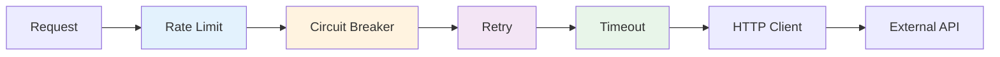
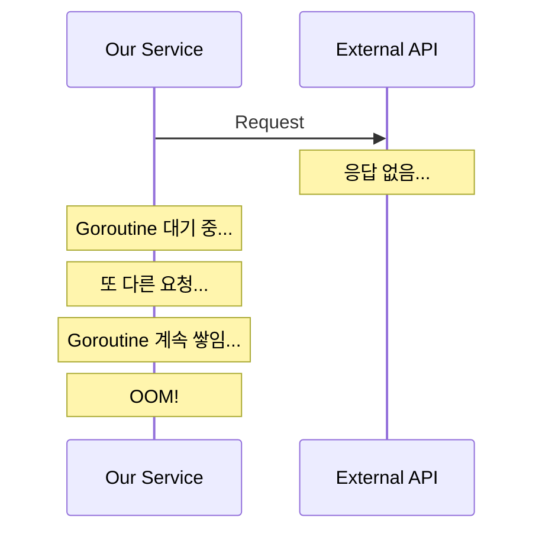
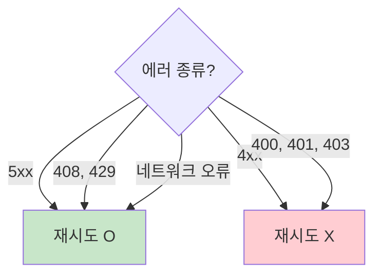
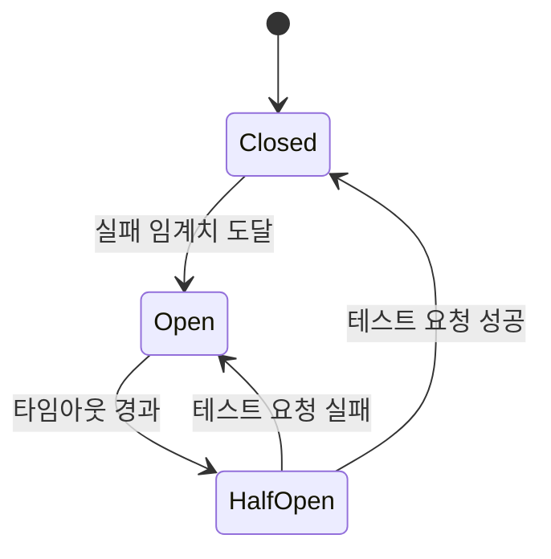
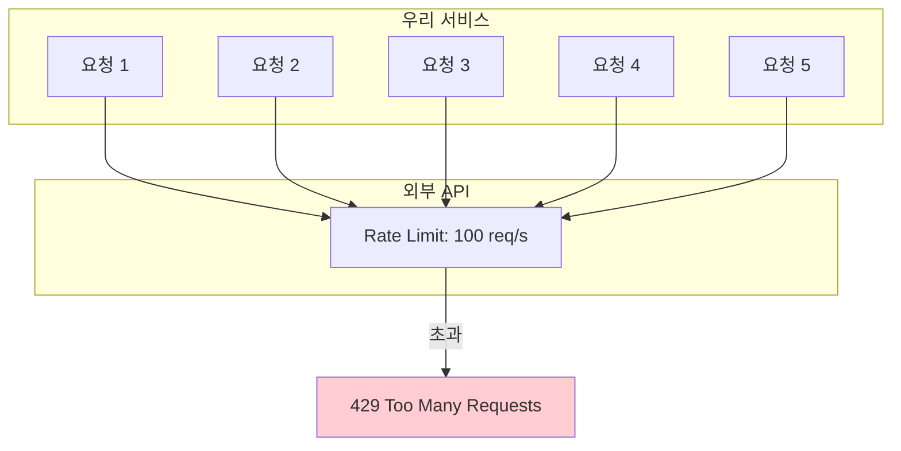
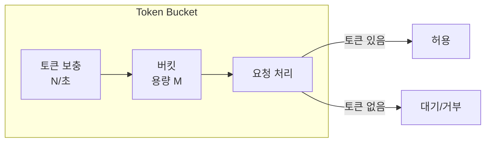
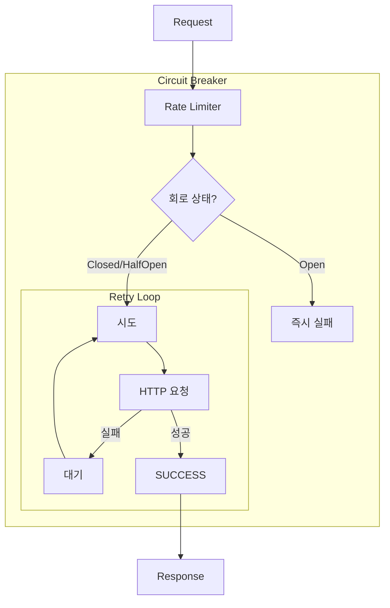

# Enterprise Go 시리즈 #6: Resilient한 외부 통신

## 개요

마이크로서비스 환경에서 외부 API 호출은 **실패할 수 있다**는 전제로 설계해야 합니다.

### 핵심 질문

- 외부 서비스가 느려지면 우리 서비스는?
- 일시적 네트워크 오류를 어떻게 처리하나?
- 장애가 전파되는 것을 어떻게 막나?

---

## Resilience 패턴 개요

| 패턴 | 목적 | 적용 순서 |
|------|------|----------|
| Rate Limit | 요청 속도 제한 | 1번째 (가장 바깥) |
| Circuit Breaker | 장애 서비스 격리 | 2번째 |
| Retry | 일시적 실패 복구 | 3번째 |
| Timeout | 무한 대기 방지 | 4번째 (가장 안쪽) |

---

## Timeout

### 없으면 생기는 일

### 설계 원칙

| 레벨 | 타임아웃 | 이유 |
|------|---------|------|
| 연결 | 5초 | TCP 연결 실패 빠르게 감지 |
| 요청 전체 | 30초 | 사용자 대기 한계 |
| 개별 API | 5-10초 | 외부 장애 격리 |

---

## Retry

### 언제 재시도할 것인가?

### Exponential Backoff

**원칙**:

- 재시도 간격 점진적 증가
- Jitter 추가 (동시 재시도 방지)
- 최대 횟수 제한 (보통 3-5회)

---

## Circuit Breaker

### 동작 원리

| 상태 | 동작 |
|------|------|
| **Closed** | 정상 동작, 요청 통과 |
| **Open** | 요청 즉시 실패 (빠른 실패) |
| **Half-Open** | 일부 요청만 통과 (테스트) |

### 경험담

> 결제 API 장애 시 Circuit Breaker 없이 계속 호출하다가 타임아웃 누적으로 전체 서비스 마비

> Circuit Breaker 적용 후 결제 실패 시 빠르게 에러 반환, 다른 기능은 정상 동작

---

## Rate Limiting

### 왜 필요한가?

### Token Bucket 알고리즘

---

## 통합 설계

### Resilient Client 구조

### 설정 가이드

| 항목 | 권장값 | 이유 |
|------|--------|------|
| Timeout | 5-30초 | API 특성에 따라 |
| Retry 횟수 | 3회 | 네트워크 일시 장애 대응 |
| CB 임계치 | 5회 요청 중 60% 실패 | 성급한 Open 방지 |
| CB Open 시간 | 30초 | 복구 여유 시간 |
| Rate Limit | API 제한의 80% | 버스트 대비 여유 |

---

## 정리: 체크리스트

| 항목 | 확인 |
|------|------|
| Timeout이 설정되어 있는가? | ☐ |
| 재시도 가능한 에러만 Retry하는가? | ☐ |
| Exponential Backoff를 적용했는가? | ☐ |
| Circuit Breaker가 있는가? | ☐ |
| 외부 API Rate Limit을 고려했는가? | ☐ |

---

## 다음 편 예고

**7편: 테스트 전략과 실전**에서는:

- gomock으로 Mock 생성
- Testcontainers로 통합 테스트
- Ginkgo BDD 스타일

을 다룹니다.

---

## 참고 자료

- [sony/gobreaker](https://github.com/sony/gobreaker)
- [golang.org/x/time/rate](https://pkg.go.dev/golang.org/x/time/rate)
