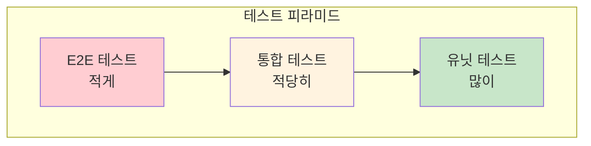
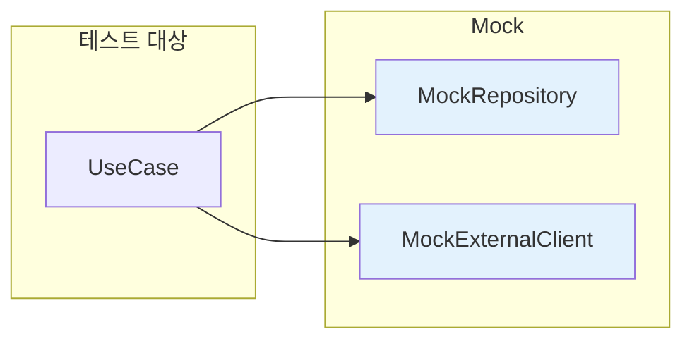
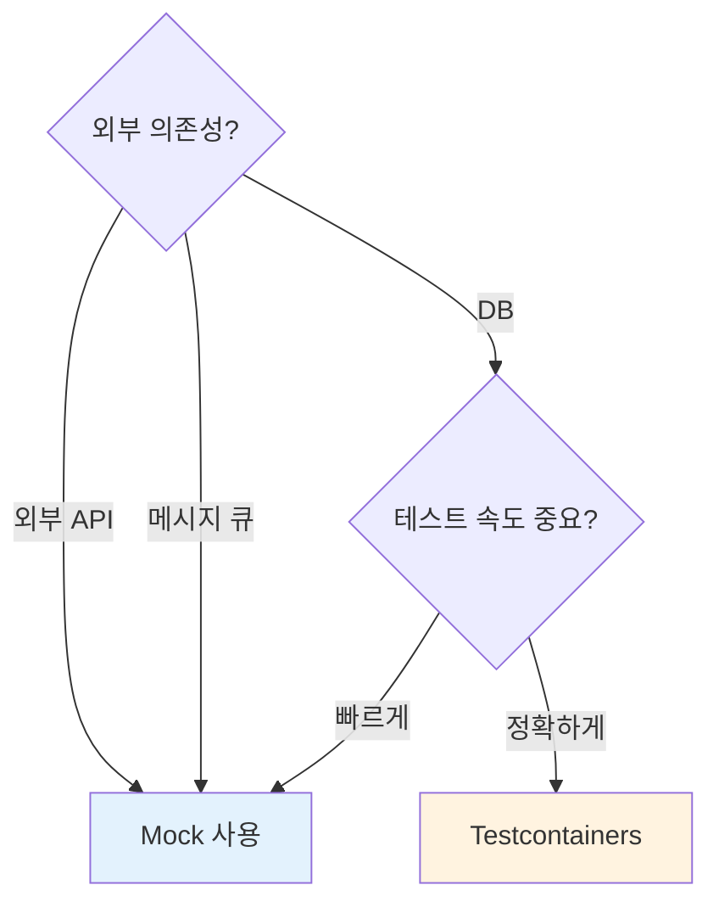
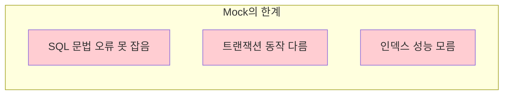
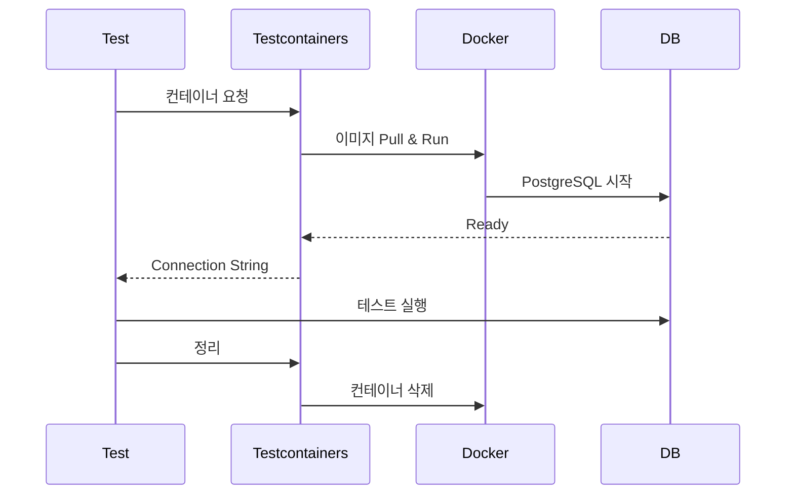
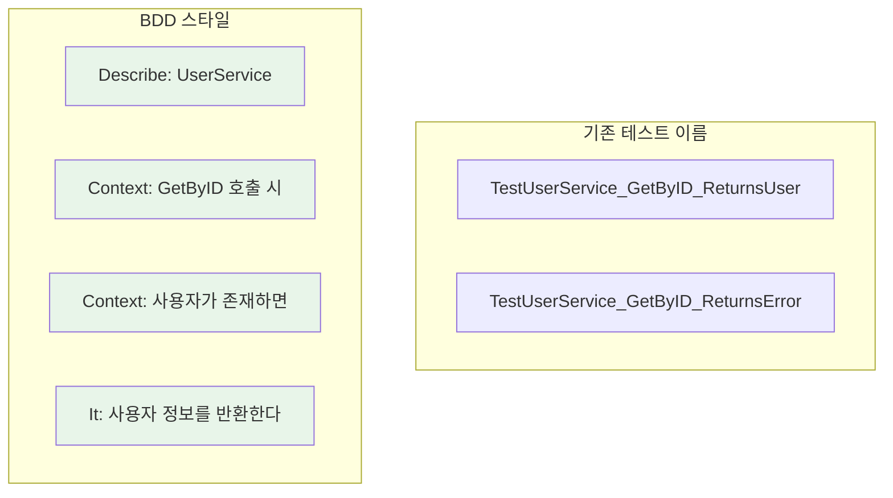
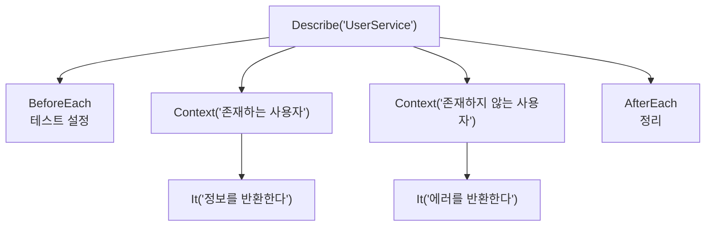
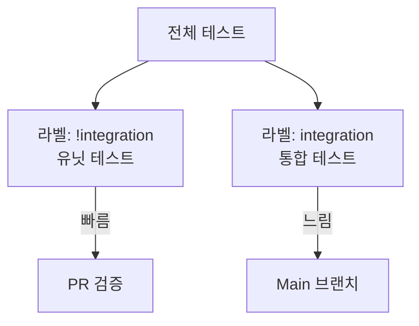
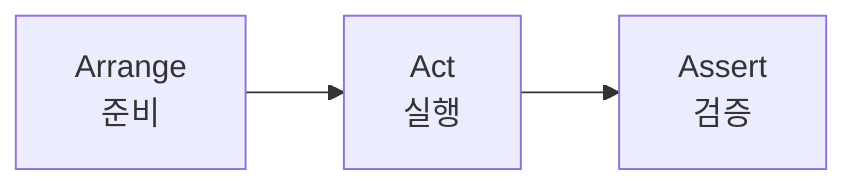

# Enterprise Go 시리즈 #7: 테스트 전략과 실전

## 개요

엔터프라이즈 애플리케이션의 테스트 전략을 설계합니다.

### 핵심 질문

- 유닛 테스트와 통합 테스트의 경계는?
- Mock을 어디까지 사용할 것인가?
- 테스트 가독성을 어떻게 높일 것인가?

---

## 테스트 피라미드

| 레벨 | 특징 | 도구 |
|------|------|------|
| **Unit** | 빠름, 고립됨, 많이 | gomock |
| **Integration** | 느림, 실제 의존성 | Testcontainers |
| **E2E** | 가장 느림, 전체 시스템 | Ginkgo + HTTP Client |

---

## gomock: 유닛 테스트

### Mock의 역할

### Mock vs Stub vs Fake

| 종류 | 설명 | 예시 |
|------|------|------|
| **Mock** | 호출 검증, 반환값 설정 | gomock |
| **Stub** | 고정 반환값 | 직접 구현 |
| **Fake** | 간단한 구현체 | In-memory DB |

### 언제 Mock을 쓰나?

---

## Testcontainers: 통합 테스트

### 왜 필요한가?

### 동작 원리

### 사용 시점

| 상황 | 추천 |
|------|------|
| Repository 레이어 테스트 | Testcontainers |
| 복잡한 SQL 검증 | Testcontainers |
| UseCase 비즈니스 로직 | Mock |
| 외부 API 호출 로직 | Mock |

---

## Ginkgo: BDD 스타일

### 왜 BDD인가?

### Ginkgo 구조

### 장점

| 기존 | Ginkgo |
|------|--------|
| 테스트 이름으로 의도 표현 | 계층 구조로 의도 표현 |
| 중복 setup 코드 | BeforeEach로 공유 |
| 한 파일에 관련 없는 테스트 | Context로 그룹화 |

---

## 테스트 분리 전략

### 라벨 활용

| 명령 | 용도 |
|------|------|
| `ginkgo --label-filter="!integration"` | PR 빌드 (빠르게) |
| `ginkgo --label-filter="integration"` | 통합 테스트만 |
| `ginkgo -r` | 전체 |

---

## 테스트 설계 원칙

### AAA 패턴

### 좋은 테스트의 특성

| 특성 | 설명 |
|------|------|
| **Fast** | 빨리 끝나야 자주 실행 |
| **Isolated** | 다른 테스트에 영향 없음 |
| **Repeatable** | 몇 번 실행해도 같은 결과 |
| **Self-validating** | 성공/실패가 명확 |

---

## 정리: 체크리스트

| 항목 | 확인 |
|------|------|
| UseCase는 Mock으로 테스트하는가? | ☐ |
| Repository는 실제 DB로 테스트하는가? | ☐ |
| 테스트가 CI에서 라벨로 분리되는가? | ☐ |
| BDD 스타일로 의도가 명확한가? | ☐ |

---

## 다음 편 예고

**8편: Observability와 Debugging**에서는:

- 구조화된 로깅 (slog)
- Metrics (Prometheus)
- 분산 추적 (OpenTelemetry)

을 다룹니다.

---

## 참고 자료

- [uber/mock](https://github.com/uber-go/mock)
- [Testcontainers Go](https://golang.testcontainers.org/)
- [Ginkgo](https://onsi.github.io/ginkgo/)
