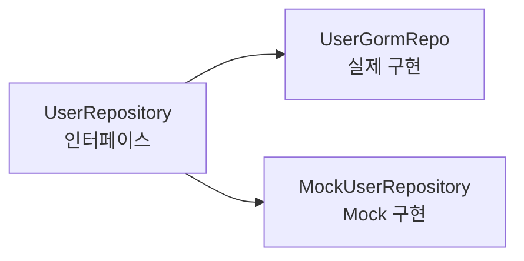
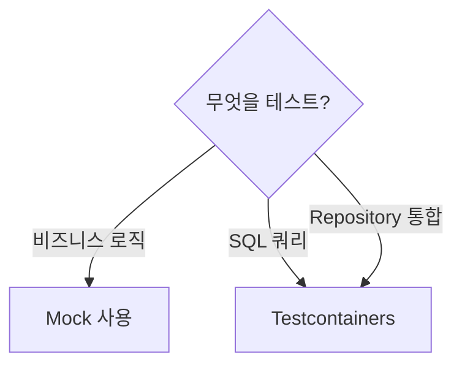
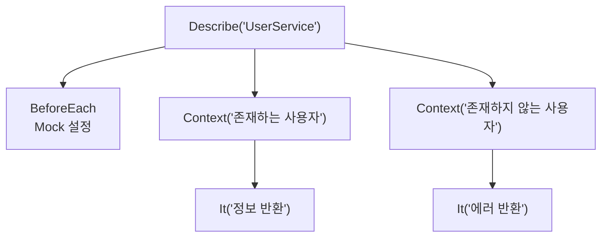
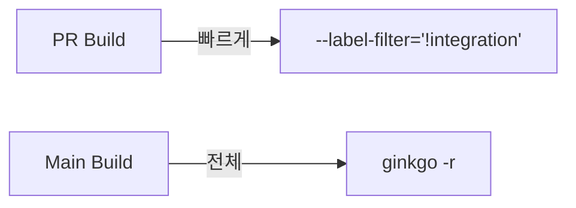

# Enterprise Go 시리즈 #7: 테스트 전략과 실전

> **다른 생태계 경험자를 위한 매핑**
>
> - Java: JUnit, Mockito, Testcontainers
> - Node.js: Jest, Supertest
> - Python: pytest, unittest.mock

## 테스트 도구 매핑

| 기능 | Java | Node.js | Go |
|------|------|---------|-----|
| Mock 생성 | Mockito | jest.mock | **uber/gomock** |
| 통합 테스트 | Testcontainers | Testcontainers | **Testcontainers-go** |
| BDD 스타일 | Cucumber | Jest describe | **Ginkgo** |
| 어설션 | AssertJ | Jest expect | **Gomega** |

---

## Mock: uber/gomock

### Mockito vs gomock

| Mockito | gomock |
|---------|--------|
| when(...).thenReturn(...) | EXPECT().Return(...) |
| verify(..., times(n)) | EXPECT().Times(n) |
| @Mock 어노테이션 | mockgen 코드 생성 |

### 인터페이스 기반 Mock

**Spring과의 차이점:**

- Spring: @MockBean으로 런타임 주입
- Go: **인터페이스 정의 필수**, 컴파일 타임 타입 체크

---

## 통합 테스트: Testcontainers

### Java vs Go

| Java Testcontainers | Go Testcontainers |
|---------------------|-------------------|
| @Container 어노테이션 | container.Run() 함수 |
| @DynamicPropertySource | ConnectionString() |
| JUnit 생명주기 | Ginkgo BeforeSuite/AfterSuite |

### 언제 사용하나?

---

## BDD: Ginkgo

### Jest vs Ginkgo

| Jest | Ginkgo |
|------|--------|
| describe('...', () => {}) | Describe("...", func() {}) |
| beforeEach(() => {}) | BeforeEach(func() {}) |
| it('should...', () => {}) | It("should...", func() {}) |
| expect(...).toBe(...) | Expect(...).To(Equal(...)) |

### 테스트 구조

---

## 테스트 분리: Label

### JUnit @Tag vs Ginkgo Label

| JUnit | Ginkgo |
|-------|--------|
| @Tag("integration") | Label("integration") |
| -Dgroups=integration | --label-filter="integration" |

### CI 파이프라인

---

## 정리

| 기능 | 추천 도구 | 대응 |
|------|----------|------|
| Mock | uber/gomock | Mockito |
| 통합 테스트 | Testcontainers | @Testcontainers |
| BDD | Ginkgo + Gomega | Jest describe |
| 분리 실행 | Label | @Tag |

---

## 다음 편 예고

**8편: Observability와 Debugging**에서는 Micrometer, Winston에 대응하는 Go의 관찰가능성 도구를 다룹니다.

---

## 참고 자료

- [uber/gomock](https://github.com/uber-go/mock)
- [Testcontainers Go](https://golang.testcontainers.org/)
- [Ginkgo](https://onsi.github.io/ginkgo/)
