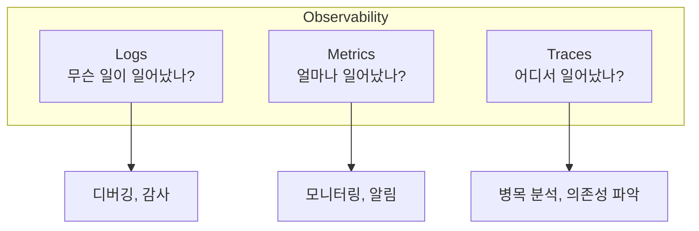
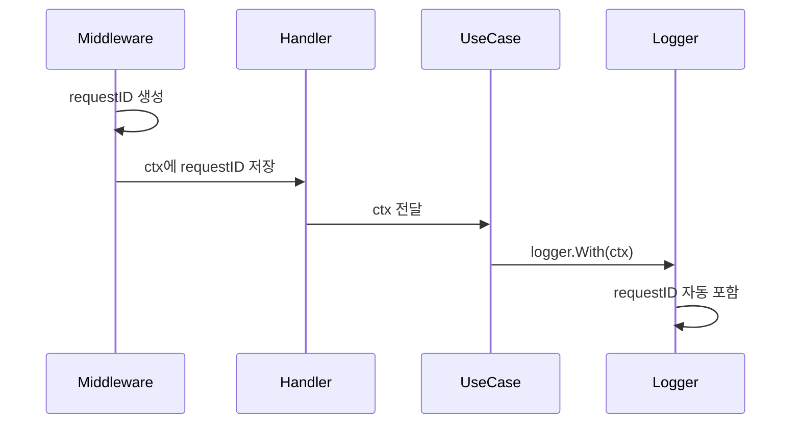
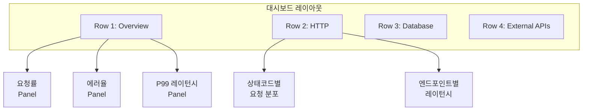
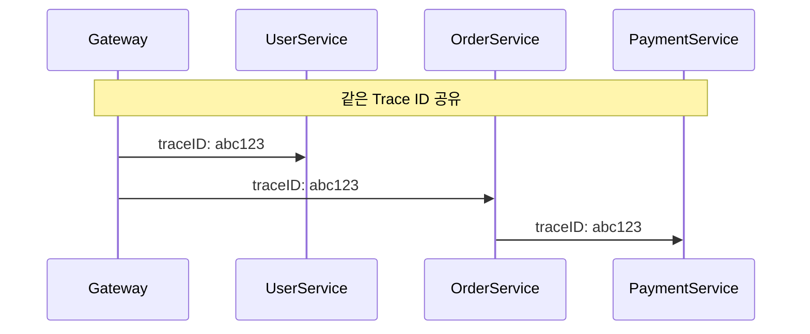
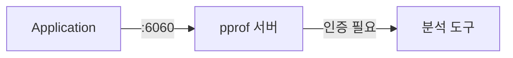
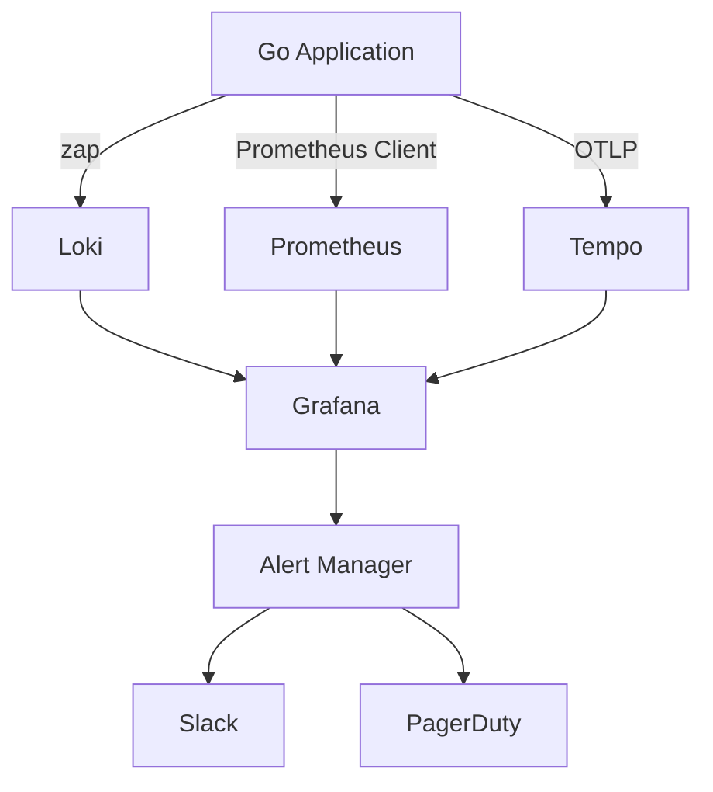
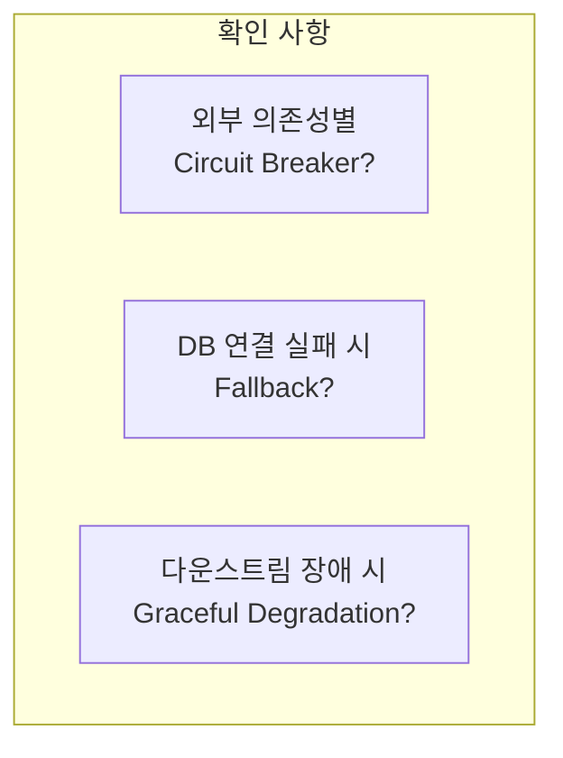

# Enterprise Go 시리즈 #8: Observability와 Debugging

> **다른 생태계 경험자를 위한 매핑**
>
> - Java: Micrometer, Logback, Zipkin
> - Node.js: Winston, prom-client, Jaeger

## 핵심 질문

프로덕션에서:

- 장애 발생 시 원인을 어떻게 파악하나?
- 어떤 메트릭을 수집해야 하나?
- Grafana 대시보드와 Alert는 어떻게 구성하나?

---

## Observability 3요소



---

## Logging (uber/zap)

### 구조화된 로깅

| 패턴 | Java | Go |
|------|------|-----|
| 구조화 로깅 | Logback + JSON | uber/zap |
| 컨텍스트 전파 | MDC | Context + zap.With |

### 로그 레벨 가이드

| 레벨 | 사용 시점 | 프로덕션 |
|------|----------|---------|
| DEBUG | 개발/디버깅 | OFF |
| INFO | 정상 흐름 기록 | ON |
| WARN | 복구 가능한 문제 | ON |
| ERROR | 실패, 조치 필요 | ON + Alert |

### Request ID 전파



### 로거 초기화 패턴

| 패턴 | 방식 | 장단점 |
|------|------|--------|
| **ReplaceGlobals** | `zap.ReplaceGlobals(logger)` | 간편, 테스트 어려움 |
| **DI 주입** | Wire로 주입 | 테스트 용이, 명시적 |

**ReplaceGlobals**: 빠른 프로토타이핑에 적합

```go
logger, _ := zap.NewProduction()
zap.ReplaceGlobals(logger)
// 이후 어디서든 zap.L().Info(...)
```

**DI (권장)**: 정식 프로젝트에서는 Wire로 주입

```go
// wire.go
func InitializeServer(logger *zap.Logger) *Server { ... }
```

테스트 시 Mock 로거 주입 가능, 의존성 명시적

---

## Metrics

### 수집해야 할 핵심 메트릭

#### RED Method (Request-driven)

| 메트릭 | 설명 | Prometheus 타입 |
|--------|------|----------------|
| **R**ate | 초당 요청 수 | Counter |
| **E**rrors | 에러율 | Counter |
| **D**uration | 응답 시간 분포 | Histogram |

#### USE Method (Resource-driven)

| 메트릭 | 설명 | 예시 |
|--------|------|------|
| **U**tilization | 리소스 사용률 | CPU, Memory |
| **S**aturation | 포화도, 대기열 | Goroutine 수 |
| **E**rrors | 리소스 에러 | Connection 실패 |

### Grafana 대시보드 구성



### Alert 설정 예시

| Alert 이름 | 조건 | 심각도 | 채널 |
|-----------|------|--------|------|
| HighErrorRate | 에러율 > 5% (5분) | Critical | Slack + PagerDuty |
| HighLatency | P99 > 1s (5분) | Warning | Slack |
| PodRestart | 재시작 > 3회 (1시간) | Critical | Slack |

---

## Tracing

### 분산 추적이 필요한 상황



### OpenTelemetry 연동

| Java | Go |
|------|-----|
| Spring Cloud Sleuth | OpenTelemetry SDK |
| Zipkin/Jaeger Exporter | OTLP Exporter |
| @NewSpan | tracer.Start(ctx, name) |

---

## pprof: 성능 프로파일링

### 프로파일 종류

| 프로파일 | 분석 대상 | 사용 시점 |
|---------|----------|----------|
| CPU | 함수별 CPU 사용 | 높은 CPU 사용률 |
| Heap | 메모리 할당 | 메모리 증가 |
| Goroutine | 활성 goroutine | 누수 의심 |
| Block | 블로킹 지점 | 동기화 문제 |

### 프로덕션 활성화



**보안 주의**: pprof 엔드포인트는 내부망/VPN에서만 접근

---

## 통합 아키텍처



---

## SPoF 방지

### 단일 장애 지점 식별



### 메트릭 기반 SPoF 탐지

| 메트릭 | 임계치 | 의미 |
|--------|-------|------|
| 의존성별 에러율 | > 50% | 해당 의존성 장애 |
| DB 커넥션 풀 사용률 | > 90% | 커넥션 고갈 위험 |
| Goroutine 수 | 급격한 증가 | 누수 또는 블로킹 |

---

## 정리

| 요소 | 도구 | 용도 |
|------|------|------|
| Logs | zap → Loki | 디버깅, 감사 |
| Metrics | Prometheus → Grafana | 모니터링, Alert |
| Traces | OpenTelemetry → Tempo | 병목 분석 |
| Profile | pprof | 성능 최적화 |

---

## 시리즈 마무리

8편에 걸쳐 엔터프라이즈 Go 개발의 핵심을 다뤘습니다:

| 편 | 주제 | 핵심 요점 |
|----|------|----------|
| 1 | 프로젝트 설계 | Cosmos SDK 구조, /internal 캡슐화 |
| 2 | HTTP 서버 | 미들웨어 순서, Graceful Shutdown |
| 3 | Context | 타임아웃, 취소 전파, Request ID |
| 4 | 동시성 | Goroutine 제한, errgroup |
| 5 | 데이터베이스 | WithTx로 @Transactional 경험 |
| 6 | 외부 통신 | 패턴 조합 순서 |
| 7 | 테스트 | Mock, Testcontainers, Ginkgo |
| 8 | Observability | RED/USE, Grafana Alert |
| 9 | Makefile | 개발 워크플로우 자동화, Façade |

---

## 참고 자료

- [uber/zap](https://github.com/uber-go/zap)
- [Prometheus Go Client](https://github.com/prometheus/client_golang)
- [OpenTelemetry Go](https://opentelemetry.io/docs/instrumentation/go/)
- [Grafana Loki](https://grafana.com/oss/loki/)
