# Enterprise Go 시리즈 #8: Observability와 Debugging

## 개요

프로덕션 시스템에서 **Observability(관찰가능성)** 의 3대 요소를 설계합니다.

### 핵심 질문

- 장애 발생 시 원인을 어떻게 파악하나?
- 시스템 상태를 어떻게 모니터링하나?
- 요청 흐름을 어떻게 추적하나?

---

## Observability 3요소

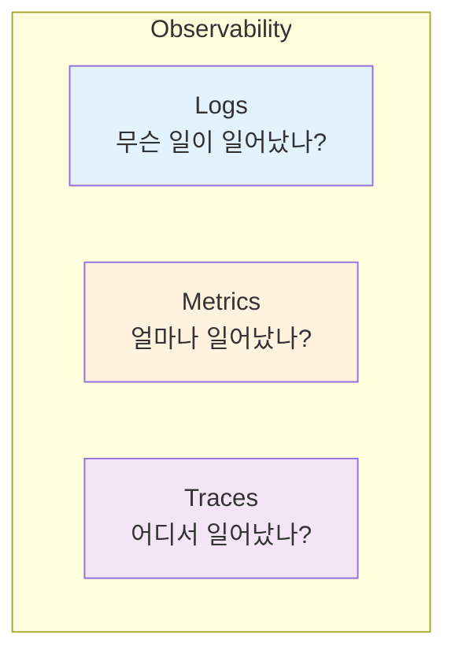

| 요소 | 목적 | 도구 |
|------|------|------|
| **Logs** | 이벤트 기록, 디버깅 | slog |
| **Metrics** | 수치 추이, 알림 | Prometheus |
| **Traces** | 분산 시스템 추적 | OpenTelemetry |

---

## Logging (slog)

### 구조화된 로깅 vs 문자열 로깅

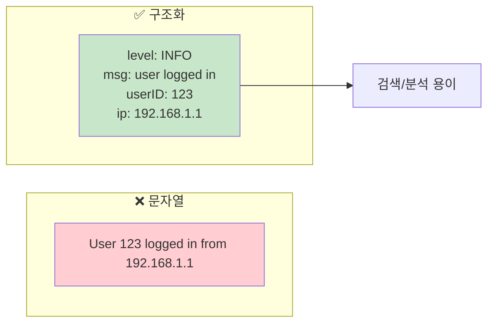

### 로그 레벨 설계

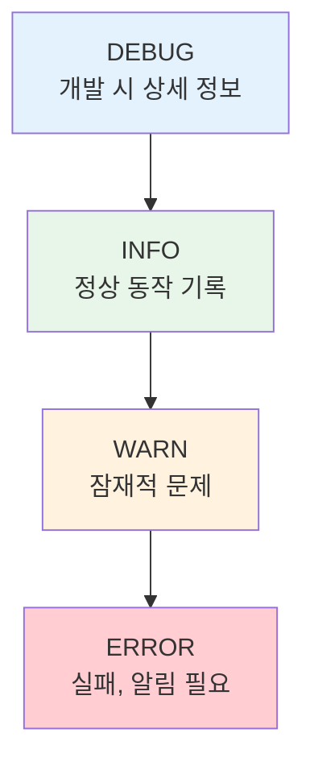

| 레벨 | 사용 시점 | 프로덕션 기본 |
|------|----------|--------------|
| DEBUG | 개발/디버깅 | OFF |
| INFO | 정상 흐름 | ON |
| WARN | 복구 가능한 문제 | ON |
| ERROR | 실패, 조치 필요 | ON + 알림 |

### Context 연동

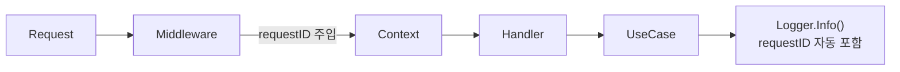

---

## Metrics (Prometheus)

### 메트릭 유형

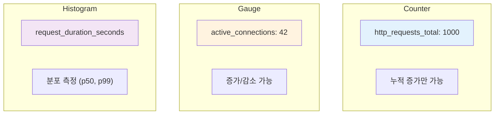

### 핵심 메트릭 (RED)

| 메트릭 | 설명 | 타입 |
|--------|------|------|
| **R**ate | 초당 요청 수 | Counter |
| **E**rrors | 에러율 | Counter |
| **D**uration | 응답 시간 | Histogram |

### 라벨 설계 원칙

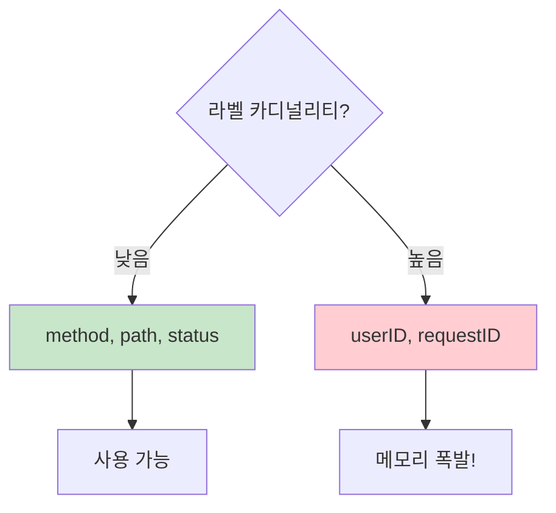

**규칙**: 라벨 값의 조합 수가 수백 개를 넘지 않도록

---

## Tracing (OpenTelemetry)

### 왜 필요한가?

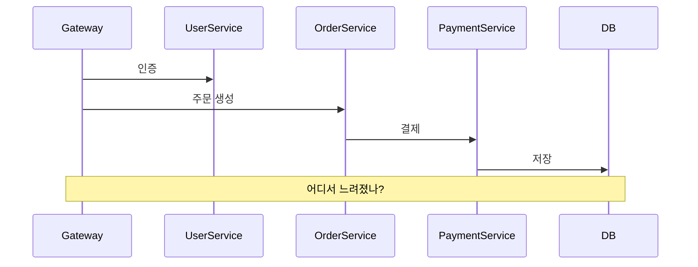

### Trace 구조

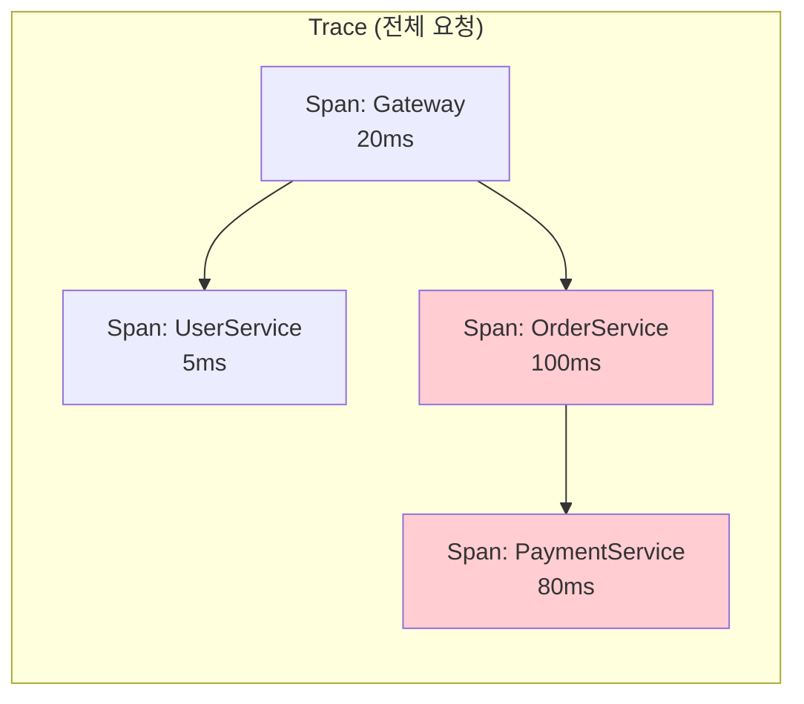

### 전파 방식

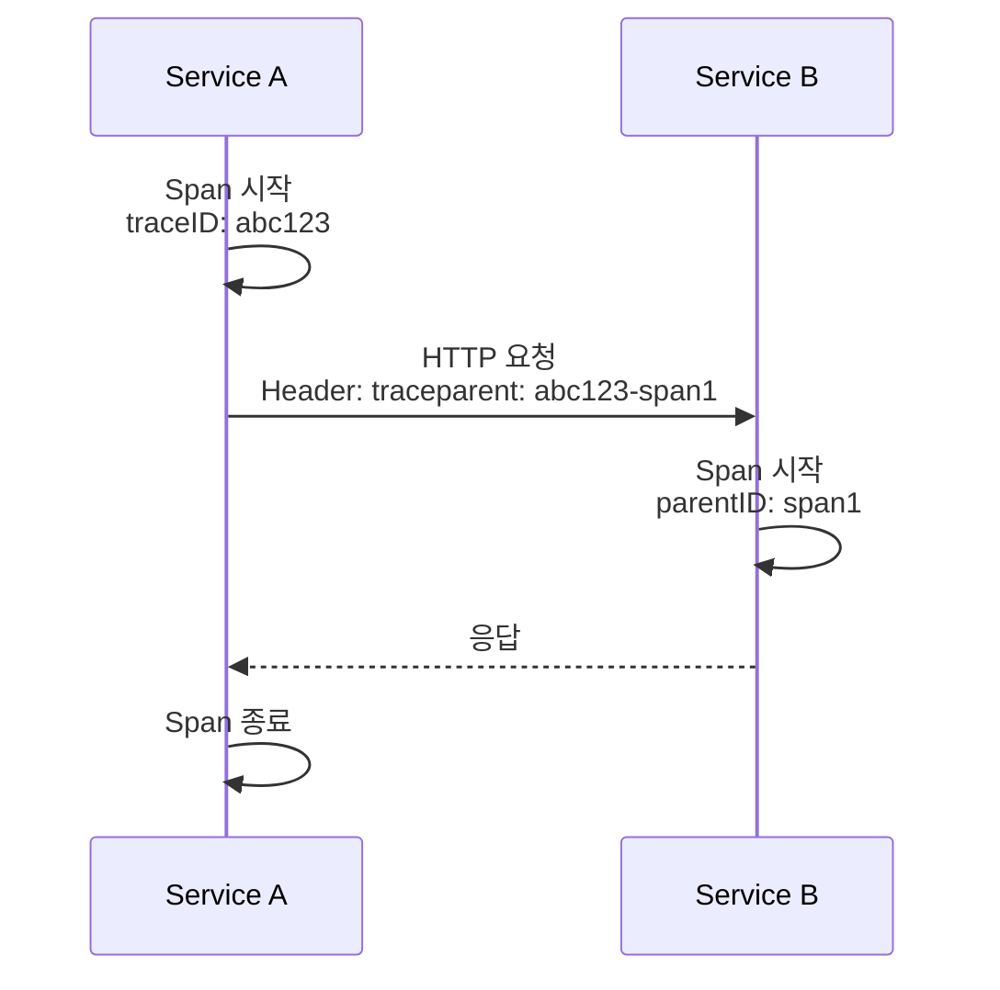

---

## pprof: 성능 분석

### 언제 사용하나?

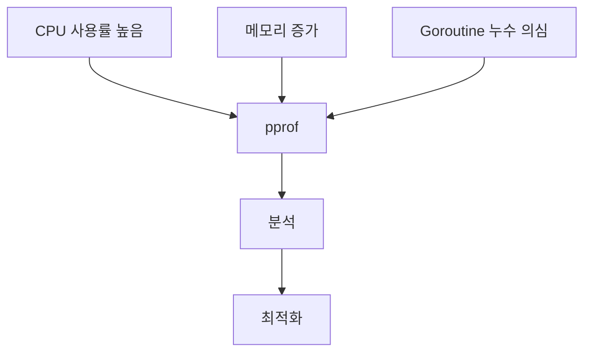

### 프로파일 종류

| 프로파일 | 분석 대상 |
|----------|----------|
| CPU | 어떤 함수가 CPU 사용 |
| Heap | 메모리 할당 |
| Goroutine | 활성 Goroutine |
| Block | 블로킹 지점 |
| Mutex | Lock 경쟁 |

---

## Health Check

### Liveness vs Readiness

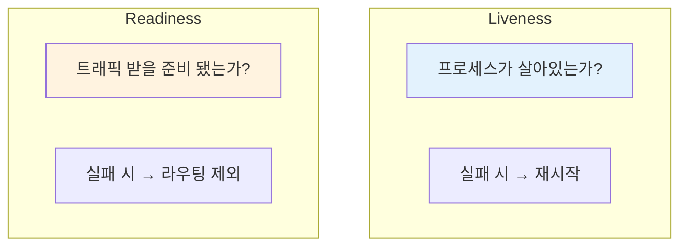

| 엔드포인트 | 확인 내용 |
|------------|----------|
| `/health/live` | 프로세스 응답 |
| `/health/ready` | DB 연결, 의존성 상태 |

---

## 통합 아키텍처

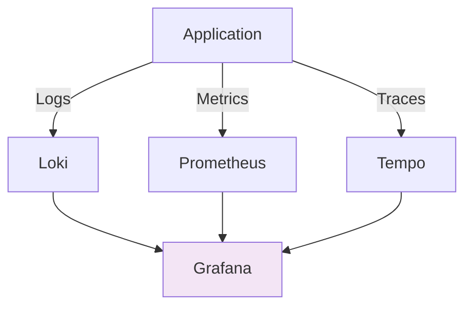

---

## 정리: 체크리스트

| 항목 | 확인 |
|------|------|
| 구조화된 로깅을 사용하는가? | ☐ |
| Request ID가 로그에 포함되는가? | ☐ |
| RED 메트릭이 수집되는가? | ☐ |
| 분산 추적이 설정되어 있는가? | ☐ |
| Health Check 엔드포인트가 있는가? | ☐ |

---

## 시리즈 마무리

**Enterprise Go 시리즈**를 통해 다룬 내용:

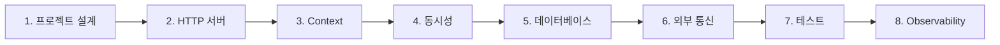

이 시리즈가 엔터프라이즈 Go 애플리케이션 구축에 도움이 되길 바랍니다! 🚀

---

## 참고 자료

- [log/slog](https://pkg.go.dev/log/slog)
- [Prometheus Go Client](https://github.com/prometheus/client_golang)
- [OpenTelemetry Go](https://opentelemetry.io/docs/instrumentation/go/)
