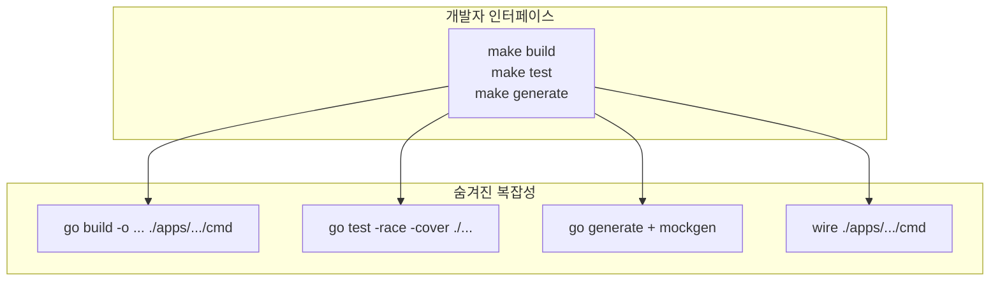

# Enterprise Go 시리즈 #9: Makefile로 개발 워크플로우 자동화

> **핵심 아이디어**: Makefile은 **CLI의 Façade 패턴**입니다.
> 복잡한 명령어 조합을 단순한 인터페이스 뒤에 숨깁니다.

## 왜 Makefile인가?

### 문제 상황

```bash
# 새 팀원이 프로젝트에 합류했을 때
$ go build -o bin/user-api ./apps/user-api/cmd
$ go build -o bin/order-api ./apps/order-api/cmd
$ go generate ./...
$ mockgen -source=... -destination=...
$ wire ./apps/user-api/cmd
$ go test -race -cover ./...
```

### Façade 적용 후

```bash
make build      # 전체 빌드
make test       # 테스트
make generate   # 코드 생성 (mock, wire)
```

**Façade 패턴**처럼, 복잡한 하위 시스템을 단순한 인터페이스로 감쌉니다.

---

## 기본 구조

```makefile
# 변수 정의
GO := go
APPS := user-api order-api worker
BIN_DIR := bin

# 기본 타겟
.PHONY: all build test lint clean

all: build

build: $(APPS)

$(APPS):
 $(GO) build -o $(BIN_DIR)/$@ ./apps/$@/cmd

test:
 $(GO) test -race -cover ./...

lint:
 golangci-lint run ./...

clean:
 rm -rf $(BIN_DIR)
```

---

## 모노레포용 타겟

### 서비스별 빌드

```makefile
# 특정 서비스만 빌드
.PHONY: build-user build-order

build-user:
 $(GO) build -o $(BIN_DIR)/user-api ./apps/user-api/cmd

build-order:
 $(GO) build -o $(BIN_DIR)/order-api ./apps/order-api/cmd

# 변경된 서비스만 빌드 (CI용)
build-changed:
 @for app in $(shell git diff --name-only HEAD~1 | grep "apps/" | cut -d/ -f2 | sort -u); do \
  echo "Building $$app..."; \
  $(GO) build -o $(BIN_DIR)/$$app ./apps/$$app/cmd; \
 done
```

---

## 코드 생성 자동화

### Mock, Wire 통합

```makefile
.PHONY: generate mock wire

generate: mock wire

mock:
 @echo "Generating mocks..."
 $(GO) generate ./...

wire:
 @echo "Running wire..."
 @for app in $(APPS); do \
  wire ./apps/$$app/cmd; \
 done
```

---

## 개발 환경

### 로컬 실행

```makefile
.PHONY: run dev

# 단일 서비스 실행
run:
 $(GO) run ./apps/user-api/cmd serve

# 핫 리로드 (air 사용)
dev:
 air -c .air.toml
```

### Docker

```makefile
.PHONY: docker-build docker-up docker-down

docker-build:
 docker build -t myapp/user-api -f apps/user-api/Dockerfile .

docker-up:
 docker-compose up -d

docker-down:
 docker-compose down
```

---

## CI/CD 연동

### GitHub Actions 예시

```yaml
# .github/workflows/ci.yml
jobs:
  build:
    runs-on: ubuntu-latest
    steps:
      - uses: actions/checkout@v4
      - uses: actions/setup-go@v5
        with:
          go-version: '1.21'
      
      - name: Lint
        run: make lint
      
      - name: Test
        run: make test
      
      - name: Build
        run: make build
```

Makefile을 사용하면 **로컬과 CI 환경이 동일**합니다.

---

## 유용한 패턴

### Help 타겟

```makefile
.PHONY: help

help:
 @echo "사용 가능한 타겟:"
 @echo "  build    - 전체 빌드"
 @echo "  test     - 테스트 실행"
 @echo "  lint     - 린트 검사"
 @echo "  generate - 코드 생성 (mock, wire)"
 @echo "  clean    - 빌드 결과물 삭제"
```

### 의존성 설치

```makefile
.PHONY: tools

tools:
 $(GO) install github.com/golangci/golangci-lint/cmd/golangci-lint@latest
 $(GO) install go.uber.org/mock/mockgen@latest
 $(GO) install github.com/google/wire/cmd/wire@latest
```

---

## 정리: Façade로서의 Makefile



| 장점 | 설명 |
|------|------|
| **온보딩 단순화** | 새 팀원도 `make build`로 시작 |
| **일관성** | 로컬 = CI 환경 |
| **문서화** | Makefile 자체가 실행 가능한 문서 |

---

## 참고 자료

- [GNU Make Manual](https://www.gnu.org/software/make/manual/)
- [Makefile Tutorial](https://makefiletutorial.com/)
