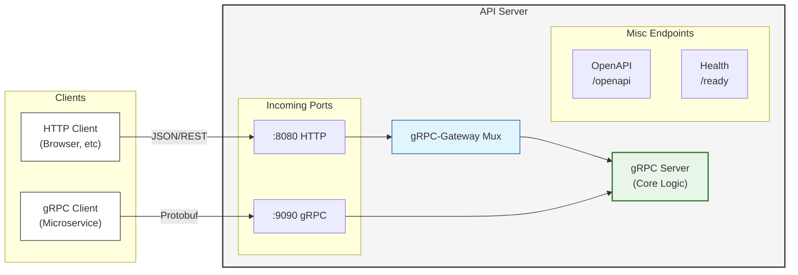

# gRPC-Gateway로 단일 API 듀얼 프로토콜 지원

## 개요

**gRPC-Gateway**는 gRPC 서비스에 RESTful HTTP/JSON 인터페이스를 자동으로 추가해주는 리버스 프록시입니다. 하나의 Proto 정의로 두 프로토콜을 모두 지원할 수 있습니다.

## 왜 듀얼 프로토콜인가?

### 장점

| 프로토콜 | 사용 시나리오 |
|----------|--------------|
| **gRPC** | 마이크로서비스 간 통신, 고성능 필요, 스트리밍 |
| **HTTP/JSON** | 웹 브라우저, 외부 API 클라이언트, 디버깅 |

단일 코드베이스로 두 니즈를 모두 충족할 수 있습니다.

### 단점

| 특성 | 설명 |
|------|------|
| 추가 레이어 | HTTP → gRPC 변환 오버헤드 |
| 기능 제한 | HTTP에서 gRPC 스트리밍 일부 지원 제한 |
| 복잡성 | 두 프로토콜의 에러 처리 매핑 필요 |

## 아키텍처



## Proto 정의

### HTTP 어노테이션 추가

```protobuf
syntax = "proto3";

package v1beta;

import "google/api/annotations.proto";
import "google/protobuf/struct.proto";

service DocumentService {
  // POST /v1beta/collections/{collection}/documents
  rpc CreateDocument(CreateDocumentRequest) returns (CreateDocumentResponse) {
    option (google.api.http) = {
      post: "/v1beta/collections/{collection}/documents"
      body: "*"
    };
  }
  
  // GET /v1beta/collections/{collection}/documents/{uri}
  rpc GetDocument(GetDocumentRequest) returns (GetDocumentResponse) {
    option (google.api.http) = {
      get: "/v1beta/collections/{collection}/documents/{uri}"
    };
  }
  
  // PATCH /v1beta/collections/{collection}/documents/{uri}
  rpc UpdateDocument(UpdateDocumentRequest) returns (UpdateDocumentResponse) {
    option (google.api.http) = {
      patch: "/v1beta/collections/{collection}/documents/{uri}"
      body: "*"
    };
  }
  
  // DELETE /v1beta/collections/{collection}/documents/{uri}
  rpc DeleteDocument(DeleteDocumentRequest) returns (DeleteDocumentResponse) {
    option (google.api.http) = {
      delete: "/v1beta/collections/{collection}/documents/{uri}"
    };
  }
  
  // POST로 쿼리 (URL 길이 제한 회피)
  // POST /v1beta/collections/{collection}/documents:query
  rpc QueryDocuments(QueryDocumentsRequest) returns (QueryDocumentsResponse) {
    option (google.api.http) = {
      post: "/v1beta/collections/{collection}/documents:query"
      body: "*"
    };
  }
  
  // 배치 작업
  // POST /v1beta/collections/{collection}/documents:batchCreate
  rpc BatchCreateDocuments(BatchCreateRequest) returns (BatchCreateResponse) {
    option (google.api.http) = {
      post: "/v1beta/collections/{collection}/documents:batchCreate"
      body: "*"
    };
  }
}

message CreateDocumentRequest {
  // URL 경로 파라미터로 추출됨
  string collection = 1;
  DocumentInput document = 2;
}

message GetDocumentRequest {
  string collection = 1;
  string uri = 2;
  // 쿼리 파라미터: ?version=3
  optional int32 version = 3;
  // 쿼리 파라미터: ?skip_validation=true
  optional bool skip_validation = 4;
}

// ... 나머지 메시지 정의
```

### URL 매핑 규칙

| gRPC 필드 위치 | HTTP 위치 |
|---------------|-----------|
| `{field}` in path | URL 경로 파라미터 |
| `body: "*"` | 나머지 필드는 JSON body |
| `body: "field"` | 특정 필드만 body |
| 그 외 필드 | 쿼리 파라미터 |

## 코드 생성 설정

### buf.gen.yaml

```yaml
version: v2
plugins:
  # gRPC 서버/클라이언트
  - remote: buf.build/grpc/go:v1.5.1
    out: generated/go/proto
    opt: paths=source_relative
  
  # gRPC-Gateway 핸들러
  - remote: buf.build/grpc-ecosystem/gateway:v2.25.1
    out: generated/go/proto
    opt:
      - paths=source_relative
      - standalone=true       # 독립 파일로 생성
      - generate_unbound_methods=true
```

### 생성 실행

```bash
buf generate
```

생성된 파일:

- `api_grpc.pb.go`: gRPC 서버/클라이언트
- `api.pb.gw.go`: HTTP Gateway 핸들러

## 서버 구현

### 통합 서버

```go
package main

import (
    "context"
    "net"
    "net/http"
    "sync"
    
    "github.com/grpc-ecosystem/grpc-gateway/v2/runtime"
    "google.golang.org/grpc"
    "google.golang.org/grpc/credentials/insecure"
    
    pb "github.com/myorg/myservice/generated/go/proto/v1beta"
)

type Server struct {
    grpcServer *grpc.Server
    httpServer *http.Server
    
    grpcPort string
    httpPort string
}

func NewServer(service DocumentService) *Server {
    // gRPC 서버 설정
    grpcServer := grpc.NewServer(
        grpc.UnaryInterceptor(loggingInterceptor),
    )
    pb.RegisterDocumentServiceServer(grpcServer, &documentHandler{service})
    
    return &Server{
        grpcServer: grpcServer,
        grpcPort:   ":9090",
        httpPort:   ":8080",
    }
}

func (s *Server) Start(ctx context.Context) error {
    var wg sync.WaitGroup
    errCh := make(chan error, 2)
    
    // 1. gRPC 서버 시작
    wg.Add(1)
    go func() {
        defer wg.Done()
        lis, err := net.Listen("tcp", s.grpcPort)
        if err != nil {
            errCh <- err
            return
        }
        if err := s.grpcServer.Serve(lis); err != nil {
            errCh <- err
        }
    }()
    
    // 2. HTTP Gateway 시작
    wg.Add(1)
    go func() {
        defer wg.Done()
        if err := s.startHTTPGateway(ctx); err != nil {
            errCh <- err
        }
    }()
    
    select {
    case err := <-errCh:
        return err
    case <-ctx.Done():
        s.Shutdown()
        return ctx.Err()
    }
}

func (s *Server) startHTTPGateway(ctx context.Context) error {
    mux := runtime.NewServeMux(
        // JSON 필드 이름 설정
        runtime.WithMarshalerOption(runtime.MIMEWildcard, &runtime.JSONPb{
            MarshalOptions: protojson.MarshalOptions{
                UseProtoNames:   true,
                EmitUnpopulated: true,
            },
            UnmarshalOptions: protojson.UnmarshalOptions{
                DiscardUnknown: true,
            },
        }),
        // 에러 핸들링 커스터마이즈
        runtime.WithErrorHandler(customErrorHandler),
    )
    
    opts := []grpc.DialOption{grpc.WithTransportCredentials(insecure.NewCredentials())}
    
    // gRPC 서버에 연결
    err := pb.RegisterDocumentServiceHandlerFromEndpoint(ctx, mux, "localhost"+s.grpcPort, opts)
    if err != nil {
        return err
    }
    
    // 추가 HTTP 엔드포인트
    handler := http.NewServeMux()
    handler.Handle("/", mux)
    handler.HandleFunc("/openapi.yaml", serveOpenAPI)
    handler.HandleFunc("/ready", healthCheck)
    
    s.httpServer = &http.Server{
        Addr:    s.httpPort,
        Handler: handler,
    }
    
    return s.httpServer.ListenAndServe()
}

func (s *Server) Shutdown() {
    s.grpcServer.GracefulStop()
    if s.httpServer != nil {
        s.httpServer.Shutdown(context.Background())
    }
}
```

### 에러 핸들링

gRPC 상태 코드를 HTTP 상태 코드로 매핑:

```go
func customErrorHandler(
    ctx context.Context,
    mux *runtime.ServeMux,
    marshaler runtime.Marshaler,
    w http.ResponseWriter,
    r *http.Request,
    err error,
) {
    // gRPC 에러에서 상태 추출
    st, _ := status.FromError(err)
    
    // HTTP 상태 코드 매핑
    httpStatus := runtime.HTTPStatusFromCode(st.Code())
    
    // 커스텀 에러 응답
    response := map[string]interface{}{
        "code":    st.Code().String(),
        "message": st.Message(),
    }
    
    if details := st.Details(); len(details) > 0 {
        response["details"] = details
    }
    
    w.Header().Set("Content-Type", "application/json")
    w.WriteHeader(httpStatus)
    json.NewEncoder(w).Encode(response)
}
```

## 인-프로세스 vs 네트워크 연결

### 네트워크 연결 (기본)

```go
// gRPC 서버에 네트워크로 연결
pb.RegisterDocumentServiceHandlerFromEndpoint(ctx, mux, "localhost:9090", opts)
```

### 인-프로세스 연결 (권장)

네트워크 오버헤드 없이 직접 연결:

```go
func (s *Server) startHTTPGatewayInProcess(ctx context.Context) error {
    mux := runtime.NewServeMux()
    
    // 서버 구현체를 직접 등록 (네트워크 경유 없음)
    err := pb.RegisterDocumentServiceHandlerServer(ctx, mux, s.documentHandler)
    if err != nil {
        return err
    }
    
    s.httpServer = &http.Server{
        Addr:    s.httpPort,
        Handler: mux,
    }
    
    return s.httpServer.ListenAndServe()
}
```

## 미들웨어

### HTTP 미들웨어 체인

```go
func (s *Server) buildHTTPHandler(mux *runtime.ServeMux) http.Handler {
    // 미들웨어 체인
    handler := corsMiddleware(mux)
    handler = loggingMiddleware(handler)
    handler = metricsMiddleware(handler)
    
    return handler
}

func corsMiddleware(next http.Handler) http.Handler {
    return http.HandlerFunc(func(w http.ResponseWriter, r *http.Request) {
        w.Header().Set("Access-Control-Allow-Origin", "*")
        w.Header().Set("Access-Control-Allow-Methods", "GET, POST, PUT, PATCH, DELETE, OPTIONS")
        w.Header().Set("Access-Control-Allow-Headers", "Content-Type, Authorization")
        
        if r.Method == "OPTIONS" {
            w.WriteHeader(http.StatusNoContent)
            return
        }
        
        next.ServeHTTP(w, r)
    })
}

func loggingMiddleware(next http.Handler) http.Handler {
    return http.HandlerFunc(func(w http.ResponseWriter, r *http.Request) {
        start := time.Now()
        
        wrapped := &responseWriter{ResponseWriter: w, status: 200}
        next.ServeHTTP(wrapped, r)
        
        log.Printf("%s %s %d %v", r.Method, r.URL.Path, wrapped.status, time.Since(start))
    })
}
```

### gRPC 인터셉터

```go
func loggingInterceptor(
    ctx context.Context,
    req interface{},
    info *grpc.UnaryServerInfo,
    handler grpc.UnaryHandler,
) (interface{}, error) {
    start := time.Now()
    
    resp, err := handler(ctx, req)
    
    log.Printf("gRPC %s %v err=%v", info.FullMethod, time.Since(start), err)
    
    return resp, err
}
```

## OpenAPI 스펙 제공

### 자동 생성된 스펙 제공

```go
//go:embed generated/docs/openapi.yaml
var openAPISpec []byte

func serveOpenAPI(w http.ResponseWriter, r *http.Request) {
    w.Header().Set("Content-Type", "application/x-yaml")
    w.Write(openAPISpec)
}
```

### Stoplight Elements 통합

정적 HTML과 Stoplight Elements 웹 컴포넌트로 인터랙티브 API 문서를 제공합니다:

```html
<!-- docs/openapi.html -->
<!DOCTYPE html>
<html lang="en">
  <head>
    <meta charset="utf-8" />
    <meta name="viewport" content="width=device-width, initial-scale=1" />
    <title>API Documentation</title>
    <script src="https://unpkg.com/@stoplight/elements/web-components.min.js"></script>
    <link rel="stylesheet" href="https://unpkg.com/@stoplight/elements/styles.min.css" />
  </head>
  <body>
    <elements-api
      apiDescriptionUrl="openapi.swagger.json"
      router="hash"
      layout="sidebar"
      hideInternal="true"
    />
  </body>
</html>
```

Proto 프로젝트에서 embed.FS로 정적 파일 제공:

```go
// generated/go/docs/embed.go
package docs

import "embed"

//go:embed openapi.html openapi.swagger.json
var StaticFiles embed.FS
```

gRPC-Gateway Mux에 직접 경로 등록:

```go
import (
    "io/fs"
    "net/http"
    
    "github.com/grpc-ecosystem/grpc-gateway/v2/runtime"
    "myproject/generated/go/docs"
)

func setupAPIRoutes(gatewayMux *runtime.ServeMux) {
    // 파일 서빙 헬퍼
    serveEmbeddedFile := func(w http.ResponseWriter, r *http.Request, fsys fs.FS, name string) {
        fileServer := http.FileServer(http.FS(fsys))
        r.URL.Path = name
        fileServer.ServeHTTP(w, r)
    }
    
    // OpenAPI JSON 스펙
    gatewayMux.HandlePath("GET", "/openapi.swagger.json", 
        func(w http.ResponseWriter, r *http.Request, _ map[string]string) {
            serveEmbeddedFile(w, r, docs.StaticFiles, "openapi.swagger.json")
        })
    
    // Stoplight Elements UI (HTML)
    gatewayMux.HandlePath("GET", "/openapi.html", 
        func(w http.ResponseWriter, r *http.Request, _ map[string]string) {
            serveEmbeddedFile(w, r, docs.StaticFiles, "openapi.html")
        })
    
    // 루트 접속 시 문서로 리다이렉트
    gatewayMux.HandlePath("GET", "/", 
        func(w http.ResponseWriter, r *http.Request, _ map[string]string) {
            http.Redirect(w, r, "/openapi.html", http.StatusFound)
        })
}
```

## 요청/응답 예시

### HTTP 요청

```bash
# 문서 생성
curl -X POST http://localhost:8080/v1beta/collections/users/documents \
  -H "Content-Type: application/json" \
  -d '{
    "document": {
      "uri": "user-001",
      "fields": {
        "name": "John Doe",
        "email": "john@example.com"
      }
    }
  }'

# 문서 조회
curl http://localhost:8080/v1beta/collections/users/documents/user-001?version=1

# 문서 업데이트
curl -X PATCH http://localhost:8080/v1beta/collections/users/documents/user-001 \
  -H "Content-Type: application/json" \
  -d '{"fields": {"name": "Jane Doe"}}'
```

### gRPC 요청 (grpcurl)

```bash
# 문서 생성
grpcurl -plaintext -d '{
  "collection": "users",
  "document": {
    "uri": "user-001",
    "fields": {"name": "John Doe"}
  }
}' localhost:9090 v1beta.DocumentService/CreateDocument

# 문서 조회
grpcurl -plaintext -d '{
  "collection": "users",
  "uri": "user-001"
}' localhost:9090 v1beta.DocumentService/GetDocument
```

## 모범 사례

1. **인-프로세스 연결**: 가능하면 `RegisterHandlerServer` 사용
2. **일관된 에러 처리**: gRPC/HTTP 에러 매핑 통일
3. **OpenAPI 통합**: 자동 생성 스펙으로 문서화
4. **미들웨어 분리**: HTTP/gRPC 각각 적절한 미들웨어 적용
5. **Health Check**: `/ready` 엔드포인트로 헬스체크 분리

## 참고 자료

- [gRPC-Gateway 공식 문서](https://grpc-ecosystem.github.io/grpc-gateway/)
- [google.api.http 어노테이션](https://cloud.google.com/endpoints/docs/grpc/transcoding)
- [runtime.ServeMux 옵션](https://pkg.go.dev/github.com/grpc-ecosystem/grpc-gateway/v2/runtime)
