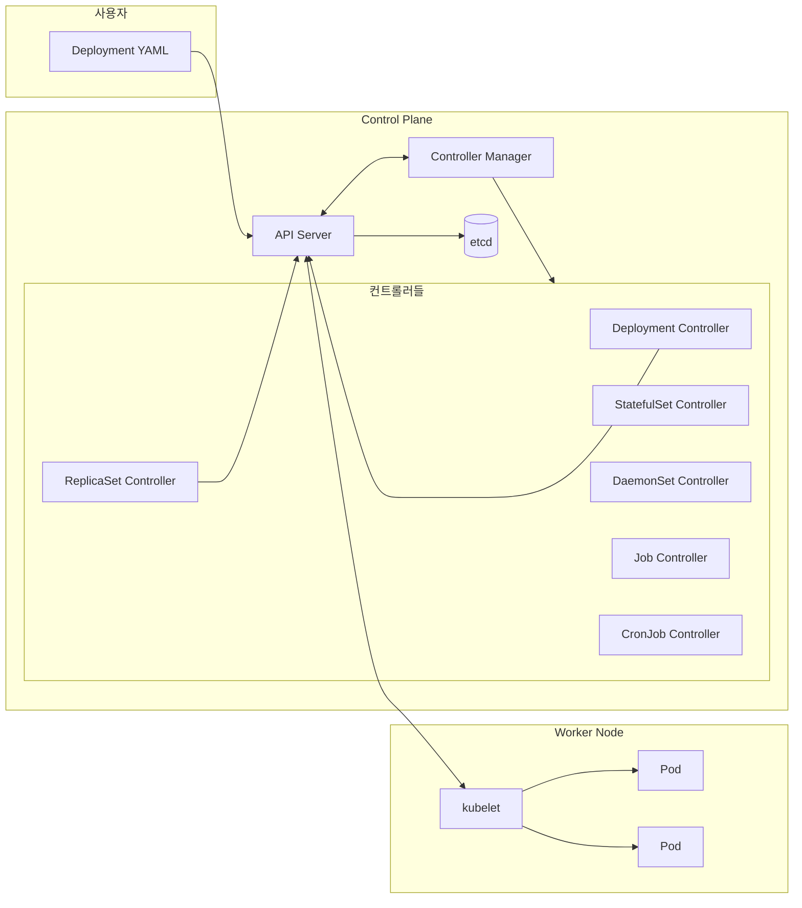
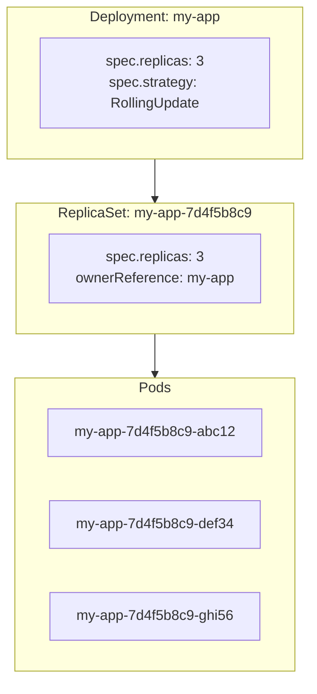
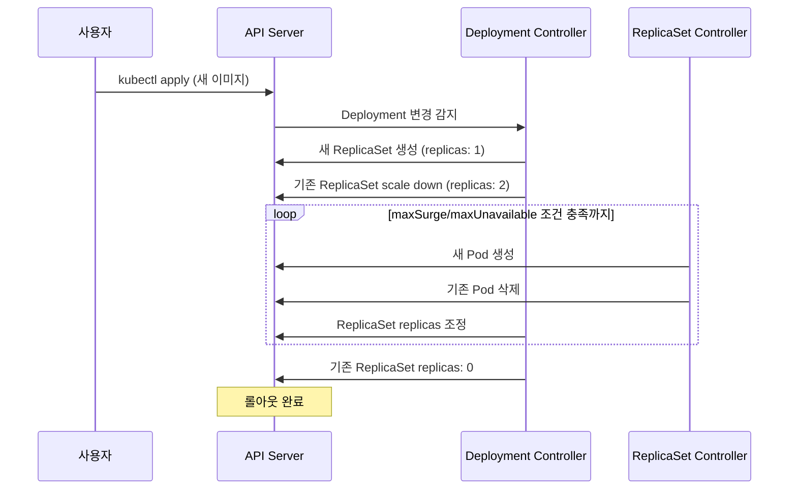
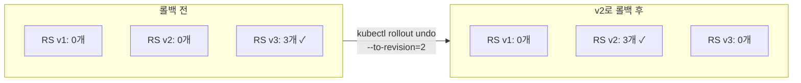
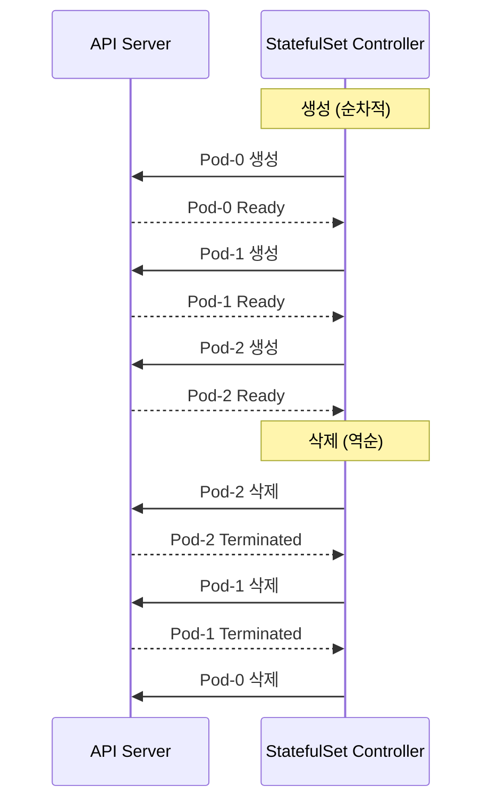
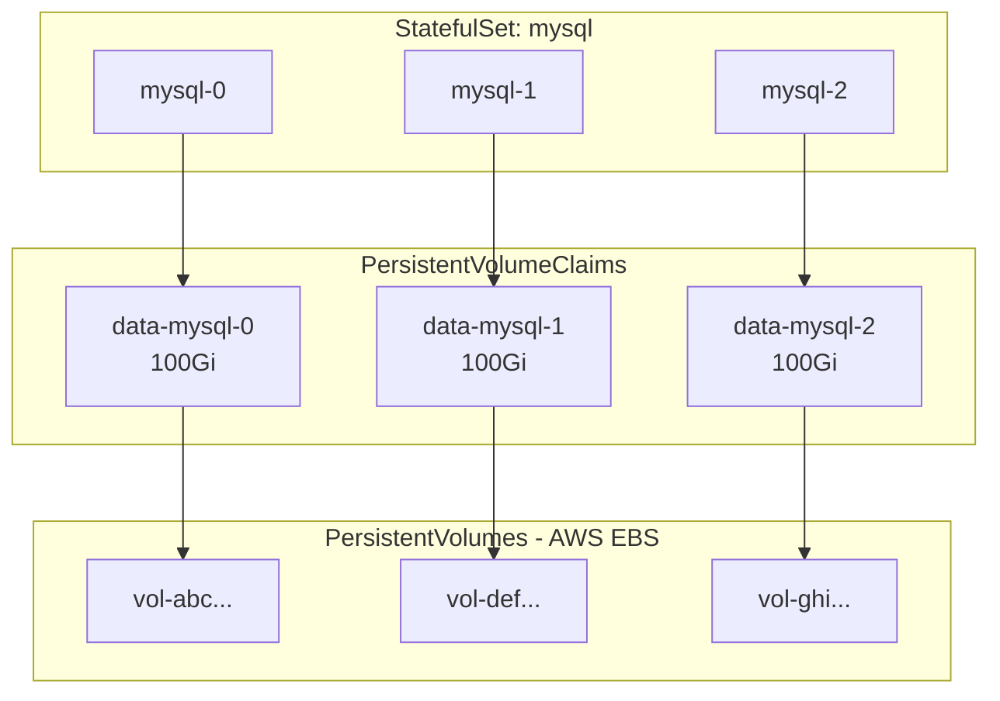
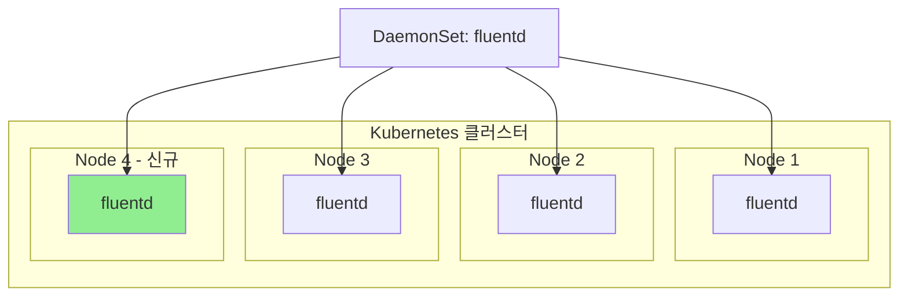

# Kubernetes 심화 시리즈 #1: 워크로드 컨트롤러의 내부 동작 원리

## 시리즈 개요

| # | 주제 | 핵심 내용 |
|---|------|----------|
| **1** | **워크로드 컨트롤러 심화** | Deployment, StatefulSet, DaemonSet, CronJob |
| 2 | 서비스 네트워킹 심화 | Service 타입, kube-proxy, AWS ALB/NLB |
| 3 | 설정 및 시크릿 관리 | ConfigMap, Secrets, AWS Secrets Manager CSI Driver |
| 4 | Istio 서비스 메시 | VirtualService, DestinationRule, 와일드카드 서브도메인 |

---

## 컨트롤러 패턴: Kubernetes의 핵심 철학

Kubernetes의 모든 것은 **컨트롤러 패턴**으로 동작합니다. 우리가 `kubectl apply`로 Deployment를 생성하면, 실제 Pod를 만드는 것은 Deployment Controller입니다.



### Reconciliation Loop (조정 루프)

모든 컨트롤러는 동일한 패턴을 따릅니다:

```
무한 반복:
  1. 현재 상태(Current State) 관찰
  2. 원하는 상태(Desired State)와 비교
  3. 차이가 있으면 조정(Reconcile)
  4. 다음 이벤트 대기
```

```go
// 실제 Kubernetes 컨트롤러의 핵심 구조 (간략화)
func (c *Controller) Run(ctx context.Context) {
    for {
        select {
        case <-ctx.Done():
            return
        default:
            // 1. 작업 큐에서 아이템 가져오기
            key, shutdown := c.workqueue.Get()
            if shutdown {
                return
            }
            
            // 2. Reconcile 실행
            err := c.reconcile(key.(string))
            if err != nil {
                // 재시도 큐에 추가
                c.workqueue.AddRateLimited(key)
            } else {
                c.workqueue.Forget(key)
            }
            c.workqueue.Done(key)
        }
    }
}
```

> [!IMPORTANT]
> **Level-triggered vs Edge-triggered**: Kubernetes 컨트롤러는 **Level-triggered** 방식입니다. "상태가 이렇게 변했다"가 아니라 "현재 상태가 이것이다"를 기준으로 동작합니다. 이 덕분에 컨트롤러가 재시작되어도 현재 상태를 다시 읽어서 조정할 수 있습니다.

---

## Deployment: 가장 널리 쓰이는 워크로드

### 내부 구조: Deployment → ReplicaSet → Pod

Deployment는 Pod를 직접 관리하지 않습니다. **ReplicaSet**을 통해 간접적으로 관리합니다.



### Rolling Update 동작 원리

Deployment를 업데이트하면 새 ReplicaSet이 생성되고, 점진적으로 트래픽이 이동합니다.



### 업데이트 전략 비교

```yaml
# RollingUpdate (기본값) - 무중단 배포
spec:
  strategy:
    type: RollingUpdate
    rollingUpdate:
      maxSurge: 25%        # 최대 추가 Pod 수
      maxUnavailable: 25%  # 최대 사용 불가 Pod 수
```

```yaml
# Recreate - 모든 Pod 삭제 후 재생성
spec:
  strategy:
    type: Recreate
    # 주의: 다운타임 발생!
    # 사용 사례: DB 마이그레이션, 싱글 인스턴스 제약
```

| 전략 | 다운타임 | 리소스 사용 | 사용 사례 |
|------|---------|-----------|----------|
| RollingUpdate | 없음 | 일시적 증가 | 대부분의 상황 |
| Recreate | 있음 | 동일 | 싱글 인스턴스, 볼륨 공유 불가 시 |

### 롤백 동작 원리

```bash
# 롤아웃 히스토리 확인
kubectl rollout history deployment/my-app

# 특정 리비전으로 롤백
kubectl rollout undo deployment/my-app --to-revision=2
```

롤백은 새로운 ReplicaSet을 만드는 게 아닙니다. **기존 ReplicaSet을 다시 scale up**합니다.



> [!TIP]
> `revisionHistoryLimit` (기본값 10)으로 유지할 ReplicaSet 수를 제한할 수 있습니다. 너무 많으면 etcd 부담이 증가합니다.

---

## StatefulSet: 상태 유지가 필요한 워크로드

### Deployment와의 핵심 차이

| 특성 | Deployment | StatefulSet |
|------|-----------|-------------|
| Pod 이름 | 랜덤 (`app-7d4f5b8c9-abc12`) | 순차적 (`app-0`, `app-1`, `app-2`) |
| 생성/삭제 순서 | 병렬 | 순차적 (0→1→2, 삭제는 역순) |
| 네트워크 ID | 없음 | Headless Service로 고정 DNS |
| 스토리지 | Pod 삭제 시 PVC도 삭제 가능 | Pod 삭제해도 PVC 유지 |

### 순차적 생성과 삭제



### Headless Service와 DNS

```yaml
# Headless Service (ClusterIP: None)
apiVersion: v1
kind: Service
metadata:
  name: mysql
spec:
  clusterIP: None  # Headless!
  selector:
    app: mysql
  ports:
    - port: 3306
---
apiVersion: apps/v1
kind: StatefulSet
metadata:
  name: mysql
spec:
  serviceName: mysql  # Headless Service 이름
  replicas: 3
  selector:
    matchLabels:
      app: mysql
  template:
    metadata:
      labels:
        app: mysql
    spec:
      containers:
      - name: mysql
        image: mysql:8.0
        ports:
        - containerPort: 3306
```

이렇게 설정하면 각 Pod에 **고정 DNS**가 부여됩니다:

```
mysql-0.mysql.default.svc.cluster.local
mysql-1.mysql.default.svc.cluster.local
mysql-2.mysql.default.svc.cluster.local
```

> [!IMPORTANT]
> 일반 Service는 Pod IP가 변해도 Service IP로 로드밸런싱됩니다. StatefulSet + Headless Service는 **각 Pod를 직접 지정**할 수 있어 MySQL 레플리케이션, Kafka 브로커 등에 필수입니다.

### VolumeClaimTemplates

```yaml
spec:
  volumeClaimTemplates:
  - metadata:
      name: data
    spec:
      accessModes: ["ReadWriteOnce"]
      storageClassName: gp3
      resources:
        requests:
          storage: 100Gi
```

Pod가 삭제되어도 PVC는 그대로 유지됩니다. `mysql-0`이 다시 생성되면 **같은 데이터**를 사용합니다.



### podManagementPolicy

```yaml
spec:
  podManagementPolicy: Parallel  # 기본값: OrderedReady
```

| 정책 | 설명 | 사용 사례 |
|------|-----|----------|
| `OrderedReady` | 순차적 생성/삭제, 이전 Pod Ready 대기 | MySQL, ZooKeeper |
| `Parallel` | 병렬 생성/삭제, 순서 무관 | Elasticsearch (빠른 스케일링 필요) |

---

## DaemonSet: 모든 노드에 Pod 배포

### 동작 원리

DaemonSet Controller는 각 노드에 정확히 하나의 Pod가 실행되도록 보장합니다.



**노드 추가 시**: 자동으로 해당 노드에 Pod 생성  
**노드 삭제 시**: 해당 Pod도 함께 삭제

### nodeSelector와 tolerations

특정 노드에만 배포하거나, taint가 있는 노드에도 배포하려면:

```yaml
apiVersion: apps/v1
kind: DaemonSet
metadata:
  name: nvidia-driver
spec:
  selector:
    matchLabels:
      app: nvidia-driver
  template:
    spec:
      # 특정 노드에만 배포
      nodeSelector:
        hardware: gpu
      
      # taint를 허용
      tolerations:
      - key: nvidia.com/gpu
        operator: Exists
        effect: NoSchedule
      
      containers:
      - name: nvidia-driver
        image: nvidia/driver:latest
```

### 주요 사용 사례

| 사용 사례 | 예시 |
|----------|-----|
| **로그 수집** | Fluentd, Fluent Bit, Filebeat |
| **모니터링** | Node Exporter, cAdvisor |
| **네트워크** | Calico, Cilium (CNI 플러그인) |
| **스토리지** | CSI 드라이버, Rook-Ceph |
| **보안** | Falco, Sysdig |

---

## CronJob & Job: 배치 작업

### Job: 일회성 작업

```yaml
apiVersion: batch/v1
kind: Job
metadata:
  name: db-migration
spec:
  backoffLimit: 3           # 실패 시 최대 재시도 횟수
  activeDeadlineSeconds: 600  # 최대 실행 시간 (10분)
  ttlSecondsAfterFinished: 3600  # 완료 후 1시간 뒤 자동 삭제
  template:
    spec:
      restartPolicy: Never   # Job에서는 OnFailure 또는 Never만 가능
      containers:
      - name: migration
        image: my-app:latest
        command: ["./migrate.sh"]
```

### CronJob: 정기적 작업

```yaml
apiVersion: batch/v1
kind: CronJob
metadata:
  name: daily-report
spec:
  schedule: "0 2 * * *"      # 매일 새벽 2시 (UTC)
  timeZone: "Asia/Seoul"     # K8s 1.27+ 지원
  
  # 동시 실행 정책
  concurrencyPolicy: Forbid  # 이전 Job이 실행 중이면 새 Job 생성 안함
  
  # 히스토리 제한
  successfulJobsHistoryLimit: 3
  failedJobsHistoryLimit: 1
  
  # 스케줄 놓쳤을 때 정책
  startingDeadlineSeconds: 300  # 5분 내 시작 못하면 스킵
  
  jobTemplate:
    spec:
      template:
        spec:
          restartPolicy: OnFailure
          containers:
          - name: report
            image: report-generator:latest
```

### concurrencyPolicy 비교

```mermaid
gantt
    title CronJob concurrencyPolicy 비교
    dateFormat HH:mm
    axisFormat %H:%M
    
    section Allow
    Job 1    :active, 00:00, 30m
    Job 2    :active, 00:30, 30m
    Job 3 (동시실행됨) :active, 00:45, 30m
    
    section Forbid
    Job 1    :active, 00:00, 60m
    Job 2 (스킵됨) :crit, 00:30, 5m
    Job 2 (실행) :active, 01:00, 30m
    
    section Replace
    Job 1    :active, 00:00, 30m
    Job 2 (Job 1 중단) :active, 00:30, 30m
```



| 정책 | 동작 | 사용 사례 |
|------|-----|----------|
| `Allow` | 동시 실행 허용 (기본값) | 독립적인 작업 |
| `Forbid` | 이전 Job 실행 중이면 스킵 | 중복 실행 방지 필요 시 |
| `Replace` | 이전 Job 중단하고 새로 시작 | 최신 데이터만 중요할 때 |

---

## 트러블슈팅 가이드

### Deployment 롤아웃이 멈춤

```bash
# 상태 확인
kubectl rollout status deployment/my-app

# 이벤트 확인
kubectl describe deployment my-app

# ReplicaSet 상태 확인
kubectl get rs -l app=my-app
```

**흔한 원인**:

1. **이미지 Pull 실패**: ImagePullBackOff
2. **리소스 부족**: Pending 상태
3. **Liveness/Readiness Probe 실패**: CrashLoopBackOff
4. **maxUnavailable 0**: 기존 Pod 삭제 안 됨

### StatefulSet Pod가 Pending 상태

```bash
# PVC 상태 확인
kubectl get pvc

# 스토리지 이벤트 확인
kubectl describe pvc data-mysql-0
```

**흔한 원인**:

1. **StorageClass 없음**: 기본 StorageClass 미설정
2. **가용 영역(AZ) 불일치**: EBS는 같은 AZ에서만 마운트
3. **용량 부족**: AWS EBS 한도 초과

### CronJob이 실행되지 않음

```bash
# CronJob 상태 확인
kubectl get cronjob

# 최근 Job 확인
kubectl get jobs --sort-by=.metadata.creationTimestamp

# 마지막 스케줄 시간 확인
kubectl describe cronjob daily-report | grep "Last Schedule"
```

**흔한 원인**:

1. **startingDeadlineSeconds 초과**: 스케줄 시간 놓침
2. **concurrencyPolicy: Forbid + 긴 실행 시간**: 이전 Job이 계속 실행 중
3. **suspend: true**: CronJob이 일시 중지됨

---

## 정리

| 워크로드 | 핵심 특징 | 사용 사례 |
|---------|----------|----------|
| **Deployment** | ReplicaSet 관리, Rolling Update | 무상태 웹 서비스 |
| **StatefulSet** | 순차적 생성, 고정 네트워크 ID, PVC 유지 | DB, 메시지 큐 |
| **DaemonSet** | 노드당 1개 Pod 보장 | 로그/모니터링 에이전트 |
| **Job** | 일회성 완료 작업 | 마이그레이션, 배치 |
| **CronJob** | 정기적 Job 스케줄링 | 리포트, 정리 작업 |

---

## 다음 편 예고

**2편: 서비스 네트워킹 심화**에서는 다음을 다룹니다:

- Service 타입별 내부 동작 (ClusterIP, NodePort, LoadBalancer)
- kube-proxy의 iptables vs IPVS 모드
- AWS ALB/NLB Ingress Controller
- ExternalDNS와 Route 53 통합

---

## 참고 자료

- [Kubernetes Controllers](https://kubernetes.io/docs/concepts/architecture/controller/)
- [Deployments](https://kubernetes.io/docs/concepts/workloads/controllers/deployment/)
- [StatefulSets](https://kubernetes.io/docs/concepts/workloads/controllers/statefulset/)
- [CronJob](https://kubernetes.io/docs/concepts/workloads/controllers/cron-jobs/)
