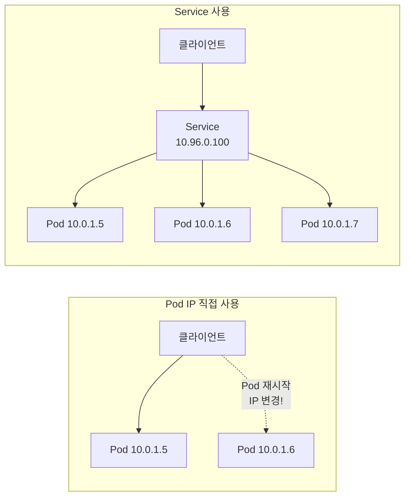
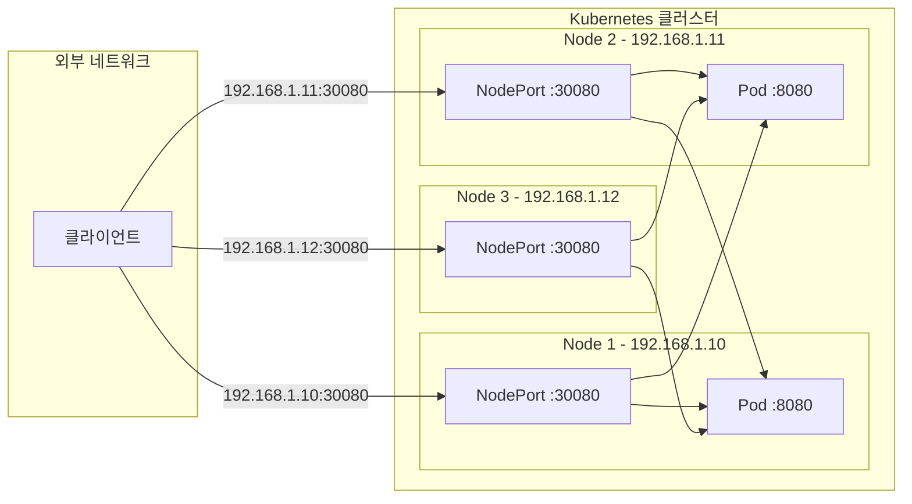
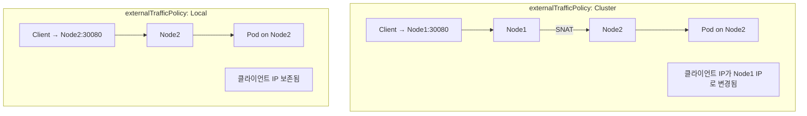
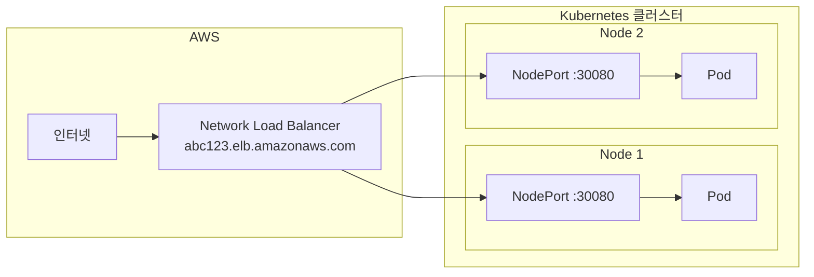
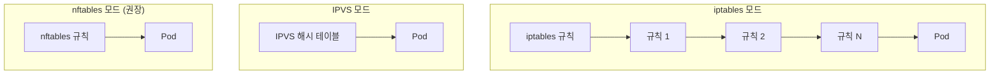
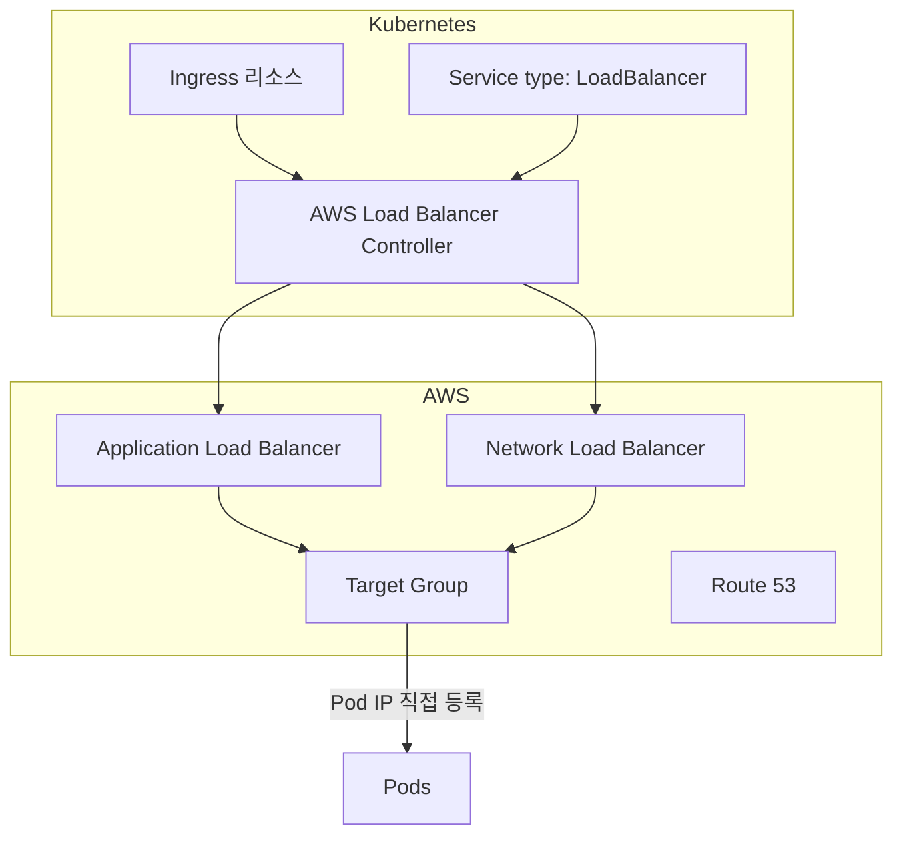
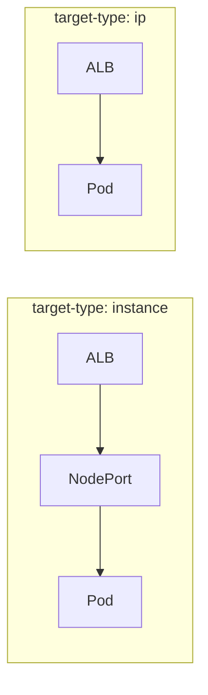
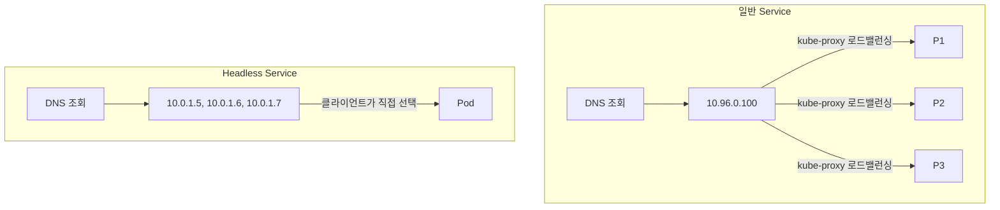
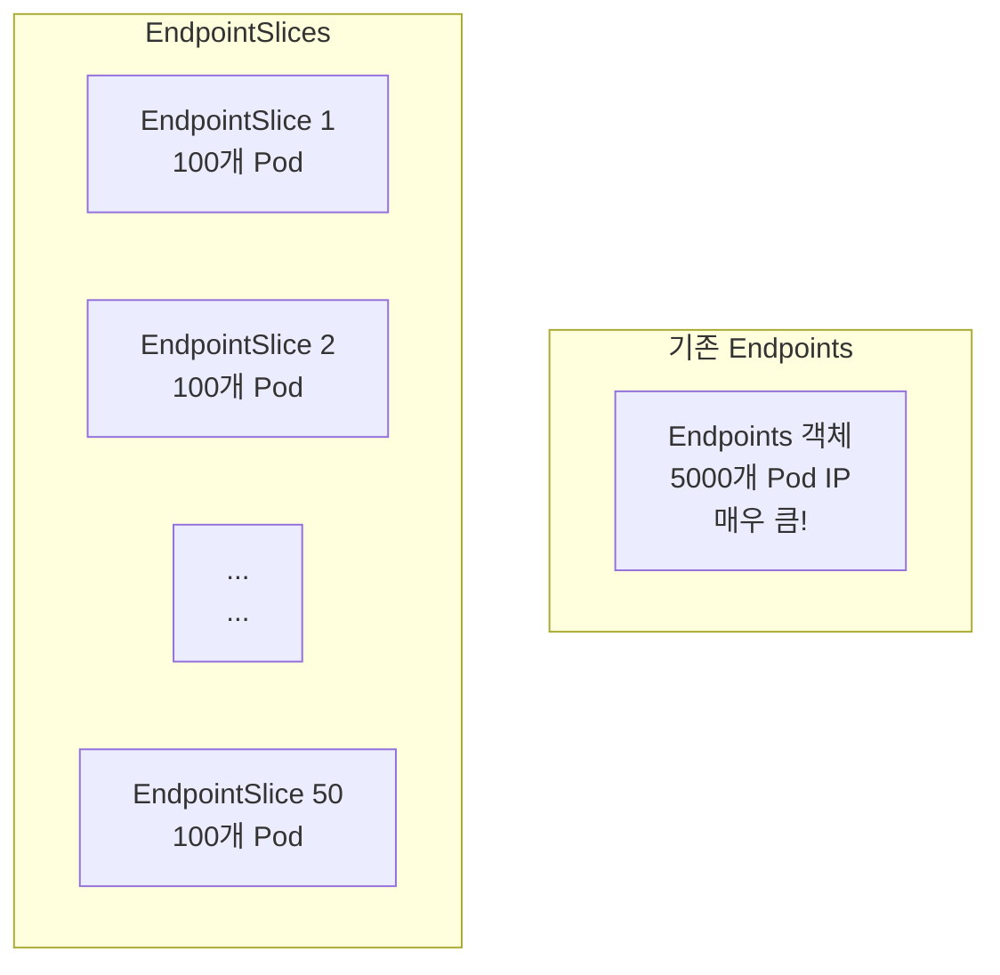

# Kubernetes 심화 시리즈 #2: 서비스 네트워킹의 내부 동작 원리

## 시리즈 개요

| # | 주제 | 핵심 내용 |
|---|------|----------|
| 1 | 워크로드 컨트롤러 심화 | Deployment, StatefulSet, DaemonSet, CronJob |
| **2** | **서비스 네트워킹 심화** | Service 타입, kube-proxy, AWS ALB/NLB |
| 3 | 설정 및 시크릿 관리 | ConfigMap, Secrets, AWS Secrets Manager CSI Driver |
| 4 | Istio 서비스 메시 | VirtualService, DestinationRule, 와일드카드 서브도메인 |
| 5 | 오토스케일링 심화 | HPA, VPA, Cluster Autoscaler, Karpenter, KEDA |
| 6 | 보안 심화 | RBAC, NetworkPolicy, Pod Security Standards |

---

## Service의 본질: Pod 추상화

Pod는 생성될 때마다 **IP가 바뀝니다**. Service는 이 변화하는 Pod들 앞에 **안정적인 엔드포인트**를 제공합니다.



---

## Service 타입별 동작 원리

### ClusterIP (기본값): 클러스터 내부 통신

```yaml
apiVersion: v1
kind: Service
metadata:
  name: backend-api
spec:
  type: ClusterIP  # 기본값, 생략 가능
  selector:
    app: backend
  ports:
  - port: 80         # Service 포트
    targetPort: 8080 # Pod 포트
```

**동작 원리**:

1. Service 생성 시 **ClusterIP** 할당 (예: 10.96.0.100)
2. **Endpoints** 객체 자동 생성 (selector와 일치하는 Pod IP 목록)
3. kube-proxy가 **iptables/IPVS 규칙** 생성
4. ClusterIP로 오는 트래픽을 Pod IP로 로드밸런싱

```bash
# Endpoints 확인 (실제 Pod IP 목록)
kubectl get endpoints backend-api

# 출력 예시:
# NAME          ENDPOINTS                                   AGE
# backend-api   10.0.1.5:8080,10.0.1.6:8080,10.0.1.7:8080   1h
```

### NodePort: 외부에서 노드 IP로 접근

```yaml
apiVersion: v1
kind: Service
metadata:
  name: backend-api
spec:
  type: NodePort
  selector:
    app: backend
  ports:
  - port: 80
    targetPort: 8080
    nodePort: 30080  # 30000-32767 범위, 생략 시 자동 할당
```



> [!IMPORTANT]
> NodePort는 **모든 노드**에서 열립니다. Node3에 Pod가 없어도 30080 포트로 접근하면 다른 노드의 Pod로 트래픽이 전달됩니다.

### externalTrafficPolicy: 트래픽 경로 제어

```yaml
spec:
  type: NodePort
  externalTrafficPolicy: Local  # 기본값: Cluster
```

| 정책 | 동작 | 장점 | 단점 |
|------|-----|------|------|
| `Cluster` | 다른 노드 Pod로도 전달 | 균등한 로드밸런싱 | 추가 홉, 클라이언트 IP 손실 |
| `Local` | 해당 노드의 Pod로만 전달 | 클라이언트 IP 보존, 낮은 지연 | 불균등 분배 가능 |



### LoadBalancer: 클라우드 로드밸런서 통합

```yaml
apiVersion: v1
kind: Service
metadata:
  name: backend-api
  annotations:
    # AWS NLB 사용 (기본은 CLB)
    service.beta.kubernetes.io/aws-load-balancer-type: nlb
    # 인터널 LB
    service.beta.kubernetes.io/aws-load-balancer-internal: "true"
spec:
  type: LoadBalancer
  selector:
    app: backend
  ports:
  - port: 80
    targetPort: 8080
```



**LoadBalancer = NodePort + 클라우드 LB 자동 프로비저닝**

### ExternalName: 외부 서비스 CNAME

```yaml
apiVersion: v1
kind: Service
metadata:
  name: external-db
spec:
  type: ExternalName
  externalName: mydb.us-east-1.rds.amazonaws.com
```

클러스터 내에서 `external-db`로 DNS 조회하면 RDS 주소가 반환됩니다.

```bash
# 클러스터 포드 내에서
nslookup external-db.default.svc.cluster.local
# → mydb.us-east-1.rds.amazonaws.com
```

---

## kube-proxy: Service 구현체

### 모드 비교: iptables vs IPVS vs nftables



| 특성 | iptables | IPVS | **nftables** |
|------|---------|------|-------------|
| **조회 시간** | O(n) | O(1) | O(1) |
| **권장 여부** | 안정적 | ⚠️ Deprecated 예정 | ✅ **권장** |
| **로드밸런싱** | 랜덤 | rr, lc, dh 등 | 다양 |
| **성능** | 개선됨 | 양호 | **최고** |
| **최소 버전** | 모든 버전 | - | K8s 1.31+ (1.33 Stable) |

> [!WARNING]
> **IPVS 모드 Deprecated 예정**: Kubernetes 공식 문서에 따르면 IPVS 모드는 Kubernetes Services API와의 불일치로 인해 향후 deprecated될 예정입니다. 새로운 클러스터에서는 **nftables 모드**(K8s 1.33+ stable) 또는 **iptables 모드**를 권장합니다.

### kube-proxy 모드 설정

```yaml
# nftables 모드 (K8s 1.31+, 권장)
apiVersion: v1
kind: ConfigMap
metadata:
  name: kube-proxy
  namespace: kube-system
data:
  config.conf: |
    mode: "nftables"
```

```yaml
# IPVS 모드 (⚠️ deprecated 예정)
apiVersion: v1
kind: ConfigMap
metadata:
  name: kube-proxy
  namespace: kube-system
data:
  config.conf: |
    mode: "ipvs"
    ipvs:
      scheduler: "rr"  # round-robin
```

---

## AWS Load Balancer Controller

### 개요

AWS Load Balancer Controller는 Ingress와 Service를 **ALB/NLB**로 프로비저닝합니다.



### Ingress로 ALB 생성

```yaml
apiVersion: networking.k8s.io/v1
kind: Ingress
metadata:
  name: my-ingress
  annotations:
    # ALB Ingress Controller
    kubernetes.io/ingress.class: alb
    alb.ingress.kubernetes.io/scheme: internet-facing
    alb.ingress.kubernetes.io/target-type: ip  # Pod IP 직접 연결
    
    # SSL/TLS
    alb.ingress.kubernetes.io/certificate-arn: arn:aws:acm:...
    alb.ingress.kubernetes.io/listen-ports: '[{"HTTPS":443}]'
    alb.ingress.kubernetes.io/ssl-redirect: '443'
    
    # 헬스체크
    alb.ingress.kubernetes.io/healthcheck-path: /health
    alb.ingress.kubernetes.io/healthcheck-interval-seconds: '15'
spec:
  rules:
  - host: api.example.com
    http:
      paths:
      - path: /
        pathType: Prefix
        backend:
          service:
            name: backend-api
            port:
              number: 80
```

### target-type: ip vs instance



| target-type | 경로 | 장점 | 단점 |
|-------------|-----|------|------|
| `instance` | ALB → NodePort → Pod | 간단, 모든 네트워크에서 동작 | 추가 홉, 지연 |
| `ip` | ALB → Pod (직접) | 낮은 지연, 효율적 | VPC CNI 필요, ENI 제한 |

### NLB for TCP/UDP

```yaml
apiVersion: v1
kind: Service
metadata:
  name: tcp-service
  annotations:
    service.beta.kubernetes.io/aws-load-balancer-type: "external"
    service.beta.kubernetes.io/aws-load-balancer-nlb-target-type: "ip"
    service.beta.kubernetes.io/aws-load-balancer-scheme: "internet-facing"
spec:
  type: LoadBalancer
  selector:
    app: my-app
  ports:
  - port: 9000
    targetPort: 9000
    protocol: TCP
```

---

## Headless Service 심화

Selector가 있지만 ClusterIP가 없는 Service입니다. DNS 조회 시 Service IP가 아닌 Pod IP 목록을 직접 반환합니다.

```yaml
apiVersion: v1
kind: Service
metadata:
  name: mysql
spec:
  clusterIP: None  # Headless!
  selector:
    app: mysql
  ports:
  - port: 3306
```

### DNS 해석 차이

```bash
# 일반 Service: ClusterIP 반환
nslookup backend-api.default.svc.cluster.local
# → 10.96.0.100

# Headless Service: 모든 Pod IP 반환
nslookup mysql.default.svc.cluster.local
# → 10.0.1.5
# → 10.0.1.6
# → 10.0.1.7
```



### 사용 사례

| 사용 사례 | 이유 |
|----------|-----|
| StatefulSet | 각 Pod에 고유 DNS 필요 (`mysql-0.mysql.svc`) |
| 클라이언트 측 로드밸런싱 | gRPC, 커스텀 LB 알고리즘 |
| 서비스 디스커버리 | Consul, etcd 같은 클러스터 |

---

## EndpointSlices: 대규모 클러스터 최적화

Endpoints 객체는 Service당 하나이며, **모든 Pod IP**를 담습니다. Pod가 수천 개면 문제가 됩니다.



**EndpointSlices 장점**:

- 최대 100개 엔드포인트씩 분할
- 변경 시 해당 슬라이스만 업데이트
- etcd 부하 감소

```bash
# EndpointSlices 확인
kubectl get endpointslices -l kubernetes.io/service-name=my-service
```

---

## 트러블슈팅 가이드

### Service에 연결되지 않음

```bash
# 1. Endpoints 확인 (비어있으면 selector 문제)
kubectl get endpoints my-service

# 2. Pod label 확인
kubectl get pods --show-labels

# 3. Pod readiness 확인
kubectl get pods -o wide
```

### NodePort로 외부 접속 불가

```bash
# 1. NodePort 확인
kubectl get svc my-service

# 2. 방화벽/Security Group 확인
# AWS: EC2 Security Group에서 NodePort 범위 허용

# 3. iptables 규칙 확인
sudo iptables -t nat -L KUBE-SERVICES -n
```

### LoadBalancer EXTERNAL-IP가 `<pending>`

```bash
# 1. AWS Load Balancer Controller 로그 확인
kubectl logs -n kube-system -l app.kubernetes.io/name=aws-load-balancer-controller

# 2. 서비스 이벤트 확인
kubectl describe svc my-service

# 3. IAM 권한 확인 (IRSA)
```

**흔한 원인**:

1. Cloud Controller Manager 미설치 (On-prem)
2. IAM 권한 부족
3. 서브넷 태그 누락 (`kubernetes.io/role/elb`)

---

## 정리

| 구성요소 | 역할 |
|---------|-----|
| **ClusterIP** | 클러스터 내부 가상 IP |
| **NodePort** | 모든 노드에서 고정 포트 노출 |
| **LoadBalancer** | 클라우드 LB 자동 프로비저닝 |
| **ExternalName** | 외부 서비스 DNS CNAME |
| **kube-proxy** | iptables/IPVS로 패킷 라우팅 |
| **AWS LB Controller** | Ingress → ALB, Service → NLB |
| **Headless Service** | 각 Pod에 직접 DNS 접근 |

---

## 다음 편 예고

**3편: 설정 및 시크릿 관리**에서는 다음을 다룹니다:

- ConfigMap과 Secrets의 내부 동작
- Secrets at Rest Encryption
- AWS Secrets Manager + CSI Driver 통합
- External Secrets Operator

---

## 참고 자료

- [Kubernetes Services](https://kubernetes.io/docs/concepts/services-networking/service/)
- [kube-proxy Modes](https://kubernetes.io/docs/reference/networking/virtual-ips/)
- [AWS Load Balancer Controller](https://kubernetes-sigs.github.io/aws-load-balancer-controller/)
