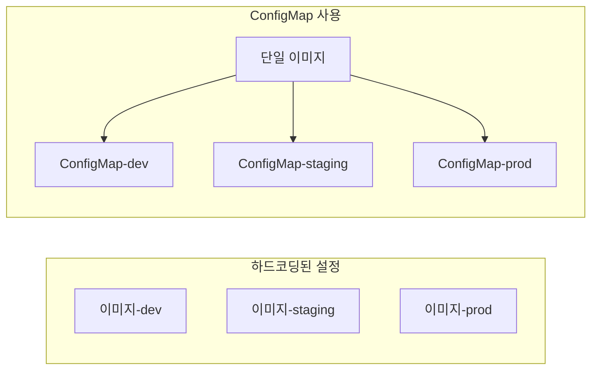
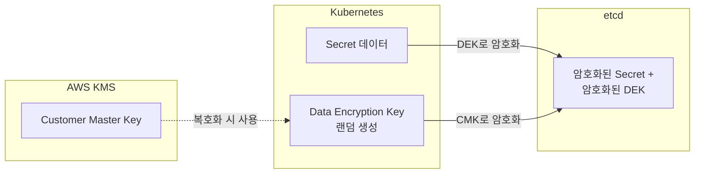
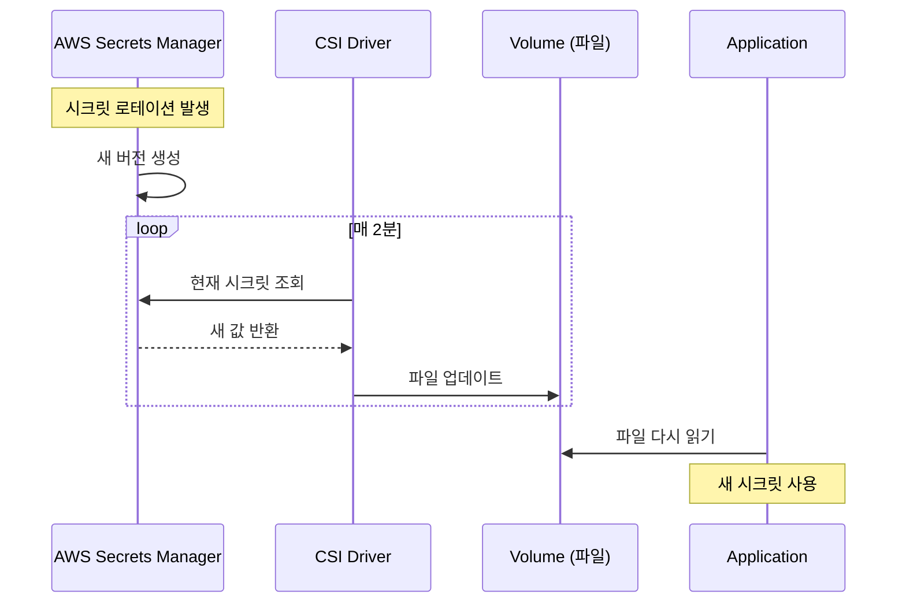
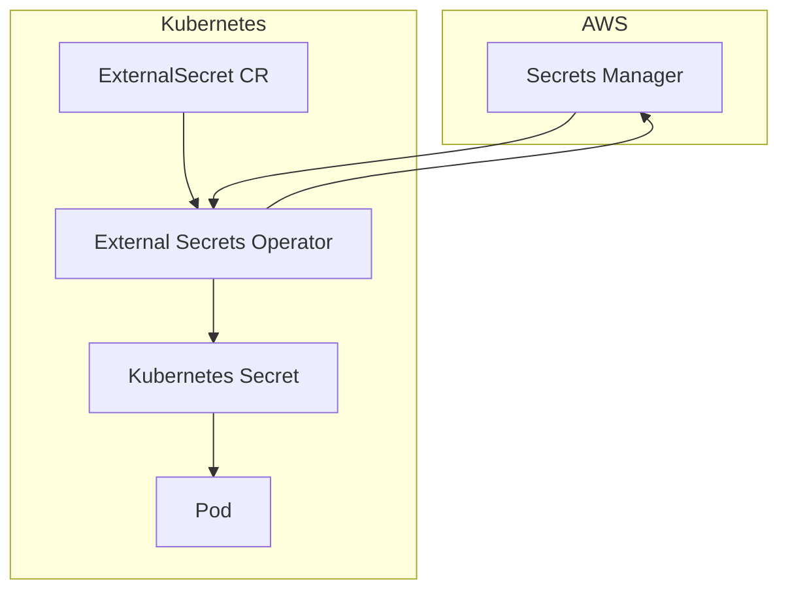

# Kubernetes 심화 시리즈 #3: 설정 및 시크릿 관리 완전 가이드

## 시리즈 개요

| # | 주제 | 핵심 내용 |
|---|------|----------|
| 1 | 워크로드 컨트롤러 심화 | Deployment, StatefulSet, DaemonSet, CronJob |
| 2 | 서비스 네트워킹 심화 | Service 타입, kube-proxy, AWS ALB/NLB |
| **3** | **설정 및 시크릿 관리** | ConfigMap, Secrets, AWS Secrets Manager CSI Driver |
| 4 | Istio 서비스 메시 | VirtualService, DestinationRule, 와일드카드 서브도메인 |

---

## ConfigMap: 설정의 외부화

### 왜 ConfigMap인가?

컨테이너 이미지에 설정을 하드코딩하면:

```
❌ 환경별 이미지 빌드 필요 (dev, staging, prod)
❌ 설정 변경 시 재배포 필요
❌ 설정 재사용 불가
```

ConfigMap으로 **설정과 코드를 분리**합니다.



### ConfigMap 생성 방법

```yaml
# 직접 정의
apiVersion: v1
kind: ConfigMap
metadata:
  name: app-config
data:
  # 키-값 쌍
  DATABASE_HOST: mysql.default.svc.cluster.local
  DATABASE_PORT: "3306"
  LOG_LEVEL: info
  
  # 파일 내용
  nginx.conf: |
    server {
      listen 80;
      location / {
        proxy_pass http://backend:8080;
      }
    }
```

```bash
# 파일에서 생성
kubectl create configmap nginx-config --from-file=nginx.conf

# 리터럴에서 생성
kubectl create configmap app-config \
  --from-literal=DATABASE_HOST=mysql \
  --from-literal=LOG_LEVEL=debug
```

### ConfigMap 사용 패턴

#### 1. 환경변수로 주입

```yaml
spec:
  containers:
  - name: app
    env:
    # 개별 키 선택
    - name: DB_HOST
      valueFrom:
        configMapKeyRef:
          name: app-config
          key: DATABASE_HOST
    
    # 전체 ConfigMap을 환경변수로
    envFrom:
    - configMapRef:
        name: app-config
```

#### 2. 볼륨으로 마운트

```yaml
spec:
  containers:
  - name: nginx
    volumeMounts:
    - name: config-volume
      mountPath: /etc/nginx/nginx.conf
      subPath: nginx.conf  # 특정 키만 파일로
      
  volumes:
  - name: config-volume
    configMap:
      name: nginx-config
```

### 불변(Immutable) ConfigMap

```yaml
apiVersion: v1
kind: ConfigMap
metadata:
  name: app-config
immutable: true  # K8s 1.21+
data:
  LOG_LEVEL: info
```

**장점**:

- API Server 부하 감소 (watch 제거)
- 실수로 인한 변경 방지

**단점**:

- 변경하려면 새 ConfigMap 생성 필요
- Pod 재배포 필요

---

## Secrets: 민감 정보 관리

### ConfigMap vs Secrets

| 특성 | ConfigMap | Secrets |
|------|-----------|---------|
| 용도 | 일반 설정 | 민감 정보 |
| 저장 | 평문 | Base64 인코딩 |
| 크기 제한 | 1MB | 1MB |
| etcd 저장 | 평문 | 암호화 가능 (별도 설정) |
| kubectl 출력 | 그대로 표시 | 기본적으로 숨김 |

> [!CAUTION]
> Base64는 **인코딩**이지 **암호화**가 아닙니다! 누구나 디코딩할 수 있습니다. 반드시 **Secrets at Rest Encryption**을 활성화하세요.

### Secret 타입

```yaml
# Opaque (기본값) - 일반 시크릿
apiVersion: v1
kind: Secret
metadata:
  name: db-credentials
type: Opaque
data:
  username: YWRtaW4=      # echo -n 'admin' | base64
  password: cGFzc3dvcmQ=  # echo -n 'password' | base64

# 또는 stringData 사용 (자동 인코딩)
stringData:
  username: admin
  password: password
```

```yaml
# TLS 인증서
apiVersion: v1
kind: Secret
metadata:
  name: tls-secret
type: kubernetes.io/tls
data:
  tls.crt: <base64-encoded-cert>
  tls.key: <base64-encoded-key>
```

```yaml
# Docker Registry 인증
apiVersion: v1
kind: Secret
metadata:
  name: regcred
type: kubernetes.io/dockerconfigjson
data:
  .dockerconfigjson: <base64-encoded-docker-config>
```

### Secrets 사용 패턴

```yaml
spec:
  containers:
  - name: app
    # 환경변수로 주입
    env:
    - name: DB_PASSWORD
      valueFrom:
        secretKeyRef:
          name: db-credentials
          key: password
    
    # 볼륨으로 마운트 (파일)
    volumeMounts:
    - name: secrets-volume
      mountPath: /etc/secrets
      readOnly: true
      
  volumes:
  - name: secrets-volume
    secret:
      secretName: db-credentials
```

### ServiceAccount Token 자동 마운트 비활성화

모든 Pod에 ServiceAccount 토큰이 자동 마운트됩니다. 필요 없다면 비활성화하세요.

```yaml
spec:
  automountServiceAccountToken: false
  containers:
  - name: app
```

---

## Secrets at Rest Encryption

etcd에 저장된 Secrets를 암호화합니다.

### EncryptionConfiguration

```yaml
# /etc/kubernetes/encryption-config.yaml
apiVersion: apiserver.config.k8s.io/v1
kind: EncryptionConfiguration
resources:
  - resources:
      - secrets
    providers:
      # AWS KMS 사용
      - kms:
          apiVersion: v2
          name: aws-encryption-provider
          endpoint: unix:///var/run/kmsplugin/socket.sock
          cachesize: 1000
          timeout: 3s
      # 폴백: identity (암호화 안 함)
      - identity: {}
```

### EKS에서 Envelope Encryption

EKS는 **AWS KMS**를 사용한 Envelope Encryption을 지원합니다.



```bash
# EKS 클러스터에 KMS 키 연결
aws eks associate-encryption-config \
  --cluster-name my-cluster \
  --encryption-config '[{
    "resources": ["secrets"],
    "provider": {
      "keyArn": "arn:aws:kms:ap-northeast-2:123456789012:key/12345678-1234-1234-1234-123456789012"
    }
  }]'
```

---

## AWS Secrets Manager + CSI Driver

### 문제: Kubernetes Secrets의 한계

```
❌ 시크릿이 etcd에 저장됨 (클러스터 침해 시 노출)
❌ 시크릿 로테이션 어려움
❌ 감사(Audit) 기능 제한적
❌ 버전 관리 없음
```

### 해결: External Secrets Store

```mermaid
flowchart TB
    subgraph AWS [AWS]
        SM[Secrets Manager]
    end
    
    subgraph K8s [Kubernetes 클러스터]
        CSI[Secrets Store CSI Driver]
        ASCP[AWS Secrets & Config Provider]
        Pod[Application Pod]
        
        subgraph Mount [Pod 내부]
            File[/mnt/secrets/db-password]
            Env[ENV: DB_PASSWORD]
        end
    end
    
    SM --> ASCP --> CSI --> Pod
    Pod --> Mount
```

### 설치

```bash
# Secrets Store CSI Driver 설치
helm repo add secrets-store-csi-driver \
  https://kubernetes-sigs.github.io/secrets-store-csi-driver/charts

helm install csi-secrets-store \
  secrets-store-csi-driver/secrets-store-csi-driver \
  --namespace kube-system \
  --set syncSecret.enabled=true \
  --set enableSecretRotation=true

# AWS Provider 설치
kubectl apply -f https://raw.githubusercontent.com/aws/secrets-store-csi-driver-provider-aws/main/deployment/aws-provider-installer.yaml
```

### IRSA (IAM Roles for Service Accounts) 설정

```bash
# OIDC Provider 연결 (EKS 클러스터 생성 시 자동)
eksctl utils associate-iam-oidc-provider \
  --cluster my-cluster \
  --approve

# ServiceAccount용 IAM Role 생성
eksctl create iamserviceaccount \
  --cluster my-cluster \
  --namespace default \
  --name my-app-sa \
  --attach-policy-arn arn:aws:iam::123456789012:policy/SecretsManagerReadPolicy \
  --approve
```

### SecretProviderClass 정의

```yaml
apiVersion: secrets-store.csi.x-k8s.io/v1
kind: SecretProviderClass
metadata:
  name: aws-secrets
spec:
  provider: aws
  parameters:
    objects: |
      - objectName: "prod/myapp/db-credentials"
        objectType: "secretsmanager"
        jmesPath:
          - path: username
            objectAlias: db-username
          - path: password
            objectAlias: db-password
      - objectName: "prod/myapp/api-key"
        objectType: "secretsmanager"
        
  # Kubernetes Secret으로도 동기화 (optional)
  secretObjects:
  - secretName: db-credentials-k8s
    type: Opaque
    data:
    - objectName: db-username
      key: username
    - objectName: db-password
      key: password
```

### Pod에서 사용

```yaml
apiVersion: v1
kind: Pod
metadata:
  name: my-app
spec:
  serviceAccountName: my-app-sa  # IRSA 연결된 SA
  
  containers:
  - name: app
    image: my-app:latest
    
    # 파일로 마운트된 시크릿 경로
    volumeMounts:
    - name: secrets
      mountPath: /mnt/secrets
      readOnly: true
    
    # 환경변수로도 사용 가능 (secretObjects 사용 시)
    env:
    - name: DB_PASSWORD
      valueFrom:
        secretKeyRef:
          name: db-credentials-k8s
          key: password
          
  volumes:
  - name: secrets
    csi:
      driver: secrets-store.csi.k8s.io
      readOnly: true
      volumeAttributes:
        secretProviderClass: aws-secrets
```

### 시크릿 로테이션

```yaml
# Secrets Store CSI Driver 설치 시 옵션
helm upgrade csi-secrets-store \
  secrets-store-csi-driver/secrets-store-csi-driver \
  --namespace kube-system \
  --set enableSecretRotation=true \
  --set rotationPollInterval=2m  # 2분마다 체크
```



> [!TIP]
> 애플리케이션이 파일 변경을 감지하도록 구현하거나, 주기적으로 파일을 다시 읽도록 해야 합니다. 환경변수 동기화 시에는 Pod 재시작이 필요합니다.

---

## External Secrets Operator (대안)

CSI Driver의 대안으로, **Kubernetes Secret을 직접 생성**하는 방식입니다.



### CSI Driver vs External Secrets Operator

| 특성 | CSI Driver | External Secrets Operator |
|------|-----------|--------------------------|
| 시크릿 저장 위치 | Pod 로컬 볼륨 (tmpfs) | Kubernetes Secret (etcd) |
| 설치 복잡도 | DaemonSet + Provider | Deployment |
| GitOps 친화성 | 낮음 | 높음 (ExternalSecret CRD) |
| etcd에 저장 | 안 됨 | 됨 |
| 호환성 | CSI 지원 필요 | 모든 환경 |

---

## 베스트 프랙티스

### 1. 환경별 네임스페이스 분리

```yaml
# dev 네임스페이스
apiVersion: v1
kind: ConfigMap
metadata:
  name: app-config
  namespace: dev
data:
  LOG_LEVEL: debug
---
# prod 네임스페이스
apiVersion: v1
kind: ConfigMap
metadata:
  name: app-config
  namespace: prod
data:
  LOG_LEVEL: warn
```

### 2. RBAC로 시크릿 접근 제한

```yaml
apiVersion: rbac.authorization.k8s.io/v1
kind: Role
metadata:
  name: secret-reader
  namespace: prod
rules:
- apiGroups: [""]
  resources: ["secrets"]
  resourceNames: ["db-credentials"]  # 특정 시크릿만
  verbs: ["get"]
---
apiVersion: rbac.authorization.k8s.io/v1
kind: RoleBinding
metadata:
  name: app-secret-binding
  namespace: prod
subjects:
- kind: ServiceAccount
  name: my-app-sa
  namespace: prod
roleRef:
  kind: Role
  name: secret-reader
  apiGroup: rbac.authorization.k8s.io
```

### 3. 감사 로깅 활성화

```yaml
# Audit Policy
apiVersion: audit.k8s.io/v1
kind: Policy
rules:
- level: Metadata
  resources:
  - group: ""
    resources: ["secrets"]
```

### 4. 시크릿 값 변경 시 Pod 재시작

```yaml
# Deployment 템플릿에 checksum 추가
spec:
  template:
    metadata:
      annotations:
        checksum/secret: {{ include (print $.Template.BasePath "/secret.yaml") . | sha256sum }}
```

---

## 트러블슈팅 가이드

### CSI Driver Pod가 시크릿을 읽지 못함

```bash
# 1. Provider Pod 로그 확인
kubectl logs -n kube-system -l app=csi-secrets-store-provider-aws

# 2. IRSA 설정 확인
kubectl describe sa my-app-sa

# 3. IAM Role의 Trust Policy 확인
aws iam get-role --role-name MyAppRole --query 'Role.AssumeRolePolicyDocument'
```

**흔한 원인**:

1. OIDC Provider 미설정
2. ServiceAccount와 IAM Role 연결 누락
3. Secrets Manager 접근 권한 누락

### ConfigMap 변경이 Pod에 반영되지 않음

```bash
# 1. 환경변수로 주입한 경우: Pod 재시작 필요
kubectl rollout restart deployment/my-app

# 2. 볼륨으로 마운트한 경우: kubelet sync 대기 (기본 1분)
# 즉시 반영하려면:
kubectl exec -it my-pod -- cat /etc/config/my-key
```

> [!IMPORTANT]
> 볼륨 마운트 시 파일은 자동 업데이트되지만, 애플리케이션이 파일을 캐싱하고 있다면 재시작이 필요합니다.

---

## 정리

| 구성요소 | 용도 | 보안 수준 |
|---------|-----|---------|
| **ConfigMap** | 일반 설정 | 평문 |
| **Secrets** | 민감 정보 (etcd) | Base64 + (암호화 가능) |
| **Secrets at Rest** | etcd 암호화 | KMS 암호화 |
| **CSI Driver** | 외부 저장소 연동 | 저장소 외부화 |
| **External Secrets** | K8s Secret 동기화 | GitOps 친화적 |

---

## 다음 편 예고

**4편: Istio 서비스 메시**에서는 다음을 다룹니다:

- Istio 아키텍처 (istiod, Envoy Sidecar)
- VirtualService와 DestinationRule
- Gateway + 와일드카드 서브도메인 + Route 53 통합
- mTLS와 보안 정책

---

## 참고 자료

- [Kubernetes ConfigMaps](https://kubernetes.io/docs/concepts/configuration/configmap/)
- [Kubernetes Secrets](https://kubernetes.io/docs/concepts/configuration/secret/)
- [Secrets Store CSI Driver](https://secrets-store-csi-driver.sigs.k8s.io/)
- [AWS Secrets Manager Provider](https://github.com/aws/secrets-store-csi-driver-provider-aws)
