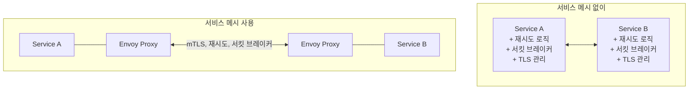
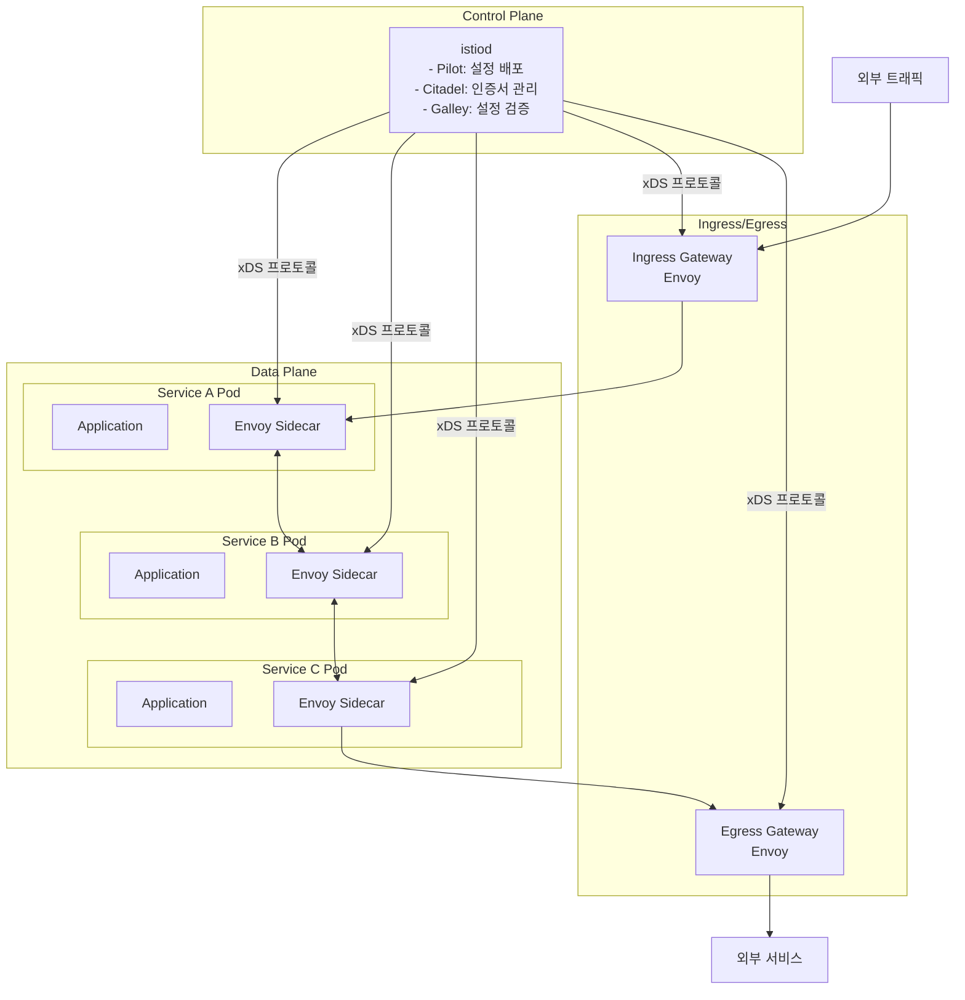
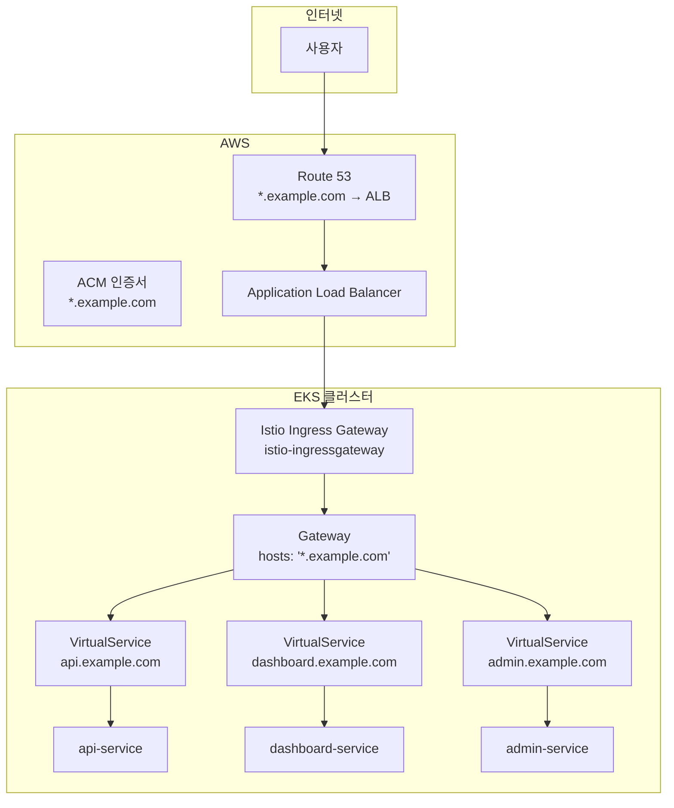
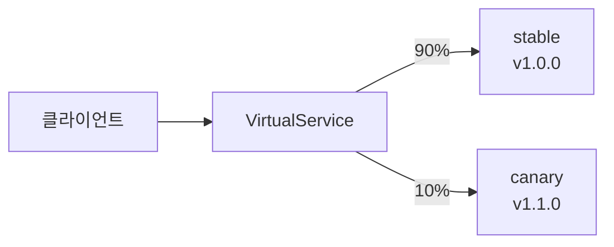
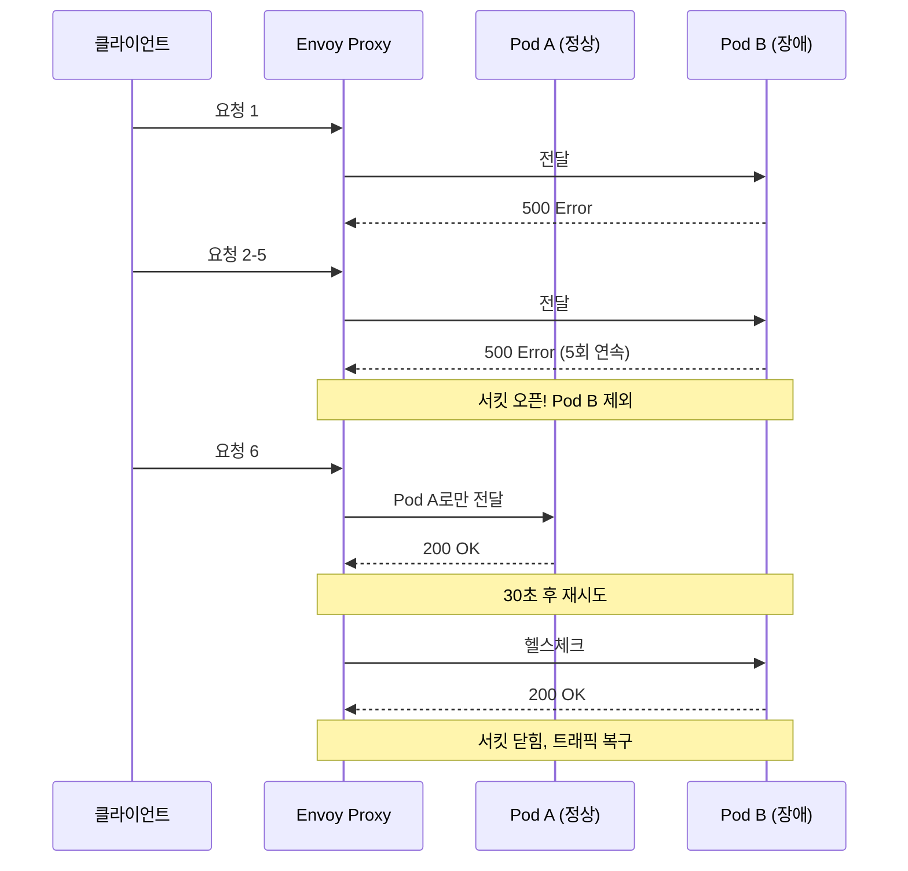
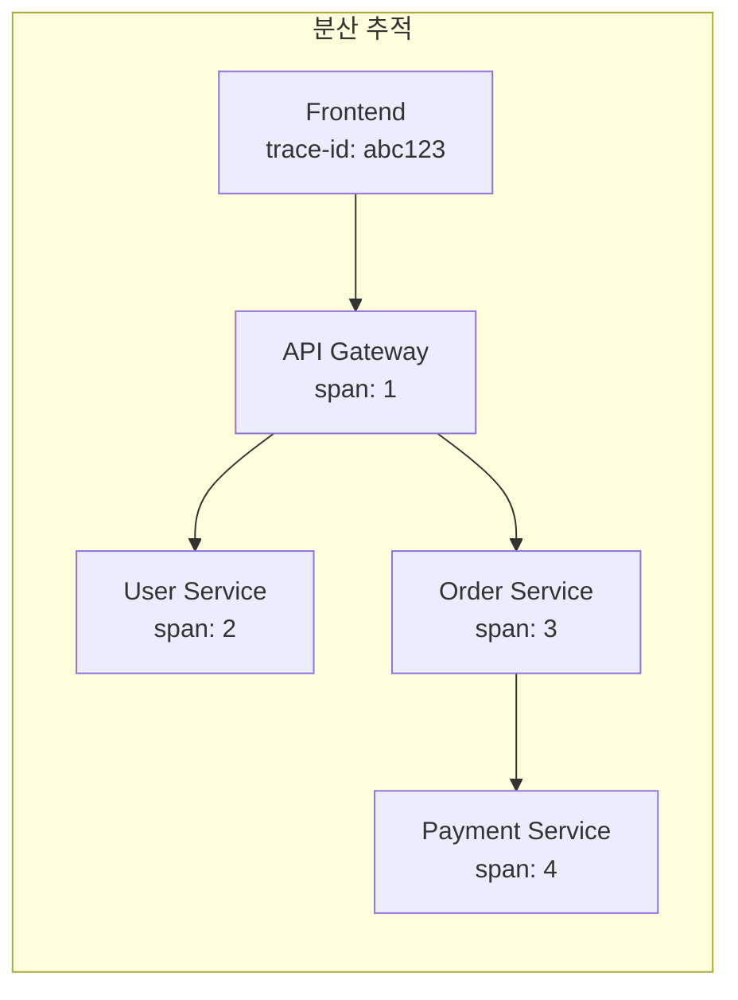

# Kubernetes 심화 시리즈 #4: Istio 서비스 메시 완전 가이드

## 시리즈 개요

| # | 주제 | 핵심 내용 |
|---|------|----------|
| 1 | 워크로드 컨트롤러 심화 | Deployment, StatefulSet, DaemonSet, CronJob |
| 2 | 서비스 네트워킹 심화 | Service 타입, kube-proxy, AWS ALB/NLB |
| 3 | 설정 및 시크릿 관리 | ConfigMap, Secrets, AWS Secrets Manager CSI Driver |
| **4** | **Istio 서비스 메시** | VirtualService, DestinationRule, 와일드카드 서브도메인 |
| 5 | 오토스케일링 심화 | HPA, VPA, Cluster Autoscaler, Karpenter, KEDA |
| 6 | 보안 심화 | RBAC, NetworkPolicy, Pod Security Standards |

---

## 왜 서비스 메시인가?

마이크로서비스 아키텍처에서는 서비스 간 통신이 핵심입니다. 하지만 각 서비스에 다음을 구현하면:

```
❌ 재시도/타임아웃 로직 중복
❌ 서킷 브레이커 각각 구현
❌ mTLS 직접 관리
❌ 트래픽 분할/카나리 배포 어려움
❌ 분산 추적 연동 복잡
```

**서비스 메시**는 이러한 **횡단 관심사(Cross-cutting Concerns)**를 애플리케이션에서 분리하여 인프라 레이어에서 처리합니다.



---

## Istio 아키텍처

### Control Plane vs Data Plane



### Envoy Sidecar 자동 주입

```yaml
# 네임스페이스에 라벨 추가
apiVersion: v1
kind: Namespace
metadata:
  name: my-app
  labels:
    istio-injection: enabled  # 자동 sidecar 주입
```

모든 Pod에 Envoy 컨테이너가 자동으로 추가됩니다:

```yaml
# 실제 생성된 Pod 확인
kubectl get pod my-app-xxx -o yaml

# 컨테이너 2개: app, istio-proxy
containers:
- name: my-app
  image: my-app:v1
- name: istio-proxy
  image: docker.io/istio/proxyv2:1.20.0
```

---

## Gateway: 외부 트래픽 진입점

### 기본 Gateway 설정

```yaml
apiVersion: networking.istio.io/v1
kind: Gateway
metadata:
  name: my-gateway
  namespace: istio-system
spec:
  selector:
    istio: ingressgateway  # Istio Ingress Gateway Pod 선택
  servers:
  - port:
      number: 80
      name: http
      protocol: HTTP
    hosts:
    - "api.example.com"
    - "dashboard.example.com"
```

### HTTPS + AWS ACM 연동

```yaml
apiVersion: networking.istio.io/v1
kind: Gateway
metadata:
  name: secure-gateway
  namespace: istio-system
spec:
  selector:
    istio: ingressgateway
  servers:
  - port:
      number: 443
      name: https
      protocol: HTTPS
    tls:
      mode: SIMPLE
      credentialName: my-tls-secret  # Kubernetes TLS Secret
    hosts:
    - "*.example.com"  # 와일드카드!
```

---

## 와일드카드 서브도메인 라우팅 (실전 패턴)

여러 서비스를 `api.example.com`, `dashboard.example.com`, `admin.example.com` 형태로 쉽게 배포할 수 있는 이유는 **Istio + AWS Route 53 + ACM 통합** 덕분입니다. 이 패턴의 핵심 구조를 살펴보겠습니다.

### 전체 아키텍처



### Step 1: AWS Route 53 와일드카드 레코드

```bash
# Route 53에 와일드카드 A 레코드 생성
aws route53 change-resource-record-sets \
  --hosted-zone-id Z1234567890 \
  --change-batch '{
    "Changes": [{
      "Action": "CREATE",
      "ResourceRecordSet": {
        "Name": "*.example.com",
        "Type": "A",
        "AliasTarget": {
          "HostedZoneId": "Z35SXDOTRQ7X7K",
          "DNSName": "my-alb-123456789.ap-northeast-2.elb.amazonaws.com",
          "EvaluateTargetHealth": true
        }
      }
    }]
  }'
```

### Step 2: AWS ACM 와일드카드 인증서

```bash
# 와일드카드 인증서 요청
aws acm request-certificate \
  --domain-name "*.example.com" \
  --subject-alternative-names "example.com" \
  --validation-method DNS
```

### Step 3: ALB + Istio Ingress Gateway 연결

```yaml
# Istio Ingress Gateway Service (LoadBalancer)
apiVersion: v1
kind: Service
metadata:
  name: istio-ingressgateway
  namespace: istio-system
  annotations:
    # ALB 사용
    service.beta.kubernetes.io/aws-load-balancer-type: "external"
    service.beta.kubernetes.io/aws-load-balancer-nlb-target-type: "ip"
    service.beta.kubernetes.io/aws-load-balancer-scheme: "internet-facing"
    
    # HTTPS 종료는 ALB에서 (ACM 인증서 사용)
    service.beta.kubernetes.io/aws-load-balancer-ssl-cert: "arn:aws:acm:ap-northeast-2:123456789012:certificate/xxx"
    service.beta.kubernetes.io/aws-load-balancer-ssl-ports: "443"
spec:
  type: LoadBalancer
  ports:
  - port: 443
    targetPort: 8080  # Istio Gateway는 8080에서 수신
    name: https
```

### Step 4: Istio Gateway (와일드카드)

```yaml
apiVersion: networking.istio.io/v1
kind: Gateway
metadata:
  name: wildcard-gateway
  namespace: istio-system
spec:
  selector:
    istio: ingressgateway
  servers:
  - port:
      number: 8080      # ALB에서 TLS 종료 후 8080으로 전달
      name: http
      protocol: HTTP
    hosts:
    - "*.example.com"   # 와일드카드로 모든 서브도메인 수신
```

### Step 5: 서비스별 VirtualService

```yaml
# API 서비스
apiVersion: networking.istio.io/v1
kind: VirtualService
metadata:
  name: api-vs
  namespace: my-app
spec:
  hosts:
  - "api.example.com"
  gateways:
  - istio-system/wildcard-gateway
  http:
  - route:
    - destination:
        host: api-service
        port:
          number: 80
---
# Dashboard 서비스
apiVersion: networking.istio.io/v1
kind: VirtualService
metadata:
  name: dashboard-vs
  namespace: my-app
spec:
  hosts:
  - "dashboard.example.com"
  gateways:
  - istio-system/wildcard-gateway
  http:
  - route:
    - destination:
        host: dashboard-service
        port:
          number: 80
---
# Admin 서비스
apiVersion: networking.istio.io/v1
kind: VirtualService
metadata:
  name: admin-vs
  namespace: my-app
spec:
  hosts:
  - "admin.example.com"
  gateways:
  - istio-system/wildcard-gateway
  http:
  - route:
    - destination:
        host: admin-service
        port:
          number: 80
```

> [!TIP]
> 이 구조에서 **새 서비스 추가**는 VirtualService 하나만 추가하면 됩니다. DNS나 인증서 작업이 필요 없습니다!

---

## VirtualService: L7 라우팅 규칙

### 경로 기반 라우팅

```yaml
apiVersion: networking.istio.io/v1
kind: VirtualService
metadata:
  name: api-routing
spec:
  hosts:
  - "api.example.com"
  gateways:
  - istio-system/wildcard-gateway
  http:
  # /v1/* → v1 서비스
  - match:
    - uri:
        prefix: /v1/
    route:
    - destination:
        host: api-v1
        
  # /v2/* → v2 서비스
  - match:
    - uri:
        prefix: /v2/
    route:
    - destination:
        host: api-v2
        
  # 기본 → latest
  - route:
    - destination:
        host: api-latest
```

### 가중치 기반 트래픽 분할 (카나리 배포)

```yaml
apiVersion: networking.istio.io/v1
kind: VirtualService
metadata:
  name: canary-rollout
spec:
  hosts:
  - api-service
  http:
  - route:
    - destination:
        host: api-service
        subset: stable
      weight: 90
    - destination:
        host: api-service
        subset: canary
      weight: 10
```



### 헤더 기반 라우팅 (A/B 테스팅)

```yaml
apiVersion: networking.istio.io/v1
kind: VirtualService
metadata:
  name: ab-testing
spec:
  hosts:
  - api-service
  http:
  # Beta 사용자 → 새 버전
  - match:
    - headers:
        x-user-group:
          exact: beta
    route:
    - destination:
        host: api-service
        subset: v2
        
  # 나머지 → 기존 버전
  - route:
    - destination:
        host: api-service
        subset: v1
```

### 타임아웃과 재시도

```yaml
apiVersion: networking.istio.io/v1
kind: VirtualService
metadata:
  name: timeout-retry
spec:
  hosts:
  - api-service
  http:
  - route:
    - destination:
        host: api-service
    timeout: 10s  # 10초 타임아웃
    retries:
      attempts: 3          # 최대 3회 재시도
      perTryTimeout: 2s    # 각 시도당 2초 타임아웃
      retryOn: "5xx,reset,connect-failure"
```

---

## DestinationRule: 트래픽 정책

### Subset 정의

```yaml
apiVersion: networking.istio.io/v1
kind: DestinationRule
metadata:
  name: api-service-dr
spec:
  host: api-service
  subsets:
  - name: stable
    labels:
      version: v1
  - name: canary
    labels:
      version: v2
```

### 로드밸런싱 알고리즘

```yaml
apiVersion: networking.istio.io/v1
kind: DestinationRule
metadata:
  name: lb-policy
spec:
  host: api-service
  trafficPolicy:
    loadBalancer:
      simple: LEAST_CONN  # 최소 연결 수
      # ROUND_ROBIN (기본값)
      # RANDOM
      # PASSTHROUGH (원래 IP로 전달)
```

### 서킷 브레이커

```yaml
apiVersion: networking.istio.io/v1
kind: DestinationRule
metadata:
  name: circuit-breaker
spec:
  host: api-service
  trafficPolicy:
    connectionPool:
      tcp:
        maxConnections: 100      # 최대 연결 수
      http:
        h2UpgradePolicy: UPGRADE
        http1MaxPendingRequests: 100
        http2MaxRequests: 1000
        
    outlierDetection:
      consecutive5xxErrors: 5    # 연속 5xx 에러 5번
      interval: 30s              # 30초 간격으로 체크
      baseEjectionTime: 30s      # 30초간 트래픽 제외
      maxEjectionPercent: 50     # 최대 50%까지 제외
```



---

## mTLS: 서비스 간 암호화

### PeerAuthentication

```yaml
# 네임스페이스 전체에 mTLS 강제
apiVersion: security.istio.io/v1
kind: PeerAuthentication
metadata:
  name: default
  namespace: my-app
spec:
  mtls:
    mode: STRICT  # mTLS 필수
```

| 모드 | 설명 |
|------|-----|
| `DISABLE` | mTLS 비활성화 |
| `PERMISSIVE` | mTLS와 평문 모두 허용 (마이그레이션 시 유용) |
| `STRICT` | mTLS만 허용 |

### AuthorizationPolicy (접근 제어)

```yaml
apiVersion: security.istio.io/v1
kind: AuthorizationPolicy
metadata:
  name: api-access-policy
  namespace: my-app
spec:
  selector:
    matchLabels:
      app: api-service
  rules:
  # frontend에서만 접근 허용
  - from:
    - source:
        principals: ["cluster.local/ns/my-app/sa/frontend"]
    to:
    - operation:
        methods: ["GET", "POST"]
        paths: ["/api/*"]
```

---

## Observability 연동

Istio는 자동으로 메트릭, 로그, 트레이스를 수집합니다.

### Kiali: 서비스 메시 시각화

```bash
# Kiali 설치
kubectl apply -f https://raw.githubusercontent.com/istio/istio/release-1.20/samples/addons/kiali.yaml

# 대시보드 접근
kubectl port-forward -n istio-system svc/kiali 20001:20001
```

### Jaeger: 분산 추적

```bash
# Jaeger 설치
kubectl apply -f https://raw.githubusercontent.com/istio/istio/release-1.20/samples/addons/jaeger.yaml

# 대시보드 접근
kubectl port-forward -n istio-system svc/tracing 16686:80
```



---

## 트러블슈팅 가이드

### VirtualService가 적용되지 않음

```bash
# 1. Gateway와 VirtualService 연결 확인
kubectl get vs my-vs -o yaml | grep gateways -A 5

# 2. Proxy 설정 동기화 확인
istioctl proxy-status

# 3. Envoy 설정 확인
istioctl proxy-config routes deploy/my-app
```

**흔한 원인**:

1. Gateway 이름/네임스페이스 불일치
2. hosts 설정 불일치
3. 네임스페이스에 `istio-injection` 라벨 누락

### 503 Service Unavailable

```bash
# 1. 대상 서비스 확인
kubectl get svc api-service
kubectl get endpoints api-service

# 2. DestinationRule subset 확인
kubectl get dr api-service-dr -o yaml

# 3. Pod 라벨 확인
kubectl get pods --show-labels
```

**흔한 원인**:

1. DestinationRule의 subset 라벨과 Pod 라벨 불일치
2. 서비스 포트 설정 오류
3. mTLS 모드 불일치

### mTLS 관련 연결 실패

```bash
# 1. PeerAuthentication 확인
kubectl get peerauthentication -A

# 2. 특정 워크로드의 mTLS 상태 확인
istioctl authn tls-check deploy/my-app

# 3. 인증서 상태 확인
istioctl proxy-config secret deploy/my-app -o json
```

---

## 정리

| 구성요소 | 역할 |
|---------|-----|
| **Gateway** | 외부 트래픽 진입점, 포트/프로토콜/TLS 설정 |
| **VirtualService** | L7 라우팅 규칙 (경로, 헤더, 가중치) |
| **DestinationRule** | 트래픽 정책 (LB, 서킷 브레이커, subset) |
| **PeerAuthentication** | mTLS 모드 설정 |
| **AuthorizationPolicy** | 접근 제어 (RBAC) |

### 와일드카드 서브도메인 패턴 요약

```
Route 53: *.example.com → ALB
ACM: *.example.com 와일드카드 인증서
ALB → Istio Ingress Gateway (TLS 종료)
Gateway: hosts: ["*.example.com"]
VirtualService: 각 서비스별 서브도메인 라우팅
```

---

## 다음 편 예고

**5편: 오토스케일링 심화**에서는 다음을 다룹니다:

- HPA v2: 다중 메트릭과 Scaling Behavior
- VPA: 수직 스케일링과 In-place Resizing
- Cluster Autoscaler vs Karpenter
- KEDA: 이벤트 기반 오토스케일링

---

## 참고 자료

- [Istio Documentation](https://istio.io/latest/docs/)
- [Istio Traffic Management](https://istio.io/latest/docs/concepts/traffic-management/)
- [Istio Security](https://istio.io/latest/docs/concepts/security/)
- [AWS Load Balancer Controller + Istio](https://aws.amazon.com/blogs/containers/using-aws-load-balancer-controller-with-istio/)
