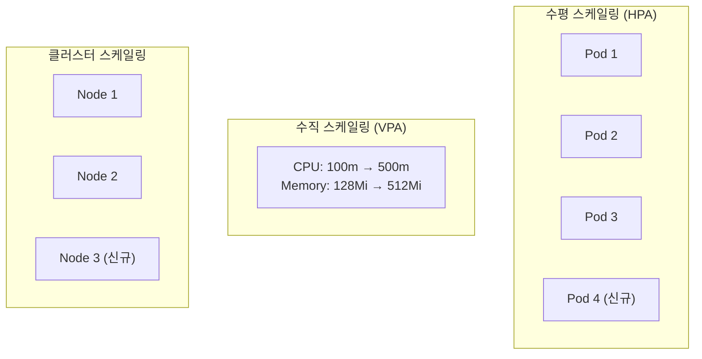
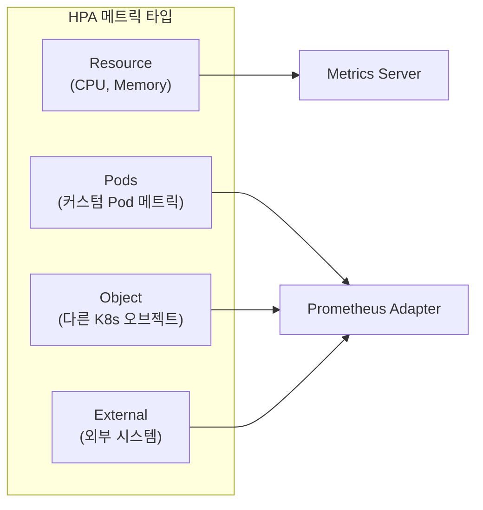
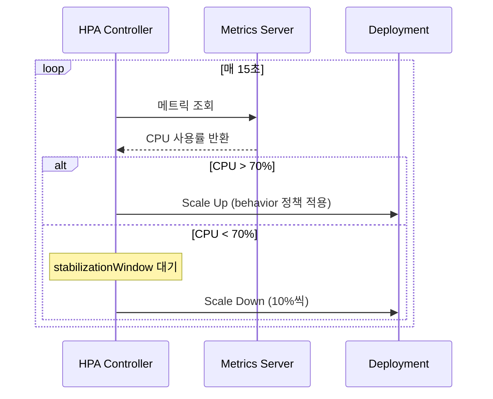
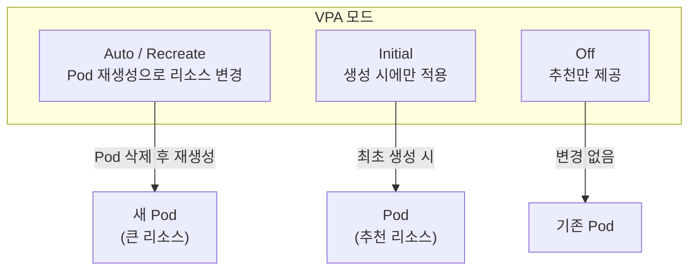
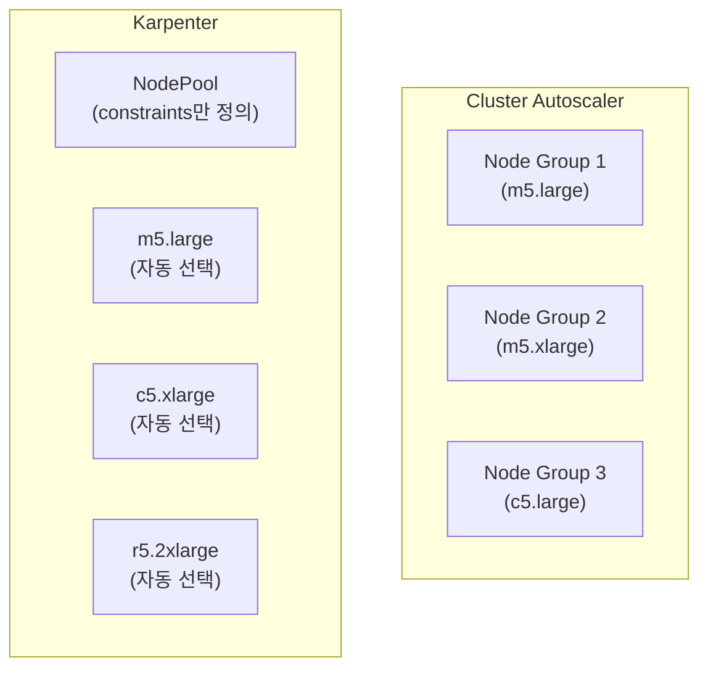
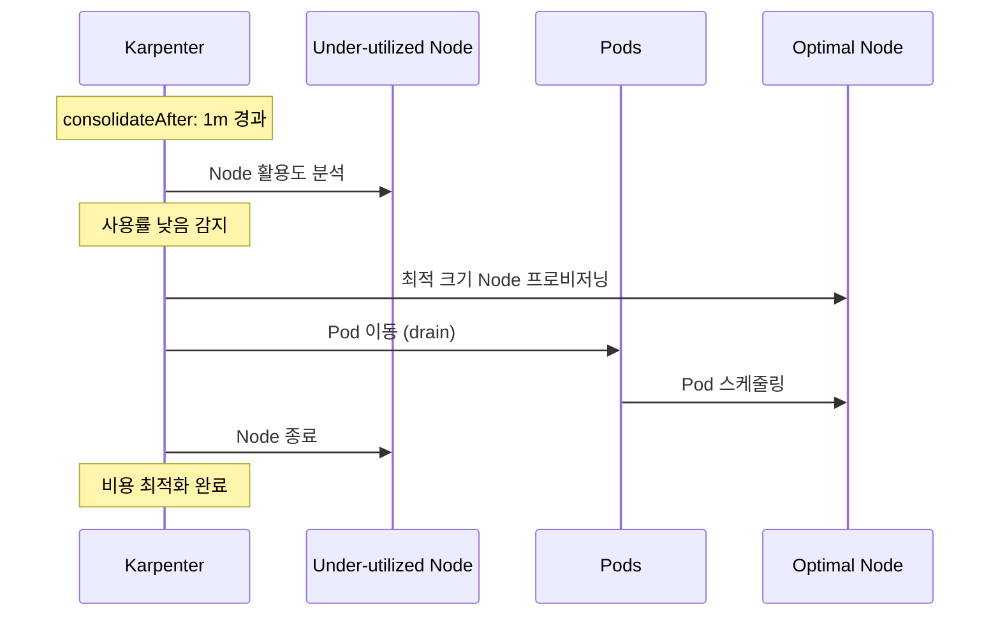
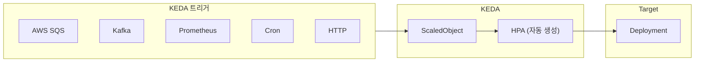

# Kubernetes 심화 시리즈 #5: 오토스케일링 완전 가이드

## 시리즈 개요

| # | 주제 | 핵심 내용 |
|---|------|----------|
| 1 | 워크로드 컨트롤러 심화 | Deployment, StatefulSet, DaemonSet, CronJob |
| 2 | 서비스 네트워킹 심화 | Service 타입, kube-proxy, AWS ALB/NLB |
| 3 | 설정 및 시크릿 관리 | ConfigMap, Secrets, AWS Secrets Manager CSI Driver |
| 4 | Istio 서비스 메시 | VirtualService, DestinationRule, 와일드카드 서브도메인 |
| **5** | **오토스케일링 심화** | HPA, VPA, Cluster Autoscaler, Karpenter, KEDA |
| 6 | 보안 심화 | RBAC, NetworkPolicy, Pod Security Standards |

---

## 오토스케일링의 3가지 축

Kubernetes 오토스케일링은 **무엇을 스케일링하느냐**에 따라 세 가지로 구분됩니다.



| 스케일링 유형 | 대상 | 도구 |
|-------------|-----|------|
| **수평 (Horizontal)** | Pod 개수 | HPA, KEDA |
| **수직 (Vertical)** | Pod 리소스 (CPU/Memory) | VPA |
| **클러스터** | Node 개수 | Cluster Autoscaler, Karpenter |

---

## HPA (HorizontalPodAutoscaler)

### HPA v2: 현재 Stable API

> [!IMPORTANT]
> HPA는 현재 `autoscaling/v2`가 stable입니다. `v2beta2`는 deprecated되었습니다.

### 기본 설정: CPU 기반

```yaml
apiVersion: autoscaling/v2
kind: HorizontalPodAutoscaler
metadata:
  name: api-hpa
spec:
  scaleTargetRef:
    apiVersion: apps/v1
    kind: Deployment
    name: api-server
  minReplicas: 2
  maxReplicas: 10
  metrics:
  - type: Resource
    resource:
      name: cpu
      target:
        type: Utilization
        averageUtilization: 70  # 평균 CPU 사용률 70%
```

### 다중 메트릭: CPU + Memory

```yaml
apiVersion: autoscaling/v2
kind: HorizontalPodAutoscaler
metadata:
  name: api-hpa
spec:
  scaleTargetRef:
    apiVersion: apps/v1
    kind: Deployment
    name: api-server
  minReplicas: 2
  maxReplicas: 10
  metrics:
  # CPU 기반
  - type: Resource
    resource:
      name: cpu
      target:
        type: Utilization
        averageUtilization: 70
  # Memory 기반
  - type: Resource
    resource:
      name: memory
      target:
        type: AverageValue
        averageValue: 500Mi
```

> [!NOTE]
> 다중 메트릭 사용 시 HPA는 **가장 큰 replica 수를 요구하는 메트릭**을 기준으로 스케일링합니다.

### 메트릭 타입 완전 정리



| 타입 | 설명 | 예시 |
|-----|-----|-----|
| `Resource` | CPU, Memory (Metrics Server 필요) | 평균 CPU 70% |
| `Pods` | Pod당 커스텀 메트릭 | requests-per-second |
| `Object` | 다른 K8s 오브젝트의 메트릭 | Ingress의 requests-per-second |
| `External` | 외부 시스템 메트릭 | SQS 큐 메시지 수 |

### External 메트릭 예시: AWS SQS

```yaml
apiVersion: autoscaling/v2
kind: HorizontalPodAutoscaler
metadata:
  name: worker-hpa
spec:
  scaleTargetRef:
    apiVersion: apps/v1
    kind: Deployment
    name: worker
  minReplicas: 1
  maxReplicas: 50
  metrics:
  - type: External
    external:
      metric:
        name: sqs_messages_visible
        selector:
          matchLabels:
            queue_name: "order-processing"
      target:
        type: AverageValue
        averageValue: "30"  # Pod당 30개 메시지 처리
```

### Scaling Behavior: 급격한 스케일링 방지

```yaml
apiVersion: autoscaling/v2
kind: HorizontalPodAutoscaler
metadata:
  name: api-hpa
spec:
  scaleTargetRef:
    apiVersion: apps/v1
    kind: Deployment
    name: api-server
  minReplicas: 2
  maxReplicas: 100
  
  behavior:
    scaleDown:
      stabilizationWindowSeconds: 300  # 5분간 안정화
      policies:
      - type: Percent
        value: 10        # 최대 10%씩 감소
        periodSeconds: 60
      selectPolicy: Max
      
    scaleUp:
      stabilizationWindowSeconds: 0  # 즉시 스케일 업
      policies:
      - type: Percent
        value: 100       # 최대 100%씩 증가
        periodSeconds: 15
      - type: Pods
        value: 4         # 또는 최대 4개씩 증가
        periodSeconds: 15
      selectPolicy: Max
  
  metrics:
  - type: Resource
    resource:
      name: cpu
      target:
        type: Utilization
        averageUtilization: 70
```



---

## VPA (VerticalPodAutoscaler)

### VPA 설치 (별도 설치 필요)

> [!CAUTION]
> VPA는 Kubernetes 기본 제공이 아닙니다. 별도 설치가 필요합니다.

```bash
# VPA 설치 (공식 리포지토리)
git clone https://github.com/kubernetes/autoscaler.git
cd autoscaler/vertical-pod-autoscaler
./hack/vpa-up.sh
```

### VPA 4가지 모드



| 모드 | 동작 | 사용 사례 |
|-----|-----|----------|
| `Auto` | Pod 재생성으로 리소스 변경 | 일반적인 워크로드 |
| `Recreate` | Auto와 동일 | Auto의 별칭 |
| `Initial` | 생성 시에만 적용 | StatefulSet, 중단 민감 워크로드 |
| `Off` | 추천만 제공, 변경 없음 | 모니터링 용도 |

### VPA 설정 예시

```yaml
apiVersion: autoscaling.k8s.io/v1
kind: VerticalPodAutoscaler
metadata:
  name: api-vpa
spec:
  targetRef:
    apiVersion: apps/v1
    kind: Deployment
    name: api-server
  
  updatePolicy:
    updateMode: "Auto"  # Auto, Recreate, Initial, Off
  
  resourcePolicy:
    containerPolicies:
    - containerName: api
      # 리소스 범위 제한
      minAllowed:
        cpu: 100m
        memory: 128Mi
      maxAllowed:
        cpu: 2
        memory: 4Gi
      # 특정 리소스만 조정
      controlledResources: ["cpu", "memory"]
```

### VPA 추천 확인

```bash
kubectl describe vpa api-vpa

# Status:
#   Recommendation:
#     Container Recommendations:
#       Container Name: api
#       Lower Bound:
#         Cpu:     25m
#         Memory:  128Mi
#       Target:
#         Cpu:     100m    # 추천 CPU
#         Memory:  256Mi   # 추천 Memory
#       Upper Bound:
#         Cpu:     1
#         Memory:  1Gi
```

### In-place Pod Resizing (K8s 1.33+)

> [!TIP]
> Kubernetes 1.33부터 **In-place Pod Resizing**이 beta로 지원됩니다. Pod를 재생성하지 않고 리소스를 변경할 수 있습니다. 단, VPA는 아직 이 기능을 지원하지 않습니다.

```yaml
# 수동 In-place Resizing 예시
apiVersion: v1
kind: Pod
metadata:
  name: api-pod
spec:
  containers:
  - name: api
    image: api:latest
    resources:
      requests:
        cpu: 100m
        memory: 128Mi
      limits:
        cpu: 500m
        memory: 512Mi
    resizePolicy:        # K8s 1.33+ 필요
    - resourceName: cpu
      restartPolicy: NotRequired  # 재시작 없이 변경
    - resourceName: memory
      restartPolicy: RestartContainer  # 메모리는 재시작 필요
```

### HPA + VPA 동시 사용 시 주의

> [!WARNING]
> HPA와 VPA를 **같은 메트릭(CPU/Memory)**으로 동시에 사용하면 충돌이 발생합니다. HPA가 Pod 수를 늘리면 VPA가 리소스를 줄이고, 다시 HPA가 Pod를 늘리는 악순환이 발생할 수 있습니다.

**권장 패턴**:

- HPA: Custom/External 메트릭 (requests-per-second, 큐 길이)
- VPA: CPU/Memory (Off 모드로 추천만 활용)

---

## Cluster Autoscaler vs Karpenter

### 공식 지원 Node Autoscaler

> [!NOTE]
> Kubernetes SIG Autoscaling은 **Cluster Autoscaler**와 **Karpenter** 두 가지를 공식 지원합니다.



### 핵심 차이점

| 특성 | Cluster Autoscaler | Karpenter |
|-----|-------------------|-----------|
| **프로비저닝** | Node Group 사전 정의 필요 | 자동 프로비저닝 (constraints만) |
| **인스턴스 선택** | Node Group당 고정 | 워크로드에 맞게 자동 선택 |
| **스케일 속도** | 느림 (Node Group 확인) | 빠름 (직접 EC2 API 호출) |
| **Node Lifecycle** | 스케일링만 | Disruption, 자동 업그레이드 |
| **클라우드 지원** | 다양 (AWS, GCP, Azure 등) | AWS, Azure |
| **Spot 통합** | 별도 Node Group 필요 | NodePool에서 바로 설정 |

### Karpenter 설정 예시 (AWS)

```yaml
# NodePool 정의
apiVersion: karpenter.sh/v1
kind: NodePool
metadata:
  name: default
spec:
  template:
    spec:
      requirements:
      - key: kubernetes.io/arch
        operator: In
        values: ["amd64", "arm64"]
      - key: karpenter.sh/capacity-type
        operator: In
        values: ["spot", "on-demand"]  # Spot 우선
      - key: karpenter.k8s.aws/instance-category
        operator: In
        values: ["c", "m", "r"]
      - key: karpenter.k8s.aws/instance-size
        operator: In
        values: ["medium", "large", "xlarge", "2xlarge"]
      
      nodeClassRef:
        group: karpenter.k8s.aws
        kind: EC2NodeClass
        name: default
  
  # 자동 정리 (Disruption)
  disruption:
    consolidationPolicy: WhenEmptyOrUnderutilized
    consolidateAfter: 1m
  
  limits:
    cpu: 1000
    memory: 1000Gi
---
# EC2NodeClass 정의
apiVersion: karpenter.k8s.aws/v1
kind: EC2NodeClass
metadata:
  name: default
spec:
  amiFamily: AL2023
  subnetSelectorTerms:
  - tags:
      karpenter.sh/discovery: my-cluster
  securityGroupSelectorTerms:
  - tags:
      karpenter.sh/discovery: my-cluster
  role: KarpenterNodeRole-my-cluster
```

### Karpenter Disruption (자동 최적화)



---

## KEDA (Kubernetes Event-driven Autoscaling)

### KEDA란?

KEDA는 HPA를 확장하여 **이벤트 기반 스케일링**을 제공합니다. 60개 이상의 트리거를 지원합니다.



### KEDA 설치

```bash
# Helm으로 설치
helm repo add kedacore https://kedacore.github.io/charts
helm install keda kedacore/keda --namespace keda --create-namespace
```

### ScaledObject: AWS SQS 예시

```yaml
apiVersion: keda.sh/v1alpha1
kind: ScaledObject
metadata:
  name: order-processor-scaler
spec:
  scaleTargetRef:
    name: order-processor
  
  minReplicaCount: 0   # 0까지 스케일 다운 가능!
  maxReplicaCount: 100
  
  pollingInterval: 30  # 30초마다 확인
  cooldownPeriod: 300  # 5분 대기 후 스케일 다운
  
  triggers:
  - type: aws-sqs-queue
    metadata:
      queueURL: https://sqs.ap-northeast-2.amazonaws.com/123456789012/orders
      queueLength: "10"  # 메시지 10개당 1개 Pod
      awsRegion: ap-northeast-2
    authenticationRef:
      name: keda-aws-credentials
---
# 인증 설정
apiVersion: keda.sh/v1alpha1
kind: TriggerAuthentication
metadata:
  name: keda-aws-credentials
spec:
  podIdentity:
    provider: aws-eks  # IRSA 사용
```

### ScaledObject: Kafka 예시

```yaml
apiVersion: keda.sh/v1alpha1
kind: ScaledObject
metadata:
  name: kafka-consumer-scaler
spec:
  scaleTargetRef:
    name: kafka-consumer
  minReplicaCount: 1
  maxReplicaCount: 50
  
  triggers:
  - type: kafka
    metadata:
      bootstrapServers: kafka.default.svc:9092
      consumerGroup: my-consumer-group
      topic: events
      lagThreshold: "100"  # lag 100 초과 시 스케일 업
```

### ScaledObject: Cron (시간 기반)

```yaml
apiVersion: keda.sh/v1alpha1
kind: ScaledObject
metadata:
  name: business-hours-scaler
spec:
  scaleTargetRef:
    name: api-server
  minReplicaCount: 2
  maxReplicaCount: 20
  
  triggers:
  # 업무 시간 (9시-18시 평일)
  - type: cron
    metadata:
      timezone: Asia/Seoul
      start: 0 9 * * 1-5   # 월-금 9시
      end: 0 18 * * 1-5    # 월-금 18시
      desiredReplicas: "10"
  
  # 비업무 시간
  - type: cron
    metadata:
      timezone: Asia/Seoul
      start: 0 18 * * 1-5
      end: 0 9 * * 2-6
      desiredReplicas: "2"
```

### KEDA의 핵심 장점

| 기능 | HPA | KEDA |
|-----|-----|------|
| **0으로 스케일 다운** | ❌ (min 1) | ✅ |
| **외부 메트릭 연동** | 복잡 (Adapter 필요) | 간단 (내장) |
| **이벤트 기반** | ❌ | ✅ |
| **Cron 스케줄링** | ❌ | ✅ |

---

## 트러블슈팅 가이드

### HPA가 스케일링하지 않음

```bash
# 1. HPA 상태 확인
kubectl get hpa api-hpa

# TARGETS가 <unknown>인 경우
# NAME      REFERENCE             TARGETS         MINPODS   MAXPODS
# api-hpa   Deployment/api-server <unknown>/70%   2         10

# 2. Metrics Server 확인
kubectl get deployment metrics-server -n kube-system

# 3. Pod의 resource requests 확인 (필수!)
kubectl get pod api-xxx -o yaml | grep -A 5 resources
```

**흔한 원인**:

1. **Metrics Server 미설치**
2. **Pod에 resource requests 미설정** (HPA 작동 불가)
3. **메트릭 수집 지연** (15초 주기)

### VPA 추천이 적용되지 않음

```bash
# 1. VPA 상태 확인
kubectl describe vpa api-vpa

# 2. updateMode 확인
# Off 모드는 추천만 제공

# 3. Pod 재생성 여부 확인
kubectl get pods -w
```

**흔한 원인**:

1. **updateMode: Off** 설정
2. **minAllowed/maxAllowed 범위 밖**
3. **PDB(PodDisruptionBudget)로 인한 재생성 차단**

### Karpenter Node가 프로비저닝되지 않음

```bash
# 1. Karpenter 로그 확인
kubectl logs -n karpenter -l app.kubernetes.io/name=karpenter

# 2. NodePool 상태 확인
kubectl describe nodepool default

# 3. Pending Pod 확인
kubectl get pods --field-selector=status.phase=Pending
```

**흔한 원인**:

1. **requirements 충족 인스턴스 타입 없음**
2. **서브넷/보안 그룹 태그 누락**
3. **IAM 권한 부족**

---

## 정리

| 도구 | 스케일링 대상 | 핵심 기능 |
|-----|-------------|----------|
| **HPA** | Pod 수 | Resource/Custom/External 메트릭 |
| **VPA** | Pod 리소스 | 리소스 추천 및 자동 조정 |
| **Cluster Autoscaler** | Node 수 | Node Group 기반 |
| **Karpenter** | Node 수 | 자동 프로비저닝, Disruption |
| **KEDA** | Pod 수 | 이벤트 기반, 0 스케일 다운 |

---

## 다음 편 예고

**6편: 보안 심화**에서는 다음을 다룹니다:

- RBAC 설계 패턴 (최소 권한 원칙)
- NetworkPolicy로 Zero Trust 구현
- Pod Security Standards (PSS)
- ServiceAccount 보안과 IRSA

---

## 참고 자료

- [Kubernetes HPA](https://kubernetes.io/docs/tasks/run-application/horizontal-pod-autoscale/)
- [Kubernetes VPA](https://github.com/kubernetes/autoscaler/tree/master/vertical-pod-autoscaler)
- [Cluster Autoscaler](https://github.com/kubernetes/autoscaler/tree/master/cluster-autoscaler)
- [Karpenter](https://karpenter.sh/)
- [KEDA](https://keda.sh/)
