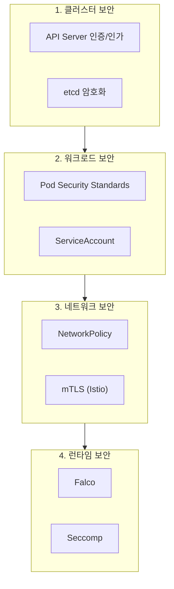
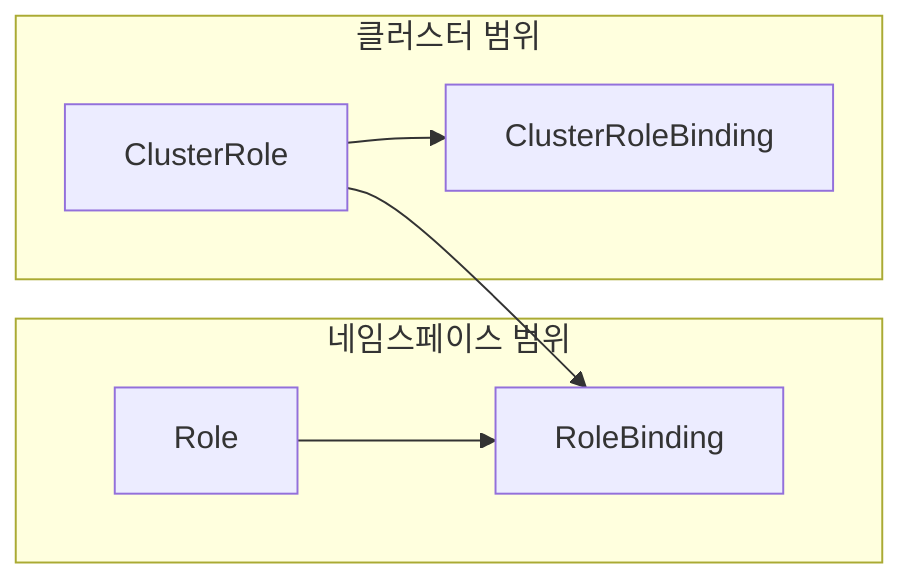
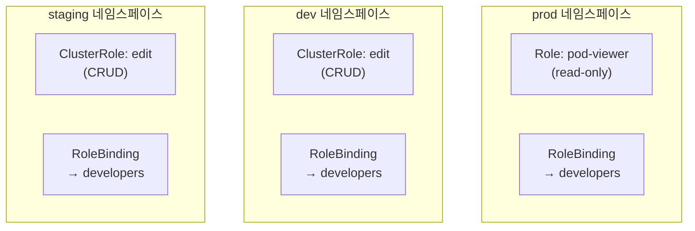
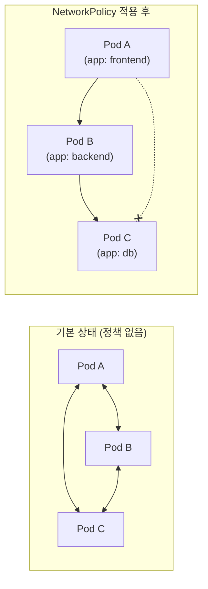
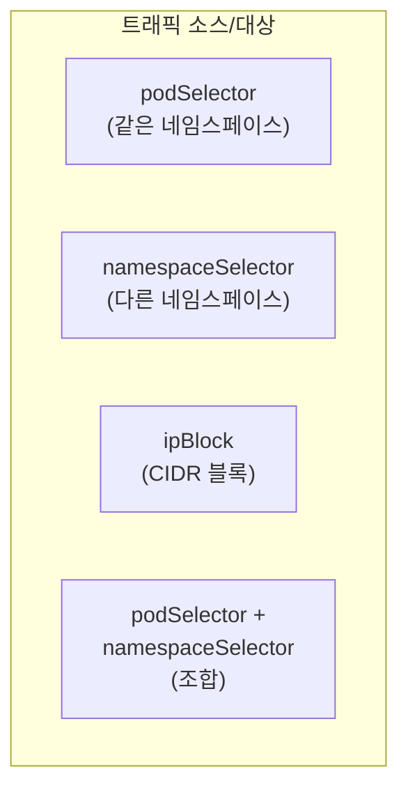
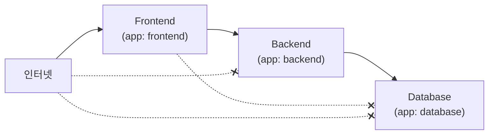
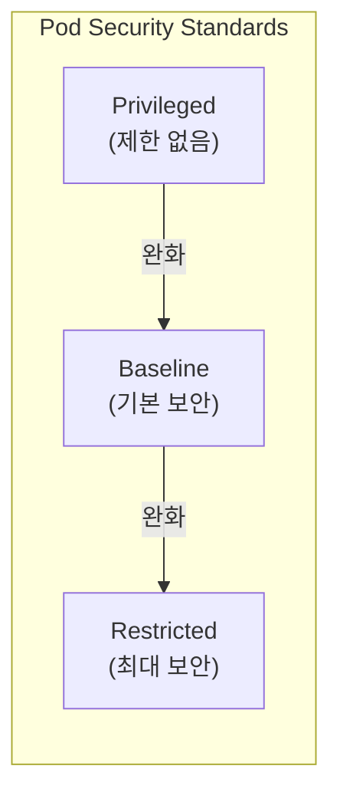
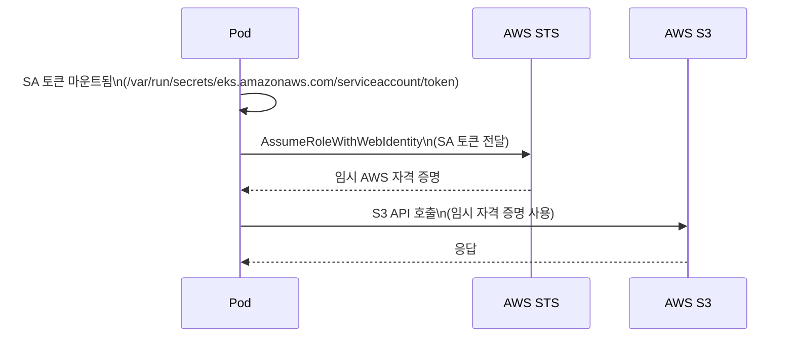

# Kubernetes 심화 시리즈 #6: 보안 완전 가이드

## 시리즈 개요

| # | 주제 | 핵심 내용 |
|---|------|----------|
| 1 | 워크로드 컨트롤러 심화 | Deployment, StatefulSet, DaemonSet, CronJob |
| 2 | 서비스 네트워킹 심화 | Service 타입, kube-proxy, AWS ALB/NLB |
| 3 | 설정 및 시크릿 관리 | ConfigMap, Secrets, AWS Secrets Manager CSI Driver |
| 4 | Istio 서비스 메시 | VirtualService, DestinationRule, 와일드카드 서브도메인 |
| 5 | 오토스케일링 심화 | HPA, VPA, Cluster Autoscaler, Karpenter, KEDA |
| **6** | **보안 심화** | RBAC, NetworkPolicy, Pod Security Standards |

---

## Kubernetes 보안의 4가지 레이어



---

## RBAC (Role-Based Access Control)

### RBAC의 4가지 핵심 리소스



| 리소스 | 범위 | 용도 |
|-------|-----|-----|
| `Role` | 네임스페이스 | 특정 네임스페이스 내 권한 정의 |
| `ClusterRole` | 클러스터 | 클러스터 전체 권한 정의 |
| `RoleBinding` | 네임스페이스 | Role/ClusterRole을 주체에 바인딩 |
| `ClusterRoleBinding` | 클러스터 | ClusterRole을 클러스터 전체에 바인딩 |

### Role 정의

```yaml
apiVersion: rbac.authorization.k8s.io/v1
kind: Role
metadata:
  namespace: prod
  name: pod-reader
rules:
- apiGroups: [""]           # "" = core API group
  resources: ["pods"]
  verbs: ["get", "watch", "list"]
  
- apiGroups: [""]
  resources: ["pods/log"]   # 하위 리소스
  verbs: ["get"]
```

### Verbs 완전 정리

| Verb | 설명 | HTTP 메서드 |
|------|-----|------------|
| `get` | 단일 리소스 조회 | GET |
| `list` | 리소스 목록 조회 | GET |
| `watch` | 변경 감시 | GET (watch=true) |
| `create` | 리소스 생성 | POST |
| `update` | 리소스 전체 업데이트 | PUT |
| `patch` | 리소스 부분 업데이트 | PATCH |
| `delete` | 단일 리소스 삭제 | DELETE |
| `deletecollection` | 여러 리소스 삭제 | DELETE |

### ClusterRole 정의

```yaml
apiVersion: rbac.authorization.k8s.io/v1
kind: ClusterRole
metadata:
  name: secret-reader
rules:
# 모든 네임스페이스의 secrets 읽기
- apiGroups: [""]
  resources: ["secrets"]
  verbs: ["get", "watch", "list"]
  
# 특정 이름의 secrets만 (resourceNames)
- apiGroups: [""]
  resources: ["secrets"]
  resourceNames: ["db-credentials", "api-key"]
  verbs: ["get"]
  
# 클러스터 범위 리소스
- apiGroups: [""]
  resources: ["nodes"]
  verbs: ["get", "list"]
  
# 비-리소스 URL
- nonResourceURLs: ["/healthz", "/healthz/*"]
  verbs: ["get"]
```

### RoleBinding

```yaml
apiVersion: rbac.authorization.k8s.io/v1
kind: RoleBinding
metadata:
  name: read-pods
  namespace: prod
subjects:
# 사용자
- kind: User
  name: jane
  apiGroup: rbac.authorization.k8s.io
  
# 그룹
- kind: Group
  name: developers
  apiGroup: rbac.authorization.k8s.io
  
# ServiceAccount
- kind: ServiceAccount
  name: app-sa
  namespace: prod
  
roleRef:
  kind: Role  # 또는 ClusterRole
  name: pod-reader
  apiGroup: rbac.authorization.k8s.io
```

### 기본 ClusterRole 활용

Kubernetes는 기본 ClusterRole을 제공합니다:

| ClusterRole | 설명 |
|-------------|-----|
| `cluster-admin` | 모든 권한 (슈퍼유저) |
| `admin` | 네임스페이스 내 모든 권한 (RBAC 포함) |
| `edit` | 대부분의 리소스 CRUD (RBAC 제외) |
| `view` | 읽기 전용 (Secrets 제외) |

```yaml
# 개발자에게 특정 네임스페이스의 edit 권한 부여
apiVersion: rbac.authorization.k8s.io/v1
kind: RoleBinding
metadata:
  name: developer-edit
  namespace: dev
subjects:
- kind: Group
  name: developers
  apiGroup: rbac.authorization.k8s.io
roleRef:
  kind: ClusterRole
  name: edit
  apiGroup: rbac.authorization.k8s.io
```

### 최소 권한 원칙 설계 패턴



```yaml
# 1. 프로덕션: 읽기 전용
apiVersion: rbac.authorization.k8s.io/v1
kind: RoleBinding
metadata:
  name: developers-view
  namespace: prod
subjects:
- kind: Group
  name: developers
  apiGroup: rbac.authorization.k8s.io
roleRef:
  kind: ClusterRole
  name: view
  apiGroup: rbac.authorization.k8s.io
---
# 2. 개발/스테이징: 편집 권한
apiVersion: rbac.authorization.k8s.io/v1
kind: RoleBinding
metadata:
  name: developers-edit
  namespace: dev
subjects:
- kind: Group
  name: developers
  apiGroup: rbac.authorization.k8s.io
roleRef:
  kind: ClusterRole
  name: edit
  apiGroup: rbac.authorization.k8s.io
```

### 권한 확인 명령어

```bash
# 현재 사용자 권한 확인
kubectl auth can-i create pods --namespace=prod
# yes 또는 no

# 특정 사용자/SA 권한 확인
kubectl auth can-i create pods --namespace=prod --as=system:serviceaccount:prod:app-sa

# 모든 권한 나열
kubectl auth can-i --list --namespace=prod
```

---

## NetworkPolicy

### NetworkPolicy 기본 개념

> [!IMPORTANT]
> NetworkPolicy는 **CNI 플러그인 지원이 필요**합니다. Calico, Cilium, Weave Net 등이 지원하며, AWS VPC CNI 단독으로는 지원하지 않습니다.



### 기본 NetworkPolicy 구조

```yaml
apiVersion: networking.k8s.io/v1
kind: NetworkPolicy
metadata:
  name: backend-policy
  namespace: prod
spec:
  # 이 정책이 적용될 Pod
  podSelector:
    matchLabels:
      app: backend
  
  # 정책 유형 (Ingress, Egress, 또는 둘 다)
  policyTypes:
  - Ingress
  - Egress
  
  # 인바운드 트래픽 규칙
  ingress:
  - from:
    - podSelector:
        matchLabels:
          app: frontend
    ports:
    - protocol: TCP
      port: 8080
  
  # 아웃바운드 트래픽 규칙
  egress:
  - to:
    - podSelector:
        matchLabels:
          app: database
    ports:
    - protocol: TCP
      port: 5432
```

### from/to 셀렉터 유형



| 셀렉터 | 설명 |
|-------|-----|
| `podSelector` | 같은 네임스페이스의 Pod |
| `namespaceSelector` | 다른 네임스페이스의 모든 Pod |
| `podSelector` + `namespaceSelector` | 특정 네임스페이스의 특정 Pod |
| `ipBlock` | CIDR 기반 IP 범위 |

### 셀렉터 조합 예시

```yaml
ingress:
# OR 관계 (배열의 각 항목)
- from:
  # 1. 같은 네임스페이스의 frontend Pod
  - podSelector:
      matchLabels:
        app: frontend
  
  # 2. monitoring 네임스페이스의 모든 Pod
  - namespaceSelector:
      matchLabels:
        name: monitoring
  
  # 3. 특정 IP 대역
  - ipBlock:
      cidr: 10.0.0.0/8
      except:
      - 10.1.0.0/16

# AND 관계 (같은 항목 내)
- from:
  - namespaceSelector:
      matchLabels:
        env: prod
    podSelector:
      matchLabels:
        role: client
```

> [!WARNING]
> `podSelector`와 `namespaceSelector`가 **같은 `-` 아래**에 있으면 **AND** 조건입니다. **별도의 `-`**로 분리하면 **OR** 조건입니다.

### Default Deny 정책 (Zero Trust 기반)

```yaml
# 1. 모든 인바운드 트래픽 차단 (기본)
apiVersion: networking.k8s.io/v1
kind: NetworkPolicy
metadata:
  name: default-deny-ingress
  namespace: prod
spec:
  podSelector: {}  # 모든 Pod에 적용
  policyTypes:
  - Ingress
  # ingress 규칙 없음 = 모든 인바운드 차단
---
# 2. 모든 아웃바운드 트래픽 차단
apiVersion: networking.k8s.io/v1
kind: NetworkPolicy
metadata:
  name: default-deny-egress
  namespace: prod
spec:
  podSelector: {}
  policyTypes:
  - Egress
  # DNS는 허용 (필수)
  egress:
  - to:
    - namespaceSelector: {}
      podSelector:
        matchLabels:
          k8s-app: kube-dns
    ports:
    - protocol: UDP
      port: 53
```

### 실전 예시: 3-tier 앱 NetworkPolicy



```yaml
# Frontend: 외부에서만 접근 가능
apiVersion: networking.k8s.io/v1
kind: NetworkPolicy
metadata:
  name: frontend-policy
  namespace: prod
spec:
  podSelector:
    matchLabels:
      app: frontend
  policyTypes:
  - Ingress
  - Egress
  ingress:
  # 외부(Ingress Controller)에서 접근
  - from:
    - namespaceSelector:
        matchLabels:
          name: ingress-nginx
    ports:
    - port: 80
  egress:
  # Backend로만 나감
  - to:
    - podSelector:
        matchLabels:
          app: backend
    ports:
    - port: 8080
  # DNS 허용
  - to:
    - namespaceSelector: {}
      podSelector:
        matchLabels:
          k8s-app: kube-dns
    ports:
    - protocol: UDP
      port: 53
---
# Backend: Frontend에서만 접근, Database로만 나감
apiVersion: networking.k8s.io/v1
kind: NetworkPolicy
metadata:
  name: backend-policy
  namespace: prod
spec:
  podSelector:
    matchLabels:
      app: backend
  policyTypes:
  - Ingress
  - Egress
  ingress:
  - from:
    - podSelector:
        matchLabels:
          app: frontend
    ports:
    - port: 8080
  egress:
  - to:
    - podSelector:
        matchLabels:
          app: database
    ports:
    - port: 5432
  - to:
    - namespaceSelector: {}
      podSelector:
        matchLabels:
          k8s-app: kube-dns
    ports:
    - protocol: UDP
      port: 53
---
# Database: Backend에서만 접근, 외부 나감 차단
apiVersion: networking.k8s.io/v1
kind: NetworkPolicy
metadata:
  name: database-policy
  namespace: prod
spec:
  podSelector:
    matchLabels:
      app: database
  policyTypes:
  - Ingress
  - Egress
  ingress:
  - from:
    - podSelector:
        matchLabels:
          app: backend
    ports:
    - port: 5432
  egress: []  # 아웃바운드 없음
```

---

## Pod Security Standards (PSS)

### PSS 개요

> [!NOTE]
> **Pod Security Admission**은 Kubernetes 1.25에서 GA가 되었으며, 더 이상 PodSecurityPolicy(PSP)를 사용하지 않습니다.

### 3가지 보안 레벨



| 레벨 | 설명 | 차단 항목 |
|-----|-----|----------|
| `privileged` | 제한 없음 | 없음 |
| `baseline` | 알려진 권한 상승 차단 | hostNetwork, hostPID, privileged 컨테이너 |
| `restricted` | 최대 보안 | root 사용자, 쓰기 가능 루트 파일시스템 등 |

### 3가지 적용 모드

| 모드 | 설명 |
|-----|-----|
| `enforce` | 정책 위반 시 Pod 생성 차단 |
| `audit` | 정책 위반 시 감사 로그 기록 |
| `warn` | 정책 위반 시 경고 메시지 표시 |

### 네임스페이스 라벨로 적용

```bash
# baseline 강제, restricted 경고/감사
kubectl label namespace prod \
  pod-security.kubernetes.io/enforce=baseline \
  pod-security.kubernetes.io/enforce-version=latest \
  pod-security.kubernetes.io/warn=restricted \
  pod-security.kubernetes.io/warn-version=latest \
  pod-security.kubernetes.io/audit=restricted \
  pod-security.kubernetes.io/audit-version=latest
```

```yaml
# 또는 YAML로 정의
apiVersion: v1
kind: Namespace
metadata:
  name: prod
  labels:
    pod-security.kubernetes.io/enforce: baseline
    pod-security.kubernetes.io/enforce-version: latest
    pod-security.kubernetes.io/warn: restricted
    pod-security.kubernetes.io/warn-version: latest
    pod-security.kubernetes.io/audit: restricted
    pod-security.kubernetes.io/audit-version: latest
```

### 클러스터 전체 기본값 설정

```yaml
# /etc/kubernetes/pss-config.yaml
apiVersion: apiserver.config.k8s.io/v1
kind: AdmissionConfiguration
plugins:
- name: PodSecurity
  configuration:
    apiVersion: pod-security.admission.config.k8s.io/v1
    kind: PodSecurityConfiguration
    defaults:
      enforce: "baseline"
      enforce-version: "latest"
      audit: "restricted"
      audit-version: "latest"
      warn: "restricted"
      warn-version: "latest"
    exemptions:
      usernames: []
      runtimeClasses: []
      namespaces:
      - kube-system
      - kube-public
```

### Restricted 레벨 Pod 예시

```yaml
apiVersion: v1
kind: Pod
metadata:
  name: secure-pod
spec:
  securityContext:
    runAsNonRoot: true
    seccompProfile:
      type: RuntimeDefault
  
  containers:
  - name: app
    image: my-app:latest
    securityContext:
      allowPrivilegeEscalation: false
      readOnlyRootFilesystem: true
      runAsNonRoot: true
      runAsUser: 1000
      capabilities:
        drop:
        - ALL
    
    # 쓰기 필요한 디렉토리는 emptyDir 사용
    volumeMounts:
    - name: tmp
      mountPath: /tmp
    - name: cache
      mountPath: /app/cache
  
  volumes:
  - name: tmp
    emptyDir: {}
  - name: cache
    emptyDir: {}
```

---

## ServiceAccount 보안

### 자동 마운트 비활성화

모든 Pod에는 기본적으로 ServiceAccount 토큰이 마운트됩니다. 필요 없다면 비활성화하세요.

```yaml
apiVersion: v1
kind: Pod
metadata:
  name: my-pod
spec:
  automountServiceAccountToken: false
  containers:
  - name: app
    image: my-app:latest
```

### 전용 ServiceAccount 사용

```yaml
# 최소 권한 ServiceAccount
apiVersion: v1
kind: ServiceAccount
metadata:
  name: app-sa
  namespace: prod
automountServiceAccountToken: false  # 기본 비활성화
---
# 필요한 권한만 부여
apiVersion: rbac.authorization.k8s.io/v1
kind: Role
metadata:
  name: app-role
  namespace: prod
rules:
- apiGroups: [""]
  resources: ["configmaps"]
  resourceNames: ["app-config"]
  verbs: ["get"]
---
apiVersion: rbac.authorization.k8s.io/v1
kind: RoleBinding
metadata:
  name: app-rolebinding
  namespace: prod
subjects:
- kind: ServiceAccount
  name: app-sa
  namespace: prod
roleRef:
  kind: Role
  name: app-role
  apiGroup: rbac.authorization.k8s.io
```

### AWS IRSA (IAM Roles for Service Accounts)

```yaml
# ServiceAccount에 IAM Role 연결
apiVersion: v1
kind: ServiceAccount
metadata:
  name: s3-reader
  namespace: prod
  annotations:
    eks.amazonaws.com/role-arn: arn:aws:iam::123456789012:role/S3ReaderRole
---
apiVersion: v1
kind: Pod
metadata:
  name: s3-reader-pod
  namespace: prod
spec:
  serviceAccountName: s3-reader
  containers:
  - name: app
    image: amazon/aws-cli
    command: ["aws", "s3", "ls"]
    # AWS SDK가 자동으로 IRSA 토큰 사용
```



---

## 트러블슈팅 가이드

### RBAC 권한 오류

```bash
# 에러: User "jane" cannot list pods in namespace "prod"

# 1. 권한 확인
kubectl auth can-i list pods --namespace=prod --as=jane

# 2. RoleBinding 확인
kubectl get rolebindings -n prod -o wide

# 3. ClusterRoleBinding 확인
kubectl get clusterrolebindings -o wide | grep jane

# 4. 자세한 권한 조회
kubectl auth can-i --list --namespace=prod --as=jane
```

### NetworkPolicy가 작동하지 않음

```bash
# 1. CNI 플러그인 확인 (Calico, Cilium 등)
kubectl get pods -n kube-system | grep calico

# 2. NetworkPolicy 확인
kubectl get networkpolicy -n prod

# 3. Pod 라벨 확인
kubectl get pods -n prod --show-labels

# 4. 정책 상세 확인
kubectl describe networkpolicy backend-policy -n prod
```

**흔한 원인**:

1. **CNI 미지원**: AWS VPC CNI 단독은 NetworkPolicy 미지원
2. **라벨 불일치**: podSelector/namespaceSelector 라벨 오타
3. **DNS 차단**: egress에서 DNS(UDP 53) 미허용

### Pod Security 위반

```bash
# 경고 메시지 예시
# Warning: would violate PodSecurity "restricted:latest"

# 1. 네임스페이스 라벨 확인
kubectl get ns prod --show-labels

# 2. Pod 보안 컨텍스트 확인
kubectl get pod my-pod -o yaml | grep -A 20 securityContext

# 3. 위반 항목 확인 (dry-run)
kubectl apply -f pod.yaml --dry-run=server
```

**흔한 원인**:

1. **runAsNonRoot 미설정**
2. **allowPrivilegeEscalation: true**
3. **capabilities.drop: ALL 미설정**

---

## 정리

| 보안 레이어 | 도구 | 핵심 기능 |
|-----------|-----|----------|
| **인증/인가** | RBAC | Role, ClusterRole, 최소 권한 |
| **네트워크** | NetworkPolicy | ingress/egress 제어, Zero Trust |
| **워크로드** | PSS | Privileged/Baseline/Restricted |
| **ID 관리** | ServiceAccount | IRSA, 토큰 마운트 제어 |

---

## 시리즈 마무리

이 시리즈에서 다룬 핵심 내용:

| 편 | 주제 | 핵심 키워드 |
|---|------|----------|
| 1편 | 워크로드 컨트롤러 | Reconciliation Loop, Rolling Update, StatefulSet |
| 2편 | 서비스 네트워킹 | ClusterIP/NodePort/LoadBalancer, nftables |
| 3편 | 설정/시크릿 관리 | ConfigMap, Secrets at Rest, CSI Driver |
| 4편 | Istio 서비스 메시 | VirtualService, DestinationRule, mTLS |
| 5편 | 오토스케일링 | HPA v2, VPA, Karpenter, KEDA |
| 6편 | 보안 | RBAC, NetworkPolicy, PSS, IRSA |

---

## 참고 자료

- [Kubernetes RBAC](https://kubernetes.io/docs/reference/access-authn-authz/rbac/)
- [Network Policies](https://kubernetes.io/docs/concepts/services-networking/network-policies/)
- [Pod Security Standards](https://kubernetes.io/docs/concepts/security/pod-security-standards/)
- [Pod Security Admission](https://kubernetes.io/docs/concepts/security/pod-security-admission/)
- [AWS IRSA](https://docs.aws.amazon.com/eks/latest/userguide/iam-roles-for-service-accounts.html)
