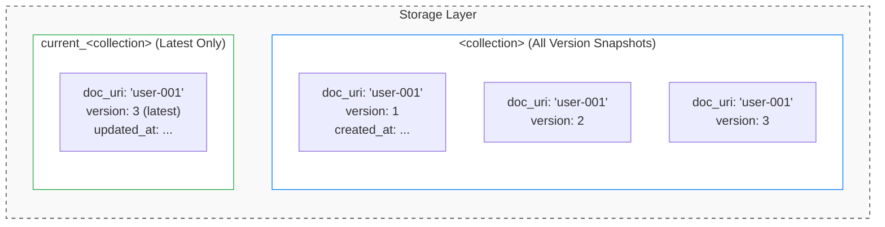

# Append-Only 문서 버저닝 설계 및 구현

## 개요

데이터의 불변성(Immutability)과 완전한 감사 추적(Audit Trail)이 요구되는 시스템에서는 Append-Only 아키텍처가 효과적입니다. 이 글에서는 문서 버저닝 시스템을 설계하고 구현하는 방법을 다룹니다.

## 왜 Append-Only인가?

### 장점

| 특성 | 설명 |
|------|------|
| **불변성 보장** | 기존 데이터를 수정하지 않아 데이터 무결성 유지 |
| **감사 추적** | 모든 변경 이력이 자동으로 보존 |
| **충돌 방지** | 동시 수정으로 인한 데이터 손실 위험 감소 |
| **복구 용이** | 특정 시점으로 롤백 가능 |
| **규정 준수** | 금융/의료 등 규제 산업의 데이터 보존 요건 충족 |

### 단점

| 특성 | 설명 |
|------|------|
| **저장 공간** | 버전마다 전체 스냅샷 저장으로 용량 증가 |
| **쿼리 복잡도** | 최신 버전 조회 시 추가 로직 필요 |
| **삭제 처리** | 물리적 삭제 대신 소프트 삭제 필요 |

## 아키텍처 설계

### 듀얼 컬렉션 구조



**두 컬렉션을 사용하는 이유:**

- `<collection>`: 히스토리 보존, 감사 추적, 규정 준수
- `current_<collection>`: 최신 데이터 빠른 조회, 인덱스 최적화

### 문서 상태 관리

```go
type DocumentState string

const (
    DocStateActive  DocumentState = "ACTIVE"
    DocStateDeleted DocumentState = "DELETED"
    DocStatePending DocumentState = "PENDING"
)
```

## 핵심 구현

### 문서 모델

```go
package model

import (
    "time"
)

// VersionedDocument는 버전 관리되는 문서의 기본 구조입니다.
type VersionedDocument struct {
    ID        string                 `bson:"_id,omitempty"`
    URI       string                 `bson:"uri"`
    Version   int32                  `bson:"version"`
    DocStatus DocumentState          `bson:"doc_status"`
    Fields    map[string]interface{} `bson:"fields"`
    CreatedAt time.Time              `bson:"created_at"`
    UpdatedAt time.Time              `bson:"updated_at"`
}

// AuditEntry는 변경 감사 로그 항목입니다.
type AuditEntry struct {
    ID            string                 `bson:"_id,omitempty"`
    Collection    string                 `bson:"collection"`
    DocumentURI   string                 `bson:"document_uri"`
    Action        string                 `bson:"action"` // CREATE, UPDATE, DELETE
    ChangedBy     string                 `bson:"changed_by"`
    ChangedAt     time.Time              `bson:"changed_at"`
    PreviousData  map[string]interface{} `bson:"previous_data,omitempty"`
    NewData       map[string]interface{} `bson:"new_data,omitempty"`
    ChangedFields []string               `bson:"changed_fields,omitempty"`
}
```

### 서비스 인터페이스

```go
package document

import (
    "context"
)

// VersionedService는 버전 관리 문서 서비스 인터페이스입니다.
type VersionedService interface {
    // Create는 버전 1의 새 문서를 생성합니다.
    Create(ctx context.Context, collection string, data BsonDocument) (*BsonDocument, error)
    
    // FindLatest는 URI의 최신 버전 문서를 조회합니다.
    FindLatest(ctx context.Context, collection, uri string) (*BsonDocument, error)
    
    // FindByVersion는 특정 버전의 문서를 조회합니다.
    FindByVersion(ctx context.Context, collection, uri string, version int32) (*BsonDocument, error)
    
    // SoftUpdate는 새 버전을 생성하여 문서를 업데이트합니다.
    SoftUpdate(ctx context.Context, collection, uri string, updates BsonDocument) (*BsonDocument, error)
    
    // SoftDelete는 삭제 상태의 새 버전을 생성합니다.
    SoftDelete(ctx context.Context, collection, uri string) (*BsonDocument, error)
    
    // GetHistory는 문서의 전체 버전 히스토리를 조회합니다.
    GetHistory(ctx context.Context, collection, uri string) ([]BsonDocument, error)
}
```

### 문서 생성

```go
func (s *versionService) Create(ctx context.Context, collection string, data BsonDocument) (*BsonDocument, error) {
    now := time.Now()
    
    doc := &VersionedDocument{
        URI:       data.URI,
        Version:   1, // 첫 버전
        DocStatus: DocStateActive,
        Fields:    data.Fields,
        CreatedAt: now,
        UpdatedAt: now,
    }
    
    // 트랜잭션으로 두 컬렉션에 동시 저장
    _, err := s.WithTransaction(ctx, func(sessCtx context.Context) (interface{}, error) {
        // 1. 버전 히스토리 컬렉션에 저장
        if _, err := s.collection(collection).InsertOne(sessCtx, doc); err != nil {
            return nil, err
        }
        
        // 2. 최신 버전 컬렉션에도 저장
        currentColl := s.currentCollection(collection)
        if _, err := currentColl.InsertOne(sessCtx, doc); err != nil {
            return nil, err
        }
        
        // 3. 감사 로그 생성
        if err := s.createAuditLog(sessCtx, collection, doc, "CREATE", nil); err != nil {
            return nil, err
        }
        
        return doc, nil
    })
    
    if err != nil {
        return nil, err
    }
    
    return doc, nil
}
```

### 소프트 업데이트

기존 버전은 그대로 두고 새 버전을 추가합니다:

```go
func (s *versionService) SoftUpdate(ctx context.Context, collection, uri string, updates BsonDocument) (*BsonDocument, error) {
    // 현재 최신 버전 조회
    current, err := s.FindLatest(ctx, collection, uri)
    if err != nil {
        return nil, err
    }
    
    if current.DocStatus == DocStateDeleted {
        return nil, ErrDocumentDeleted
    }
    
    now := time.Now()
    
    // 새 버전 문서 생성 (기존 필드 + 업데이트 필드)
    newFields := mergeFields(current.Fields, updates.Fields)
    changedFields := detectChangedFields(current.Fields, newFields)
    
    newDoc := &VersionedDocument{
        URI:       uri,
        Version:   current.Version + 1, // 버전 증가
        DocStatus: DocStateActive,
        Fields:    newFields,
        CreatedAt: current.CreatedAt, // 원본 생성 시간 유지
        UpdatedAt: now,
    }
    
    _, err = s.WithTransaction(ctx, func(sessCtx context.Context) (interface{}, error) {
        // 1. 새 버전을 히스토리 컬렉션에 추가 (Append)
        if _, err := s.collection(collection).InsertOne(sessCtx, newDoc); err != nil {
            return nil, err
        }
        
        // 2. 최신 버전 컬렉션 업데이트 (Replace)
        filter := bson.M{"uri": uri}
        if _, err := s.currentCollection(collection).ReplaceOne(sessCtx, filter, newDoc); err != nil {
            return nil, err
        }
        
        // 3. 감사 로그
        auditLog := &AuditEntry{
            Collection:    collection,
            DocumentURI:   uri,
            Action:        "UPDATE",
            ChangedAt:     now,
            PreviousData:  current.Fields,
            NewData:       newFields,
            ChangedFields: changedFields,
        }
        if err := s.insertAuditLog(sessCtx, auditLog); err != nil {
            return nil, err
        }
        
        return newDoc, nil
    })
    
    if err != nil {
        return nil, err
    }
    
    return newDoc, nil
}
```

### 소프트 삭제

물리적 삭제 대신 삭제 상태의 새 버전을 생성합니다:

```go
func (s *versionService) SoftDelete(ctx context.Context, collection, uri string) (*BsonDocument, error) {
    current, err := s.FindLatest(ctx, collection, uri)
    if err != nil {
        return nil, err
    }
    
    now := time.Now()
    
    // 삭제 상태의 새 버전 생성
    deletedDoc := &VersionedDocument{
        URI:       uri,
        Version:   current.Version + 1,
        DocStatus: DocStateDeleted, // DELETED 상태
        Fields:    current.Fields,  // 마지막 데이터 보존
        CreatedAt: current.CreatedAt,
        UpdatedAt: now,
    }
    
    _, err = s.WithTransaction(ctx, func(sessCtx context.Context) (interface{}, error) {
        // 1. 삭제 버전 히스토리에 추가
        if _, err := s.collection(collection).InsertOne(sessCtx, deletedDoc); err != nil {
            return nil, err
        }
        
        // 2. 최신 버전 컬렉션도 삭제 상태로 업데이트
        filter := bson.M{"uri": uri}
        if _, err := s.currentCollection(collection).ReplaceOne(sessCtx, filter, deletedDoc); err != nil {
            return nil, err
        }
        
        // 3. 감사 로그
        if err := s.createAuditLog(sessCtx, collection, deletedDoc, "DELETE", current.Fields); err != nil {
            return nil, err
        }
        
        return deletedDoc, nil
    })
    
    return deletedDoc, err
}
```

### 변경 필드 감지

```go
func detectChangedFields(previous, current map[string]interface{}) []string {
    var changed []string
    
    for key, newVal := range current {
        oldVal, exists := previous[key]
        if !exists || !reflect.DeepEqual(oldVal, newVal) {
            changed = append(changed, key)
        }
    }
    
    // 삭제된 필드 감지
    for key := range previous {
        if _, exists := current[key]; !exists {
            changed = append(changed, key)
        }
    }
    
    return changed
}
```

## Optimistic Locking

동시 업데이트 충돌 방지를 위한 낙관적 잠금:

```go
func (s *versionService) SoftUpdateWithLock(
    ctx context.Context, 
    collection, uri string, 
    expectedVersion int32,
    updates BsonDocument,
) (*BsonDocument, error) {
    current, err := s.FindLatest(ctx, collection, uri)
    if err != nil {
        return nil, err
    }
    
    // 버전 불일치 시 충돌 에러
    if current.Version != expectedVersion {
        return nil, fmt.Errorf(
            "version conflict: expected %d, actual %d",
            expectedVersion, current.Version,
        )
    }
    
    return s.SoftUpdate(ctx, collection, uri, updates)
}
```

## 쿼리 패턴

### 최신 버전 조회 (빠름)

```go
// current_<collection>에서 직접 조회
func (s *versionService) FindLatest(ctx context.Context, collection, uri string) (*BsonDocument, error) {
    filter := bson.M{
        "uri":        uri,
        "doc_status": bson.M{"$ne": DocStateDeleted},
    }
    
    var doc VersionedDocument
    err := s.currentCollection(collection).FindOne(ctx, filter).Decode(&doc)
    if err != nil {
        return nil, err
    }
    
    return &doc, nil
}
```

### 특정 버전 조회

```go
func (s *versionService) FindByVersion(ctx context.Context, collection, uri string, version int32) (*BsonDocument, error) {
    filter := bson.M{
        "uri":     uri,
        "version": version,
    }
    
    var doc VersionedDocument
    err := s.collection(collection).FindOne(ctx, filter).Decode(&doc)
    if err != nil {
        return nil, err
    }
    
    return &doc, nil
}
```

### 히스토리 조회

```go
func (s *versionService) GetHistory(ctx context.Context, collection, uri string) ([]BsonDocument, error) {
    filter := bson.M{"uri": uri}
    opts := options.Find().SetSort(bson.D{{Key: "version", Value: 1}})
    
    cursor, err := s.collection(collection).Find(ctx, filter, opts)
    if err != nil {
        return nil, err
    }
    defer cursor.Close(ctx)
    
    var docs []VersionedDocument
    if err := cursor.All(ctx, &docs); err != nil {
        return nil, err
    }
    
    return docs, nil
}
```

## 인덱스 전략

```go
// 히스토리 컬렉션 인덱스
indexes := []mongo.IndexModel{
    {
        Keys: bson.D{{Key: "uri", Value: 1}, {Key: "version", Value: -1}},
        Options: options.Index().SetUnique(true),
    },
    {
        Keys: bson.D{{Key: "created_at", Value: -1}},
    },
}

// 최신 버전 컬렉션 인덱스
currentIndexes := []mongo.IndexModel{
    {
        Keys: bson.D{{Key: "uri", Value: 1}},
        Options: options.Index().SetUnique(true),
    },
    {
        Keys: bson.D{{Key: "doc_status", Value: 1}},
    },
}
```

## 스토리지 최적화

버전 누적으로 인한 저장 공간 증가 대응:

### 1. 필드 압축

```go
// 변경된 필드만 저장하는 Delta 방식 (선택적)
type DeltaDocument struct {
    URI         string                 `bson:"uri"`
    Version     int32                  `bson:"version"`
    BaseVersion int32                  `bson:"base_version,omitempty"`
    Delta       map[string]interface{} `bson:"delta,omitempty"`
    IsSnapshot  bool                   `bson:"is_snapshot"`
}
```

### 2. TTL 정책

```go
// 오래된 버전 자동 정리 (최신 N개 유지)
indexes := mongo.IndexModel{
    Keys:    bson.D{{Key: "created_at", Value: 1}},
    Options: options.Index().SetExpireAfterSeconds(86400 * 365), // 1년
}
```

## 모범 사례

1. **트랜잭션 필수**: 두 컬렉션 동시 업데이트 시 원자성 보장
2. **URI 불변성**: 문서 식별자(URI)는 생성 후 변경 금지
3. **감사 로그 분리**: 감사 로그는 별도 컬렉션에 저장하여 독립적 접근
4. **인덱스 최적화**: 최신 버전 조회 패턴에 맞는 인덱스 설계
5. **버전 상한 설정**: 무한 버전 증가 방지 정책 고려

## 참고 자료

- [Event Sourcing Pattern](https://martinfowler.com/eaaDev/EventSourcing.html)
- [MongoDB Transactions](https://www.mongodb.com/docs/manual/core/transactions/)
- [Immutable Data Patterns](https://www.cidrdb.org/cidr2015/Papers/CIDR15_Paper16.pdf)
