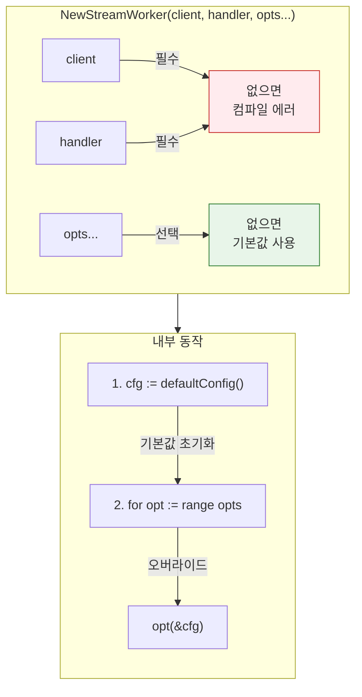

# Functional Options 패턴을 활용한 Go 설정 관리

## 개요

**Functional Options 패턴**은 Go에서 객체 생성 시 **필수 파라미터**와 **선택적 설정**을 명확히 분리하는 관용적인 패턴입니다.

핵심 원칙:

- **필수값**: 생성자의 명시적 파라미터로 전달 (없으면 컴파일 에러)
- **선택값**: 합리적인 기본값을 정의하고, `With...` 옵션 함수로 오버라이드

## 패턴의 핵심: 필수 vs 선택

### 설계 의도

```
NewWorker(client, handler, opts...)
         ↑       ↑        ↑
      필수값   필수값   선택적 옵션들
      
생성자 시그니처가 "무엇이 필수인지"를 명확히 선언합니다.
옵션을 전달하지 않아도 기본값으로 동작합니다.
```

| 구분 | 전달 방식 | 특징 |
|------|----------|------|
| **필수 파라미터** | 생성자의 명시적 인자 | 누락 시 컴파일 에러, 기본값 없음 |
| **선택적 설정** | `...WorkerOption` 가변 인자 | 기본값 존재, 필요 시 오버라이드 |

### 왜 이 구분이 중요한가?

```go
// ❌ 나쁜 예: 모든 것이 옵션
// client가 nil이어도 컴파일은 통과 → 런타임 에러
worker := NewWorker(
    WithClient(client),     // 필수인데 옵션처럼 보임
    WithHandler(handler),   // 필수인데 옵션처럼 보임
    WithBatchSize(100),
)

// ✅ 좋은 예: 필수값은 명시적 파라미터
// client나 handler 누락 시 컴파일 에러
worker := NewWorker(
    client,                 // 필수: 첫 번째 인자
    handler,                // 필수: 두 번째 인자  
    WithBatchSize(100),     // 선택: 기본값 10을 100으로 오버라이드
)
```

## 기본 구현

### 1. 내부 설정 구조체 (기본값 정의)

```go
package worker

import "time"

// workerConfig는 Worker의 "선택적" 설정을 담습니다.
// 필수값(client, handler)은 여기에 포함되지 않습니다.
type workerConfig struct {
    batchSize        int
    pollInterval     time.Duration
    maxRetries       int
    shutdownTimeout  time.Duration
    deadLetterStream string
}

// defaultConfig는 합리적인 기본값을 반환합니다.
// 옵션을 전혀 전달하지 않아도 이 값으로 동작합니다.
func defaultConfig() workerConfig {
    return workerConfig{
        batchSize:        10,                    // 기본: 10개씩 처리
        pollInterval:     100 * time.Millisecond, // 기본: 100ms 폴링
        maxRetries:       3,                     // 기본: 3회 재시도
        shutdownTimeout:  30 * time.Second,      // 기본: 30초 종료 대기
        deadLetterStream: "dead-letter-stream",  // 기본 DLQ 이름
    }
}
```

### 2. 옵션 타입과 With 함수들 (기본값 오버라이드)

```go
// WorkerOption은 기본 설정을 변경하는 함수 타입입니다.
type WorkerOption func(*workerConfig)

// WithBatchSize는 기본값(10)을 오버라이드합니다.
func WithBatchSize(size int) WorkerOption {
    return func(c *workerConfig) {
        if size > 0 {
            c.batchSize = size
        }
    }
}

// WithPollInterval은 기본값(100ms)을 오버라이드합니다.
func WithPollInterval(interval time.Duration) WorkerOption {
    return func(c *workerConfig) {
        if interval > 0 {
            c.pollInterval = interval
        }
    }
}

// WithMaxRetries는 기본값(3)을 오버라이드합니다.
func WithMaxRetries(retries int) WorkerOption {
    return func(c *workerConfig) {
        c.maxRetries = retries
    }
}

// WithShutdownTimeout은 기본값(30s)을 오버라이드합니다.
func WithShutdownTimeout(timeout time.Duration) WorkerOption {
    return func(c *workerConfig) {
        c.shutdownTimeout = timeout
    }
}

// WithDeadLetterStream은 기본값을 오버라이드합니다.
func WithDeadLetterStream(stream string) WorkerOption {
    return func(c *workerConfig) {
        c.deadLetterStream = stream
    }
}
```

### 3. 생성자 (필수 파라미터 + 선택적 옵션)

```go
// StreamWorker는 메시지 스트림을 처리하는 워커입니다.
type StreamWorker struct {
    // 필수 의존성 (생성자 파라미터로 주입)
    client  redis.UniversalClient
    handler MessageHandler
    
    // 선택적 설정 (기본값 + 옵션으로 구성)
    config  workerConfig
    
    stopCh  chan struct{}
}

// NewStreamWorker는 새 워커를 생성합니다.
//
// 파라미터:
//   - client: Redis 클라이언트 (필수)
//   - handler: 메시지 핸들러 (필수)
//   - opts: 선택적 설정 (기본값 존재, 필요 시 오버라이드)
func NewStreamWorker(
    client redis.UniversalClient,   // 필수: 없으면 컴파일 에러
    handler MessageHandler,          // 필수: 없으면 컴파일 에러
    opts ...WorkerOption,            // 선택: 없어도 기본값으로 동작
) *StreamWorker {
    // 1. 기본값으로 시작
    cfg := defaultConfig()
    
    // 2. 전달된 옵션들로 기본값 오버라이드
    for _, opt := range opts {
        opt(&cfg)
    }
    
    return &StreamWorker{
        client:  client,
        handler: handler,
        config:  cfg,
        stopCh:  make(chan struct{}),
    }
}
```

### 4. 사용 예시

```go
func main() {
    // 필수 의존성 준비
    client := redis.NewClusterClient(&redis.ClusterOptions{
        Addrs: []string{"localhost:7001"},
    })
    handler := &AuditHandler{}
    
    // Case 1: 기본값 그대로 사용 (옵션 없음)
    // batchSize=10, pollInterval=100ms, maxRetries=3 ...
    worker1 := NewStreamWorker(client, handler)
    
    // Case 2: 일부 설정만 오버라이드
    // batchSize=100 (오버라이드), 나머지는 기본값
    worker2 := NewStreamWorker(client, handler,
        WithBatchSize(100),
    )
    
    // Case 3: 여러 설정 오버라이드
    worker3 := NewStreamWorker(client, handler,
        WithBatchSize(100),              // 10 → 100
        WithPollInterval(50*time.Millisecond), // 100ms → 50ms
        WithMaxRetries(5),               // 3 → 5
    )
    
    worker3.Start(context.Background())
}
```

## 실제 활용 예시

### 데이터베이스 클라이언트

```go
type dbConfig struct {
    // 선택적 설정 (기본값 존재)
    host       string
    port       int
    poolSize   int
    timeout    time.Duration
}

func defaultDBConfig() dbConfig {
    return dbConfig{
        host:     "localhost",
        port:     5432,
        poolSize: 10,
        timeout:  5 * time.Second,
    }
}

type DBOption func(*dbConfig)

func WithHost(host string) DBOption {
    return func(c *dbConfig) { c.host = host }
}

func WithPort(port int) DBOption {
    return func(c *dbConfig) { c.port = port }
}

func WithPoolSize(size int) DBOption {
    return func(c *dbConfig) { c.poolSize = size }
}

// NewDBClient: database는 필수, 나머지는 선택
func NewDBClient(database string, opts ...DBOption) (*DBClient, error) {
    // database: 필수 파라미터 (기본값 없음)
    if database == "" {
        return nil, errors.New("database name is required")
    }
    
    // 선택적 설정: 기본값 + 옵션 오버라이드
    cfg := defaultDBConfig()
    for _, opt := range opts {
        opt(&cfg)
    }
    
    return &DBClient{
        database: database,  // 필수
        config:   cfg,       // 선택 (기본값 + 오버라이드)
    }, nil
}

// 사용
db, _ := NewDBClient("mydb")                           // 기본값 사용
db, _ := NewDBClient("mydb", WithHost("db.prod.com"))  // host만 오버라이드
db, _ := NewDBClient("mydb", WithHost("db.prod.com"), WithPoolSize(50))
```

## 응용 패턴

### 옵션 프리셋 (자주 쓰는 설정 조합)

```go
// ProductionOptions는 프로덕션 환경용 설정 프리셋입니다.
func ProductionOptions() []WorkerOption {
    return []WorkerOption{
        WithBatchSize(100),
        WithMaxRetries(5),
        WithShutdownTimeout(60 * time.Second),
    }
}

// 프리셋 사용
worker := NewStreamWorker(client, handler, ProductionOptions()...)

// 프리셋 + 추가 오버라이드
opts := append(ProductionOptions(), WithBatchSize(200))
worker := NewStreamWorker(client, handler, opts...)
```

### 검증 포함 옵션

```go
func WithBatchSize(size int) WorkerOption {
    return func(c *workerConfig) {
        // 검증: 범위 제한
        if size < 1 {
            size = 1
        }
        if size > 1000 {
            size = 1000
        }
        c.batchSize = size
    }
}
```

### 에러 반환 옵션 (고급)

```go
type WorkerOptionWithError func(*workerConfig) error

func NewStreamWorkerSafe(
    client redis.UniversalClient,
    handler MessageHandler,
    opts ...WorkerOptionWithError,
) (*StreamWorker, error) {
    cfg := defaultConfig()
    
    for _, opt := range opts {
        if err := opt(&cfg); err != nil {
            return nil, err
        }
    }
    
    return &StreamWorker{config: cfg}, nil
}

func WithStreamFromEnv(key string) WorkerOptionWithError {
    return func(c *workerConfig) error {
        value := os.Getenv(key)
        if value == "" {
            return fmt.Errorf("env %s is not set", key)
        }
        // 설정 적용
        return nil
    }
}
```

## 테스트 용이성

옵션 패턴은 테스트에서 특히 유용합니다:

```go
func TestWorker_ProcessMessages(t *testing.T) {
    // 테스트용 짧은 타임아웃으로 오버라이드
    worker := NewStreamWorker(
        mockClient,
        mockHandler,
        WithBatchSize(1),                        // 빠른 테스트를 위해 1개씩
        WithPollInterval(10*time.Millisecond),   // 빠른 폴링
        WithMaxRetries(1),                       // 재시도 최소화
        WithShutdownTimeout(100*time.Millisecond),
    )
    
    // 테스트 로직...
}
```

## 핵심 정리



## 모범 사례

1. **필수/선택 분리**: 없으면 안 되는 것은 파라미터, 기본값이 있는 것은 옵션
2. **기본값 명시**: `defaultConfig()` 함수로 합리적인 기본값 정의
3. **With 접두사**: 옵션 함수는 `With...` 네이밍 컨벤션 준수
4. **검증 포함**: 옵션 함수 내에서 값 검증
5. **불변성**: 내부 config 구조체는 외부에 노출하지 않음

## 참고 자료

- [Dave Cheney - Functional Options](https://dave.cheney.net/2014/10/17/functional-options-for-friendly-apis)
- [Rob Pike - Self-referential functions](https://commandcenter.blogspot.com/2014/01/self-referential-functions-and-design.html)
- [Uber Go Style Guide](https://github.com/uber-go/guide/blob/master/style.md#functional-options)
