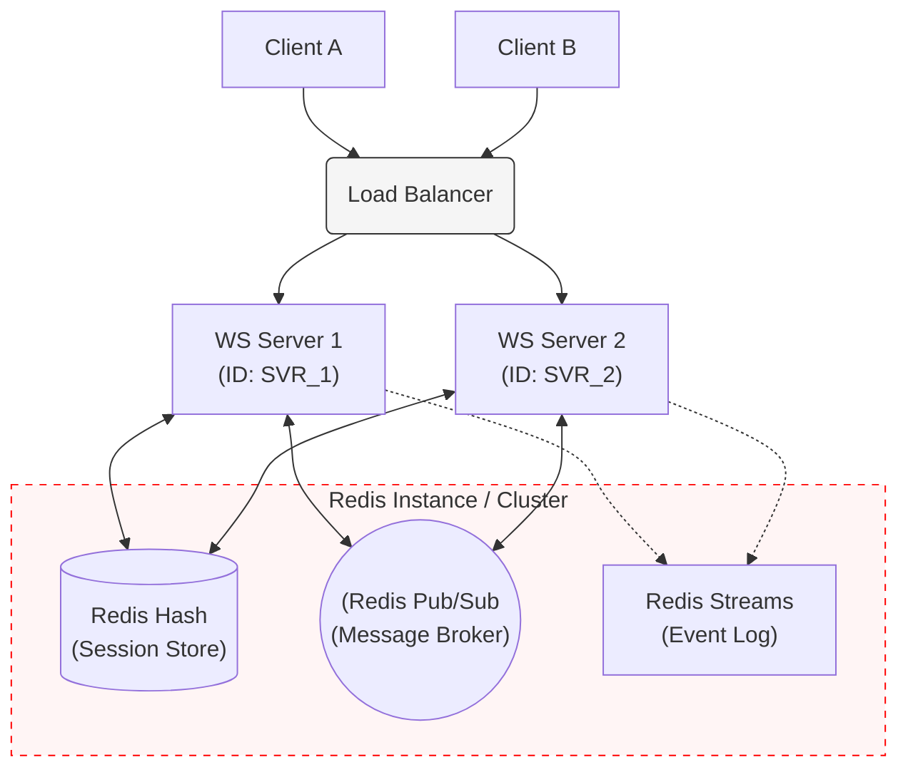
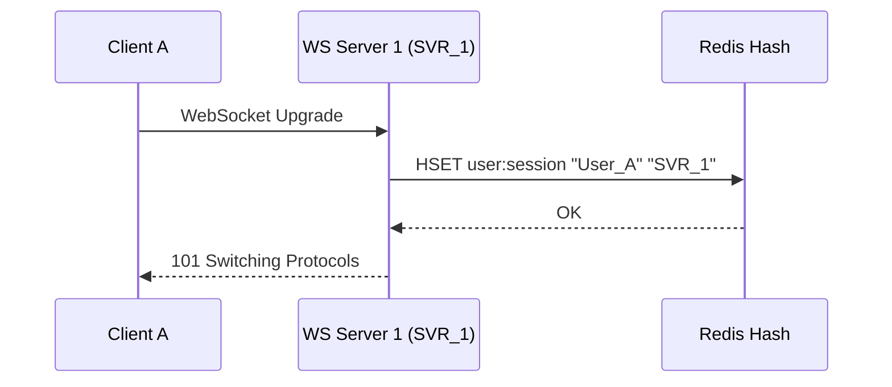
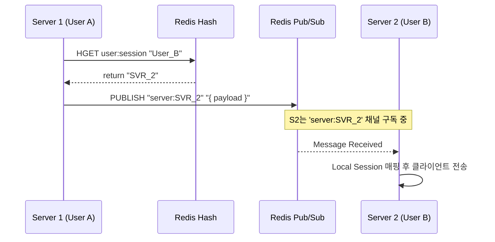
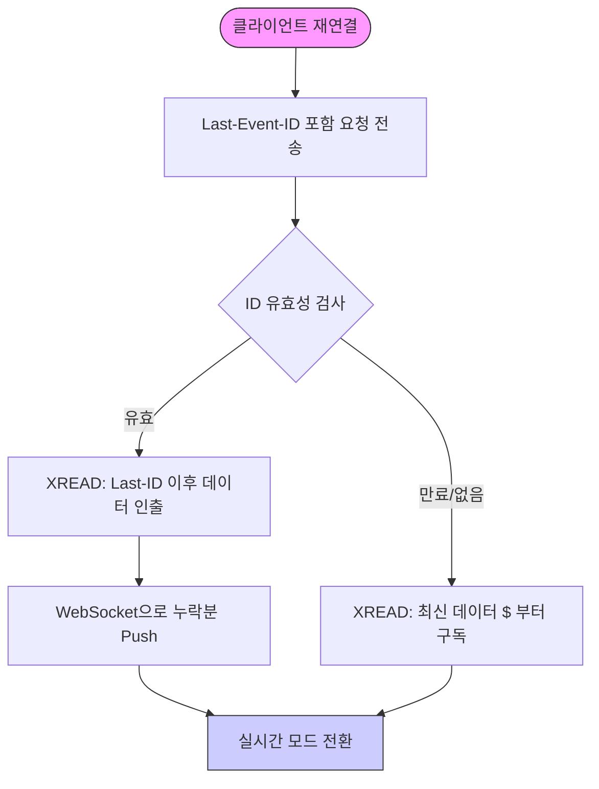

# 확장 가능한 실시간 WebSocket 서버 아키텍처 설계

실시간 통신 환경에서 서버를 수평 확장(Horizontal Scaling)할 때 가장 큰 기술적 과제는 **'상태(State)의 중앙 집중화'**입니다. 특정 클라이언트가 어느 서버 인스턴스에 점유되어 있는지를 관리하고, 서버 간 메시지를 정확히 라우팅하는 설계가 핵심입니다.

---

### 1. 전체 시스템 아키텍처

여러 대의 WebSocket 서버가 로드밸런서 하단에 배치되며, Redis를 공유 저장소 및 메시지 브로커로 활용하여 클러스터를 구성합니다.

---

### 2. Redis 컴포넌트별 역할 정의

|**컴포넌트**|**핵심 기능**|**비고**|
|---|---|---|
|**Hash**|**전역 세션 관리:** `{UserId: ServerId}` 매핑 정보 저장|세션 위치 확인용|
|**Pub/Sub**|**실시간 라우팅:** 서버 간 이벤트 전파 (Fire-and-forget)|낮은 지연 시간 우선|
|**Streams**|**신뢰성 보장:** 메시지 영속화 및 재연결 시 누락 데이터 복구|At-least-once 전달 보장|

---

### 3. 핵심 운영 워크플로우

#### ① 세션 등록 프로세스

클라이언트가 핸드셰이크를 완료하면 Redis Hash에 세션 정보를 기록하여 전역 상태를 업데이트합니다.

#### ② 서버 간 메시지 라우팅

상대방이 다른 서버 인스턴스에 접속 중일 경우, 세션 정보를 조회한 후 해당 서버 전용 채널로 메시지를 발행합니다.

#### ③ Redis Streams를 이용한 데이터 복구

네트워크 순단 시 클라이언트가 `Last-Event-ID`를 기반으로 누락된 메시지를 요청하는 흐름입니다.

---

### 4. 설계 및 운영 가이드라인

- **좀비 세션(Zombie Session) 방지:** 서버 비정상 종료 시 세션 정보가 남지 않도록 세션 키에 **TTL**을 설정하고, **Heartbeat(Ping/Pong)** 시점에 수시로 갱신해야 합니다.
    
- **Graceful Shutdown:** 배포 시 서버 인스턴스가 종료 신호(`SIGTERM`)를 받으면, 관리 중인 모든 세션을 Redis Hash에서 삭제(`HDEL`)한 후 프로세스를 종료해야 합니다.
    
- **Backpressure 제어:** 클라이언트의 수신 속도가 느릴 경우 서버 메모리 부하가 발생할 수 있습니다. Redis Streams의 **Consumer Group** 기능을 활용해 처리량을 조절하는 설계를 검토하십시오.
    

