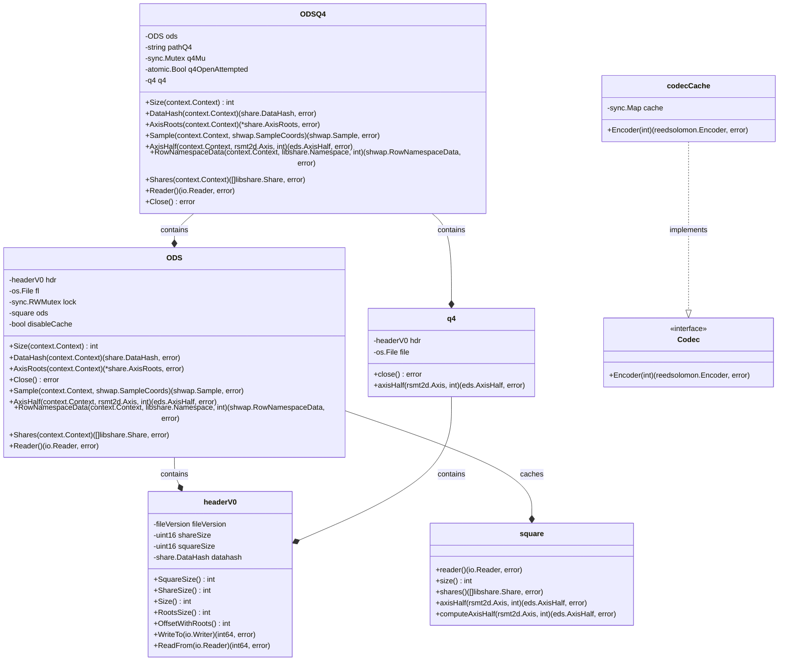

# celestia-node 'file' 패키지 분석

Celestia-node repository의 `store/file` 패키지는 Exten Data Square(EDS)라는 데이터 구조를 파일 시스템에 효율적으로 저장하고 접근하기 위한 구현을 제공합니다. 이 패키지는 데이터의 무결성과 복구 가능성을 보장하면서도 디스크 공간을 최적화하는 방식으로 설계되었습니다.

## 핵심 개념

1. **Original Data Square (ODS)**: 블록체인의 트랜잭션 데이터를 정사각형 형태로 배열한 것으로, EDS의 첫 번째 사분면(Q1)을 구성합니다.
2. **Extended Data Square (EDS)**: ODS에 Reed-Solomon 인코딩을 적용하여 확장된 2D 데이터 구조입니다. 총 4개의 사분면으로 구성됩니다.
3. **Q4**: EDS의 네 번째 사분면으로, 행과 열 모두에 패리티가 적용된 데이터를 저장합니다.
4. **Share**: 데이터의 기본 단위로, 고정 크기의 바이트 배열입니다.

## 저장 전략과 공간 효율성

Celestia는 저장 공간을 효율적으로 사용하기 위해 두 가지 저장 전략을 사용합니다:

1. **ODS만 저장**: 트랜잭션 데이터(ODS)만 저장하는 방식으로, EDS 전체 크기의 약 1/4에 해당하는 저장 공간을 사용합니다. 오래된 블록이나 아카이브 목적의 저장에 주로 사용됩니다.
2. **ODSQ4 저장**: ODS와 Q4 사분면을 함께 저장하는 방식으로, EDS 전체 크기의 약 1/2에 해당하는 저장 공간을 사용합니다. 가용성 윈도우(availability window) 내의 최근 블록에 사용하여 특정 데이터 접근 패턴에서 계산 효율성을 향상시킵니다.

가용성 윈도우는 데이터 가용성 검증이 더 중요한 최근 블록들을 구분하는 시간적 경계로, 이 기간 내의 블록은 ODSQ4 방식으로, 그 외의 블록은 ODS 방식으로 저장됩니다.

## 핵심 구성요소와 기능

다음은 패키지의 주요 구조체와 그 관계를 mermaid 다이어그램으로 정리한 것입니다:



## 주요 컴포넌트 상세 설명

### 1. headerV0 (header.go)
- 파일의 메타데이터를 저장하는 구조체입니다.
- 파일 버전, share 크기, square 크기, 데이터 해시 등을 포함합니다.
- 파일 읽기/쓰기 작업에 필요한 메타데이터를 제공하며, 파일 형식의 버전 관리를 지원합니다.

### 2. ODS (ods.go)
- Original Data Square(ODS)를 파일 시스템에 저장하고 접근하는 기능을 제공합니다.
- EDS의 첫 번째 사분면(Q1)을 저장하며, 파일 헤더에 메타데이터를 함께 저장합니다.
- 성능 최적화를 위한 메모리 캐싱 기능을 제공하여 반복적인 파일 I/O를 줄입니다.
- `eds.AccessorStreamer` 인터페이스를 구현하여 표준화된 데이터 접근 방식을 제공합니다.

### 3. q4 (q4.go)
- EDS의 네 번째 사분면(Q4)을 파일 시스템에 저장하고 접근하는 기능을 제공합니다.
- Q4는 데이터 복구나 특정 유형의 쿼리(특히 Q2, Q4 사분면 샘플링)에 효율적으로 활용됩니다.
- 파일의 크기 검증 및 오류 처리 기능을 포함합니다.

### 4. ODSQ4 (ods_q4.go)
- ODS와 Q4를 결합하여 효율적인 데이터 접근을 제공합니다.
- 첫 번째 요청 시 Q4 파일을 지연 로딩(lazy loading)하여 초기 로딩 시간과 메모리 사용량을 최적화합니다.
- 샘플링 작업이나 특정 행/열 접근 시 계산 효율성을 높여줍니다.
- `eds.AccessorStreamer` 인터페이스를 구현하여 ODS와 동일한 인터페이스로 접근 가능합니다.

### 5. square (square.go)
- 데이터 square를 표현하는 2차원 배열 구조체입니다.
- share의 행과 열에 쉽게 접근할 수 있는 메소드를 제공합니다.
- 필요한 데이터를 계산하거나 복구하는 기능을 구현합니다.
- 병렬 처리를 통해 데이터 복구 성능을 최적화합니다.

### 6. Codec/codecCache (codec.go)
- Reed-Solomon 인코딩을 위한 인터페이스와 구현을 제공합니다.
- `reedsolomon.New(ln/2, ln/2, reedsolomon.WithLeopardGF(true))` 형태로 인코더를 생성하여 데이터의 약 25%만으로도 전체 복구가 가능하게 합니다.
- 인코더를 캐싱하여 반복적인 생성 비용을 줄이고 성능을 최적화합니다.

## 핵심 기능

1. **데이터 저장**: EDS의 일부(ODS와 선택적으로 Q4)를 파일 시스템에 효율적으로 저장합니다.
2. **데이터 접근**: 저장된 데이터에 다양한 방식(행, 열, 샘플 등)으로 접근할 수 있는 API를 제공합니다.
3. **데이터 복구**: Reed-Solomon 인코딩을 사용하여 필요한 경우 누락된 데이터를 복구할 수 있으며, EDS 전체의 약 25%만으로도 복구가 가능합니다.
4. **최적화된 I/O**: 버퍼링, 캐싱, 지연 로딩 등을 통해 파일 I/O 작업을 최적화합니다.
5. **무결성 검증**: 데이터 해시와 크기 검증을 통해 파일의 무결성을 보장합니다.

## 실제 사용 예시

Celestia 네트워크에서 이 패키지는 다음과 같은 상황에서 활용됩니다:

1. **블록 데이터 저장**: 새로운 블록이 검증되면, 노드는 블록 데이터를 EDS로 확장한 후 저장 전략에 따라 ODS 또는 ODSQ4 형태로 저장합니다.

   ```go
   // 가용성 윈도우 내의 블록은 ODS와 Q4 모두 저장
   if availability.IsWithinWindow(eh.Time(), availability.StorageWindow) {
       err = store.PutODSQ4(ctx, eh.DAH, eh.Height(), eds)
   } else {
       // 그 외 블록은 ODS만 저장하여 공간 절약
       err = store.PutODS(ctx, eh.DAH, eh.Height(), eds)
   }
   ```

2. **데이터 가용성 샘플링(DAS)**: 다른 노드로부터 블록 데이터의 특정 샘플을 요청받으면, 저장된 ODS 또는 ODSQ4를 사용하여 요청된 샘플을 효율적으로 제공합니다.

3. **데이터 복구**: 누락된 블록 데이터가 있을 경우, 네트워크의 다른 노드로부터 충분한 샘플을 수집하여 Reed-Solomon 인코딩을 통해 전체 EDS를 복구할 수 있습니다.

이 패키지는 Celestia의 데이터 가용성 레이어의 핵심 구성 요소로, 블록체인의 데이터 확장성 문제를 해결하면서도 데이터의 가용성과 무결성을 보장하는 중요한 역할을 합니다.
