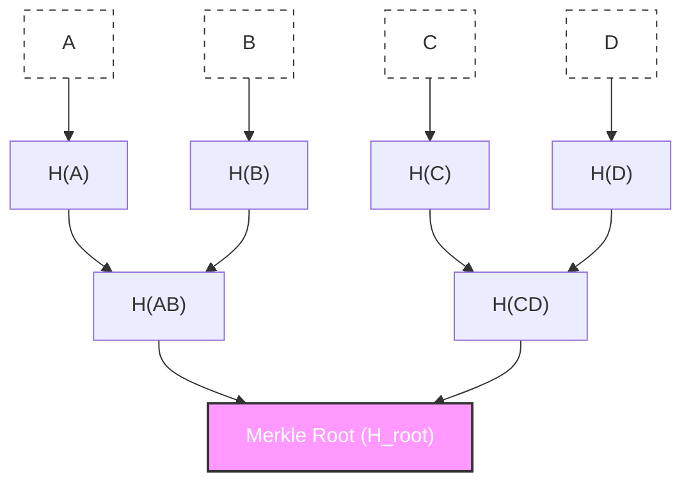

# go-ethereum Merkle Trie를 활용한 데이터 무결성 검증

## 개요

**Merkle Trie**는 대량의 데이터 무결성을 단일 해시값(Merkle Root)으로 증명할 수 있는 자료구조입니다. 이 글에서는 go-ethereum의 Trie 패키지를 활용하여 데이터 무결성 검증 시스템을 구축하는 방법을 다룹니다.

## Merkle Trie란?

### 핵심 개념



- **Leaf 노드**: 원본 데이터의 해시
- **내부 노드**: 자식 노드들의 해시 조합
- **Root 노드**: 전체 데이터를 대표하는 단일 해시

### 왜 Merkle Trie인가?

| 장점 | 설명 |
|------|------|
| **효율적 검증** | O(log n) 복잡도로 특정 데이터 포함 증명 |
| **배치 검증** | 수천 개 데이터를 단일 루트로 검증 |
| **변조 감지** | 하나라도 변경되면 루트 해시 변경 |
| **블록체인 호환** | 대부분의 블록체인이 사용하는 표준 구조 |

## go-ethereum Trie 패키지

### 설치

```bash
go get github.com/ethereum/go-ethereum
```

### 핵심 인터페이스

```go
package integrity

import (
    "github.com/ethereum/go-ethereum/common"
    "github.com/ethereum/go-ethereum/core/rawdb"
    ethtrie "github.com/ethereum/go-ethereum/trie"
    "github.com/ethereum/go-ethereum/triedb"
)
```

## 핵심 구현

### Trie 래퍼

```go
package integrity

import (
    "errors"
    "fmt"
    "sync"
    
    "github.com/ethereum/go-ethereum/common"
    "github.com/ethereum/go-ethereum/core/rawdb"
    ethtrie "github.com/ethereum/go-ethereum/trie"
    "github.com/ethereum/go-ethereum/triedb"
)

var (
    ErrNodeNotFound = errors.New("node not found in trie")
    ErrInvalidProof = errors.New("invalid merkle proof")
)

// LeafNode는 Trie의 리프 노드입니다.
type LeafNode struct {
    key   []byte
    value []byte
}

func NewLeafNode(key, value []byte) *LeafNode {
    return &LeafNode{key: key, value: value}
}

func (n *LeafNode) Key() []byte   { return n.key }
func (n *LeafNode) Value() []byte { return n.value }
func (n *LeafNode) Hash() []byte  { return n.value }

// IntegrityTrie는 데이터 무결성 검증을 위한 Merkle Trie입니다.
type IntegrityTrie struct {
    trie *ethtrie.Trie
    db   *triedb.Database
    mu   sync.RWMutex
}

// NewIntegrityTrie는 새 Trie를 생성합니다.
func NewIntegrityTrie(seedNodes []*LeafNode) (*IntegrityTrie, error) {
    // 인메모리 데이터베이스 생성
    memDB := rawdb.NewMemoryDatabase()
    trieDB := triedb.NewDatabase(memDB, nil)
    
    // 빈 Trie 생성
    t := ethtrie.NewEmpty(trieDB)
    
    integrityTrie := &IntegrityTrie{
        trie: t,
        db:   trieDB,
    }
    
    // 초기 노드 삽입
    for _, node := range seedNodes {
        if err := integrityTrie.Insert(node.Key(), node.Value()); err != nil {
            return nil, fmt.Errorf("insert seed node: %w", err)
        }
    }
    
    return integrityTrie, nil
}

// Insert는 키-값 쌍을 Trie에 추가합니다.
func (t *IntegrityTrie) Insert(key, value []byte) error {
    t.mu.Lock()
    defer t.mu.Unlock()
    
    return t.trie.Update(key, value)
}

// RootHash는 현재 Merkle Root를 반환합니다.
func (t *IntegrityTrie) RootHash() common.Hash {
    t.mu.RLock()
    defer t.mu.RUnlock()
    
    return t.trie.Hash()
}

// Commit은 Trie 상태를 저장하고 Root를 반환합니다.
func (t *IntegrityTrie) Commit() (common.Hash, error) {
    t.mu.Lock()
    defer t.mu.Unlock()
    
    // Trie 커밋
    rootHash, _, err := t.trie.Commit(false)
    if err != nil {
        return common.Hash{}, fmt.Errorf("trie commit: %w", err)
    }
    
    // 데이터베이스에 저장
    if err := t.db.Commit(rootHash, false); err != nil {
        return common.Hash{}, fmt.Errorf("db commit: %w", err)
    }
    
    return rootHash, nil
}
```

### 배치 데이터 처리

감사 로그 등 대량 데이터를 배치로 처리:

```go
// BatchData는 배치 처리할 데이터 항목입니다.
type BatchData struct {
    ID      string
    Content []byte
}

// ComputeBatchRoot는 배치 데이터의 Merkle Root를 계산합니다.
func ComputeBatchRoot(items []BatchData) (common.Hash, error) {
    nodes := make([]*LeafNode, len(items))
    
    for i, item := range items {
        // 키: 고유 ID의 해시
        key := crypto.Keccak256([]byte(item.ID))
        // 값: 콘텐츠의 해시
        value := crypto.Keccak256(item.Content)
        
        nodes[i] = NewLeafNode(key, value)
    }
    
    trie, err := NewIntegrityTrie(nodes)
    if err != nil {
        return common.Hash{}, err
    }
    
    return trie.Commit()
}
```

### 감사 로그 통합 예시

```go
package audit

import (
    "context"
    "time"
    "encoding/json"
)

// AuditBatch는 감사 로그 배치입니다.
type AuditBatch struct {
    ID        string       `json:"id"`
    Logs      []AuditLog   `json:"logs"`
    CreatedAt time.Time    `json:"created_at"`
}

// AuditLog는 개별 감사 로그입니다.
type AuditLog struct {
    DocumentID string `json:"document_id"`
    Action     string `json:"action"`
    Version    int32  `json:"version"`
    Hash       string `json:"hash"`
}

// AnchoringService는 블록체인 앵커링 서비스입니다.
type AnchoringService struct {
    blockchain BlockchainClient
}

// ProcessBatch는 배치 감사 로그를 처리하고 앵커링합니다.
func (s *AnchoringService) ProcessBatch(ctx context.Context, logs []AuditLog) (*AnchorResult, error) {
    // 1. 각 로그를 Merkle Trie 노드로 변환
    items := make([]BatchData, len(logs))
    for i, log := range logs {
        content, _ := json.Marshal(log)
        items[i] = BatchData{
            ID:      log.DocumentID + "_" + fmt.Sprint(log.Version),
            Content: content,
        }
    }
    
    // 2. Merkle Root 계산
    merkleRoot, err := ComputeBatchRoot(items)
    if err != nil {
        return nil, fmt.Errorf("compute merkle root: %w", err)
    }
    
    // 3. 블록체인에 앵커링
    txHash, err := s.blockchain.SubmitAnchor(ctx, merkleRoot.Hex())
    if err != nil {
        return nil, fmt.Errorf("submit anchor: %w", err)
    }
    
    return &AnchorResult{
        MerkleRoot:      merkleRoot.Hex(),
        TransactionHash: txHash,
        AnchoredAt:      time.Now(),
        LogCount:        len(logs),
    }, nil
}

type AnchorResult struct {
    MerkleRoot      string    `json:"merkle_root"`
    TransactionHash string    `json:"transaction_hash"`
    AnchoredAt      time.Time `json:"anchored_at"`
    LogCount        int       `json:"log_count"`
}
```

## Merkle Proof 생성 및 검증

특정 데이터가 Merkle Root에 포함되어 있음을 증명:

```go
import (
    "github.com/ethereum/go-ethereum/trie"
)

// GenerateProof는 특정 키에 대한 Merkle Proof를 생성합니다.
func (t *IntegrityTrie) GenerateProof(key []byte) ([][]byte, error) {
    t.mu.RLock()
    defer t.mu.RUnlock()
    
    // Proof 노드들을 담을 메모리 DB
    proofDB := rawdb.NewMemoryDatabase()
    
    // Proof 생성
    if err := t.trie.Prove(key, proofDB); err != nil {
        return nil, fmt.Errorf("generate proof: %w", err)
    }
    
    // Proof 데이터 추출
    var proofNodes [][]byte
    it := proofDB.NewIterator(nil, nil)
    defer it.Release()
    
    for it.Next() {
        proofNodes = append(proofNodes, common.CopyBytes(it.Value()))
    }
    
    return proofNodes, nil
}

// VerifyProof는 Merkle Proof를 검증합니다.
func VerifyProof(rootHash common.Hash, key []byte, proofNodes [][]byte) ([]byte, error) {
    // Proof DB 구성
    proofDB := rawdb.NewMemoryDatabase()
    for _, node := range proofNodes {
        hash := crypto.Keccak256(node)
        proofDB.Put(hash, node)
    }
    
    // Proof 검증 및 값 반환
    value, err := trie.VerifyProof(rootHash, key, proofDB)
    if err != nil {
        return nil, ErrInvalidProof
    }
    
    return value, nil
}
```

### 사용 예시

```go
func ExampleMerkleProof() {
    // 1. 데이터 준비
    items := []BatchData{
        {ID: "doc-001", Content: []byte(`{"action":"CREATE"}`)},
        {ID: "doc-002", Content: []byte(`{"action":"UPDATE"}`)},
        {ID: "doc-003", Content: []byte(`{"action":"DELETE"}`)},
    }
    
    nodes := make([]*LeafNode, len(items))
    for i, item := range items {
        key := crypto.Keccak256([]byte(item.ID))
        value := crypto.Keccak256(item.Content)
        nodes[i] = NewLeafNode(key, value)
    }
    
    // 2. Trie 생성 및 Root 계산
    trie, _ := NewIntegrityTrie(nodes)
    rootHash, _ := trie.Commit()
    
    fmt.Printf("Merkle Root: %s\n", rootHash.Hex())
    
    // 3. 특정 문서의 Proof 생성
    targetKey := crypto.Keccak256([]byte("doc-002"))
    proof, _ := trie.GenerateProof(targetKey)
    
    fmt.Printf("Proof nodes: %d\n", len(proof))
    
    // 4. Proof 검증 (다른 시스템에서)
    expectedValue := crypto.Keccak256([]byte(`{"action":"UPDATE"}`))
    verifiedValue, err := VerifyProof(rootHash, targetKey, proof)
    
    if err != nil {
        fmt.Println("Proof invalid!")
    } else if bytes.Equal(verifiedValue, expectedValue) {
        fmt.Println("Proof verified! Data integrity confirmed.")
    }
}
```

## 무결성 검증 API

외부에서 데이터 무결성을 검증할 수 있는 API:

```go
package api

type IntegrityVerification struct {
    DocumentID   string `json:"document_id"`
    Version      int32  `json:"version"`
    ContentHash  string `json:"content_hash"`
    MerkleRoot   string `json:"merkle_root"`
    BlockchainTx string `json:"blockchain_tx"`
    Verified     bool   `json:"verified"`
    VerifiedAt   string `json:"verified_at"`
}

func (s *APIServer) VerifyIntegrity(ctx context.Context, req VerifyRequest) (*IntegrityVerification, error) {
    // 1. 문서 조회
    doc, err := s.docService.FindByVersion(ctx, req.Collection, req.URI, req.Version)
    if err != nil {
        return nil, err
    }
    
    // 2. 문서의 앵커링 메타데이터 확인
    anchor := doc.AnchoringMetadata
    if anchor.Status != "COMPLETED" {
        return nil, errors.New("document not yet anchored")
    }
    
    // 3. 블록체인에서 Merkle Root 조회
    blockchainRoot, err := s.blockchain.GetAnchor(ctx, anchor.TransactionHash)
    if err != nil {
        return nil, err
    }
    
    // 4. 현재 데이터로 해시 재계산
    currentHash := computeDocumentHash(doc)
    
    // 5. 저장된 Merkle Root와 블록체인 Root 비교
    verified := anchor.MerkleRoot == blockchainRoot
    
    return &IntegrityVerification{
        DocumentID:   doc.URI,
        Version:      doc.Version,
        ContentHash:  currentHash,
        MerkleRoot:   anchor.MerkleRoot,
        BlockchainTx: anchor.TransactionHash,
        Verified:     verified,
        VerifiedAt:   time.Now().Format(time.RFC3339),
    }, nil
}
```

## 성능 최적화

### 배치 크기 조정

```go
const (
    OptimalBatchSize = 1000 // Trie 연산에 최적화된 배치 크기
    MaxBatchSize     = 10000
)

func ProcessWithOptimalBatch(items []BatchData) ([]common.Hash, error) {
    var roots []common.Hash
    
    for i := 0; i < len(items); i += OptimalBatchSize {
        end := i + OptimalBatchSize
        if end > len(items) {
            end = len(items)
        }
        
        batch := items[i:end]
        root, err := ComputeBatchRoot(batch)
        if err != nil {
            return nil, err
        }
        
        roots = append(roots, root)
    }
    
    return roots, nil
}
```

### 캐싱

```go
type TrieCache struct {
    mu    sync.RWMutex
    roots map[string]common.Hash // batchID -> rootHash
}

func (c *TrieCache) Get(batchID string) (common.Hash, bool) {
    c.mu.RLock()
    defer c.mu.RUnlock()
    root, ok := c.roots[batchID]
    return root, ok
}

func (c *TrieCache) Set(batchID string, root common.Hash) {
    c.mu.Lock()
    defer c.mu.Unlock()
    c.roots[batchID] = root
}
```

## 모범 사례

1. **배치 처리**: 개별 데이터마다 Trie 생성하지 말고 배치 단위로 처리
2. **Root 저장**: 계산된 Merkle Root는 영구 저장소에 저장
3. **Proof 캐싱**: 자주 조회되는 데이터의 Proof는 캐싱
4. **해시 일관성**: 동일한 해시 함수(Keccak256) 일관되게 사용
5. **동시성 제어**: Trie 접근 시 뮤텍스로 보호

## 참고 자료

- [go-ethereum Trie 패키지](https://pkg.go.dev/github.com/ethereum/go-ethereum/trie)
- [Merkle Tree 위키피디아](https://en.wikipedia.org/wiki/Merkle_tree)
- [Ethereum Yellow Paper](https://ethereum.github.io/yellowpaper/paper.pdf)
