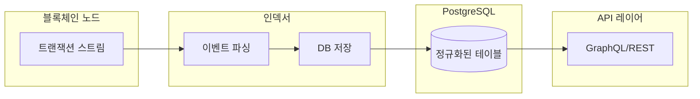
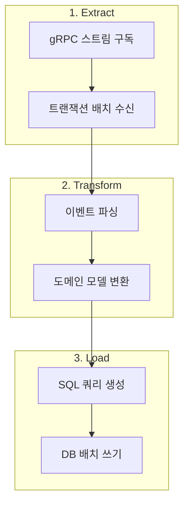

## 시리즈 목차

1. **블록체인 인덱서란?** (현재 글)
2. [인덱서 아키텍처 Deep Dive](/blog/blockchain/indexer/indexer-02-architecture)
3. [이력 테이블 vs 스냅샷 테이블](/blog/blockchain/indexer/indexer-03-database-design)
4. [Rust로 인덱서 SDK 만들기](/blog/blockchain/indexer/indexer-04-rust-sdk)
5. [Diesel ORM 실전 활용](/blog/blockchain/indexer/indexer-05-diesel-orm)
6. [멱등성 있는 인덱서 핸들러 설계](/blog/blockchain/indexer/indexer-06-idempotency)

---

## 블록체인의 데이터 조회, 왜 어려운가?

블록체인은 분산 원장이라는 특성상 **모든 트랜잭션이 시간 순서대로 누적**됩니다. 이는 데이터 무결성 측면에서는 훌륭하지만, 데이터 조회 측면에서는 심각한 한계가 있습니다.

### 실제 사례: NFT 마켓플레이스

NFT 마켓플레이스에서 "내가 보유한 NFT 목록"을 조회한다고 가정해봅시다.

```
❓ 질문: 사용자 0x1234...가 보유한 NFT는?
```

블록체인 네이티브 방식으로 이 질문에 답하려면:

1. **제네시스 블록부터 최신 블록까지** 모든 트랜잭션을 스캔
2. NFT 전송 이벤트 중 **수신자가 0x1234인 것**을 필터링
3. 동시에 **발신자가 0x1234인 것**도 찾아서 차감
4. 최종적으로 현재 보유 목록 계산

이 과정이 얼마나 비효율적인지 숫자로 보겠습니다:

| 블록체인 | 일일 트랜잭션 수 | 1년간 누적 |
|---------|-----------------|-----------|
| Ethereum | ~1.2M | ~438M |
| Aptos | ~2.5M | ~912M |

**수억 건의 트랜잭션을 매번 풀스캔?** 현실적으로 불가능합니다.

---

## 인덱서란 무엇인가?

**인덱서(Indexer)**는 블록체인의 원시 트랜잭션 데이터를 **개발자 친화적인 형태로 변환**하여 별도의 데이터베이스에 저장하는 오프체인(off-chain) 시스템입니다.



### 인덱서의 핵심 역할

1. **실시간 구독**: gRPC 스트림으로 새 트랜잭션을 즉시 수신
2. **이벤트 파싱**: 인코딩된 원시 데이터를 도메인 모델로 변환
3. **정규화 저장**: PostgreSQL 등 쿼리 최적화 DB에 적재
4. **빠른 조회**: 인덱스 기반 밀리초 단위 응답

---

## 인덱서 vs RPC 노드

| 구분 | RPC 노드 | 인덱서 |
|------|---------|--------|
| **목적** | 트랜잭션 실행, 상태 조회 | 데이터 분석, 집계 쿼리 |
| **조회 방식** | 현재 상태만 (포인트 쿼리) | 이력 + 집계 (범위 쿼리) |
| **응답 속도** | 단순 쿼리는 빠름 | 복잡한 쿼리도 빠름 |
| **사용 사례** | 잔액 조회, 트랜잭션 전송 | NFT 목록, 거래 이력, 통계 |

### 구체적 비교 예시

```
질문: "지난 30일간 가장 많이 거래된 NFT 컬렉션 Top 10"
```

**RPC 노드 방식**:

- ❌ 불가능하거나 수 분~수 시간 소요
- 30일치 모든 블록을 순차 스캔해야 함

**인덱서 방식**:

- ✅ 수 밀리초 내 응답
- 이미 정규화된 테이블에 `GROUP BY` + `ORDER BY` 쿼리

```sql
SELECT collection_id, COUNT(*) as trade_count
FROM nft_trades
WHERE traded_at > NOW() - INTERVAL '30 days'
GROUP BY collection_id
ORDER BY trade_count DESC
LIMIT 10;
```

---

## 인덱서가 필요한 서비스들

현대 블록체인 서비스 대부분은 인덱서 없이는 작동할 수 없습니다:

| 서비스 유형 | 필요한 쿼리 | 인덱서 필수 여부 |
|------------|------------|-----------------|
| NFT 마켓플레이스 | 소유권 이력, 가격 추이 | ✅ 필수 |
| DeFi 대시보드 | TVL, APY 계산, 포지션 조회 | ✅ 필수 |
| 블록 익스플로러 | 트랜잭션 검색, 계정 활동 | ✅ 필수 |
| 지갑 앱 | 토큰 잔액, 거래 이력 | ✅ 필수 |
| 온체인 게임 | 아이템 소유, 게임 상태 | ✅ 필수 |

---

## 인덱서 동작 원리 미리보기

인덱서의 핵심 동작은 **ETL(Extract-Transform-Load)** 파이프라인과 유사합니다:



각 단계의 자세한 구현은 다음 편에서 다루겠습니다.

---

## 정리

- 블록체인은 **누적 구조**라 복잡한 쿼리에 부적합
- 인덱서는 **오프체인 ETL 시스템**으로 이 문제를 해결
- 현대 블록체인 서비스는 **인덱서 없이는 불가능**
- 다음 편에서 인덱서의 **아키텍처를 상세히** 살펴봅니다

---

## 다음 편 예고

**[2편: 인덱서 아키텍처 Deep Dive - ETL 파이프라인으로 이해하기](/blog/blockchain/indexer/indexer-02-architecture)**

- gRPC 트랜잭션 스트림 상세 분석
- 파싱 파이프라인 설계
- 배치 저장 최적화 전략
